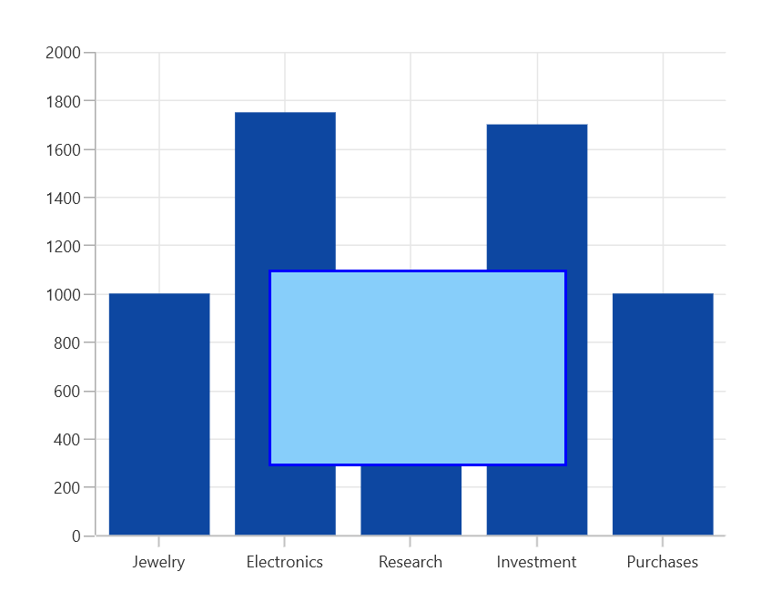

# Zooming and Panning in WinUI Cartesian Chart (SfCartesianChart)

[SfCartesianChart]() allows you to zoom the chart area with the help of the zoom feature. This behavior is mostly used to view the data point in the specific area, when there are large number of data points inside the chart.

Zooming and panning provides you to take a close-up look of the data point plotted in the series

## Enable zooming

To enable the zooming and panning in the chart, create an instance of [ChartZoomPanBehavior]() and add it to the `Behaviors` collection of [SfCartesianChart]().





<chart:SfCartesianChart.Behaviors>
    <chart:ChartZoomPanBehavior />
</chart:SfCartesianChart.Behaviors>





SfCartesianChart chart = new SfCartesianChart();
. . .
ChartZoomPanBehavior zooming = new ChartZoomPanBehavior();
chart.Behaviors.Add(zooming);





## Zooming the chart area

Zooming the chart area can be achieved in different ways by pinch zooming, mouse wheel zooming, selection zooming, and also using the properties [ZoomFactor]() and [ZoomPosition]().

### Pinch zooming

Pinch zooming is enable by using the [EnablePinchZooming]() property to true as shown in the below code snippet.





<chart:SfCartesianChart.Behaviors>
    <chart:ChartZoomPanBehavior EnablePinchZooming="True"/>
</chart:SfCartesianChart.Behaviors>





ChartZoomPanBehavior zooming = new ChartZoomPanBehavior()
{
    EnablePinchZooming = true
};

chart.Behaviors.Add(zooming);





### Mouse wheel zooming

Zooming can be performed by mouse wheel action by setting [`EnableMouseWheelZooming`]() property to true.





<chart:SfCartesianChart.Behaviors>
    <chart:ChartZoomPanBehavior EnableMouseWheelZooming="True"/>
</chart:SfCartesianChart.Behaviors>





ChartZoomPanBehavior zooming = new ChartZoomPanBehavior()
{
    EnableMouseWheelZooming = true
};

chart.Behaviors.Add(zooming);





### Selection zooming

Selection zooming is used to zoom a particular area by selecting the region using rectangle. To enable the selection zooming, you have to set [EnableSelectionZooming]() property to true.





<chart:SfCartesianChart.Behaviors>
    <chart:ChartZoomPanBehavior EnableSelectionZooming="True"/>
</chart:SfCartesianChart.Behaviors>





ChartZoomPanBehavior zooming = new ChartZoomPanBehavior()
{
    EnableSelectionZooming = true
};

chart.Behaviors.Add(zooming);





### Customization of selection rectangle

Selection rectangle can be customized by setting the following properties: 

* [Fill]() - Represents the brush filled in selection rectangle. 
* [Stroke]() - Represents the outer line color of selection rectangle.
* [StrokeThickness]()- Represents the selection rectangle outer line thickness. 

The following code example demonstrates the customization of selection rectangle





<chart:SfCartesianChart.Behaviors>
    <chart:ChartZoomPanBehavior EnableSelectionZooming="True" Fill="LightSkyBlue" Stroke="Blue" StrokeThickness="2"/>
</chart:SfCartesianChart.Behaviors>





ChartZoomPanBehavior zooming = new ChartZoomPanBehavior()
{
    EnableSelectionZooming = true,
    Fill = new SolidColorBrush(Colors.LightSkyBlue),
    Stroke = new SolidColorBrush(Colors.Blue),
    StrokeThickness = 2
};

chart.Behaviors.Add(zooming);





### Zooming by setting ZoomFactor and ZoomPosition

[ZoomFactor]() defines the percentage of visible range from the total range of axis values. [ZoomPosition]() defines the position for ranges of values that need to be displayed as a result of [ZoomFactor](). 

The following code example demonstrates the zooming the chart area by setting zoom position and zoom factor.





<chart:SfCartesianChart.PrimaryAxis>
    <chart:CategoryAxis ShowGridLines="False" ZoomFactor="0.3" ZoomPosition="0.5"/>
</chart:SfCartesianChart.PrimaryAxis>





chart.PrimaryAxis = new CategoryAxis()
{
    ShowGridLines = false,
    ZoomFactor = 0.3,
    ZoomPosition = 0.5
};





## Zooming mode

The zooming can be done both horizontally and vertically. The zooming direction is defined by using the [ZoomMode]() property.

Following code example illustrates how to restrict the chart to be zoomed only along horizontal axis.





<chart:SfCartesianChart.Behaviors>
    <chart:ChartZoomPanBehavior ZoomMode="X" />
</chart:SfCartesianChart.Behaviors>





ChartZoomPanBehavior zooming = new ChartZoomPanBehavior()
{
    ZoomMode = ZoomMode.X
};

chart.Behaviors.Add(zooming);





Following code example illustrates how to restrict the chart to be zoomed only along vertical axis.





<chart:SfCartesianChart.Behaviors>
    <chart:ChartZoomPanBehavior ZoomMode="Y" />
</chart:SfCartesianChart.Behaviors>





ChartZoomPanBehavior zooming = new ChartZoomPanBehavior()
{
    ZoomMode = ZoomMode.Y
};

chart.Behaviors.Add(zooming);





## Maximum zoom level

The [MaximumZoomLevel]() property defines the maximum zooming level of the chart area. Zooming will be stopped after reaching this value.





<chart:SfCartesianChart.Behaviors>
    <chart:ChartZoomPanBehavior EnableSelectionZooming="True" MaximumZoomLevel="100"/>
</chart:SfCartesianChart.Behaviors>





ChartZoomPanBehavior zooming = new ChartZoomPanBehavior()
{
    EnableSelectionZooming = true,
    MaximumZoomLevel = 100
};

chart.Behaviors.Add(zooming);





## Panning the chart area

Panning feature allows moving the visible area of the chart when it is zoomed in. To enable panning, you have to set [EnablePanning]() property to true.





<chart:SfCartesianChart.Behaviors>
    <chart:ChartZoomPanBehavior EnableMouseWheelZooming="True" EnablePanning="True"/>
</chart:SfCartesianChart.Behaviors>





ChartZoomPanBehavior zooming = new ChartZoomPanBehavior()
{
    EnableMouseWheelZooming = true,
    EnablePanning = true
};

chart.Behaviors.Add(zooming);





