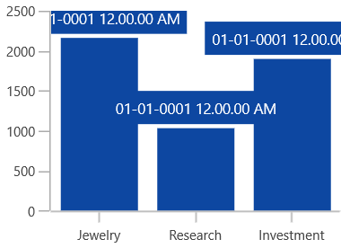
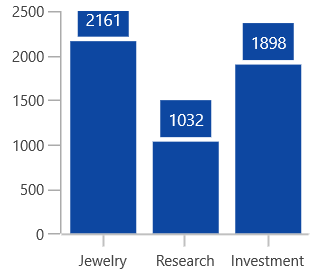
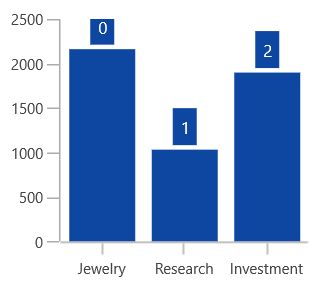
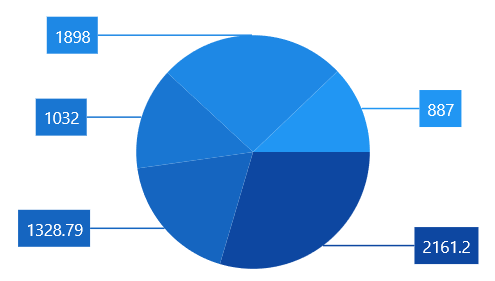

# Data Label in WinUI Charts (SfChart)

Data points can be easily annotated with labels to help improve the readability of data. 

## Define Data Label 

To enable the Label in data markers you have to set the [`ShowLabel`](https://help.syncfusion.com/cr/WinUI/Syncfusion.UI.Xaml.Charts.ChartDataMarkerBase.html#Syncfusion_UI_Xaml_Charts_ChartDataMarkerBase_ShowLabel) property of [`ChartDataMarker`](https://help.syncfusion.com/cr/WinUI/Syncfusion.UI.Xaml.Charts.ChartDataMarker.html). 

[`SegmentLabelContent`](https://help.syncfusion.com/cr/WinUI/Syncfusion.UI.Xaml.Charts.ChartDataMarkerBase.html#Syncfusion_UI_Xaml_Charts_ChartDataMarkerBase_SegmentLabelContent) property allows you to define the value to be displayed as data marker label.

The following code example demonstrates about define the value to be displayed as data marker label.





<syncfusion:ChartDataMarker SegmentLabelContent="YValue" ShowLabel="True"/>




        
ChartDataMarker datamarker = new ChartDataMarker()
{
   ShowLabel = true,
   SegmentLabelContent = LabelContent.YValue
};





| SegmentLabelContent values | Description | Output |
|---|--|---|
| DateTime | Displays LabelContent.DateTime value |  |
|LabelContentPath | Displays the y value||
| Percentage | Displays the percentage value of series point among other points | |
| XValue | Displays the X value of series point| |
| YValue | Displays the Y value of series point|  |

## Customizing Labels

The following properties are used to customize the data marker label.

* [`BorderBrush`](https://help.syncfusion.com/cr/WinUI/Syncfusion.UI.Xaml.Charts.ChartDataMarkerBase.html#Syncfusion_UI_Xaml_Charts_ChartDataMarkerBase_BorderBrush)- used to change the border color.
* [`BorderThickness`](https://help.syncfusion.com/cr/WinUI/Syncfusion.UI.Xaml.Charts.ChartDataMarkerBase.html#Syncfusion_UI_Xaml_Charts_ChartDataMarkerBase_BorderThickness)- used to change the thickness of the border.
* [`Margin`](https://help.syncfusion.com/cr/WinUI/Syncfusion.UI.Xaml.Charts.ChartDataMarkerBase.html#Syncfusion_UI_Xaml_Charts_ChartDataMarkerBase_Margin)- used to change the margin size for label.
* [`FontStyle`](https://help.syncfusion.com/cr/WinUI/Syncfusion.UI.Xaml.Charts.ChartDataMarkerBase.html#Syncfusion_UI_Xaml_Charts_ChartDataMarkerBase_FontStyle)-  used to change font style of the label.
* [`FontSize`](https://help.syncfusion.com/cr/WinUI/Syncfusion.UI.Xaml.Charts.ChartDataMarkerBase.html#Syncfusion_UI_Xaml_Charts_ChartDataMarkerBase_FontSize)-  used to change font size of the label.
* [`Foreground`](https://help.syncfusion.com/cr/WinUI/Syncfusion.UI.Xaml.Charts.ChartDataMarkerBase.html#Syncfusion_UI_Xaml_Charts_ChartDataMarkerBase_Foreground)- used to change the color of the label.
* [`FontFamily`](https://help.syncfusion.com/cr/WinUI/Syncfusion.UI.Xaml.Charts.ChartDataMarkerBase.html#Syncfusion_UI_Xaml_Charts_ChartDataMarkerBase_FontFamily)-  used to change the font family of the label.
* [`Background`](https://help.syncfusion.com/cr/WinUI/Syncfusion.UI.Xaml.Charts.ChartDataMarkerBase.html#Syncfusion_UI_Xaml_Charts_ChartDataMarkerBase_Background)- used to change the label background color.

The following code example demonstrates the customization of label using the above properties:





<syncfusion:ColumnSeries.DataMarker>
    <syncfusion:ChartDataMarker LabelPosition="Outer" Foreground="White" FontSize="11" FontFamily="Calibri" BorderBrush="Black" BorderThickness="1" Margin="1" FontStyle="Italic" Background="#1E88E5" ShowLabel="True">                        
    </syncfusion:ChartDataMarker>
</syncfusion:ColumnSeries.DataMarker>





ChartDataMarker datamarker = new ChartDataMarker()

        ShowLabel = true,
        LabelPosition = DataMarkerLabelPosition.Outer,
        Foreground = new SolidColorBrush(Colors.White),
        BorderBrush = new SolidColorBrush(Colors.Black),
        Background = "#1E88E5",
        BorderThickness = new Thickness(1),
        Margin = new Thickness(1),
        FontStyle = FontStyles.Italic,
        FontFamily = new FontFamily("Calibri"),
        FontSize = 11
};





## Label Template

The default appearance of the label can be customized using [`LabelTemplate`](https://help.syncfusion.com/cr/WinUI/Syncfusion.UI.Xaml.Charts.ChartDataMarkerBase.html#Syncfusion_UI_Xaml_Charts_ChartDataMarkerBase_LabelTemplate) property as in the below code example:





<Page.Resources>
    <DataTemplate x:Key="dataMarkerTemplate">
        <StackPanel Orientation="Vertical">               
            <Path Grid.Row="0"  Stretch="Uniform" Fill="#1E88E5"                              
                       Width="15" Height="15" Margin="0,0,0,0"                              
                       RenderTransformOrigin="0.5,0.5"
                       Data="M22.5,15.8899993896484L37.5,                                
                       30.8899993896484 7.5,30.8899993896484 22.5,15.8899993896484z">
                <Path.RenderTransform>
                    <TransformGroup>
                        <TransformGroup.Children>
                            <RotateTransform Angle="0" />
                            <ScaleTransform ScaleX="1" ScaleY="1" />
                        </TransformGroup.Children>
                    </TransformGroup>
                </Path.RenderTransform>
            </Path>
            <TextBlock Grid.Row="1" Text="{Binding}" FontSize="11" Foreground="Black"></TextBlock>
        </StackPanel>
    </DataTemplate>
</Page.Resources>

<Grid>
   <chart:SfChart Width="400" Height="300">
    ...
       <syncfusion:ColumnSeries ItemsSource="{Binding Demands}" XBindingPath="Category" YBindingPath="Value">
           <syncfusion:ColumnSeries.DataMarker>
               <syncfusion:ChartDataMarker ShowLabel="True" LabelTemplate="{StaticResource dataMarkerTemplate}"
                   LabelPosition="Outer">
               </syncfusion:ChartDataMarker>
           </syncfusion:ColumnSeries.DataMarker>
       </syncfusion:ColumnSeries>
   ...
   </chart:SfChart>
</Grid>





ColumnSeries series = new ColumnSeries()
{
    ItemsSource = new ViewModel().Demands,
    XBindingPath = "Category",
    YBindingPath = "Value",
};

ChartDataMarker datamarker = new ChartDataMarker()
{
    ShowLabel = true,
    LabelPosition = DataMarkerLabelPosition.Outer,
    LabelTemplate = this.Resources["dataMarkerTemplate"] as DataTemplate
};
series.DataMarker = datamarker;





## Label Format

[`SegmentLabelFormat`](https://help.syncfusion.com/cr/WinUI/Syncfusion.UI.Xaml.Charts.ChartDataMarkerBase.html#Syncfusion_UI_Xaml_Charts_ChartDataMarkerBase_SegmentLabelFormat) property allows you to provide formatting for the labels.

The following code example demonstrates the y value having three decimal digits.





<syncfusion:ChartDataMarker ShowLabel="True" SegmentLabelFormat="#.000">
</syncfusion:ChartDataMarker>





ChartDataMarker datamarker = new ChartDataMarker()
{
    ShowLabel = true,
    SegmentLabelFormat = "#.000"
};





In the following image, you can see the decimal position will be rounded off to two digits by default.

## Label Rotation

[`LabelRotationAngle`](https://help.syncfusion.com/cr/WinUI/Syncfusion.UI.Xaml.Charts.ChartDataMarkerBase.html#Syncfusion_UI_Xaml_Charts_ChartDataMarkerBase_LabelRotationAngle) property is used to define the angle to which the label has to rotate. The following code demonstrates the label rotating angle.





<syncfusion:ColumnSeries.DataMarker>
     <syncfusion:ChartDataMarker LabelPosition="Outer" LabelRotationAngle="45" ShowLabel="True"/>
</syncfusion:ColumnSeries.DataMarker>




ChartDataMarker datamarker = new ChartDataMarker()
{
        ShowLabel = true,
        LabelRotationAngle = 45,
        LabelPosition = DataMarkerLabelPosition.Outer          
};




## Connector Line

This feature is used to connect label and data point using a line. It can be enabled for any chart types but this is often used with Pie and Doughnut chart types. You can add connector line for the data markers using [`ShowConnectorLine`](https://help.syncfusion.com/cr/WinUI/Syncfusion.UI.Xaml.Charts.ChartDataMarkerBase.html#Syncfusion_UI_Xaml_Charts_ChartDataMarkerBase_ShowConnectorLine) property. 

The connector line can be customized using the below properies.

* [`ConnectorHeight`](https://help.syncfusion.com/cr/WinUI/Syncfusion.UI.Xaml.Charts.ChartDataMarkerBase.html#Syncfusion_UI_Xaml_Charts_ChartDataMarkerBase_ConnectorHeight)
* [`ConnectorLineStyle`](https://help.syncfusion.com/cr/WinUI/Syncfusion.UI.Xaml.Charts.ChartDataMarkerBase.html#Syncfusion_UI_Xaml_Charts_ChartDataMarkerBase_ConnectorLineStyle) 
* [`ConnectorRotationAngle`](https://help.syncfusion.com/cr/WinUI/Syncfusion.UI.Xaml.Charts.ChartDataMarkerBase.html#Syncfusion_UI_Xaml_Charts_ChartDataMarkerBase_ConnectorRotationAngle)

The following code example shows the customization options for connector line:





<Page.Resources>
    
</Page.Resources>
<Grid>
    <chart:SfChart Width="400" Height="400">
     ...
        <syncfusion:PieSeries ItemsSource="{Binding Demands}" XBindingPath="Category" YBindingPath="FloatValue"  LabelPosition="OutsideExtended">
            <syncfusion:PieSeries.DataMarker>
                <syncfusion:ChartDataMarker ShowLabel="True" ConnectorLineStyle="{StaticResource lineStyle}" ShowConnectorLine="True"  LabelPosition="Outer">
            </syncfusion:ChartDataMarker>
            </syncfusion:PieSeries.DataMarker>
        </syncfusion:PieSeries>
    ...
    </chart:SfChart>
</Grid>





PieSeries series = new PieSeries()
{
        ItemsSource = new ViewModel().Demands,
        XBindingPath = "Category",
        YBindingPath = "FloatValue",
        LabelPosition = CircularSeriesLabelPosition.OutsideExtended,
};

ChartDataMarker datamarker = new ChartDataMarker()
{
        ShowLabel = true,
        ShowConnectorLine = true,
        UseSeriesPalette = true,
        ConnectorLineStyle = this.Resources["lineStyle"] as Style,
        LabelPosition = DataMarkerLabelPosition.Outer,
};
series.DataMarker = datamarker;





**Connector Type**

[`ConnectorType`](https://help.syncfusion.com/cr/WinUI/Syncfusion.UI.Xaml.Charts.CircularSeriesBase.html#Syncfusion_UI_Xaml_Charts_CircularSeriesBase_ConnectorType) property in CicularSeriesBase is used to specify the connector line type such as [`Line`](https://help.syncfusion.com/cr/WinUI/Syncfusion.UI.Xaml.Charts.ConnectorMode.html) or [`Bezier`](https://help.syncfusion.com/cr/WinUI/Syncfusion.UI.Xaml.Charts.ConnectorMode.html) or [`StraightLine`](https://help.syncfusion.com/cr/WinUI/Syncfusion.UI.Xaml.Charts.ConnectorMode.html). This property is only for circular series such as [`PieSeries`](https://help.syncfusion.com/cr/WinUI/Syncfusion.UI.Xaml.Charts.PieSeries.html) and [`DoughnutSeries`](https://help.syncfusion.com/cr/WinUI/Syncfusion.UI.Xaml.Charts.DoughnutSeries.html).





<chart:PieSeries ItemsSource="{Binding Performance}" XBindingPath="ServerLoad"
    YBindingPath="Server1" EnableSmartLabels="True" ConnectorType="Bezier" LabelPosition="OutsideExtended">
        <chart:PieSeries.DataMarker>
            <chart:ChartDataMarker HorizontalAlignment="Center" VerticalAlignment="Center" ShowConnectorLine="True" ConnectorHeight="80" ShowLabel="True"/>
        </chart:PieSeries.DataMarker>
</chart:PieSeries>





PieSeries series = new PieSeries()
{
        ItemsSource = new ServerViewModel().Performance,
        XBindingPath = "ServerLoad",
        YBindingPath = "Server1",
        EnableSmartLabels = true,
        ConnectorType = ConnectorMode.Bezier,
        LabelPosition = CircularSeriesLabelPosition.OutsideExtended,
};

ChartDataMarker datamarker = new ChartDataMarker()
{
        ShowLabel = true,
        ShowConnectorLine = true,
        HorizontalAlignment = HorizontalAlignment.Center,
        VerticalAlignment = VerticalAlignment.Center,
        ConnectorHeight = 80
};
series.DataMarker = datamarker;





 **Line** 
 
  

 **Bezier**
 

**Straight Line**

## Applying Series Brush

[`UseSeriesPalette`](https://help.syncfusion.com/cr/WinUI/Syncfusion.UI.Xaml.Charts.ChartDataMarkerBase.html#Syncfusion_UI_Xaml_Charts_ChartDataMarkerBase_UseSeriesPalette) property is used to set the interior of the series to the data marker background. 





<syncfusion:ChartDataMarker ShowLabel="True" UseSeriesPalette="True">
</syncfusion:ChartDataMarker>





ChartDataMarker datamarker = new ChartDataMarker()
{
    ShowLabel = true,
    UseSeriesPalette = true
};





## Smart Labels

When you have more datapoints in Pie or Doughnut series, the data marker labels might get overlap with each other. Chart provides built-in support to avoid these overlapping by using [`EnableSmartLabels`](https://help.syncfusion.com/cr/WinUI/Syncfusion.UI.Xaml.Charts.CircularSeriesBase.html#Syncfusion_UI_Xaml_Charts_CircularSeriesBase_EnableSmartLabels) property.

The following code example demonstrates the EnableSmartLabels property:





<chart:PieSeries ItemsSource="{Binding CategoricalData}" ConnectorType="Bezier" XBindingPath="Year"
    YBindingPath="Plastic" EnableSmartLabels="True" LabelPosition="OutsideExtended" ExplodeAll="True" ExplodeRadius="3">
        <chart:PieSeries.DataMarker>
            <chart:ChartDataMarker ShowLabel="True" HorizontalAlignment="Center" VerticalAlignment="Center" ShowConnectorLine="True">
            </chart:ChartDataMarker>
        </chart:PieSeries.DataMarker>
</chart:PieSeries>





PieSeries series = new PieSeries()
{
        ItemsSource = new ViewModel().CategoricalData,
        XBindingPath = "Year",
        YBindingPath = "Plastic",
        EnableSmartLabels = true,
        ExplodeAll = true,
        ExplodeRadius = 3,
        LabelPosition = CircularSeriesLabelPosition.OutsideExtended,
};

ChartDataMarker datamarker = new ChartDataMarker()
{
        ShowLabel = true,
        ShowConnectorLine = true,
        UseSeriesPalette = true,
        HorizontalAlignment = HorizontalAlignment.Center,
        VerticalAlignment = VerticalAlignment.Center
};
series.DataMarker = datamarker




N> For circular series, the data marker position can be changed to [`Inside`](https://help.syncfusion.com/cr/WinUI/Syncfusion.UI.Xaml.Charts.CircularSeriesLabelPosition.html), [`Outside`](https://help.syncfusion.com/cr/WinUI/Syncfusion.UI.Xaml.Charts.CircularSeriesLabelPosition.html) or [`OutsideExtended`](https://help.syncfusion.com/cr/WinUI/Syncfusion.UI.Xaml.Charts.CircularSeriesLabelPosition.html) using the [`LabelPosition`](https://help.syncfusion.com/cr/WinUI/Syncfusion.UI.Xaml.Charts.CircularSeriesBase.html#Syncfusion_UI_Xaml_Charts_CircularSeriesBase_LabelPosition) property.
