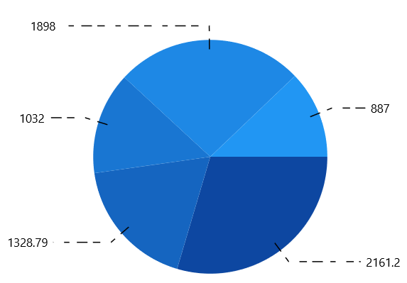

# Data Label in WinUI Chart

Data points can be easily annotated with labels to help improve the readability of data. 

## Define Data Label 

To enable the Label in data markers you have to set the [`ShowDataLabels`](https://help.syncfusion.com/cr/winui/Syncfusion.UI.Xaml.Charts.DataMarkerSeries.html#Syncfusion_UI_Xaml_Charts_DataMarkerSeries_ShowDataLabels) property. 

[`Context`](https://help.syncfusion.com/cr/winui/Syncfusion.UI.Xaml.Charts.ChartDataLabelSettings.html#Syncfusion_UI_Xaml_Charts_ChartDataLabelSettings_Context) property allows you to define the value to be displayed as label content..

The following code example demonstrates about define the value to be displayed as data label.





<chart:SfChart>
. . .
<chart:ColumnSeries ShowDataLabels="True">
    <chart:ColumnSeries.DataLabelSettings>
        <chart:CartesianDataLabelSettings Context="YValue"/>
    </chart:ColumnSeries.DataLabelSettings>
</chart:ColumnSeries>

</chart:SfChart>




        
SfChart chart = new SfChart();
ColumnSeries series = new ColumnSeries();
. . .
series.DataLabelSettings = new CartesianDataLabelSettings()
{
    Context = LabelContext.YValue
};

chart.Series.Add(series);





## Customizing Labels

The following properties are used to customize the data marker label.

* [`BorderBrush`](https://help.syncfusion.com/cr/winui/Syncfusion.UI.Xaml.Charts.ChartDataLabelSettings.html#Syncfusion_UI_Xaml_Charts_ChartDataLabelSettings_BorderBrush)- used to change the border color.
* [`BorderThickness`](https://help.syncfusion.com/cr/winui/Syncfusion.UI.Xaml.Charts.ChartDataLabelSettings.html#Syncfusion_UI_Xaml_Charts_ChartDataLabelSettings_BorderThickness)- used to change the thickness of the border.
* [`Margin`](https://help.syncfusion.com/cr/winui/Syncfusion.UI.Xaml.Charts.ChartDataLabelSettings.html#Syncfusion_UI_Xaml_Charts_ChartDataLabelSettings_Margin)- used to change the margin size for label.
* [`FontStyle`](https://help.syncfusion.com/cr/winui/Syncfusion.UI.Xaml.Charts.ChartDataLabelSettings.html#Syncfusion_UI_Xaml_Charts_ChartDataLabelSettings_FontStyle)-  used to change font style of the label.
* [`FontSize`](https://help.syncfusion.com/cr/winui/Syncfusion.UI.Xaml.Charts.ChartDataLabelSettings.html#Syncfusion_UI_Xaml_Charts_ChartDataLabelSettings_FontSize)-  used to change font size of the label.
* [`Foreground`](https://help.syncfusion.com/cr/winui/Syncfusion.UI.Xaml.Charts.ChartDataLabelSettings.html#Syncfusion_UI_Xaml_Charts_ChartDataLabelSettings_Foreground)- used to change the color of the label.
* [`FontFamily`](https://help.syncfusion.com/cr/winui/Syncfusion.UI.Xaml.Charts.ChartDataLabelSettings.html#Syncfusion_UI_Xaml_Charts_ChartDataLabelSettings_FontFamily)-  used to change the font family of the label.
* [`Background`](https://help.syncfusion.com/cr/winui/Syncfusion.UI.Xaml.Charts.ChartDataLabelSettings.html#Syncfusion_UI_Xaml_Charts_ChartDataLabelSettings_Background)- used to change the label background color.

The following code example demonstrates the customization of label using the above properties:





<chart:SfChart>
. . .
<chart:ColumnSeries ShowDataLabels="True">
<chart:ColumnSeries.DataLabelSettings>
    <chart:CartesianDataLabelSettings Position="Outer" Foreground="White" 
                                      FontSize="11" FontFamily="Calibri" 
                                      BorderBrush="Black" BorderThickness="1" 
                                      Margin="1" FontStyle="Italic" Background="#1E88E5" />
</chart:ColumnSeries.DataLabelSettings>

</chart:ColumnSeries>
</chart:SfChart>





SfChart chart = new SfChart();
ColumnSeries series = new ColumnSeries();
. . .
series.DataLabelSettings = new CartesianDataLabelSettings()
{
    Position = DataLabelPosition.Outer,
    Foreground = new SolidColorBrush(Colors.White),
    BorderBrush = new SolidColorBrush(Colors.Black),
    Background = new SolidColorBrush(Colors.LightBlue),
    BorderThickness = new Thickness(1),
    Margin = new Thickness(1),
    FontStyle = FontStyle.Italic,
    FontFamily = new FontFamily("Calibri"),
    FontSize = 11
};

chart.Series.Add(series);





## Content Template

The default appearance of the label can be customized using [ContentTemplate](https://help.syncfusion.com/cr/winui/Syncfusion.UI.Xaml.Charts.ChartDataLabelSettings.html#Syncfusion_UI_Xaml_Charts_ChartDataLabelSettings_ContentTemplate) property of [CartesianDataLabelSettings](https://help.syncfusion.com/cr/winui/Syncfusion.UI.Xaml.Charts.CartesianDataLabelSettings.html) as in the below code example:





<chart:SfChart>
. . .
<chart:SfChart.Resources>
    <DataTemplate x:Key="dataLabelTemplate">
        <StackPanel Orientation="Vertical">
            <Path Grid.Row="0"  Stretch="Uniform" Fill="#1E88E5"                              
               Width="15" Height="15" Margin="0,0,0,0"                              
               RenderTransformOrigin="0.5,0.5"
               Data="M22.5,15.8899993896484L37.5,                                
               30.8899993896484 7.5,30.8899993896484 22.5,15.8899993896484z">
                <Path.RenderTransform>
                    <TransformGroup>
                        <TransformGroup.Children>
                            <RotateTransform Angle="0" />
                            <ScaleTransform ScaleX="1" ScaleY="1" />
                        </TransformGroup.Children>
                    </TransformGroup>
                </Path.RenderTransform>
            </Path>
            <TextBlock Grid.Row="1" Text="{Binding}" FontSize="11" Foreground="Black"></TextBlock>
        </StackPanel>
    </DataTemplate>
</chart:SfChart.Resources>
. . . 
<chart:ColumnSeries ShowDataLabels="True">
    <chart:ColumnSeries.DataLabelSettings>
        <chart:CartesianDataLabelSettings Position="Outer" ContentTemplate="{StaticResource dataLabelTemplate}"/>
    </chart:ColumnSeries.DataLabelSettings>
. . .
</chart:ColumnSeries>

</chart:SfChart>





SfChart chart = new SfChart();
ColumnSeries series = new ColumnSeries();
. . .
series.DataLabelSettings = new CartesianDataLabelSettings()
{
    Position = DataLabelPosition.Outer,
    ContentTemplate = chart.Resources["dataLabelTemplate"] as DataTemplate
};

chart.Series.Add(series);





## Format

[Format](https://help.syncfusion.com/cr/winui/Syncfusion.UI.Xaml.Charts.ChartDataLabelSettings.html#Syncfusion_UI_Xaml_Charts_ChartDataLabelSettings_Format) property allows you to provide formatting for the labels.

The following code example demonstrates the y value having three decimal digits.





<chart:SfChart>
. . .
<chart:ColumnSeries ShowDataLabels="True">
    <chart:ColumnSeries.DataLabelSettings>
        <chart:CartesianDataLabelSettings Format="#.000" />
    </chart:ColumnSeries.DataLabelSettings>

</chart:ColumnSeries>
</chart:SfChart>





SfChart chart = new SfChart();
ColumnSeries series = new ColumnSeries();
. . .
series.DataLabelSettings = new CartesianDataLabelSettings()
{
    Format = "#.000"
};

chart.Series.Add(series);





In the following image, you can see the decimal position will be rounded off to two digits by default.

## Rotation

[Rotation](https://help.syncfusion.com/cr/winui/Syncfusion.UI.Xaml.Charts.ChartDataLabelSettings.html#Syncfusion_UI_Xaml_Charts_ChartDataLabelSettings_Rotation) property is used to define the angle to which the label has to rotate. The following code demonstrates the label rotating angle.





<chart:SfChart>
. . .
<chart:ColumnSeries ShowDataLabels="True">
    <chart:ColumnSeries.DataLabelSettings>
        <chart:CartesianDataLabelSettings Rotation="45" Position="Outer" />
    </chart:ColumnSeries.DataLabelSettings>
</chart:ColumnSeries>
</chart:SfChart>





SfChart chart = new SfChart();
ColumnSeries series = new ColumnSeries();
. . .
series.DataLabelSettings = new CartesianDataLabelSettings()
{
    Rotation = 45,
    Position = DataLabelPosition.Outer,
};

chart.Series.Add(series);





## Connector Line

This feature is used to connect label and data point using a line. It can be enabled for any chart types but this is often used with Pie and Doughnut chart types. You can add connector line for the data markers using [`ShowConnectorLine`](https://help.syncfusion.com/cr/winui/Syncfusion.UI.Xaml.Charts.ChartDataLabelSettings.html#Syncfusion_UI_Xaml_Charts_ChartDataLabelSettings_ShowConnectorLine) property. 

The connector line can be customized using the below properties.

* [`ConnectorHeight`](https://help.syncfusion.com/cr/winui/Syncfusion.UI.Xaml.Charts.ChartDataLabelSettings.html#Syncfusion_UI_Xaml_Charts_ChartDataLabelSettings_ConnectorHeight)
* [`ConnectorLineStyle`](https://help.syncfusion.com/cr/winui/Syncfusion.UI.Xaml.Charts.ChartDataLabelSettings.html#Syncfusion_UI_Xaml_Charts_ChartDataLabelSettings_ConnectorLineStyle) 

The following code example shows the customization options for connector line:





<chart:SfChart>
. . .

<chart:SfChart.Resources>
    
</chart:SfChart.Resources>
. . .
<chart:PieSeries ShowDataLabels="True">
    <chart:PieSeries.DataLabelSettings>
        <chart:CircularDataLabelSettings Position="Outer" 
                                         ShowConnectorLine="True"
                                         ConnectorLineStyle="{StaticResource lineStyle}" />
    </chart:PieSeries.DataLabelSettings>
        
</chart:PieSeries>

</chart:SfChart>





SfChart chart = new SfChart();
PieSeries series = new PieSeries();
. . .
series.DataLabelSettings = new CircularDataLabelSettings()
{
    Position = DataLabelPosition.Outer,
    ShowConnectorLine = true,
    ConnectorLineStyle = chart.Resources["lineStyle"] as Style,
};

chart.Series.Add(series);





## Applying Series Brush

[`UseSeriesPalette`](https://help.syncfusion.com/cr/WinUI/Syncfusion.UI.Xaml.Charts.ChartDataMarkerBase.html#Syncfusion_UI_Xaml_Charts_ChartDataMarkerBase_UseSeriesPalette) property is used to set the interior of the series to the data marker background. 





<chart:SfChart>
. . .
<chart:ColumnSeries ShowDataLabels="True">
    <chart:ColumnSeries.DataLabelSettings>
        <chart:CartesianDataLabelSettings UseSeriesPalette="True"/>
    </chart:ColumnSeries.DataLabelSettings>
</chart:ColumnSeries>

</chart:SfChart>





SfChart chart = new SfChart();
ColumnSeries series = new ColumnSeries();
. . .
series.DataLabelSettings = new CartesianDataLabelSettings()
{
    UseSeriesPalette = true,
};

chart.Series.Add(series);





