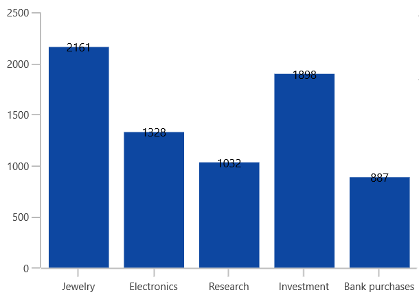
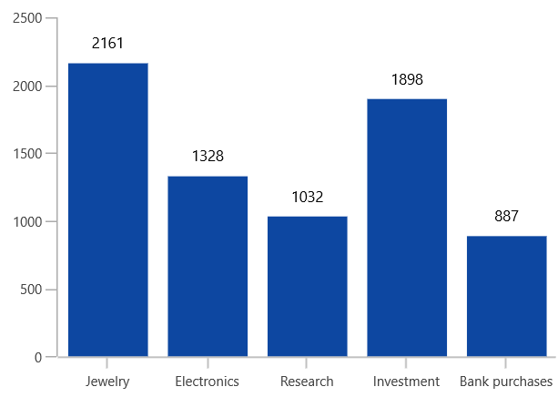

# Positioning Data Markers in WinUI Chart

The positioning of data markers is defined by using the [BarLabelAlignment](https://help.syncfusion.com/cr/winui/Syncfusion.UI.Xaml.Charts.CartesianDataLabelSettings.html#Syncfusion_UI_Xaml_Charts_CartesianDataLabelSettings_BarLabelAlignment) property.

* [Top](https://help.syncfusion.com/cr/winui/Syncfusion.UI.Xaml.Charts.BarLabelAlignment.html#Syncfusion_UI_Xaml_Charts_BarLabelAlignment_Top) - Positions the data marker at the top edge point of a chart segment.
* [Middle](https://help.syncfusion.com/cr/winui/Syncfusion.UI.Xaml.Charts.BarLabelAlignment.html#Syncfusion_UI_Xaml_Charts_BarLabelAlignment_Middle) - Positions the data marker at the center point of a chart segment.
* [Bottom](https://help.syncfusion.com/cr/winui/Syncfusion.UI.Xaml.Charts.BarLabelAlignment.html#Syncfusion_UI_Xaml_Charts_BarLabelAlignment_Bottom) - Positions the data marker at the bottom edge point of a chart segment.

N> This behavior varies based on the chart series type.

The following code example explains the positioning of data markers in the middle of the segment.





<chart:SfChart>
. . .
<chart:ColumnSeries ShowDataLabels="True">
    <chart:ColumnSeries.DataLabelSettings>
        <chart:CartesianDataLabelSettings BarLabelAlignment="Middle"/>
    </chart:ColumnSeries.DataLabelSettings>
</chart:ColumnSeries>
</chart:SfChart>





SfChart chart = new SfChart();
ColumnSeries series = new ColumnSeries();
. . .
series.DataLabelSettings = new CartesianDataLabelSettings()
{
    BarLabelAlignment = BarLabelAlignment.Middle,
};

chart.Series.Add(series);





Also, you can define the label alignment using  [HorizontalAlignment](https://help.syncfusion.com/cr/winui/Syncfusion.UI.Xaml.Charts.ChartDataLabelSettings.html#Syncfusion_UI_Xaml_Charts_ChartDataLabelSettings_HorizontalAlignment) and [VerticalAlignment](https://help.syncfusion.com/cr/winui/Syncfusion.UI.Xaml.Charts.ChartDataLabelSettings.html#Syncfusion_UI_Xaml_Charts_ChartDataLabelSettings_VerticalAlignment) properties.

## Position

Other than the above alignment options, Chart providing additional customization option to position the data markers smartly based on series types using the [Position](https://help.syncfusion.com/cr/winui/Syncfusion.UI.Xaml.Charts.CartesianDataLabelSettings.html#Syncfusion_UI_Xaml_Charts_CartesianDataLabelSettings_Position) property. By default, labels are positioned based on the series types for better readability.

The following are the values for this property: 

* [`Default`](https://help.syncfusion.com/cr/winui/Syncfusion.UI.Xaml.Charts.DataLabelPosition.html#Syncfusion_UI_Xaml_Charts_DataLabelPosition_Default)
* [`Auto`](https://help.syncfusion.com/cr/winui/Syncfusion.UI.Xaml.Charts.DataLabelPosition.html#Syncfusion_UI_Xaml_Charts_DataLabelPosition_Auto)
* [`Inner`](https://help.syncfusion.com/cr/winui/Syncfusion.UI.Xaml.Charts.DataLabelPosition.html#Syncfusion_UI_Xaml_Charts_DataLabelPosition_Inner)
* [`Outer`](https://help.syncfusion.com/cr/winui/Syncfusion.UI.Xaml.Charts.DataLabelPosition.html#Syncfusion_UI_Xaml_Charts_DataLabelPosition_Outer)
* [`Center`](https://help.syncfusion.com/cr/winui/Syncfusion.UI.Xaml.Charts.DataLabelPosition.html#Syncfusion_UI_Xaml_Charts_DataLabelPosition_Center)

The following code sample illustrates the center position of data marker labels,





 <chart:CartesianDataLabelSettings Position="Center" />





CartesianDataLabelSettings dataLabel = new CartesianDataLabelSettings()
{
    Position = DataLabelPosition.Center
}; 





| Column | Spline |
|--|--|
|||

The following code sample illustrates the inner position of data marker labels,





<chart:CartesianDataLabelSettings Position="Inner" />





CartesianDataLabelSettings dataLabel = new CartesianDataLabelSettings()
{
    Position = DataLabelPosition.Inner
};  





| Column | Spline |
|--|--|
|||

The following code sample illustrates the outer position of data marker labels,





<chart:CartesianDataLabelSettings Position="Outer" />





CartesianDataLabelSettings dataLabel = new CartesianDataLabelSettings()
{
    Position = DataLabelPosition.Outer
};     





| Column | Spline |
|--|--|
|||
