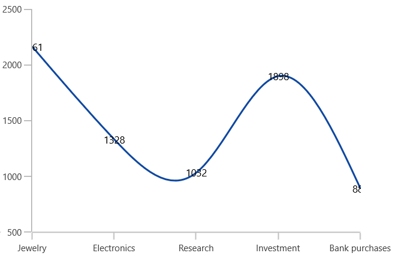
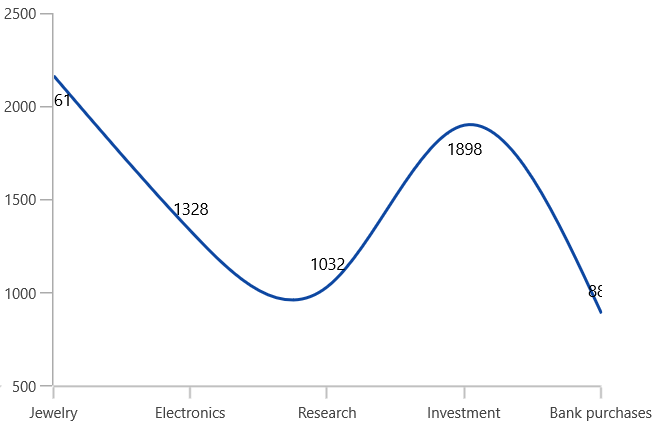
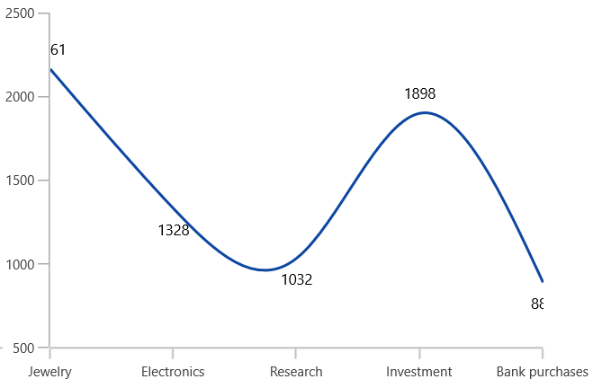

# Positioning the Data Markers in WinUI Charts (SfChart)

The positioning of data markers inside the series is defined using [`DataMarkerPosition`](https://help.syncfusion.com/cr/WinUI/Syncfusion.UI.Xaml.Charts.ChartDataMarkerBase.html#Syncfusion_UI_Xaml_Charts_ChartDataMarkerBase_DataMarkerPosition) property. 

* [`Top`](https://help.syncfusion.com/cr/WinUI/Syncfusion.UI.Xaml.Charts.DataMarkerPosition.html) - Positions the data marker at the top edge point of a chart segment.
* [`Bottom`](https://help.syncfusion.com/cr/WinUI/Syncfusion.UI.Xaml.Charts.DataMarkerPosition.html) - Positions the data marker at the bottom edge point of a chart segment.
* [`TopAndBottom`](https://help.syncfusion.com/cr/WinUI/Syncfusion.UI.Xaml.Charts.DataMarkerPosition.html) - Positions the data marker at the center point of a chart segment.

N> This behavior varies based on the chart series type.

The following code example explains the positioning of data markers in the middle of the segment.





<syncfusion:ChartDataMarker ShowMarker="True" DataMarkerPosition="TopAndBottom" MarkerInterior="DarkGray" MarkerType="Ellipse">
</syncfusion:ChartDataMarker>





ColumnSeries series = new ColumnSeries();
ChartDataMarker datamarker = new ChartDataMarker()
{
    ShowMarker = true,
    MarkerType = ChartSymbol.Ellipse,
    MarkerInterior = new SolidColorBrush(Colors.DarkGray),
    DataMarkerPosition=DataMarkerPosition.TopAndBottom
};
series.DataMarker = datamarker;





Also, you can define the label alignment using  [`HorizontalAlignment`](https://help.syncfusion.com/cr/WinUI/Syncfusion.UI.Xaml.Charts.ChartDataMarkerBase.html#Syncfusion_UI_Xaml_Charts_ChartDataMarkerBase_HorizontalAlignment) and [`VerticalAlignment`](https://help.syncfusion.com/cr/WinUI/Syncfusion.UI.Xaml.Charts.ChartDataMarkerBase.html#Syncfusion_UI_Xaml_Charts_ChartDataMarkerBase_VerticalAlignment) properties.

## Label Position

Other than the above positioning options, Chart providing additional customization option to position the data markers smartly based on series types using [`LabelPosition`](https://help.syncfusion.com/cr/WinUI/Syncfusion.UI.Xaml.Charts.ChartDataMarkerBase.html#Syncfusion_UI_Xaml_Charts_ChartDataMarkerBase_LabelPosition) property.

The following are the values for this property: 

* [`Default`](https://help.syncfusion.com/cr/WinUI/Syncfusion.UI.Xaml.Charts.DataMarkerLabelPosition.html#Syncfusion_UI_Xaml_Charts_DataMarkerLabelPosition_Default)
* [`Auto`](https://help.syncfusion.com/cr/WinUI/Syncfusion.UI.Xaml.Charts.DataMarkerLabelPosition.html#Syncfusion_UI_Xaml_Charts_DataMarkerLabelPosition_Auto)
* [`Inner`](https://help.syncfusion.com/cr/WinUI/Syncfusion.UI.Xaml.Charts.DataMarkerLabelPosition.html#Syncfusion_UI_Xaml_Charts_DataMarkerLabelPosition_Inner)
* [`Outer`](https://help.syncfusion.com/cr/WinUI/Syncfusion.UI.Xaml.Charts.DataMarkerLabelPosition.html#Syncfusion_UI_Xaml_Charts_DataMarkerLabelPosition_Outer)
* [`Center`](https://help.syncfusion.com/cr/WinUI/Syncfusion.UI.Xaml.Charts.DataMarkerLabelPosition.html#Syncfusion_UI_Xaml_Charts_DataMarkerLabelPosition_Center)

The following code sample illustrates the center position of data marker labels,





<chart:ChartDataMarker ShowLabel="True" LabelPosition="Center"/>





ChartDataMarker datamarker = new ChartDataMarker()
{
    ShowLabel = true,
    LabelPosition = DataMarkerLabelPosition.Center
};      





| Column | Spline |
|--|--|
|||

The following code sample illustrates the inner position of data marker labels,





<chart:ChartDataMarker ShowLabel="True" LabelPosition="Inner"/>





ChartDataMarker datamarker = new ChartDataMarker()
{
    ShowLabel = true,
    LabelPosition = DataMarkerLabelPosition.Inner
};      





| Column | Spline |
|--|--|
|||

The following code sample illustrates the outer position of data marker labels,





<chart:ChartDataMarker ShowLabel="True" LabelPosition="Outer"/>





ChartDataMarker datamarker = new ChartDataMarker()
{
    ShowLabel = true,
    LabelPosition = DataMarkerLabelPosition.Outer
};      





| Column | Spline |
|--|--|
|||