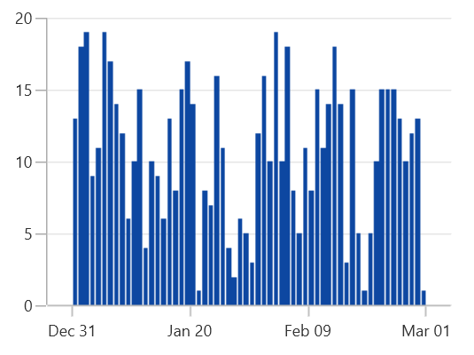
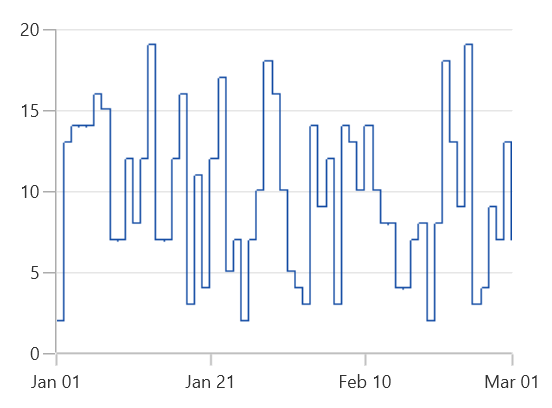

# Fast Bitmap Series in WinUI Charts (SfChart)

A fast bitmap series is a special kind of series that can render a collection with huge number of data points. A fast bitmap series displays a series of segments rendered using WritableBitmap. 

## FastLineBitmap Chart

[`FastLineBitmapSeries`]() displays a series of line segments rendered using WritableBitmap. The advantage of FastLineBitmapSeries is, its renders a million data point in a fraction of seconds.

The following code example shows how to use the fast line bitmap series:





<chart:FastLineBitmapSeries ItemsSource="{Binding Data}"

XBindingPath="XValue" YBindingPath="YValue"/>





FastLineBitmapSeries series = new FastLineBitmapSeries()
{

    ItemsSource = new ViewModel().Data,

    XBindingPath = "XValue",

    YBindingPath = "YValue"

};

chart.Series.Add(series);





N> As it was rendered using bitmap, there might be some jagged lines at edges. This is can be reduced using [`EnableAntiAliasing`]() property.





<chart:FastLineBitmapSeries EnableAntiAliasing="True" ItemsSource="{Binding Data}"

XBindingPath="XValue" YBindingPath="YValue"/>





FastLineBitmapSeries series = new FastLineBitmapSeries()
{

    ItemsSource = new ViewModel().Data,

    XBindingPath = "XValue",

    YBindingPath = "YValue",

    EnableAntiAliasing = true

};

chart.Series.Add(series);





## FastColumnBitmap Chart

[`FastColumnBitmapSeries`]() is used to boost up the performance of the column series.





<chart:FastColumnBitmapSeries ItemsSource="{Binding Data}" 

XBindingPath="XValue" YBindingPath="YValue"/>





FastColumnBitmapSeries series = new FastColumnBitmapSeries()
{

    ItemsSource = new ViewModel().Data,

    XBindingPath = "XValue",

    YBindingPath = "YValue"

};

chart.Series.Add(series);





## FastBarBitmap Chart

[`FastBarBitmapSeries`]() is used to boost up the performance of the bar series.





<chart:FastBarBitmapSeries ItemsSource="{Binding Data}" 

XBindingPath="XValue" YBindingPath="YValue"/>





FastBarBitmapSeries series = new FastBarBitmapSeries()
{

    ItemsSource = new ViewModel().Data,

    XBindingPath = "XValue",

    YBindingPath = "YValue"

};

chart.Series.Add(series);





## FastScatterBitmap Chart

[`FastScatterBitmapSeries`]() used to render high number scatter points. The [`ScatterHeight`]() and [`ScatterWidth`]() also available as in ScatterSeries. [`ShapeType`]() is used to change the rendering shape of fast scatter bitmap series. The available shapes are [`Cross`](), [`Diamond`](), [`Ellipse`](), [`Hexagon`](), [`InvertedTriangle`](), [`Pentagon`](), [`Plus`](), [`Rectangle`]() and [`Triangle`]().





<chart:FastScatterBitmapSeries ItemsSource="{Binding Data}"                         

XBindingPath="XValue" YBindingPath="YValue" 

ScatterHeight="7" ScatterWidth="7"/>





FastScatterBitmapSeries series = new FastScatterBitmapSeries()
{

    ItemsSource = new ViewModel().Data,

    XBindingPath = "XValue",

    YBindingPath = "YValue",

    ScatterHeight = 7,

    ScatterWidth = 7

};

chart.Series.Add(series);





## FastStepLineBitmap Chart

[`FastStepLineBitmapSeries`]() is the high performance version of step line series.





<chart:FastStepLineBitmapSeries ItemsSource="{Binding Data}"

XBindingPath="XValue" YBindingPath="YValue" />





FastStepLineBitmapSeries series = new FastStepLineBitmapSeries()
{

    ItemsSource = new ViewModel().Data,

    XBindingPath = "XValue",

    YBindingPath = "YValue"

};

chart.Series.Add(series);





The anti aliasing mode can be enabled using [`EnableAntiAliasing`]() property of FastStepLineBitmapSeries as in below code snippet:





<chart:FastStepLineBitmapSeries EnableAntiAliasing="True" ItemsSource="{Binding Data}"

XBindingPath="XValue" YBindingPath="YValue" />





FastStepLineBitmapSeries series = new FastStepLineBitmapSeries()
{

    ItemsSource = new ViewModel().Data,

    XBindingPath = "XValue",

    YBindingPath = "YValue",

    EnableAntiAliasing = true

};

chart.Series.Add(series);





