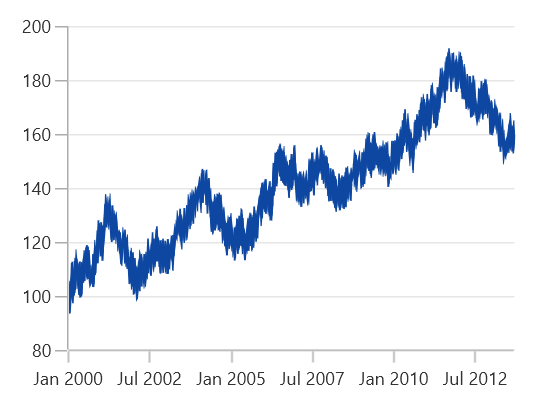

# Fast Series in WinUI Charts (SfChart)

A fast series is a special kind of series that can render a collection with huge number of data points. Fast series is rendered using a polyline segment.

## FastLine Chart

The [`FastLineSeries`]() is a special kind of line series that can render a collection with huge number of datapoints. Fast line is rendered using polyline segment. 





<chart:FastLineSeries ItemsSource="{Binding Data}"

XBindingPath="XValue" YBindingPath="YValue"/>





FastLineSeries series = new FastLineSeries()
{

    ItemsSource = new ViewModel().Data,

    XBindingPath = "XValue",

    YBindingPath = "YValue",

};

chart.Series.Add(series);





