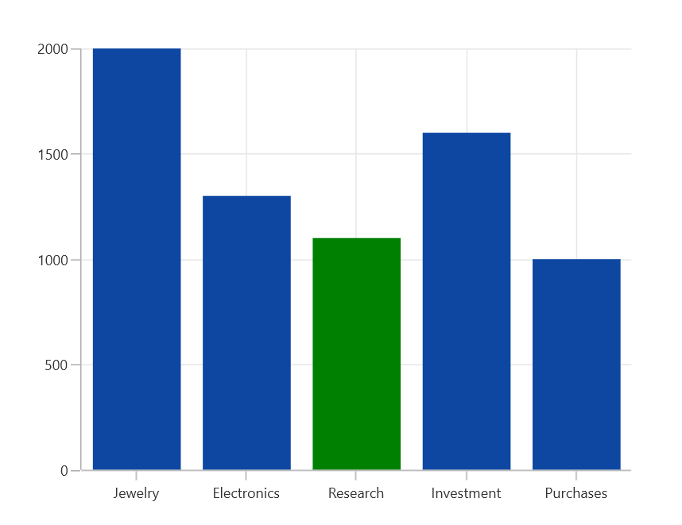
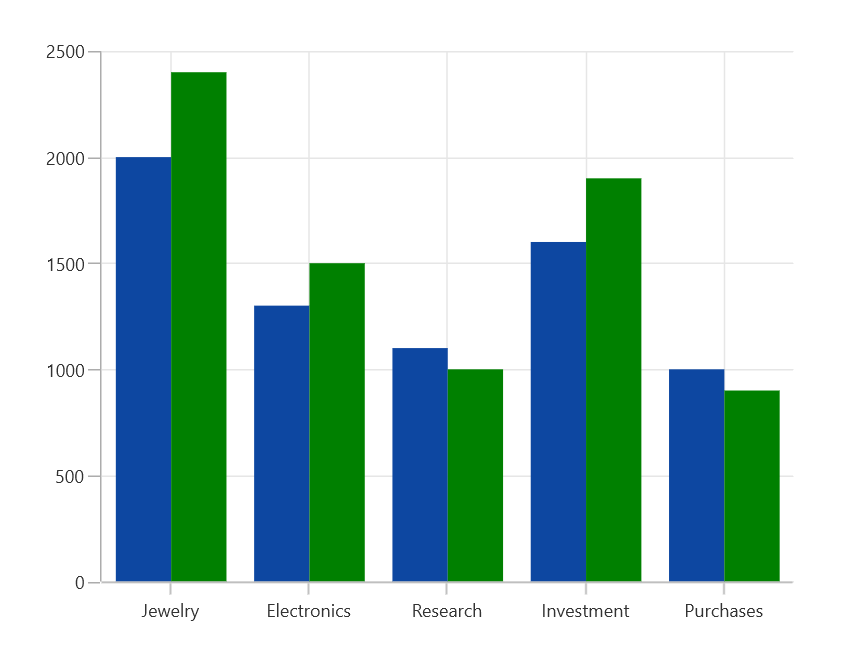

# Selection in WinUI Chart

SfChart supports selection that allows you to select a segment in a series or series itself by using [`ChartSelectionBehavior`](https://help.syncfusion.com/cr/WinUI/Syncfusion.UI.Xaml.Charts.ChartSelectionBehavior.html#). 

### Adding Selection Behavior to SfChart

You can create an instance [`ChartSelectionBehavior`](https://help.syncfusion.com/cr/WinUI/Syncfusion.UI.Xaml.Charts.ChartSelectionBehavior.html#) and add it to the Behaviors collection.





<syncfusion:SfChart.Behaviors>

<syncfusion:ChartSelectionBehavior >

</syncfusion:ChartSelectionBehavior>

</syncfusion:SfChart.Behaviors>





ChartSelectionBehavior selection = new ChartSelectionBehavior();

chart.Behaviors.Add(selection);





## SegmentSelection

Segment Selection allows you to highlight a segment in a chart series. For highlighting a segment the brush color can be set using [`SelectionBrush`](https://help.syncfusion.com/cr/winui/Syncfusion.UI.Xaml.Charts.ColumnSeries.html#Syncfusion_UI_Xaml_Charts_ColumnSeries_SelectionBrush) property.

**Segment Selection in ColumnSeries**





<chart:SChart>
. . .
    <chart:SfChart.Behaviors>
        <chart:ChartSelectionBehavior />
    </chart:SfChart.Behaviors>

    <chart:ColumnSeries ItemsSource="{Binding Data}" 
                        XBindingPath="Demand"
                        YBindingPath="Year2010"
                        SelectionBrush="Green"/>
</chart:SfChart>





SChart chart = new SChart();
. . .
ChartSelectionBehavior selection = new ChartSelectionBehavior();
chart.Behaviors.Add(selection);

ColumnSeries series = new ColumnSeries()
{
    ItemsSource = new ViewModel().Data,
    XBindingPath = "Demand",
    YBindingPath = "Year2010",
    SelectionBrush = new SolidColorBrush(Colors.Green)
};

chart.Series.Add(series);
this.Content = chart;





**Segment Selection in Linear Series**

In Linear type series the segment selection can be viewed by changing the data label interior.

The following code example demonstrates the spline series segment selection by changing the data label interior.





<chart:SfChart>
. . .
    <chart:SfChart.Behaviors>
        <chart:ChartSelectionBehavior />
    </chart:SfChart.Behaviors>

    <chart:SplineSeries ItemsSource="{Binding Data}" 
                        XBindingPath="Demand"
                        YBindingPath="Year2010"
                        SelectionBrush="Green"
                        ShowDataLabels="True"/>
</chart:SfChart>





SfChart chart = new SfChart();
. . .
ChartSelectionBehavior selection = new ChartSelectionBehavior();
chart.Behaviors.Add(selection);

SplineSeries series = new SplineSeries()
{
    ItemsSource = new ViewModel().Data,
    XBindingPath = "Demand",
    YBindingPath = "Year2010",
    SelectionBrush = new SolidColorBrush(Colors.Green),
    ShowDataLabels="True" 
};

chart.Series.Add(series);
this.Content = chart;





## Series Selection

Series selection is used in case of multiple series when you want to highlight a particular series. Series selection can be enabled by setting [`Type`](https://help.syncfusion.com/cr/winui/Syncfusion.UI.Xaml.Charts.ChartSelectionBehavior.html#Syncfusion_UI_Xaml_Charts_ChartSelectionBehavior_Type) property value to [Series](https://help.syncfusion.com/cr/winui/Syncfusion.UI.Xaml.Charts.SfCartesianChart.html#Syncfusion_UI_Xaml_Charts_SfCartesianChart_Series) in [ChartSelectionBehavior](https://help.syncfusion.com/cr/winui/Syncfusion.UI.Xaml.Charts.ChartSelectionBehavior.html). The [`SeriesSelectionBrush`](https://help.syncfusion.com/cr/WinUI/Syncfusion.UI.Xaml.Charts.ChartSeriesBase.html#Syncfusion_UI_Xaml_Charts_ChartSeriesBase_SeriesSelectionBrush) property is used to set the brush color to highlight the series.

The following code example demonstrates highlighting a series.





<chart:SfChart>
. . .
    <chart:SfChart.Behaviors>
        <chart:ChartSelectionBehavior SeriesSelectionBrush="Green" Type="Series"/>
    </chart:SfChart.Behaviors>
. . .
</chart:SfChart> 





SfChart chart = new SfChart();
. . .
ChartSelectionBehavior selection = new ChartSelectionBehavior();
selection.SeriesSelectionBrush = new SolidColorBrush(Colors.Green);
selection.Type = SelectionType.Series;
chart.Behaviors.Add(selection);
. . .
this.Content = chart;





N>By default the segment selection is true, so for selecting series you have to set the EnableSegmentSelection property to false.

## Multi-selection

SfChart provides support to select single or multiple segments/series by using the [Type](https://help.syncfusion.com/cr/winui/Syncfusion.UI.Xaml.Charts.ChartSelectionBehavior.html#Syncfusion_UI_Xaml_Charts_ChartSelectionBehavior_Type) property. [Type](https://help.syncfusion.com/cr/winui/Syncfusion.UI.Xaml.Charts.ChartSelectionBehavior.html#Syncfusion_UI_Xaml_Charts_ChartSelectionBehavior_Type) property with [MultiPoint](https://help.syncfusion.com/cr/winui/Syncfusion.UI.Xaml.Charts.SelectionType.html#Syncfusion_UI_Xaml_Charts_SelectionType_MultiPoint) value is used to select multiple segments and [MultiSeries](https://help.syncfusion.com/cr/winui/Syncfusion.UI.Xaml.Charts.SelectionType.html#Syncfusion_UI_Xaml_Charts_SelectionType_MultiSeries) is used to select multiple series. By default, the [Type](https://help.syncfusion.com/cr/winui/Syncfusion.UI.Xaml.Charts.ChartSelectionBehavior.html#Syncfusion_UI_Xaml_Charts_ChartSelectionBehavior_Type) value is [Point](https://help.syncfusion.com/cr/winui/Syncfusion.UI.Xaml.Charts.SelectionType.html#Syncfusion_UI_Xaml_Charts_SelectionType_Point).





<chart:SfChart>
. . .
    <chart:SfChart.Behaviors>
        <chart:ChartSelectionBehavior  Type="MultiPoint"/>
    </chart:SfChart.Behaviors>

    <chart:SfChart.Series>
        <chart:ColumnSeries ItemsSource="{Binding Data}"  
                            XBindingPath="Demand"
                            YBindingPath="Year2010" 
                            SelectionBrush="Green"/>
    </chart:SfChart.Series>

</chart:SfChart>





SfChart chart = new SfChart();
. . .
ChartSelectionBehavior selection = new ChartSelectionBehavior();
selection.Type = SelectionType.MultiPoint;
chart.Behaviors.Add(selection);

ColumnSeries series = new ColumnSeries()
{
    ItemsSource = new ViewModel().Data,
    XBindingPath = "Demand",
    YBindingPath = "Year2010",
    SelectionBrush = new SolidColorBrush(Colors.Green)
};
chart.Series.Add(series);
this.Content = chart;





The following code snippet demonstrates multiple series selection.





<chart:SfChart>
. . .
    <chart:SfChart.Behaviors>
        <chart:ChartSelectionBehavior SeriesSelectionBrush="Green" Type="MultiSeries"/>
    </chart:SfChart.Behaviors>
. . .
</chart:SfChart>





SfChart chart = new SfChart();
. . .
ChartSelectionBehavior selection = new ChartSelectionBehavior();
selection.SeriesSelectionBrush = new SolidColorBrush(Colors.Green);
selection.Type = SelectionType.MultiSeries;
chart.Behaviors.Add(selection);
. . .
this.Content = chart;





## Selection on initial rendering

SfChart provides support to select a point programmatically on a chart using the [SelectedIndex](https://help.syncfusion.com/cr/winui/Syncfusion.UI.Xaml.Charts.ColumnSeries.html#Syncfusion_UI_Xaml_Charts_ColumnSeries_SelectedIndex) property of series.





<chart:SfChart>
. . .
    <chart:SfChart.Behaviors>
        <chart:ChartSelectionBehavior/>
    </chart:SfChart.Behaviors>

    <chart:SfChart.Series>
        <chart:ColumnSeries ItemsSource="{Binding Data}" 
                            XBindingPath="Demand"
                            YBindingPath="Year2010" 
                            SelectionBrush="Green"]
                            SelectedIndex="3"/>
    </chart:SfChart.Series>

</chart:SfChart>





SfChart chart = new SfChart();
. . .
ChartSelectionBehavior selection = new ChartSelectionBehavior();
chart.Behaviors.Add(selection);

ColumnSeries series = new ColumnSeries()
{
    ItemsSource = new ViewModel().Data,
    XBindingPath = "Demand",
    YBindingPath = "Year2010",
    SelectionBrush = new SolidColorBrush(Colors.Green),
    SelectedIndex = 3
};
chart.Series.Add(series);
this.Content = chart;





Select a series programmatically on a chart using the [SelectedSeriesIndex](https://help.syncfusion.com/cr/winui/Syncfusion.UI.Xaml.Charts.ChartBase.html#Syncfusion_UI_Xaml_Charts_ChartBase_SelectedSeriesIndex) property of the chart.





<chart:SfChart SelectedSeriesIndex="0">
. . .
    <chart:SfChart.Behaviors>
        <chart:ChartSelectionBehavior SeriesSelectionBrush="Green" Type="Series"/>
    </chart:SfChart.Behaviors>
. . .
</chart:SfChart>





SfChart chart = new SfChart();
chart.SelectedSeriesIndex = 0;
. . .
ChartSelectionBehavior selection = new ChartSelectionBehavior();
selection.SeriesSelectionBrush = new SolidColorBrush(Colors.Green);
selection.Type = SelectionType.Series;
chart.Behaviors.Add(selection);
. . .
this.Content = chart;





### Changing Cursor while Selection

[Cursor](https://help.syncfusion.com/cr/winui/Syncfusion.UI.Xaml.Charts.ChartSelectionBehavior.html#Syncfusion_UI_Xaml_Charts_ChartSelectionBehavior_Cursor) property allows to define the cursor when mouse is hovered over the segment with segment selection enabled.





<chart:SfChart>
. . . 
    <chart:SfChart.Behaviors>
        <chart:ChartSelectionBehavior  Cursor="Hand"/>
    </chart:SfChart.Behaviors>

    <chart:SfChart.Series>
        <chart:ColumnSeries ItemsSource="{Binding Data}"  
                            XBindingPath="Demand" 
                            YBindingPath="Year2010" 
                            SelectionBrush="Green"/>
     </chart:SfChart.Series>

</chart:SfChart>





SfChart chart = new SfChart();
. . .
ChartSelectionBehavior selection = new ChartSelectionBehavior();
selection.Cursor = Windows.UI.Core.CoreCursorType.Hand;
chart.Behaviors.Add(selection);

ColumnSeries series = new ColumnSeries()
{
    ItemsSource = new ViewModel().Data,
    XBindingPath = "Demand",
    YBindingPath = "Year2010",
    SelectionBrush = new SolidColorBrush(Colors.Green)
};

chart.Series.Add(series);
this.Content = chart;





## Events

The following events are available in SfChart for ChartSelectionBehavior.

### SelectionChanging

The [`SelectionChanging`](https://help.syncfusion.com/cr/winui/Syncfusion.UI.Xaml.Charts.ChartBase.html#Syncfusion_UI_Xaml_Charts_ChartBase_SelectionChanging) event occurs before the data point is being selected. This is a cancelable event. This argument contains the following information.

* [`SelectedSeries`](https://help.syncfusion.com/cr/WinUI/Syncfusion.UI.Xaml.Charts.ChartSelectionChangingEventArgs.html#Syncfusion_UI_Xaml_Charts_ChartSelectionChangingEventArgs_SelectedSeries) - Gets the series of the selected data point.
* [`SelectedSegments`](https://help.syncfusion.com/cr/WinUI/Syncfusion.UI.Xaml.Charts.ChartSelectionChangingEventArgs.html#Syncfusion_UI_Xaml_Charts_ChartSelectionChangingEventArgs_SelectedSegments) - Gets or sets the segments collection of the selected series.
* [`SelectedSegment`](https://help.syncfusion.com/cr/WinUI/Syncfusion.UI.Xaml.Charts.ChartSelectionChangingEventArgs.html#Syncfusion_UI_Xaml_Charts_ChartSelectionChangingEventArgs_SelectedSegment) - Gets the segment of the selected data point.
* [`SelectedIndex`](https://help.syncfusion.com/cr/WinUI/Syncfusion.UI.Xaml.Charts.ChartSelectionChangingEventArgs.html#Syncfusion_UI_Xaml_Charts_ChartSelectionChangingEventArgs_SelectedIndex) - Gets the selected data point index.
* [`PreviousSelectedIndex`](https://help.syncfusion.com/cr/WinUI/Syncfusion.UI.Xaml.Charts.ChartSelectionChangingEventArgs.html#Syncfusion_UI_Xaml_Charts_ChartSelectionChangingEventArgs_PreviousSelectedIndex) - Gets the previous selected data point index.
* [`IsSelected`](https://help.syncfusion.com/cr/WinUI/Syncfusion.UI.Xaml.Charts.ChartSelectionChangingEventArgs.html#Syncfusion_UI_Xaml_Charts_ChartSelectionChangingEventArgs_IsSelected) - Gets a value that indicates whether the segment or series is selected.
* [`IsDataPointSelection`](https://help.syncfusion.com/cr/WinUI/Syncfusion.UI.Xaml.Charts.ChartSelectionChangingEventArgs.html#Syncfusion_UI_Xaml_Charts_ChartSelectionChangingEventArgs_IsDataPointSelection) - Gets a value that indicates whether the selection is segment selection or series selection.
* [`Cancel`](https://help.syncfusion.com/cr/WinUI/Syncfusion.UI.Xaml.Charts.ChartSelectionChangingEventArgs.html#Syncfusion_UI_Xaml_Charts_ChartSelectionChangingEventArgs_Cancel) - Gets or Sets a value that indicates whether the selection should be canceled.

### SelectionChanged

The [`SelectionChanged`](https://help.syncfusion.com/cr/winui/Syncfusion.UI.Xaml.Charts.ChartSelectionChangedEventArgs.html#Syncfusion_UI_Xaml_Charts_ChartSelectionChangedEventArgs_SelectedSeries) event occurs after a data point has been selected. This argument contains the following information.

* [`SelectedSeries`](https://help.syncfusion.com/cr/WinUI/Syncfusion.UI.Xaml.Charts.ChartSelectionChangedEventArgs.html#Syncfusion_UI_Xaml_Charts_ChartSelectionChangedEventArgs_SelectedSeries) - Gets the series of the selected data point.
* [`SelectedSegments`](https://help.syncfusion.com/cr/WinUI/Syncfusion.UI.Xaml.Charts.ChartSelectionChangedEventArgs.html#Syncfusion_UI_Xaml_Charts_ChartSelectionChangedEventArgs_SelectedSegments) - Gets the segments collection of the selected series.
* [`SelectedSegment`](https://help.syncfusion.com/cr/WinUI/Syncfusion.UI.Xaml.Charts.ChartSelectionChangedEventArgs.html#Syncfusion_UI_Xaml_Charts_ChartSelectionChangedEventArgs_SelectedSegment) - Gets the segment of the selected data point.
* [`SelectedIndex`](https://help.syncfusion.com/cr/WinUI/Syncfusion.UI.Xaml.Charts.ChartSelectionChangedEventArgs.html#Syncfusion_UI_Xaml_Charts_ChartSelectionChangedEventArgs_SelectedIndex) - Gets the selected data point index.
* [`PreviousSelectedSeries`](https://help.syncfusion.com/cr/WinUI/Syncfusion.UI.Xaml.Charts.ChartSelectionChangedEventArgs.html#Syncfusion_UI_Xaml_Charts_ChartSelectionChangedEventArgs_PreviousSelectedSeries) - Gets the previous selected series.
* [`PreviousSelectedSegments`](https://help.syncfusion.com/cr/WinUI/Syncfusion.UI.Xaml.Charts.ChartSelectionChangedEventArgs.html#Syncfusion_UI_Xaml_Charts_ChartSelectionChangedEventArgs_PreviousSelectedSegments) - Gets the segments collection of previous selected series.
* [`PreviousSelectedSegment`](https://help.syncfusion.com/cr/WinUI/Syncfusion.UI.Xaml.Charts.ChartSelectionChangedEventArgs.html#Syncfusion_UI_Xaml_Charts_ChartSelectionChangedEventArgs_PreviousSelectedSegment) - Gets the segment of previous selected data point.
* [`PreviousSelectedIndex`](https://help.syncfusion.com/cr/WinUI/Syncfusion.UI.Xaml.Charts.ChartSelectionChangedEventArgs.html#Syncfusion_UI_Xaml_Charts_ChartSelectionChangedEventArgs_PreviousSelectedIndex) - Gets the previous selected data point index.
* [`OldPointInfo`](https://help.syncfusion.com/cr/WinUI/Syncfusion.UI.Xaml.Charts.ChartSelectionChangedEventArgs.html#Syncfusion_UI_Xaml_Charts_ChartSelectionChangedEventArgs_OldPointInfo) - Gets the previous selected segment item value.
* [`NewPointInfo`](https://help.syncfusion.com/cr/WinUI/Syncfusion.UI.Xaml.Charts.ChartSelectionChangedEventArgs.html#Syncfusion_UI_Xaml_Charts_ChartSelectionChangedEventArgs_NewPointInfo) - Gets the selected segment item value.
* [`IsSelected`](https://help.syncfusion.com/cr/WinUI/Syncfusion.UI.Xaml.Charts.ChartSelectionChangedEventArgs.html#Syncfusion_UI_Xaml_Charts_ChartSelectionChangedEventArgs_IsSelected) - Gets a value that indicates whether the segment or series is being selected.
* [`IsDataPointSelection`](https://help.syncfusion.com/cr/WinUI/Syncfusion.UI.Xaml.Charts.ChartSelectionChangedEventArgs.html#Syncfusion_UI_Xaml_Charts_ChartSelectionChangedEventArgs_IsDataPointSelection) - Gets a value that indicates whether the selection is segment selection or series selection.
* [`SelectedSeriesCollection`](https://help.syncfusion.com/cr/WinUI/Syncfusion.UI.Xaml.Charts.ChartSelectionChangedEventArgs.html#Syncfusion_UI_Xaml_Charts_ChartSelectionChangedEventArgs_SelectedSeriesCollection) - Gets the series collection that has been selected through rectangle selection or mouse interaction.
