# Legend in WinUI Charts (SfChart)

[`Legend`](https://help.syncfusion.com/cr/WinUI/Syncfusion.UI.Xaml.Charts.ChartBase.html#Syncfusion_UI_Xaml_Charts_ChartBase_Legend) provides metadata which helps for identifying elements in chart like [chart series](https://help.syncfusion.com/winui/chart/seriestypes/series). 
You can define the legend using the following code example.





<chart:SfChart.Legend>

       <chart:ChartLegend />                                 

</chart:SfChart.Legend>





SfChart chart = new SfChart();

chart.Legend = new ChartLegend();





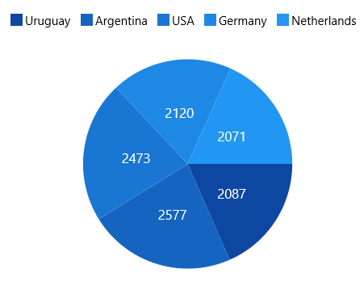

## Legend Header

Chart provides support to add any UIElement as a header for legend items. 

You can define the [`Header`](https://help.syncfusion.com/cr/winui/Syncfusion.UI.Xaml.Charts.ChartLegend.html#Syncfusion_UI_Xaml_Charts_ChartLegend_Header) for legend using the following code example.





<chart:SfChart.Legend>

      <chart:ChartLegend>

          <chart:ChartLegend.Header>

               <TextBlock Text="Medals" VerticalAlignment="Center"  

                           HorizontalAlignment="Center" Margin="15"/>

            </chart:ChartLegend.Header>

     </chart:ChartLegend>

</chart:SfChart.Legend>





ChartLegend legend = new ChartLegend();

TextBlock textBlock = new TextBlock()
{

    Text = "Medals",

    HorizontalAlignment = HorizontalAlignment.Center,

    VerticalAlignment = VerticalAlignment.Center,

    Margin = new Thickness(15)

};

legend.Header = textBlock;

chart.Legend = legend;





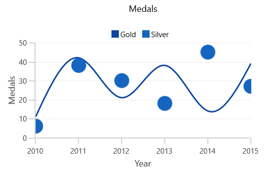

## Legend Icon

Represents the symbol associated with each legend item. By default, the legend icon is [`Rectangle`](https://help.syncfusion.com/cr/winui/Syncfusion.UI.Xaml.Charts.ChartLegendIcon.html). This can be customized using the [`LegendIcon`](https://help.syncfusion.com/cr/winui/Syncfusion.UI.Xaml.Charts.ChartSeriesBase.html#Syncfusion_UI_Xaml_Charts_ChartSeriesBase_LegendIcon) property in any series as in below code snippet:





<chart:SfChart.Legend>

      <chart:ChartLegend/>

</chart:ChartLegend>

<chart:SplineSeries XBindingPath="Year" Label="Gold" ItemsSource="{Binding List}" 

YBindingPath="India" LegendIcon="Diamond" />





chart.Legend = new ChartLegend();

SplineSeries splineSeries = new SplineSeries()
{

    Label = "Gold",

    ItemsSource = new ViewModel().List,

    XBindingPath = "Year",

    YBindingPath = "India",

    LegendIcon = ChartLegendIcon.Diamond

};

chart.Series.Add(splineSeries);





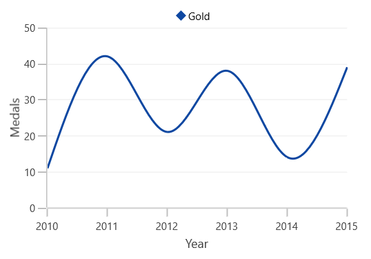

The following properties are used to customize the legend.

* [`IconWidth`](https://help.syncfusion.com/cr/winui/Syncfusion.UI.Xaml.Charts.ChartLegend.html#Syncfusion_UI_Xaml_Charts_ChartLegend_IconWidth)-Gets or sets the double value that represents the legend icon(s) width.
* [`IconHeight`](https://help.syncfusion.com/cr/winui/Syncfusion.UI.Xaml.Charts.ChartLegend.html#Syncfusion_UI_Xaml_Charts_ChartLegend_IconHeight)-Gets or sets the double value that represents that legend icon(s) height.
* [`IconVisibility`](https://help.syncfusion.com/cr/winui/Syncfusion.UI.Xaml.Charts.ChartLegend.html#Syncfusion_UI_Xaml_Charts_ChartLegend_IconVisibility)-Gets or sets the Visibility of the legend icon.
* [`ItemMargin`](https://help.syncfusion.com/cr/winui/Syncfusion.UI.Xaml.Charts.ChartLegend.html#Syncfusion_UI_Xaml_Charts_ChartLegend_ItemMargin)-Gets or sets the margin for the legend items.
* [`CornerRadius`](https://help.syncfusion.com/cr/winui/Syncfusion.UI.Xaml.Charts.ChartLegend.html#Syncfusion_UI_Xaml_Charts_ChartLegend_CornerRadius)-Gets or sets the corner radius of the legend.

The following code example illustrates the customization of legend.





<chart:SfChart.Legend>

    <chart:ChartLegend  IconHeight="10" IconWidth="10" 

                        Margin="0,0,0,5"

                        HorizontalAlignment="Center"

                        VerticalAlignment="Center"                                    

                        DockPosition="Top"

                        BorderBrush="Black" BorderThickness="1"

                        IconVisibility="Visible" CornerRadius="5"

                        ItemMargin="10">                   

    </chart:ChartLegend>

</chart:SfChart.Legend>       





chart.Legend = new ChartLegend()
{

    IconHeight = 10,

    IconWidth = 10,

    Margin = new Thickness(0, 0, 0, 5),

    HorizontalAlignment = HorizontalAlignment.Center,

    VerticalAlignment = VerticalAlignment.Center,

    DockPosition = ChartDock.Top,

    IconVisibility = Visibility.Visible,

    CornerRadius = CornerRadiusHelper.FromUniformRadius(5),

    ItemMargin = new Thickness(10),

    BorderThickness = new Thickness(1),

    BorderBrush = new SolidColorBrush(Colors.Black)

};





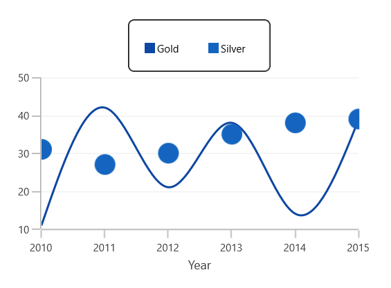

The visibility of the legend icon can be changed by setting [`IconVisibility`](https://help.syncfusion.com/cr/winui/Syncfusion.UI.Xaml.Charts.ChartLegend.html#Syncfusion_UI_Xaml_Charts_ChartLegend_IconVisibility) property in ChartLegend. 





<chart:SfChart.Legend>

   <chart:ChartLegend  IconHeight="8" IconWidth="8"  

                       IconVisibility="Collapsed" />                                 

</chart:SfChart.Legend>





chart.Legend = new ChartLegend()
{

    IconHeight = 8,

    IconWidth = 8,

    IconVisibility = Visibility.Collapsed,

};





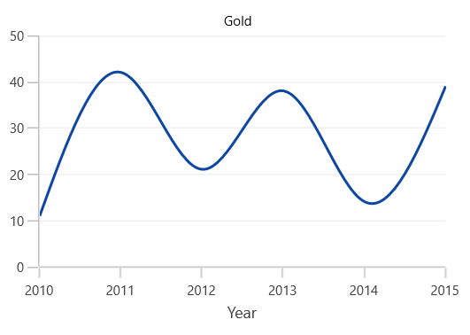

**Custom** **Legend** **Icon**

We can add custom icon for the legend using [`LegendIconTemplate`](https://help.syncfusion.com/cr/winui/Syncfusion.UI.Xaml.Charts.ChartSeriesBase.html#Syncfusion_UI_Xaml_Charts_ChartSeriesBase_IconTemplate) property in ChartSeries as in below example.





<syncfusion:SfChart x:Name="chart">

    <syncfusion:SfChart.Resources>

        <DataTemplate x:Key="iconTemplate">

            <Ellipse Height="15" Width="15" Fill="White" 
			                   
                     Stroke="#4a4a4a" StrokeThickness="2"/>

        </DataTemplate>

    </syncfusion:SfChart.Resources>

    <syncfusion:SfChart.Legend>

        <syncfusion:ChartLegend/>

     </syncfusion:SfChart.Legend>

    <syncfusion:SplineSeries XBindingPath="Year"  Label="Gold" 
  
	                         ItemsSource="{Binding List}" 
                                     
                             YBindingPath="India" 
                                     
                             IconTemplate="{StaticResource iconTemplate}">

    </syncfusion:SplineSeries>
        
</syncfusion:SfChart>





SplineSeries series = new SplineSeries()
{

    ItemsSource = new ViewModel().List,

    XBindingPath = "Year",

    YBindingPath = "India",

    IconTemplate = chart.Resources["iconTemplate"] as DataTemplate

};

chart.Series.Add(series);





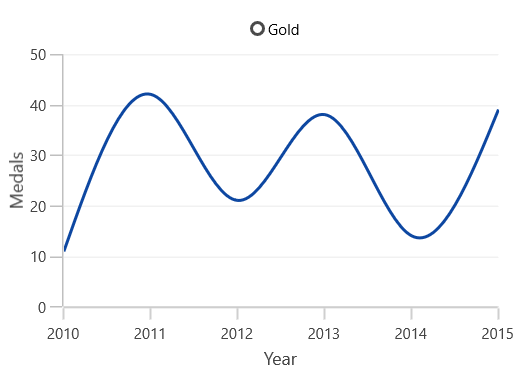

## Legend Label

This allows us to specify the label for each series which is to be displayed in legend label.





<chart:SfChart.Legend>

    <chart:ChartLegend>

    </chart:ChartLegend>

</chart:SfChart.Legend>

<chart:SplineSeries XBindingPath="Year" Label="Spline"
   
	                  ItemsSource="{Binding List}" YBindingPath="India"/>





chart.Legend = new ChartLegend();

SplineSeries splineSeries = new SplineSeries()
{

    Label = "Spline",

    ItemsSource = new ViewModel().List,

    XBindingPath = "Year",

    YBindingPath = "India",

};

chart.Series.Add(splineSeries);





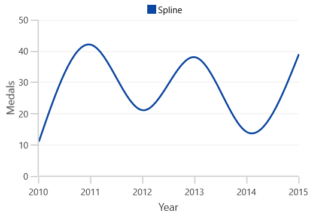

## Checkbox for legend

Used to view or collapse the associated series. By default, the CheckboxVisibility is *Collapsed*. 

We can enable it by using the [`CheckBoxVisibility`](https://help.syncfusion.com/cr/winui/Syncfusion.UI.Xaml.Charts.ChartLegend.html#Syncfusion_UI_Xaml_Charts_ChartLegend_CheckBoxVisibility) property as in below code example:





<chart:SfChart.Legend>

        <chart:ChartLegend CheckBoxVisibility="Visible" />

</chart:SfChart.Legend>





chart.Legend = new ChartLegend()
{

    CheckBoxVisibility = Visibility.Visible

};





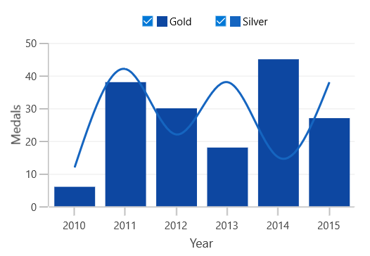

The series can be collapsed by unchecking the checkbox as below:

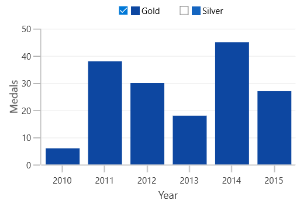

## ToggleSeriesVisibility 

[`ToggleSeriesVisibility`](https://help.syncfusion.com/cr/winui/Syncfusion.UI.Xaml.Charts.ChartLegend.html#Syncfusion_UI_Xaml_Charts_ChartLegend_ToggleSeriesVisibility) is used to view or collapse the associated [`series`](https://help.syncfusion.com/winui/chart/seriestypes/series), by clicking on its legend item. By default, [`ToggleSeriesVisibility`](https://help.syncfusion.com/cr/winui/Syncfusion.UI.Xaml.Charts.ChartLegend.html#Syncfusion_UI_Xaml_Charts_ChartLegend_ToggleSeriesVisibility) property is *False*.

We can enable the [`ToggleSeriesVisibility`](https://help.syncfusion.com/cr/winui/Syncfusion.UI.Xaml.Charts.ChartLegend.html#Syncfusion_UI_Xaml_Charts_ChartLegend_ToggleSeriesVisibility) property as in below code example:





<chart:SfChart.Legend>

        <chart:ChartLegend ToggleSeriesVisibility="True" />

</chart:SfChart.Legend>





chart.Legend = new ChartLegend()
{

    ToggleSeriesVisibility = true

};





The [`series`](https://help.syncfusion.com/winui/chart/seriestypes/series) can be collapsed, by clicking on the respective legend item,

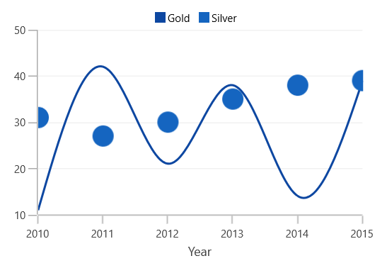

We can also view the associated [`series`](https://help.syncfusion.com/winui/chart/seriestypes/series), by clicking on its disabled legend item,

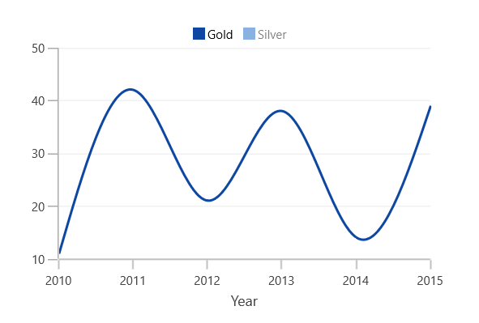

## Positioning the Legend

**Legend** **Position**

This allows us to position the legends [`Inside`](https://help.syncfusion.com/cr/winui/Syncfusion.UI.Xaml.Charts.LegendPosition.html#Syncfusion_UI_Xaml_Charts_LegendPosition_Inside) or [`Outside`](https://help.syncfusion.com/cr/winui/Syncfusion.UI.Xaml.Charts.LegendPosition.html#Syncfusion_UI_Xaml_Charts_LegendPosition_Outside) of the chart area (plotting area). 
By default, it will be displayed outside and positioned at top (using [`DockPosition`](https://help.syncfusion.com/cr/winui/Syncfusion.UI.Xaml.Charts.ChartLegend.html#Syncfusion_UI_Xaml_Charts_ChartLegend_DockPosition)) of the chart area.





<chart:SfChart.Legend>

     <chart:ChartLegend Position="Inside" />                                 

</chart:SfChart.Legend>





chart.Legend = new ChartLegend()
{

    Position = LegendPosition.Inside

};





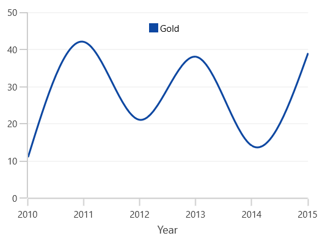

**Docking**

Legends can be docked left, right, and top or bottom around the chart area using [`DockPosition`](https://help.syncfusion.com/cr/winui/Syncfusion.UI.Xaml.Charts.ChartLegend.html#Syncfusion_UI_Xaml_Charts_ChartLegend_DockPosition) property. 
By default, the ChartLegend is docked at the top of the chart as mentioned earlier.

To display the legend at the bottom, you can set the [`DockPosition`](https://help.syncfusion.com/cr/winui/Syncfusion.UI.Xaml.Charts.ChartLegend.html#Syncfusion_UI_Xaml_Charts_ChartLegend_DockPosition) as [`Bottom`](https://help.syncfusion.com/cr/winui/Syncfusion.UI.Xaml.Charts.ChartDock.html#Syncfusion_UI_Xaml_Charts_ChartDock_Bottom) as in below code snippet.





<chart:SfChart.Legend>

    <chart:ChartLegend  DockPosition="Bottom"/>

</chart:SfChart.Legend>





chart.Legend = new ChartLegend()
{

    DockPosition = ChartDock.Bottom

};





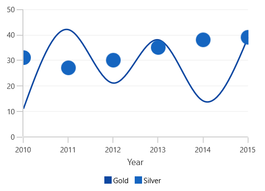

**Floating** **Legends**

To position the legend at any arbitrary location inside chart, we need to set [`DockPosition`](https://help.syncfusion.com/cr/winui/Syncfusion.UI.Xaml.Charts.ChartLegend.html#Syncfusion_UI_Xaml_Charts_ChartLegend_DockPosition) as **Floating** and provide its relative position using [`OffsetX`](https://help.syncfusion.com/cr/winui/Syncfusion.UI.Xaml.Charts.ChartLegend.html#Syncfusion_UI_Xaml_Charts_ChartLegend_OffsetX) and [`OffsetY`](https://help.syncfusion.com/cr/winui/Syncfusion.UI.Xaml.Charts.ChartLegend.html#Syncfusion_UI_Xaml_Charts_ChartLegend_OffsetY) properties.
 
Offset specifies x or y distance from origin.





<chart:SfChart.Legend>

      <chart:ChartLegend  DockPosition="Floating" OffsetX="30" OffsetY="10"/>

</chart:SfChart.Legend>





chart.Legend = new ChartLegend()
{

    DockPosition = ChartDock.Floating,

    OffsetX = 30,

    OffsetY = 10

};





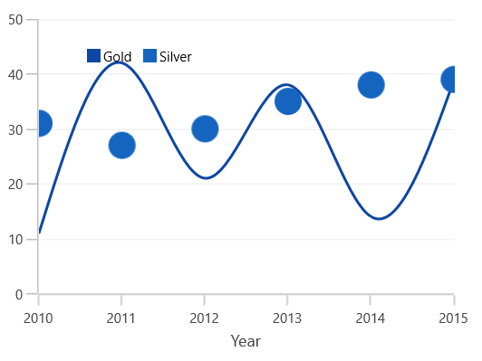

## Legends for Accumulation Series

For the series like Pie, Doughnut, Funnel and Pyramid, legends will be generated for all the data points. But for remaining series, each legend corresponds to each series. By default, the [`Interior`](https://help.syncfusion.com/cr/winui/Syncfusion.UI.Xaml.Charts.LegendItem.html#Syncfusion_UI_Xaml_Charts_LegendItem_Interior) color of the segment (data point) is applied to the legend icon. 

The following code snippets explains how the legends displaying for accumulation series.





<chart:SfChart.Legend>

   <chart:ChartLegend />                                 

</chart:SfChart.Legend>

<chart:PieSeries  XBindingPath="Category" 
	
	             ItemsSource="{Binding Tax}" YBindingPath="Percentage"/>





chart.Legend = new ChartLegend();

PieSeries pieSeries = new PieSeries()
{

    ItemsSource = new ViewModel().Tax,

    XBindingPath = "Category",

    YBindingPath = "Percentage"

};

chart.Series.Add(pieSeries);





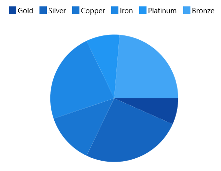

N> Here Legend ‘Label’ will be the x value of the Pie chart.

## Series visibility on legend

We can limit the number of series and trendlines to be displayed in chart using [`VisibilityOnLegend`](https://help.syncfusion.com/cr/winui/Syncfusion.UI.Xaml.Charts.ChartSeriesBase.html#Syncfusion_UI_Xaml_Charts_ChartSeriesBase_VisibilityOnLegend)
property as shown in below example.





<chart:SfChart.Legend>

    <chart:ChartLegend>                  

    </chart:ChartLegend>

</chart:SfChart.Legend>

<chart:SplineSeries XBindingPath="Year" Label="Gold" 

                    VisibilityOnLegend="Collapsed"

                    ItemsSource="{Binding List}" YBindingPath="India">

</chart:SplineSeries>

<chart:ColumnSeries XBindingPath="Year"

                    VisibilityOnLegend="Visible"

                    Label="Silver" YBindingPath="America"

                    ItemsSource="{Binding List}" />   





chart.Legend = new ChartLegend();

SplineSeries splineSeries = new SplineSeries()
{

    Label = "Gold",

    ItemsSource = new ViewModel().List,

    XBindingPath = "Year",

    YBindingPath = "India",

    VisibilityOnLegend = Visibility.Collapsed

};

ColumnSeries columnSeries = new ColumnSeries()
{

    Label = "Silver",

    ItemsSource = new ViewModel().List,

    XBindingPath = "Year",

    YBindingPath = "America",

    VisibilityOnLegend = Visibility.Visible

};

chart.Series.Add(splineSeries);

chart.Series.Add(columnSeries);





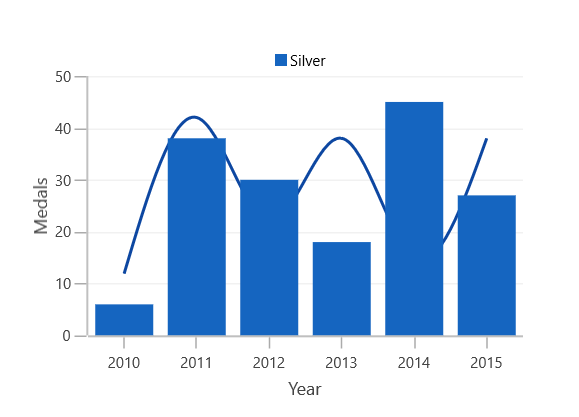

## Legend Orientation

Orientation of the Legend can be vertical or horizontal. By default the [`Orientation`](https://help.syncfusion.com/cr/winui/Syncfusion.UI.Xaml.Charts.ChartLegend.html#Syncfusion_UI_Xaml_Charts_ChartLegend_Orientation) is [`Horizontal`](https://help.syncfusion.com/cr/winui/Syncfusion.UI.Xaml.Charts.ChartOrientation.html#Syncfusion_UI_Xaml_Charts_ChartOrientation_Horizontal). 





<chart:SfChart.Legend>

   <chart:ChartLegend  Orientation="Vertical"/>

</chart:SfChart.Legend>





chart.Legend = new ChartLegend()
{

    Orientation = ChartOrientation.Vertical

};





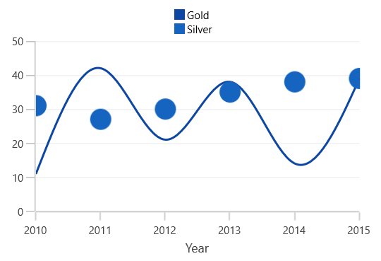

## Customization

**ItemTemplate**

You can customize each legend item using `ItemTemplate` property in ChartLegend as in below code snippet:





 <syncfusion:SfChart x:Name="chart">

     <syncfusion:SfChart.Resources>

            <local:ImageConverter x:Key="imageConverter"/>

            <DataTemplate x:Key="itemTemplate">

                <Grid Margin="10,0,10,0" >

                    <Grid.RowDefinitions>

                        <RowDefinition/>

                        <RowDefinition/>

                    </Grid.RowDefinitions>

                    <Image  Width="30" Height="15"
                                        
                            Source="{Binding Converter={StaticResource imageConverter}}"/>

                    <TextBlock HorizontalAlignment="Center" FontSize="12"
                                           
                               Grid.Row="1" Foreground="Black" 
                                           
                               FontWeight="SemiBold" Text="{Binding Label}">

                    </TextBlock>

                </Grid>

             </DataTemplate>

    </syncfusion:SfChart.Resources>

    <syncfusion:SfChart.Legend>

                <syncfusion:ChartLegend ItemTemplate="{StaticResource itemTemplate}"/>

    </syncfusion:SfChart.Legend>

</syncfusion:SfChart>





SfChart chart = new SfChart();

chart.Legend = new ChartLegend()
{

   ItemTemplate = chart.Resources["itemTemplate"] as DataTemplate

};

public class ImageConverter:IValueConverter

{

 public object Convert(object value, Type targetType, object parameter, System.Globalization.CultureInfo culture)

  {

   LegendItem item = value as LegendItem;

   if (item.Label == "Gold")

     return new BitmapImage(new Uri(("gold_symb.png"),UriKind.RelativeOrAbsolute));

   else

    return new BitmapImage(new Uri(("silver_symb.png"), UriKind.RelativeOrAbsolute));

  }

  public object ConvertBack(object value, Type targetType, object parameter, System.Globalization.CultureInfo culture)

  {

    return value;

  }

}





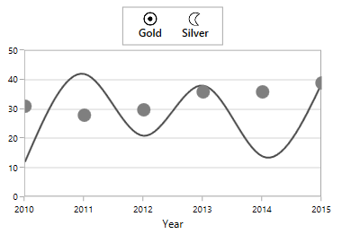
