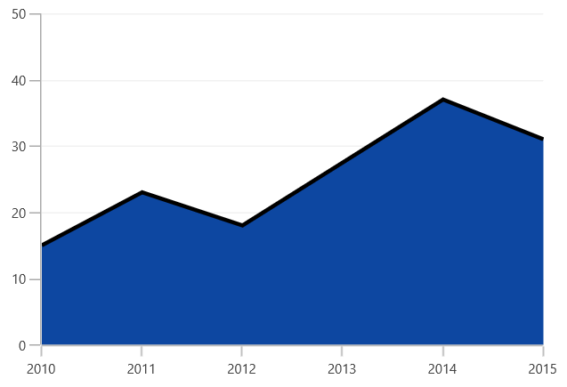

# Area in WinUI Chart

## Area 
[`AreaSeries`](https://help.syncfusion.com/cr/WinUI/Syncfusion.UI.Xaml.Charts.AreaSeries.html#) is rendered using a collection of line segments connected to form a closed loop area, filled with the specified color.

The following code example initializes the AreaSeries:





<chart:AreaSeries XBindingPath="XValue" YBindingPath="YValue" ItemsSource="{Binding Data}"/>   





AreaSeries series = new AreaSeries()
{

    ItemsSource = new ViewModel().Data,

    XBindingPath = "XValue",

    YBindingPath = "YValue",

};

chart.Series.Add(series);





## Step Area

[`StepAreaSeries`](https://help.syncfusion.com/cr/WinUI/Syncfusion.UI.Xaml.Charts.StepAreaSeries.html#) is similar to AreaSeries but it does not use the shortest distance to connect two data points using Bezier curves. Instead, this ChartSeries uses vertical and horizontal lines to connect the data points in a series forming a step-like progression.





<chart:StepAreaSeries ItemsSource="{Binding Data}" XBindingPath="XValue" YBindingPath="YValue"/>





StepAreaSeries series = new StepAreaSeries()
{

    ItemsSource = new ViewModel().Data,

    XBindingPath = "XValue",

    YBindingPath = "YValue",

};

chart.Series.Add(series);





## Closed Area

If you wish to draw the open area series (Area with stroke only at top), SfChart provides [`IsClosed`](https://help.syncfusion.com/cr/WinUI/Syncfusion.UI.Xaml.Charts.AreaSeries.html#Syncfusion_UI_Xaml_Charts_AreaSeries_IsClosed) property. By default, this property is true.





<chart:AreaSeries IsClosed="False" XBindingPath="XValue" 

YBindingPath="YValue" ItemsSource="{Binding Data}" /> 





AreaSeries series = new AreaSeries()
{

    ItemsSource = new ViewModel().Data,

    XBindingPath = "XValue",

    YBindingPath = "YValue",

    IsClosed = false,

};

chart.Series.Add(series);





