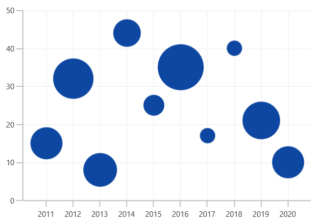
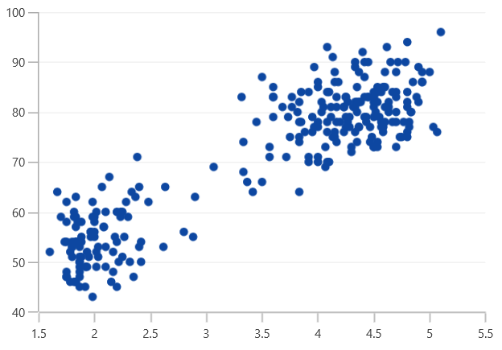

# Bubble and Scatter in WinUI Chart

## Bubble 

[`BubbleSeries`](https://help.syncfusion.com/cr/WinUI/Syncfusion.UI.Xaml.Charts.BubbleSeries.html#) is represented by closely packed circles, whose areas are proportional to the quantities. 

The size of the bubble series is relative proportional to the value bind with the series using [`Size`](https://help.syncfusion.com/cr/WinUI/Syncfusion.UI.Xaml.Charts.BubbleSeries.html#Syncfusion_UI_Xaml_Charts_BubbleSeries_Size)  property. You can set the constraints on this size using [`MinimumRadius`](https://help.syncfusion.com/cr/WinUI/Syncfusion.UI.Xaml.Charts.BubbleSeries.html#Syncfusion_UI_Xaml_Charts_BubbleSeries_MaximumRadius) and [`MaximumRadius`](https://help.syncfusion.com/cr/WinUI/Syncfusion.UI.Xaml.Charts.BubbleSeries.html#Syncfusion_UI_Xaml_Charts_BubbleSeries_MaximumRadius).





<chart:BubbleSeries ItemsSource="{Binding Data}" XBindingPath="XValue" YBindingPath="YValue" Size="Size" MinimumRadius="5" MaximumRadius="10"/>





BubbleSeries series = new BubbleSeries()
{

    ItemsSource = new ViewModel().Data,

    XBindingPath = "XValue",

    YBindingPath = "YValue",

    Size = "Size",

    MinimumRadius = 5,

    MaximumRadius = 10

};

chart.Series.Add(series);





**Show Zero Bubbles**

The zero size bubble segments can be enabled or disabled by using the [`ShowZeroBubbles`](https://help.syncfusion.com/cr/WinUI/Syncfusion.UI.Xaml.Charts.BubbleSeries.html#Syncfusion_UI_Xaml_Charts_BubbleSeries_ShowZeroBubblesProperty) property. By default, the property value is True.

The following code illustrates how to set the value to the property.





<chart:BubbleSeries ShowZeroBubbles="True">
</chart:BubbleSeries>





BubbleSeries series = new BubbleSeries();

series.ShowZeroBubbles = true;





The following code example and screenshots describes when [`ShowZeroBubbles`](https://help.syncfusion.com/cr/WinUI/Syncfusion.UI.Xaml.Charts.BubbleSeries.html#Syncfusion_UI_Xaml_Charts_BubbleSeries_ShowZeroBubblesProperty) value is false.





<chart:BubbleSeries ShowZeroBubbles="False">
</chart:BubbleSeries>





BubbleSeries series = new BubbleSeries();

series.ShowZeroBubbles = false;





## Scatter

[`ScatterSeries`](https://help.syncfusion.com/cr/WinUI/Syncfusion.UI.Xaml.Charts.ScatterSeries.html#) is similar to bubble series when each point being represented by an ellipse with equal size. This size can be defined by using [`ScatterHeight`](https://help.syncfusion.com/cr/WinUI/Syncfusion.UI.Xaml.Charts.ScatterSeries.html#Syncfusion_UI_Xaml_Charts_ScatterSeries_ScatterHeight) and [`ScatterWidth`](https://help.syncfusion.com/cr/WinUI/Syncfusion.UI.Xaml.Charts.ScatterSeries.html#Syncfusion_UI_Xaml_Charts_ScatterSeries_ScatterWidth) properties.





<chart:ScatterSeries ScatterHeight="7" ScatterWidth="7" ItemsSource="{Binding Data}" XBindingPath="XValue" YBindingPath="YValue"/>





ScatterSeries series = new ScatterSeries()
{

    ItemsSource = new ViewModel().Data,

    XBindingPath = "XValue",

    YBindingPath = "YValue",

    ScatterHeight = 7,

    ScatterWidth = 7,

};

chart.Series.Add(series);





