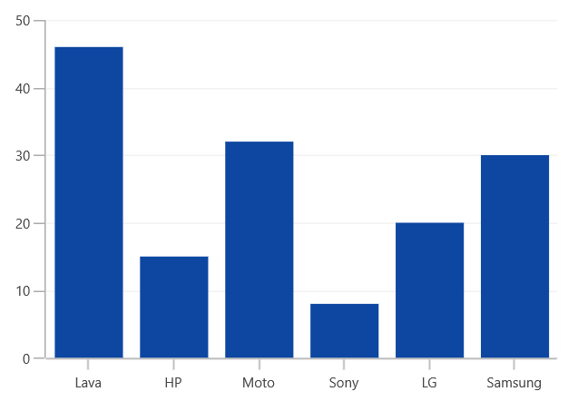
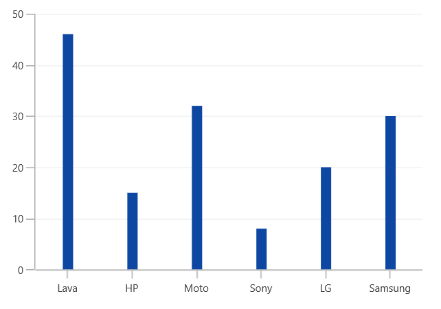

# Column and Bar Charts in WinUI Chart (SfChart)

## Column

Column charts plot discrete rectangles for the given values. The following code example demonstrates the usage of [`ColumnSeries`](https://help.syncfusion.com/cr/WinUI/Syncfusion.UI.Xaml.Charts.ColumnSeries.html#).





<chart:ColumnSeries ItemsSource="{Binding Data}"           

XBindingPath="XValue" YBindingPath="YValue"   />





ColumnSeries series = new ColumnSeries()
{

    ItemsSource = new ViewModel().Data,

    XBindingPath = "XValue",

    YBindingPath = "YValue",

};

chart.Series.Add(series);





## Bar

Bar series are similar to column series, excepts its orientation. The following code examples shows how to use [`BarSeries`](https://help.syncfusion.com/cr/WinUI/Syncfusion.UI.Xaml.Charts.BarSeries.html#).





<chart:BarSeries ItemsSource="{Binding CategoricalDatas}" XBindingPath="Category" 

YBindingPath="Value"/>





BarSeries series = new BarSeries()
{

    ItemsSource = new ViewModel().CategoricalDatas,

    XBindingPath = "Category",

    YBindingPath = "Value",

};





### Spacing

[`Spacing`](https://help.syncfusion.com/cr/WinUI/Syncfusion.UI.Xaml.Charts.ChartSeriesBase.html#Syncfusion_UI_Xaml_Charts_ChartSeriesBase_SpacingProperty) property of series is used to decide the width of a segment. [`Spacing`](https://help.syncfusion.com/cr/WinUI/Syncfusion.UI.Xaml.Charts.ChartSeriesBase.html#Syncfusion_UI_Xaml_Charts_ChartSeriesBase_SpacingProperty) value ranges from 0 to 1. The following code illustrates how to set [`Spacing`](https://help.syncfusion.com/cr/WinUI/Syncfusion.UI.Xaml.Charts.ChartSeriesBase.html#Syncfusion_UI_Xaml_Charts_ChartSeriesBase_SpacingProperty) property of the series.





<Chart:ColumnSeries Chart:ChartSeriesBase.Spacing="0.8"/>





ColumnSeries series = new ColumnSeries()

ChartSeriesBase.SetSpacing(series, 0.8);





**Segment Spacing**

[`SegmentSpacing`](https://help.syncfusion.com/cr/WinUI/Syncfusion.UI.Xaml.Charts.ColumnSeries.html#Syncfusion_UI_Xaml_Charts_ColumnSeries_SegmentSpacing) property is used to set the spacing among the segments, when multiple series are added in chart. Its value ranges from 0 to 1. The following code illustrates how to use the [`SegmentSpacing`](https://help.syncfusion.com/cr/WinUI/Syncfusion.UI.Xaml.Charts.ColumnSeries.html#Syncfusion_UI_Xaml_Charts_ColumnSeries_SegmentSpacing) property in series.





<Chart:SfChart >

<Chart:ColumnSeries SegmentSpacing="0.6"/>

<Chart:ColumnSeries SegmentSpacing="0.6"/>

</Chart:SfChart>





SfChart chart = new SfChart();

ColumnSeries series1 = new ColumnSeries()
{

    SegmentSpacing = 0.6,

};

chart.Series.Add(series1);

ColumnSeries series2 = new ColumnSeries()
{

    SegmentSpacing = 0.6

};

chart.Series.Add(series2);





