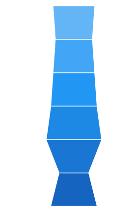
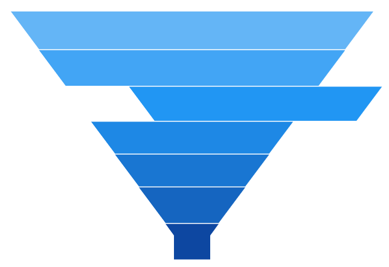
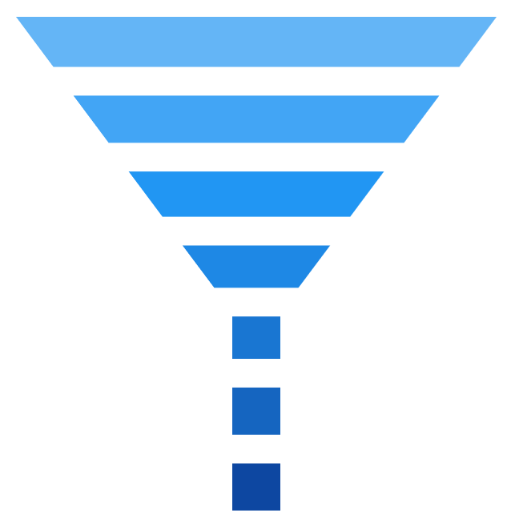

# Funnel and Pyramid in WinUI Chart

## Pyramid

[`PyramidSeries`](https://help.syncfusion.com/cr/WinUI/Syncfusion.UI.Xaml.Charts.PyramidSeries.html#Syncfusion_UI_Xaml_Charts_PyramidSeries) has the form of a triangle with lines dividing it into sections, and each section has a different width. Depending on the Y co-ordinates, this width indicates a level of hierarchy among other categories.





<chart:PyramidSeries XBindingPath="Category" ItemsSource="{Binding Data}" YBindingPath="Value"/>





PyramidSeries series = new PyramidSeries()
{

    ItemsSource = new ViewModel().Data,

    XBindingPath = "Category",

    YBindingPath = "Value"

};

chart.Series.Add(series);





The [`PyramidMode`](https://help.syncfusion.com/cr/WinUI/Syncfusion.UI.Xaml.Charts.PyramidSeries.html#Syncfusion_UI_Xaml_Charts_PyramidSeries_PyramidMode) is used to define the rendering mode, such as [`Surface`](https://help.syncfusion.com/cr/WinUI/Syncfusion.UI.Xaml.Charts.ChartPyramidMode.html) or [`Linear`](https://help.syncfusion.com/cr/WinUI/Syncfusion.UI.Xaml.Charts.ChartPyramidMode.html) pyramid segments.

**PyramidMode** **as** **Surface**





<chart:PyramidSeries XBindingPath="Category" PyramidMode="Surface" ItemsSource="{Binding Data}" YBindingPath="Value"/>





PyramidSeries series = new PyramidSeries()
{

    ItemsSource = new ViewModel().Data,

    XBindingPath = "Category",

    YBindingPath = "Value",

    PyramidMode = ChartPyramidMode.Surface

};

chart.Series.Add(series);





**PyramidMode** **as** **Linear**





<chart:PyramidSeries XBindingPath="Category" PyramidMode="Linear" ItemsSource="{Binding Data}" YBindingPath="Value"/>





PyramidSeries series = new PyramidSeries()
{

    ItemsSource = new ViewModel().Data,

    XBindingPath = "Category",

    YBindingPath = "Value",

    PyramidMode = ChartPyramidMode.Linear

};

chart.Series.Add(series);





## Funnel

[`FunnelSeries`](https://help.syncfusion.com/cr/WinUI/Syncfusion.UI.Xaml.Charts.FunnelSeries.html#Syncfusion_UI_Xaml_Charts_FunnelSeries) is similar to [`PyramidSeries`](https://help.syncfusion.com/cr/WinUI/Syncfusion.UI.Xaml.Charts.PyramidSeries.html#Syncfusion_UI_Xaml_Charts_PyramidSeries), displays data in a funnel shape that equals to 100% when totaled. It is a single series, representing data as portions of 100%, and does not use any axes. 

The following code example shows how to use the funnel series:





<chart:FunnelSeries XBindingPath="Category" ItemsSource="{Binding Data}" YBindingPath="Value"/>





FunnelSeries series = new FunnelSeries()
{

    ItemsSource = new ViewModel().Data,

    XBindingPath = "Category",

    YBindingPath = "Value",

};

chart.Series.Add(series);





### Funnel mode

The [`FunnelMode`](https://help.syncfusion.com/cr/WinUI/Syncfusion.UI.Xaml.Charts.FunnelSeries.html#Syncfusion_UI_Xaml_Charts_FunnelSeries_FunnelMode) defines a rendering mode for the funnel series that specifies where to bind your values (to height or width). The following example demonstrates [`ValueIsHeight`](https://help.syncfusion.com/cr/WinUI/Syncfusion.UI.Xaml.Charts.ChartFunnelMode.html) and [`ValueIsWidth`](https://help.syncfusion.com/cr/WinUI/Syncfusion.UI.Xaml.Charts.ChartFunnelMode.html) funnel modes:

**ValueIsHeight**





<chart:FunnelSeries XBindingPath="Category" ItemsSource="{Binding Data}" FunnelMode="ValueIsHeight" YBindingPath="Value"/>





FunnelSeries series = new FunnelSeries()
{

    ItemsSource = new ViewModel().Data,

    XBindingPath = "Category",

    YBindingPath = "Value",

    FunnelMode = ChartFunnelMode.ValueIsHeight

};

chart.Series.Add(series);





**ValueIsWidth**





<chart:FunnelSeries XBindingPath="Category" ItemsSource="{Binding Data}" FunnelMode="ValueIsWidth" YBindingPath="Value"/>





FunnelSeries series = new FunnelSeries()
{

    ItemsSource = new ViewModel().Data,

    XBindingPath = "Category",

    YBindingPath = "Value",

    FunnelMode = ChartFunnelMode.ValueIsWidth

};

chart.Series.Add(series);





### Explode segments

The following properties are used to explode the individual segments in Funnel and Pyramid.

* [`ExplodeAll`](https://help.syncfusion.com/cr/WinUI/Syncfusion.UI.Xaml.Charts.AccumulationSeriesBase.html#Syncfusion_UI_Xaml_Charts_AccumulationSeriesBase_ExplodeAll) - Used to explode all the segments of these series.
* [`ExplodeIndex`](https://help.syncfusion.com/cr/WinUI/Syncfusion.UI.Xaml.Charts.AccumulationSeriesBase.html#Syncfusion_UI_Xaml_Charts_AccumulationSeriesBase_ExplodeIndex) - Used to explode any specific segment.
* [`ExplodeOffset`](https://help.syncfusion.com/cr/WinUI/Syncfusion.UI.Xaml.Charts.TriangularSeriesBase.html#Syncfusion_UI_Xaml_Charts_TriangularSeriesBase_ExplodeOffset) - Used to define the explode distance like ExplodeRadius for Pie.
* [`ExplodeOnMouseClick`](https://help.syncfusion.com/cr/WinUI/Syncfusion.UI.Xaml.Charts.AccumulationSeriesBase.html#Syncfusion_UI_Xaml_Charts_AccumulationSeriesBase_ExplodeOnMouseClick) - Used to explode the segment when the segment is clicked.

**Explode** **Offset**





<chart:FunnelSeries XBindingPath="Category" ItemsSource="{Binding Data}"   

ExplodeIndex="4"  ExplodeOffset="70" YBindingPath="Value">

</chart:FunnelSeries>





FunnelSeries series = new FunnelSeries()
{

    ItemsSource = new ViewModel().Data,

    XBindingPath = "Category",

    YBindingPath = "Value",

    ExplodeIndex = 4,

    ExplodeOffset = 70

};

chart.Series.Add(series);





**Gap** **Ratio**

The gap between each segment is calculated using the [`GapRatio`](https://help.syncfusion.com/cr/WinUI/Syncfusion.UI.Xaml.Charts.TriangularSeriesBase.html#Syncfusion_UI_Xaml_Charts_TriangularSeriesBase_GapRatio) property, as shown in the following code example.





<chart:FunnelSeries XBindingPath="Category" ItemsSource="{Binding Data}"     

GapRatio="0.5" YBindingPath="Value">

</chart:FunnelSeries>





FunnelSeries series = new FunnelSeries()
{

    ItemsSource = new ViewModel().Data,

    XBindingPath = "Category",

    YBindingPath = "Value",

    GapRatio = 0.5

};

chart.Series.Add(series);





