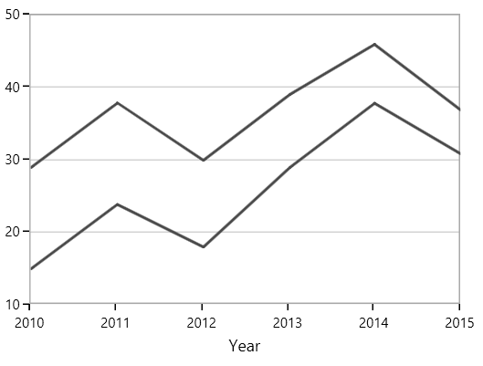
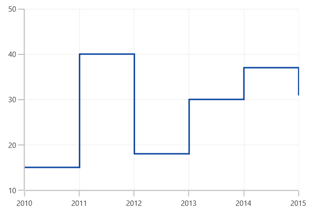

# Line and Step Line Charts in WinUI Chart (SfChart)

## Line

Line series join points on a plot by straight lines, showing data trends at equal intervals. The following code example explains how to create a simple [`LineSeries`](https://help.syncfusion.com/cr/WinUI/Syncfusion.UI.Xaml.Charts.LineSeries.html#) using given data.





<chart:LineSeries  XBindingPath="Year

ItemsSource="{Binding List}" YBindingPath="India"/>

<chart:LineSeries  XBindingPath="Year"     

ItemsSource="{Binding List}" YBindingPath="America"/>





LineSeries series1 = new LineSeries()
{

    ItemsSource = new ViewModel().List,

    XBindingPath = "Year",

    YBindingPath = "India",

};

LineSeries series2 = new LineSeries()
{

    ItemsSource = new ViewModel().List,

    XBindingPath = "Year",

    YBindingPath = "America",

};

chart.Series.Add(series1);

chart.Series.Add(series2);





## Step Line

[`StepLineSeries`](https://help.syncfusion.com/cr/WinUI/Syncfusion.UI.Xaml.Charts.StepLineSeries.html) plots horizontal and vertical lines to connect data points resulting in a step line progression. The following code illustrates how to initialize the [`StepLineSeries`](https://help.syncfusion.com/cr/WinUI/Syncfusion.UI.Xaml.Charts.StepLineSeries.html) in chart.





<chart:StepLineSeries ItemsSource="{Binding Data}"  
                      
                      XBindingPath="XValue" 
                      
                      YBindingPath="YValue">
            
 </chart:StepLineSeries>





StepLineSeries stepLine = new StepLineSeries();

stepLine.ItemsSource = new ViewModel().Data;

stepLine.XBindingPath = "XValue";

stepLine.YBindingPath = "YValue";

SteplineChart.Series.Add(stepLine);





