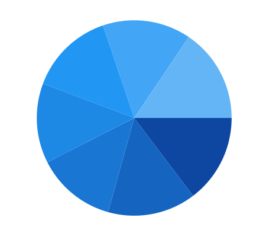
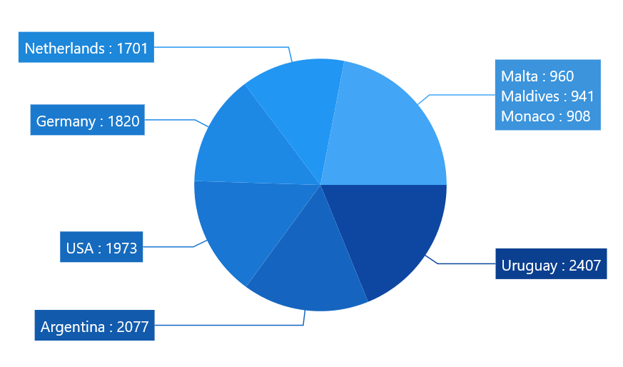

# Pie and Doughnut Charts in WinUI Chart (SfChart)

## Pie

[`PieSeries`](https://help.syncfusion.com/cr/WinUI/Syncfusion.UI.Xaml.Charts.PieSeries.html#) is divided into sectors, illustrating numerical proportion. The following code example illustrates the PieSeries.





<chart:PieSeries XBindingPath="Category" ItemsSource="{Binding Data}" YBindingPath="Value"/>





PieSeries series = new PieSeries()
{

    ItemsSource = new ViewModel().Data,

    XBindingPath = "Category",

    YBindingPath = "Value"

};

chart.Series.Add(series);





The rendering size of the PieSeries can be controlled using [`CircularCoefficient`](https://help.syncfusion.com/cr/WinUI/Syncfusion.UI.Xaml.Charts.PieSeries.html#Syncfusion_UI_Xaml_Charts_PieSeries_CircularCoefficient) property as in below code example.





<chart:PieSeries CircularCoefficient="0.9" XBindingPath="Category" ItemsSource="{Binding Data}" YBindingPath="Value"/>





PieSeries series = new PieSeries()
{

    ItemsSource = new ViewModel().Data,

    XBindingPath = "Category",

    YBindingPath = "Value",

    CircularCoefficient = 0.9

};

chart.Series.Add(series);





### Group small data points into “others”
The small segments in the pie chart can be grouped into the “others” category using the [`GroupTo`](https://help.syncfusion.com/cr/WinUI/Syncfusion.UI.Xaml.Charts.CircularSeriesBase.html#Syncfusion_UI_Xaml_Charts_CircularSeriesBase_GroupTo) and [`GroupMode`](https://help.syncfusion.com/cr/WinUI/Syncfusion.UI.Xaml.Charts.CircularSeriesBase.html#Syncfusion_UI_Xaml_Charts_CircularSeriesBase_GroupMode) properties of PieSeries.

 The [`GroupMode`](https://help.syncfusion.com/cr/WinUI/Syncfusion.UI.Xaml.Charts.CircularSeriesBase.html#Syncfusion_UI_Xaml_Charts_CircularSeriesBase_GroupMode) property is used to specify the grouping type based on slice [`Angle`](https://help.syncfusion.com/cr/WinUI/Syncfusion.UI.Xaml.Charts.PieGroupMode.html), actual data point [`Value`](https://help.syncfusion.com/cr/WinUI/Syncfusion.UI.Xaml.Charts.PieGroupMode.html), or [`Percentage`](https://help.syncfusion.com/cr/WinUI/Syncfusion.UI.Xaml.Charts.PieGroupMode.html), and the [`GroupTo`](https://help.syncfusion.com/cr/WinUI/Syncfusion.UI.Xaml.Charts.CircularSeriesBase.html#Syncfusion_UI_Xaml_Charts_CircularSeriesBase_GroupTo) property is used to set the limit to group data points into a single slice. The grouped segment is labeled as “Others” in legend and toggled as other segment. The default value of the [`GroupTo`](https://help.syncfusion.com/cr/WinUI/Syncfusion.UI.Xaml.Charts.CircularSeriesBase.html#Syncfusion_UI_Xaml_Charts_CircularSeriesBase_GroupTo) property is `double.NAN`, and the default value of the [`GroupMode`](https://help.syncfusion.com/cr/WinUI/Syncfusion.UI.Xaml.Charts.CircularSeriesBase.html#Syncfusion_UI_Xaml_Charts_CircularSeriesBase_GroupMode) property is Value.

**Pie series without grouping**

**Pie series with grouping (Mode - Value)**





<chart:PieSeries ItemsSource="{Binding Data}" XBindingPath="Country" YBindingPath="Count" GroupMode="Value" GroupTo="1000">
    <chart:PieSeries.DataMarker>
        <chart:ChartDataMarker ShowConnectorLine="True" 
                                  ConnectorHeight="80" 
                                  ShowLabel="True" 
                                  LabelTemplate="{StaticResource DataLabelTemplate}"  
                                  SegmentLabelContent="LabelContentPath">
        </chart:ChartDataMarker>
    </chart:PieSeries.DataMarker>
</chart:PieSeries>





pieSeries.GroupMode = PieGroupMode.Value;
pieSeries.GroupTo = 1000;
ChartDataMarker datamarker = new ChartDataMarker()
{
    ShowConnectorLine = true,
    ShowLabel = true,
    ConnectorHeight = 80,
    LabelTemplate = this.RootGrid.Resources["DataLabelTemplate"] as DataTemplate,
    SegmentLabelContent = LabelContent.LabelContentPath,

pieSeries.DataMarker = datamarker;





**Pie series with grouping (Mode - Angle)**





<chart:PieSeries ItemsSource="{Binding Data}" XBindingPath="Country" YBindingPath="Count" GroupMode="Angle" GroupTo="30">
    <chart:PieSeries.DataMarker>
        <chart:ChartDataMarker ShowConnectorLine="True" 
                                  ConnectorHeight="80" 
                                  ShowLabel="True" 
                                  LabelTemplate="{StaticResource DataLabelTemplate}"  
                                  SegmentLabelContent="LabelContentPath">
        </chart:ChartDataMarker>
    </chart:PieSeries.DataMarker>
</chart:PieSeries>





pieSeries.GroupMode = PieGroupMode.Angle;
pieSeries.GroupTo = 30;

ChartDataMarker datamarker = new ChartDataMarker()
{
        ShowConnectorLine = true,
        ShowLabel = true,
        ConnectorHeight = 80,
        LabelTemplate = this.RootGrid.Resources["DataLabelTemplate"] as DataTemplate,
        SegmentLabelContent = LabelContent.LabelContentPath,
};

pieSeries.DataMarker = datamarker;





**Pie series with grouping (Mode - Percentage)**





<chart:PieSeries ItemsSource="{Binding Data}" XBindingPath="Country" YBindingPath="Count" GroupMode="Percentage" GroupTo="10">
    <chart:PieSeries.DataMarker>
        <chart:ChartDataMarker ShowConnectorLine="True" 
                                  ConnectorHeight="80" 
                                  ShowLabel="True" 
                                  LabelTemplate="{StaticResource DataLabelTemplate}"  
                                  SegmentLabelContent="LabelContentPath">
        </chart:ChartDataMarker>
    </chart:PieSeries.DataMarker>
</chart:PieSeries>





pieSeries.GroupMode = PieGroupMode.Percentage;
pieSeries.GroupTo = 10;

ChartDataMarker datamarker = new ChartDataMarker()
{
        ShowConnectorLine = true,
        ShowLabel = true,
        ConnectorHeight = 80,
        LabelTemplate = this.RootGrid.Resources["DataLabelTemplate"] as DataTemplate,
        SegmentLabelContent = LabelContent.LabelContentPath,
};

pieSeries.DataMarker = datamarker;





## Doughnut

[`DoughnutSeries`](https://help.syncfusion.com/cr/WinUI/Syncfusion.UI.Xaml.Charts.DoughnutSeries.html#) is similar to PieSeries. It is used to show the relationship between parts of data and whole data. 

The DoughnutSeries can be added to chart as in below code example:





<chart:DoughnutSeries XBindingPath="Category" ItemsSource="{Binding Data}" YBindingPath="Value"/>





DoughnutSeries series = new DoughnutSeries()
{

    ItemsSource = new ViewModel().Data,

    XBindingPath = "Category",

    YBindingPath = "Value"
};

chart.Series.Add(series);





The Doughnut also having coefficient property, [`DoughnutCoefficient`](https://help.syncfusion.com/cr/WinUI/Syncfusion.UI.Xaml.Charts.DoughnutSeries.html#Syncfusion_UI_Xaml_Charts_DoughnutSeries_DoughnutCoefficient) which defines the inner circle. Also it has [`DoughnutSize`](https://help.syncfusion.com/cr/WinUI/Syncfusion.UI.Xaml.Charts.DoughnutSeries.html#Syncfusion_UI_Xaml_Charts_DoughnutSeries_DoughnutSize), used to define the size for this series like [`CircularCoefficient`](https://help.syncfusion.com/cr/WinUI/Syncfusion.UI.Xaml.Charts.PieSeries.html#Syncfusion_UI_Xaml_Charts_PieSeries_CircularCoefficient) in PieSeries.





<chart:DoughnutSeries DoughnutCoefficient="0.7" XBindingPath="Category" ItemsSource="{Binding Data}" YBindingPath="Value"/>





DoughnutSeries series = new DoughnutSeries()
{

    ItemsSource = new ViewModel().Data,

    XBindingPath = "Category",

    YBindingPath = "Value",

    DoughnutCoefficient = 0.7
};

chart.Series.Add(series);





**Size**

The size of doughnut series can be customized by using its [`DoughnutSize`](https://help.syncfusion.com/cr/WinUI/Syncfusion.UI.Xaml.Charts.DoughnutSeries.html#Syncfusion_UI_Xaml_Charts_DoughnutSeries_DoughnutSizeProperty) property. The following code illustrates how to use the property in series.





<syncfusion:SfChart>

<syncfusion:DoughnutSeries DoughnutSize="0.8"/>
       
<syncfusion:DoughnutSeries DoughnutSize="0.8"/>

</syncfusion:SfChart>





DoughnutSeries doughnut = new DoughnutSeries();

doughnut.DoughnutSize = 0.8;

chart.Series.Add(doughnut);

DoughnutSeries doughnut1 = new DoughnutSeries();

doughnut1.DoughnutSize = 0.8;

chart.Series.Add(doughnut1);





**Hole Size**

[`DoughnutHoleSize`](https://help.syncfusion.com/cr/WinUI/Syncfusion.UI.Xaml.Charts.DoughnutSeries.html#Syncfusion_UI_Xaml_Charts_DoughnutSeries_DoughnutHoleSizeProperty) is an attachable property. It gets or sets the double value, which is used to customize the doughnut hole size. Its value ranges from 0 to 1, and it can be set as shown in the following code example.





<Chart:SfChart Chart:DoughnutSeries.DoughnutHoleSize="0.2">
    
</chart:SfChart>





SfChart chart = new SfChart();

DoughnutSeries.SetDoughnutHoleSize(chart, 0.2);





## Semi Pie and Doughnut

By using custom [`StartAngle`](https://help.syncfusion.com/cr/WinUI/Syncfusion.UI.Xaml.Charts.CircularSeriesBase.html#Syncfusion_UI_Xaml_Charts_CircularSeriesBase_StartAngle) and [`EndAngle`](https://help.syncfusion.com/cr/WinUI/Syncfusion.UI.Xaml.Charts.CircularSeriesBase.html#Syncfusion_UI_Xaml_Charts_CircularSeriesBase_EndAngle) properties, you can draw pie series in different shapes such as semicircular or quarter circular series.





<syncfusion:PieSeries StartAngle="180" EndAngle="360" XBindingPath="Utilization" YBindingPath="ResponseTime" ItemsSource="{Binding Data}"/>





PieSeries series = new PieSeries()
{

    ItemsSource = new ViewModel().Data,

    XBindingPath = "Utilization",

    YBindingPath = "ResponseTime",

    StartAngle = 180,

    EndAngle = 360

};

chart.Series.Add(series);









<syncfusion:DoughnutSeries StartAngle="180" EndAngle="360" XBindingPath="Utilization" YBindingPath="ResponseTime" ItemsSource="{Binding Data}"/>





DoughnutSeries series = new DoughnutSeries()
{

    ItemsSource = new ViewModel().Data,

    XBindingPath = "Utilization",

    YBindingPath = "ResponseTime",

    StartAngle = 180,

    EndAngle = 360

};

chart.Series.Add(series);





## Stacked doughnut

Doughnut segments can be separated as individual circles using the [`IsStackedDoughnut`](https://help.syncfusion.com/cr/WinUI/Syncfusion.UI.Xaml.Charts.DoughnutSeries.html#Syncfusion_UI_Xaml_Charts_DoughnutSeries_IsStackedDoughnut) property. The following properties are used to customize the stacked doughnut chart:

* [`CapStyle`](https://help.syncfusion.com/cr/WinUI/Syncfusion.UI.Xaml.Charts.DoughnutSeries.html#Syncfusion_UI_Xaml_Charts_DoughnutSeries_CapStyle) - Specifies the shapes of the start and end points of a circular segment. The supported values are [`BothFlat`](https://help.syncfusion.com/cr/WinUI/Syncfusion.UI.Xaml.Charts.DoughnutCapStyle.html), [`BothCurve`](https://help.syncfusion.com/cr/WinUI/Syncfusion.UI.Xaml.Charts.DoughnutCapStyle.html), [`StartCurve`](https://help.syncfusion.com/cr/WinUI/Syncfusion.UI.Xaml.Charts.DoughnutCapStyle.html), and [`EndCurve`](https://help.syncfusion.com/cr/WinUI/Syncfusion.UI.Xaml.Charts.DoughnutCapStyle.html). The default value of the this property is BothFlat.

* [`SegmentSpacing`](https://help.syncfusion.com/cr/WinUI/Syncfusion.UI.Xaml.Charts.DoughnutSeries.html#Syncfusion_UI_Xaml_Charts_DoughnutSeries_SegmentSpacing) - Changes the spacing between two individual segments. The default value of spacing is 0, and the value ranges from 0 to 1. Here, 1 represents 100%, and 0 represents 0% of the available space.

* [`MaximumValue`](https://help.syncfusion.com/cr/WinUI/Syncfusion.UI.Xaml.Charts.DoughnutSeries.html#Syncfusion_UI_Xaml_Charts_DoughnutSeries_SegmentSpacing) - Represents the entire span of an individual circle. The default value of the this property is double.NaN.

* [`TrackColor`](https://help.syncfusion.com/cr/WinUI/Syncfusion.UI.Xaml.Charts.DoughnutSeries.html#Syncfusion_UI_Xaml_Charts_DoughnutSeries_TrackColor) - Changes the color of the track area.

* [`TrackBorderColor`](https://help.syncfusion.com/cr/WinUI/Syncfusion.UI.Xaml.Charts.DoughnutSeries.html#Syncfusion_UI_Xaml_Charts_DoughnutSeries_TrackBorderColor) - Changes the color of the track border.

* [`TrackBorderWidth`](https://help.syncfusion.com/cr/WinUI/Syncfusion.UI.Xaml.Charts.DoughnutSeries.html#Syncfusion_UI_Xaml_Charts_DoughnutSeries_TrackBorderWidth) - Changes the width of the track border.





<chart:SfChart>
    …
    <chart:DoughnutSeries IsStackedDoughnut="True" CapStyle="BothCurve" SegmentSpacing="0.2" MaximumValue="100" XBindingPath="Category" YBindingPath="Expenditure" ItemsSource="{Binding ExpenditureData}">
    </chart:DoughnutSeries>

</chart:SfChart>





SfChart chart = new SfChart();

DoughnutSeries doughnutSeries = new DoughnutSeries()
{
    IsStackedDoughnut = true,
    CapStyle = DoughnutCapStyle.BothCurve,
    SegmentSpacing = 0.2,
    MaximumValue = 100,
    XBindingPath = "Category",
    YBindingPath = "Expenditure",
    ItemsSource = new ViewModel().ExpenditureData
};

chart.Series.Add(doughnutSeries);





## Explode Segments

The following properties are used to explode the individual segments in Pie and Doughnut.

* [`ExplodeAll`](https://help.syncfusion.com/cr/WinUI/Syncfusion.UI.Xaml.Charts.AccumulationSeriesBase.html#Syncfusion_UI_Xaml_Charts_AccumulationSeriesBase_ExplodeAll)  - Used to explode all the segments of these series.

* [`ExplodeIndex`](https://help.syncfusion.com/cr/WinUI/Syncfusion.UI.Xaml.Charts.AccumulationSeriesBase.html#Syncfusion_UI_Xaml_Charts_AccumulationSeriesBase_ExplodeIndex) - Used to explode any specific segment.

* [`ExplodeRadius`](https://help.syncfusion.com/cr/WinUI/Syncfusion.UI.Xaml.Charts.CircularSeriesBase.html#Syncfusion_UI_Xaml_Charts_CircularSeriesBase_ExplodeRadius) - Used to define the explode distance.

* [`ExplodeOnMouseClick`](https://help.syncfusion.com/cr/WinUI/Syncfusion.UI.Xaml.Charts.AccumulationSeriesBase.html#Syncfusion_UI_Xaml_Charts_AccumulationSeriesBase_ExplodeOnMouseClick) - Used to explode the segment when segment is clicked.

**Explode** **Index**





<syncfusion:PieSeries x:Name="PieSeries" ItemsSource="{Binding Data}"    

ExplodeIndex="2" ExplodeRadius="10" XBindingPath="Utilization" 

YBindingPath="ResponseTime" />





PieSeries series = new PieSeries()
{

    ItemsSource = new ViewModel().Data,

    XBindingPath = "Utilization",

    YBindingPath = "ResponseTime",

    ExplodeIndex = 2,

    ExplodeRadius = 10

};

chart.Series.Add(series);





N> We have defined ExplodeRadius as 30, by default its value is zero. So you need to define explode, when you set ExplodeIndex or ExplodeAll.

**Explode** **All**





<chart:PieSeries  ExplodeAll="True" ExplodeRadius="15"

XBindingPath="Category" ItemsSource="{Binding Data}" 

YBindingPath="Value">





PieSeries series = new PieSeries()
{

    ItemsSource = new ViewModel().Data,

    XBindingPath = "Category",

    YBindingPath = "Value",

    ExplodeAll = true,

    ExplodeRadius = 15

};

chart.Series.Add(series);





