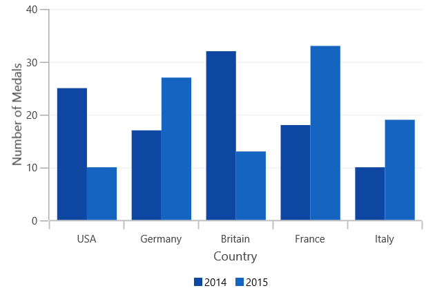
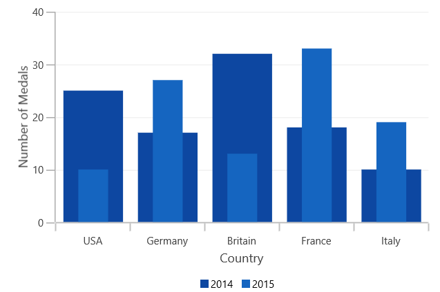

# Side By Side Placement in WinUI Chart

It defines the placement pattern of bar type series like Column, Bar, StackedColumn, etc. 

It is a Boolean property and its default value is true, so the segment will be placed adjacent to each other (Clustered).

The following code example and image illustrates the placement of series while setting [`SideBySideSeriesPlacement`](https://help.syncfusion.com/cr/WinUI/Syncfusion.UI.Xaml.Charts.ChartBase.html#Syncfusion_UI_Xaml_Charts_ChartBase_SideBySideSeriesPlacement) as false.





<chart:SfChart SideBySideSeriesPlacement="False">

<chart:SfChart.PrimaryAxis>

<chart:CategoryAxis Header="Country"/>

</chart:SfChart.PrimaryAxis>

<chart:SfChart.SecondaryAxis>

<chart:NumericalAxis Header="Number of Medals" />                            

</chart:SfChart.SecondaryAxis>

<chart:SfChart.Legend>

<chart:ChartLegend Visibility="Visible" />

</chart:SfChart.Legend>

<chart:ColumnSeries ItemsSource="{Binding Data}" Label="2014"  

XBindingPath="CountryName" YBindingPath="Count1"/>

<chart:ColumnSeries ItemsSource="{Binding Data}" Label="2015"

SegmentSpacing="0.5" XBindingPath="CountryName" 

YBindingPath="Count2"/>            

</chart:SfChart>





SfChart chart = new SfChart();

chart.SideBySideSeriesPlacement = false;

chart.PrimaryAxis = new CategoryAxis()
{

    Header = "Country"

};

chart.SecondaryAxis = new NumericalAxis()
{

    Header = "Number of Medals"

};

chart.Legend = new ChartLegend()
{

    Visibility = Visibility.Visible

};

ColumnSeries columnSeries1 = new ColumnSeries()
{

    ItemsSource = new ViewModel().Data,

    XBindingPath = "CountryName",

    YBindingPath = "Count1",

    Label = "2014",

};

ColumnSeries columnSeries2 = new ColumnSeries()
{

    ItemsSource = new ViewModel().Data,

    XBindingPath = "CountryName",

    YBindingPath = "Count2",

    Label = "2015",

    SegmentSpacing = 0.5,

};

chart.Series.Add(columnSeries1);

chart.Series.Add(columnSeries2);





N> As the series will be placed one over the other(overlapped), to differentiate between the series the `SegmentSpacing` is used.
