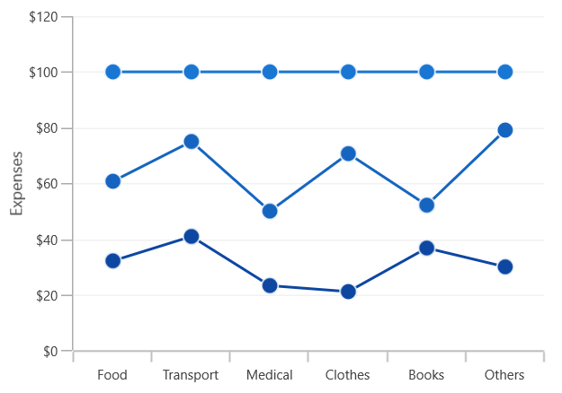
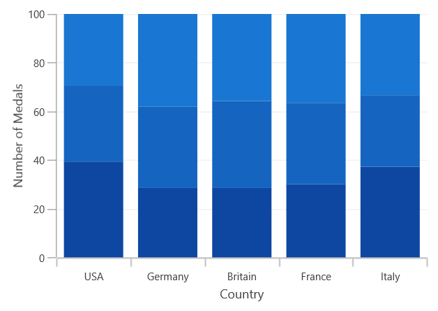
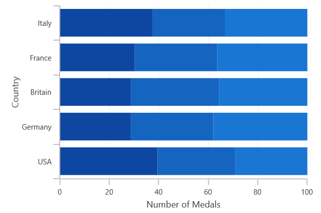

# Stacked in WinUI Chart

## Stacked Line

[`StackedLineSeries`](https://help.syncfusion.com/cr/WinUI/Syncfusion.UI.Xaml.Charts.StackedLineSeries.html) resembles multiple types of series of the [`LineSeries`](https://help.syncfusion.com/cr/WinUI/Syncfusion.UI.Xaml.Charts.LineSeries.html). Each series is vertically stacked one above the other. When there is only one series, then it is [`LineSeries`](https://help.syncfusion.com/cr/WinUI/Syncfusion.UI.Xaml.Charts.LineSeries.html). 

The following code example illustrates how to use [`StackedLineSeries`](https://help.syncfusion.com/cr/WinUI/Syncfusion.UI.Xaml.Charts.StackedLineSeries.html):





<chart:StackedLineSeries  

XBindingPath="MonthlyExpenses"    

YBindingPath="Father" 

ItemsSource="{Binding Data}"/>

<chart:StackedLineSeries

XBindingPath="MonthlyExpenses" 

YBindingPath="Mother"

ItemsSource="{Binding Data}"/> 

<chart:StackedLineSeries 

XBindingPath="MonthlyExpenses" 

YBindingPath="Son"

ItemsSource="{Binding Data}" />





StackedLineSeries series1 = new StackedLineSeries()
{

    ItemsSource = new ViewModel().Data,

    XBindingPath = "MonthlyExpenses",

    YBindingPath ="Father",

};

StackedLineSeries series2 = new StackedLineSeries()
{

    ItemsSource = new ViewModel().Data,

    XBindingPath = "MonthlyExpenses",

    YBindingPath = "Mother",

};

StackedLineSeries series3 = new StackedLineSeries()
{

    ItemsSource = new ViewModel().Data,

    XBindingPath = "MonthlyExpenses",

    YBindingPath = "Son",

};

chart.Series.Add(series1);

chart.Series.Add(series2);

chart.Series.Add(series3);





## 100% Stacked Line

[`StackedLine100Series`](https://help.syncfusion.com/cr/WinUI/Syncfusion.UI.Xaml.Charts.StackedLine100Series.html) resembles [`StackedLineSeries`](https://help.syncfusion.com/cr/WinUI/Syncfusion.UI.Xaml.Charts.StackedLineSeries.html) but the cumulative portion of each stacked element always comes to a total of 100%. 





<chart:StackedLine100Series ItemsSource="{Binding Data}" 

XBindingPath="MonthlyExpenses" 

YBindingPath="Father" />

<chart:StackedLine100Series ItemsSource="{Binding Data}"

XBindingPath="MonthlyExpenses"  

YBindingPath="Mother" />

<chart:StackedLine100Series ItemsSource="{Binding Data}"

XBindingPath="MonthlyExpenses" 

YBindingPath="Son" 




StackedLine100Series series1 = new StackedLine100Series()
{

    ItemsSource = new ViewModel().Data,

    XBindingPath = "MonthlyExpenses",

    YBindingPath = "Father",

};

StackedLine100Series series2 = new StackedLine100Series()
{

    ItemsSource = new ViewModel().Data,

    XBindingPath = "MonthlyExpenses",

    YBindingPath = "Mother",

};

StackedLine100Series series3 = new StackedLine100Series()
{

    ItemsSource = new ViewModel().Data,

    XBindingPath = "MonthlyExpenses",

    YBindingPath = "Son",

};

chart.Series.Add(series1);

chart.Series.Add(series2);

chart.Series.Add(series3);





## Stacked Column

[`StackedColumnSeries`](https://help.syncfusion.com/cr/WinUI/Syncfusion.UI.Xaml.Charts.StackedColumnSeries.html#) resembles multiple types of ColumnSeries. Each series is vertically stacked one above the other. When there is only one series, then it is ColumnSeries. 

The following code example illustrates how to use StackedColumnSeries.





<chart:StackedColumnSeries XBindingPath="CountryName"    

YBindingPath="GoldMedals" ItemsSource="{Binding MedalDetails}"/>

<chart:StackedColumnSeries XBindingPath="CountryName" 

YBindingPath="SilverMedals" ItemsSource="{Binding MedalDetails}"/> 

<chart:StackedColumnSeries XBindingPath="CountryName" 

YBindingPath="BronzeMedals" ItemsSource="{Binding MedalDetails}"/>





StackedColumnSeries series1 = new StackedColumnSeries()
{

    ItemsSource = new ViewModel().MedalDetails,

    XBindingPath = "CountryName",

    YBindingPath ="GoldMedals",

};

StackedColumnSeries series2 = new StackedColumnSeries()
{

    ItemsSource = new ViewModel().MedalDetails,

    XBindingPath = "CountryName",

    YBindingPath = "SilverMedals",

};

StackedColumnSeries series3 = new StackedColumnSeries()
{

    ItemsSource = new ViewModel().MedalDetails,

    XBindingPath = "CountryName",

    YBindingPath = "BronzeMedals",

};

chart.Series.Add(series1);

chart.Series.Add(series2);

chart.Series.Add(series3);





## 100% Stacked Column

[`StackedColumn100Series`](https://help.syncfusion.com/cr/WinUI/Syncfusion.UI.Xaml.Charts.StackedColumn100Series.html#) resembles StackedColumnSeries but the cumulative portion of each stacked element always comes to a total of 100%. 





<chart:StackedColumn100Series XBindingPath="CountryName" 

YBindingPath="GoldMedals" ItemsSource="{Binding MedalDetails}"/>

<chart:StackedColumn100Series XBindingPath="CountryName"

 YBindingPath="SilverMedals" ItemsSource="{Binding MedalDetails}"/>

<chart:StackedColumn100Series XBindingPath="CountryName" 

YBindingPath="BronzeMedals" ItemsSource="{Binding MedalDetails}" />





StackedColumn100Series series1 = new StackedColumn100Series()
{

    ItemsSource = new ViewModel().MedalDetails,

    XBindingPath = "CountryName",

    YBindingPath = "GoldMedals",

};

StackedColumn100Series series2 = new StackedColumn100Series()
{

    ItemsSource = new ViewModel().MedalDetails,

    XBindingPath = "CountryName",

    YBindingPath = "SilverMedals",

};

StackedColumn100Series series3 = new StackedColumn100Series()
{

    ItemsSource = new ViewModel().MedalDetails,

    XBindingPath = "CountryName",

    YBindingPath = "BronzeMedals",

};

chart.Series.Add(series1);

chart.Series.Add(series2);

chart.Series.Add(series3);





## Stacked Bar

[`StackedBarSeries`](https://help.syncfusion.com/cr/WinUI/Syncfusion.UI.Xaml.Charts.StackedBarSeries.html#) is a multiple series type of BarSeries. Each BarSeries is then stacked horizontally, side by side to each other. When only one series exists, it resembles a simple BarSeries. 





<chart:StackedBarSeries XBindingPath="CountryName"        

YBindingPath="GoldMedals" ItemsSource="{Binding MedalDetails}">

</chart:StackedBarSeries>

<chart:StackedBarSeries XBindingPath="CountryName" 

YBindingPath="SilverMedals" ItemsSource="{Binding MedalDetails}">

</chart:StackedBarSeries>

<chart:StackedBarSeries XBindingPath="CountryName" 

YBindingPath="BronzeMedals" ItemsSource="{Binding MedalDetails}">

</chart:StackedBarSeries>





StackedBarSeries series1 = new StackedBarSeries()
{

    ItemsSource = new ViewModel().MedalDetails,

    XBindingPath = "CountryName",

    YBindingPath = "GoldMedals",

};

StackedBarSeries series2 = new StackedBarSeries()
{

    ItemsSource = new ViewModel().MedalDetails,

    XBindingPath = "CountryName",

    YBindingPath = "SilverMedals",

};

StackedBarSeries series3 = new StackedBarSeries()
{

    ItemsSource = new ViewModel().MedalDetails,

    XBindingPath = "CountryName",

    YBindingPath = "BronzeMedals",

};

chart.Series.Add(series1);

chart.Series.Add(series2);

chart.Series.Add(series3);





## 100% Stacked Bar

[`StackedBar100Series`](https://help.syncfusion.com/cr/WinUI/Syncfusion.UI.Xaml.Charts.StackedBar100Series.html#) resembles a StackedBarSeries. StackedBar100Series displays multiple series as stacked bars and the cumulative portion of each stacked element is always 100%. 





<chart:StackedBar100Series XBindingPath="CountryName" 

YBindingPath="GoldMedals" ItemsSource="{Binding MedalDetails}" />

<chart:StackedBar100Series XBindingPath="CountryName"                          

YBindingPath="SilverMedals" ItemsSource="{Binding MedalDetails}" />

<chart:StackedBar100Series XBindingPath="CountryName" 

YBindingPath="BronzeMedals" ItemsSource="{Binding MedalDetails}" />





StackedBar100Series series1 = new StackedBar100Series()
{

    ItemsSource = new ViewModel().MedalDetails,

    XBindingPath = "CountryName",

    YBindingPath = "GoldMedals",

};

StackedBar100Series series2 = new StackedBar100Series()
{

    ItemsSource = new ViewModel().MedalDetails,

    XBindingPath = "CountryName",

    YBindingPath = "SilverMedals",

};

StackedBar100Series series3 = new StackedBar100Series()
{

    ItemsSource = new ViewModel().MedalDetails,

    XBindingPath = "CountryName",

    YBindingPath = "BronzeMedals",

};

chart.Series.Add(series1);

chart.Series.Add(series2);

chart.Series.Add(series3);





## Stacked Area

[`StackedAreaSeries`](https://help.syncfusion.com/cr/WinUI/Syncfusion.UI.Xaml.Charts.StackedAreaSeries.html#) represents areas stacked vertically one above the other. 





<chart:StackedAreaSeries XBindingPath="Month" 

YBindingPath="Bus" ItemsSource="{Binding Accidents}" />

<chart:StackedAreaSeries XBindingPath="Month"         

 YBindingPath="Car" ItemsSource="{Binding Accidents}" />

<chart:StackedAreaSeries XBindingPath="Month"                 

YBindingPath="Truck" ItemsSource="{Binding Accidents}" />





StackedAreaSeries series1 = new StackedAreaSeries()
{

    ItemsSource = new ViewModel().Accidents,

    XBindingPath = "Month",

    YBindingPath = "Bus",

};

StackedAreaSeries series2 = new StackedAreaSeries()
{

    ItemsSource = new ViewModel().Accidents,

    XBindingPath = "Month",

    YBindingPath = "Car",

};

StackedAreaSeries series3 = new StackedAreaSeries()
{

    ItemsSource = new ViewModel().Accidents,

    XBindingPath = "Month",

    YBindingPath = "Truck",

};

chart.Series.Add(series1);

chart.Series.Add(series2);

chart.Series.Add(series3);





## 100% Stacked Area

StackedArea100Series is similar to StackedAreaSeries, but the cumulative portion of each stacked element always totals 100%. 

The following code example shows how to add stacked area 100 series.





<chart:StackedArea100Series XBindingPath="Month"         

YBindingPath="Bus" ItemsSource="{Binding Accidents}" />

<chart:StackedArea100Series XBindingPath="Month" 

YBindingPath="Car" ItemsSource="{Binding Accidents}" />

<chart:StackedArea100Series XBindingPath="Month" 

YBindingPath="Truck" ItemsSource="{Binding Accidents}" />





StackedArea100Series series1 = new StackedArea100Series()
{

    ItemsSource = new ViewModel().Accidents,

    XBindingPath = "Month",

    YBindingPath = "Bus",

};

StackedArea100Series series2 = new StackedArea100Series()
{

    ItemsSource = new ViewModel().Accidents,

    XBindingPath = "Month",

    YBindingPath = "Car",

};

StackedArea100Series series3 = new StackedArea100Series()
{

    ItemsSource = new ViewModel().Accidents,

    XBindingPath = "Month",

    YBindingPath = "Truck",

};

chart.Series.Add(series1);

chart.Series.Add(series2);

chart.Series.Add(series3);





You can draw open curve like Area using the [`IsClosed`](https://help.syncfusion.com/cr/WinUI/Syncfusion.UI.Xaml.Charts.StackedAreaSeries.html#Syncfusion_UI_Xaml_Charts_StackedAreaSeries_IsClosed) property.





<chart:StackedAreaSeries Stroke="Black" StrokeThickness="3"

IsClosed="False" XBindingPath="Month" 

YBindingPath="Bus" ItemsSource="{Binding Accidents}"/>

<chart:StackedAreaSeries Stroke="White" StrokeThickness="3"

IsClosed="False" XBindingPath="Month"             

YBindingPath="Car" ItemsSource="{Binding Accidents}"/>

<chart:StackedAreaSeries Stroke="Black" StrokeThickness="3"  

IsClosed="False" XBindingPath="Month" 

YBindingPath="Truck" ItemsSource="{Binding Accidents}"/>





StackedAreaSeries series1 = new StackedAreaSeries()
{

    ItemsSource = new ViewModel().Accidents,

    XBindingPath = "Month",

    YBindingPath = "Bus",

    Stroke = new SolidColorBrush(Colors.Black),

    StrokeThickness = 3,

    IsClosed = false,

};

StackedAreaSeries series2 = new StackedAreaSeries()
{

    ItemsSource = new ViewModel().Accidents,

    XBindingPath = "Month",

    YBindingPath = "Car",

    Stroke = new SolidColorBrush(Colors.White),

    StrokeThickness = 3,

    IsClosed = false,

};

StackedAreaSeries series3 = new StackedAreaSeries()
{

    ItemsSource = new ViewModel().Accidents,

    XBindingPath = "Month",

    YBindingPath = "Truck",

    Stroke = new SolidColorBrush(Colors.Black),

    StrokeThickness = 3,

    IsClosed = false,

};

chart.Series.Add(series1);

chart.Series.Add(series2);

chart.Series.Add(series3);





