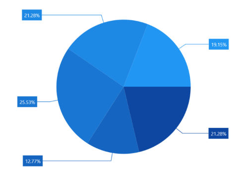

# Data Labels in WinUI Chart (SfCircularChart)

Data labels are used to display values related to a chart segment. Values from a data point (x, y) or other custom properties from a data source can be displayed.

Each data label can be represented by the following:

* Label - displays the segment label content at the (X, Y) point.
* Connector Line - used to connect the (X, Y) point and the label element.

## Enable Data Label 

[ShowDataLabels](https://help.syncfusion.com/cr/winui/Syncfusion.UI.Xaml.Charts.ChartSeries.html#Syncfusion_UI_Xaml_Charts_ChartSeries_ShowDataLabels) property of a series is used to enable data labels.





<chart:SfCircularChart>
. . .
<chart:PieSeries ShowDataLabels="True"
                 ItemsSource="{Binding Data}"  
                 XBindingPath="Product" 
                 YBindingPath="SalesRate"/>
. . .
</chart:SfCircularChart>





SfCircularChart chart = new SfCircularChart();
. . .
PieSeries series = new PieSeries();
series.ShowDataLabels = true;
. . .
chart.Series.Add(series);





 

## Context

To customize the content of data labels, define [DataLabelSettings](https://help.syncfusion.com/cr/winui/Syncfusion.UI.Xaml.Charts.CircularSeries.html?tabs=tabid-1#Syncfusion_UI_Xaml_Charts_CircularSeries_DataLabelSettings) of the series and set the [Context](https://help.syncfusion.com/cr/winui/Syncfusion.UI.Xaml.Charts.ChartDataLabelSettings.html#Syncfusion_UI_Xaml_Charts_ChartDataLabelSettings_Context) property to define the value to be displayed as label content.





<chart:SfCircularChart>
. . .
<chart:PieSeries ShowDataLabels="True">
    <chart:PieSeries.DataLabelSettings>
        <chart:CircularDataLabelSettings Context="Percentage"/>
    </chart:PieSeries.DataLabelSettings>
</chart:PieSeries>
. . .
</chart:SfCircularChart>




SfCircularChart chart = new SfCircularChart();
. . .
PieSeries series = new PieSeries();
series.ShowDataLabels = true;
series.DataLabelSettings = new CircularDataLabelSettings() {Context = LabelContext.Percentage };
. . .
chart.Series.Add(series);





 

## Customization

The following properties are used to customize the data label.

* [BorderBrush](https://help.syncfusion.com/cr/winui/Syncfusion.UI.Xaml.Charts.ChartDataLabelSettings.html#Syncfusion_UI_Xaml_Charts_ChartDataLabelSettings_BorderBrush)- used to change the border color.
* [BorderThickness](https://help.syncfusion.com/cr/winui/Syncfusion.UI.Xaml.Charts.ChartDataLabelSettings.html#Syncfusion_UI_Xaml_Charts_ChartDataLabelSettings_BorderThickness)- used to change the thickness of the border.
* [Margin](https://help.syncfusion.com/cr/winui/Syncfusion.UI.Xaml.Charts.ChartDataLabelSettings.html#Syncfusion_UI_Xaml_Charts_ChartDataLabelSettings_Margin)- used to change the margin size for labels.
* [FontStyle](https://help.syncfusion.com/cr/winui/Syncfusion.UI.Xaml.Charts.ChartDataLabelSettings.html#Syncfusion_UI_Xaml_Charts_ChartDataLabelSettings_FontStyle)-  used to change font style of the label.
* [FontSize](https://help.syncfusion.com/cr/winui/Syncfusion.UI.Xaml.Charts.ChartDataLabelSettings.html#Syncfusion_UI_Xaml_Charts_ChartDataLabelSettings_FontSize)-  used to change font size of the label.
* [Foreground](https://help.syncfusion.com/cr/winui/Syncfusion.UI.Xaml.Charts.ChartDataLabelSettings.html#Syncfusion_UI_Xaml_Charts_ChartDataLabelSettings_Foreground)- used to change the color of the label.
* [FontFamily](https://help.syncfusion.com/cr/winui/Syncfusion.UI.Xaml.Charts.ChartDataLabelSettings.html#Syncfusion_UI_Xaml_Charts_ChartDataLabelSettings_FontFamily)-  used to change the font family of the label.
* [Background](https://help.syncfusion.com/cr/winui/Syncfusion.UI.Xaml.Charts.ChartDataLabelSettings.html#Syncfusion_UI_Xaml_Charts_ChartDataLabelSettings_Background)- used to change the label background color.





<chart:SfCircularChart>
. . .
<chart:PieSeries.DataLabelSettings>
    <chart:CircularDataLabelSettings Position="Outside"
                                     Foreground="White"
                                     FontSize="11" 
                                     FontFamily="Calibri" 
                                     BorderBrush="Black" 
                                     BorderThickness="1"
									 Margin="1" 
                                     FontStyle="Italic"
									 Background="#1E88E5"
                                     Context="Percentage"/>
</chart:PieSeries.DataLabelSettings>
. . .
</chart:SfCircularChart>





SfCircularChart chart = new SfCircularChart();
. . . 
PieSeries series = new PieSeries();
series.ShowDataLabels = true;
series.DataLabelSettings = new CircularDataLabelSettings()
{
    Position = CircularSeriesLabelPosition.Outside,
    Foreground = new SolidColorBrush(Colors.White),
    BorderBrush = new SolidColorBrush(Colors.Black),
    Background = new SolidColorBrush(Color.FromArgb(255, 30, 136, 229)),
    BorderThickness = new Thickness(1),
    Margin = new Thickness(1),
    FontStyle = FontStyle.Italic,
    FontFamily = new FontFamily("Calibri"),
    FontSize = 11,
    Context = LabelContext.Percentage
};

chart.Series.Add(series);





## Template

The appearance of the data label can be customized using the [ContentTemplate](https://help.syncfusion.com/cr/winui/Syncfusion.UI.Xaml.Charts.ChartDataLabelSettings.html#Syncfusion_UI_Xaml_Charts_ChartDataLabelSettings_ContentTemplate) property of [CircularDataLabelSettings](https://help.syncfusion.com/cr/winui/Syncfusion.UI.Xaml.Charts.CircularDataLabelSettings.html) as shown in the example below:





<Grid x:Name="grid">
    <GridResources>
        <DataTemplate x:Key="labelTemplate">
            <StackPanel Margin="10" Orientation="Vertical">
                <Ellipse Height="15" Width="15" Fill="Cyan" 
                 Stroke="#4a4a4a" StrokeThickness="2"/>
                <TextBlock HorizontalAlignment="Center" 
						   FontSize="12"
                           Foreground="Black" 
                           FontWeight="SemiBold"
						   Text="{Binding Item.Product}"/>
            </StackPanel>
        </DataTemplate>
    </Grid.Resources>
    <chart:SfCircularChart >
...
    <chart:PieSeries ShowDataLabels="True">
        <chart:PieSeries.DataLabelSettings>
            <chart:CircularDataLabelSettings
						Position="Inside"
						ContentTemplate="{StaticResource labelTemplate}"
                        Context="DataLabelItem"/>
        </chart:PieSeries.DataLabelSettings>
    </chart:PieSeries>
. . .
    </chart:SfCircularChart>
</Grid>




SfCircularChart chart = new SfCircularChart();
. . .
PieSeries series = new PieSeries();
series.ShowDataLabels = true;
series.DataLabelSettings = new CircularDataLabelSettings()
{
    Position = CircularSeriesLabelPosition.Inside,
    Context = LabelContext.DataLabelItem,
    ContentTemplate = grid.Resources["labelTemplate"] as DataTemplate,
};
. . .
chart.Series.Add(series);





## Position

[SfCircularChart](https://help.syncfusion.com/cr/winui/Syncfusion.UI.Xaml.Charts.SfCircularChart.html) provides additional customization options to position the data label smartly based on series types using [Position](https://help.syncfusion.com/cr/winui/Syncfusion.UI.Xaml.Charts.CircularDataLabelSettings.html#Syncfusion_UI_Xaml_Charts_CircularDataLabelSettings_Position) property.

The following are the values for this property:

[Inside](https://help.syncfusion.com/cr/winui/Syncfusion.UI.Xaml.Charts.CircularSeriesLabelPosition.html#Syncfusion_UI_Xaml_Charts_CircularSeriesLabelPosition_Inside) - Data labels will be  placed inside over the CircularSeries.

[Outside](https://help.syncfusion.com/cr/winui/Syncfusion.UI.Xaml.Charts.CircularSeriesLabelPosition.html#Syncfusion_UI_Xaml_Charts_CircularSeriesLabelPosition_Outside) - Data labels will be placed just outside over the CircularSeries.

[OutsideExtended](https://help.syncfusion.com/cr/winui/Syncfusion.UI.Xaml.Charts.CircularSeriesLabelPosition.html#Syncfusion_UI_Xaml_Charts_CircularSeriesLabelPosition_OutsideExtended) - Data labels will be placed outside over the CircularSeries at a certain distance.





<chart:SfCircularChart>
. . .
<chart:PieSeries ShowDataLabels="True">
    <chart:PieSeries.DataLabelSettings>
        <chart:CircularDataLabelSettings
					Position="OutsideExtended"
					ShowConnectorLine="True"
					Context="Percentage"/>
    </chart:PieSeries.DataLabelSettings>
</chart:PieSeries>
. . .
</chart:SfCircularChart>





SfCircularChart chart = new SfCircularChart();
. . .
PieSeries series = new PieSeries();
series.ShowDataLabels = true;
series.DataLabelSettings = new CircularDataLabelSettings()
{
    Position = CircularSeriesLabelPosition.OutsideExtended,
    ShowConnectorLine = true,
    Context = LabelContext.Percentage
};

chart.Series.Add(series);





## Rotation

The [Rotation](https://help.syncfusion.com/cr/winui/Syncfusion.UI.Xaml.Charts.ChartDataLabelSettings.html#Syncfusion_UI_Xaml_Charts_ChartDataLabelSettings_Rotation) property is used to define the angle at which the label should rotate. The following code demonstrates setting the label rotation angle.





<chart:SfCircularChart>
. . .
<chart:PieSeries ShowDataLabels="True">
    <chart:PieSeries.DataLabelSettings>
        <chart:CircularDataLabelSettings
					Context="Percentage"
					Position="Outside"
					Rotation="335"/>
    </chart:PieSeries.DataLabelSettings>
</chart:PieSeries>
. . .
</chart:SfCircularChart>





SfCircularChart chart = new SfCircularChart();
. . .
PieSeries series = new PieSeries();
series.ShowDataLabels = true;
series.DataLabelSettings = new CircularDataLabelSettings()
{
    Context = LabelContext.Percentage,
    Position = CircularSeriesLabelPosition.Outside,
    Rotation = 335,
};

chart.Series.Add(series);





## Connector Line

The connector line is used to connect a label and data point using a line. [ShowConnectorLine](https://help.syncfusion.com/cr/winui/Syncfusion.UI.Xaml.Charts.ChartDataLabelSettings.html#Syncfusion_UI_Xaml_Charts_ChartDataLabelSettings_ShowConnectorLine) property of [CircularDataLabelSettings](https://help.syncfusion.com/cr/winui/Syncfusion.UI.Xaml.Charts.CircularDataLabelSettings.html) is used to enable the connector line in the circular chart. 

The connector line can be customized using the following properties.

* [ConnectorHeight](https://help.syncfusion.com/cr/winui/Syncfusion.UI.Xaml.Charts.ChartDataLabelSettings.html#Syncfusion_UI_Xaml_Charts_ChartDataLabelSettings_ConnectorHeight) - used to set height for the connector line.
* [ConnectorLineStyle](https://help.syncfusion.com/cr/winui/Syncfusion.UI.Xaml.Charts.ChartDataLabelSettings.html#Syncfusion_UI_Xaml_Charts_ChartDataLabelSettings_ConnectorLineStyle) - used to customize the style of the line.
* [ConnectorType](https://help.syncfusion.com/cr/winui/Syncfusion.UI.Xaml.Charts.CircularDataLabelSettings.html#Syncfusion_UI_Xaml_Charts_CircularDataLabelSettings_ConnectorType) - used to specify the connector line type.





<Grid x:Name="grid">
    <Grid.Resources>
        
    </Grid.Resources>
<chart:SfCircularChart>
. . . 
<chart:PieSeries ShowDataLabels="True">
    <chart:PieSeries.DataLabelSettings>
        <chart:CircularDataLabelSettings
					Position="Outside"
					Context="Percentage"
					ShowConnectorLine="True"
					ConnectorHeight="40"
					ConnectorType="StraightLine"
					ConnectorLineStyle="{StaticResource lineStyle}"/>
    </chart:PieSeries.DataLabelSettings>
</chart:PieSeries>
</chart:SfCircularChart>
</Grid>





SfCircularChart chart = new SfCircularChart();
. . .
PieSeries series = new PieSeries();
series.ShowDataLabels = true;
series.DataLabelSettings = new CircularDataLabelSettings()
{
    Context = LabelContext.Percentage,
    Position = CircularSeriesLabelPosition.Outside,
    ShowConnectorLine = true,
    ConnectorHeight = 40,
    ConnectorLineStyle = grid.Resources["lineStyle"] as Style,
};
. . .
chart.Series.Add(series);





### Connector Line Type

[ConnectorType](https://help.syncfusion.com/cr/winui/Syncfusion.UI.Xaml.Charts.CircularDataLabelSettings.html#Syncfusion_UI_Xaml_Charts_CircularDataLabelSettings_ConnectorType) property in [CircularDataLabelSettings](https://help.syncfusion.com/cr/winui/Syncfusion.UI.Xaml.Charts.CircularDataLabelSettings.html) is used to specify the connector line type such as [Line](https://help.syncfusion.com/cr/winui/Syncfusion.UI.Xaml.Charts.ConnectorMode.html#Syncfusion_UI_Xaml_Charts_ConnectorMode_Line) or [Bezier](https://help.syncfusion.com/cr/winui/Syncfusion.UI.Xaml.Charts.ConnectorMode.html#Syncfusion_UI_Xaml_Charts_ConnectorMode_Bezier) or [StraightLine](https://help.syncfusion.com/cr/winui/Syncfusion.UI.Xaml.Charts.ConnectorMode.html#Syncfusion_UI_Xaml_Charts_ConnectorMode_StraightLine).





<chart:SfCircularChart>
. . .
<chart:PieSeries ShowDataLabels="True">
    <chart:PieSeries.DataLabelSettings>
        <chart:CircularDataLabelSettings
					ConnectorType="Bezier"
					ConnectorHeight="40"
                    Position="Outside"
                    ShowConnectorLine="True"/>
    </chart:PieSeries.DataLabelSettings>
</chart:PieSeries>

</chart:SfCircularChart>




SfCircularChart chart = new SfCircularChart();

PieSeries series = new PieSeries();
series.ShowDataLabels = true;
series.DataLabelSettings = new CircularDataLabelSettings()
{
    ShowConnectorLine = true,
    ConnectorHeight = 40,
    ConnectorType = ConnectorMode.Bezier, 
    Position = CircularSeriesLabelPosition.Outside,
};

chart.Series.Add(series);





 **Bezier**
 

## Applying Series Fill

The [UseSeriesPalette](https://help.syncfusion.com/cr/winui/Syncfusion.UI.Xaml.Charts.ChartDataLabelSettings.html#Syncfusion_UI_Xaml_Charts_ChartDataLabelSettings_UseSeriesPalette) property is used to set the `Fill` of the series to the data label background. 





<chart:SfCircularChart>
. . .
<chart:PieSeries ShowDataLabels="True">
    <chart:PieSeries.DataLabelSettings>
        <chart:CircularDataLabelSettings
					UseSeriesPalette="True" 
					ShowConnectorLine="True" 
					ConnectorHeight="40"
					Position="Outside"/>
    </chart:PieSeries.DataLabelSettings>
</chart:PieSeries>

</chart:SfCircularChart>





SfCircularChart chart = new SfCircularChart();
. . .
PieSeries series = new PieSeries();
series.ShowDataLabels = true;
series.DataLabelSettings = new CircularDataLabelSettings()
{
    UseSeriesPalette = true,
    ShowConnectorLine = true,
    ConnectorHeight = 40,
    Position = CircularSeriesLabelPosition.Outside,
};

chart.Series.Add(series);





