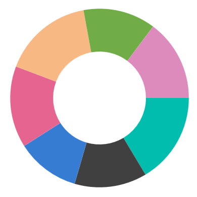
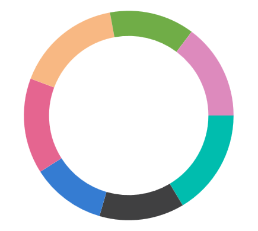
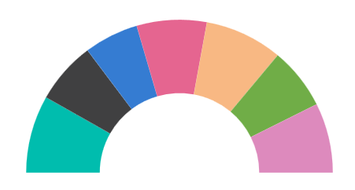

# Doughnut Chart in WinUI Chart (SfCircularChart)

[DoughnutSeries](https://help.syncfusion.com/cr/winui/Syncfusion.UI.Xaml.Charts.DoughnutSeries.html) is similar to [PieSeries](https://help.syncfusion.com/cr/winui/Syncfusion.UI.Xaml.Charts.PieSeries.html). It is used to show the relationship between parts of data and whole data. To render a [DoughnutSeries](https://help.syncfusion.com/cr/winui/Syncfusion.UI.Xaml.Charts.DoughnutSeries.html) in circular chart, create an instance of the [DoughnutSeries](https://help.syncfusion.com/cr/winui/Syncfusion.UI.Xaml.Charts.DoughnutSeries.html) and add it to the [Series](https://help.syncfusion.com/cr/winui/Syncfusion.UI.Xaml.Charts.SfCircularChart.html#Syncfusion_UI_Xaml_Charts_SfCircularChart_Series) collection property of [SfCircularChart](https://help.syncfusion.com/cr/winui/Syncfusion.UI.Xaml.Charts.SfCircularChart.html).





<chart:SfCircularChart>

    <chart:SfCircularChart.Series>
        <chart:DoughnutSeries ItemsSource="{Binding Data}" 
                              XBindingPath="Product" 
                              YBindingPath="SalesRate" />
    </chart:SfCircularChart.Series>

</chart:SfCircularChart>





SfCircularChart chart = new SfCircularChart();

DoughnutSeries series = new DoughnutSeries();
series.XBindingPath = "Product";
series.YBindingPath = "SalesRate";

chart.Series.Add(series);





## Multiple Doughnut

Circular chart provides support add the multiple doughnut series in a single chart.





<chart:SfCircularChart>

    <chart:SfCircularChart.Series>
         <chart:SfCircularChart.Series>
                <chart:DoughnutSeries ItemsSource="{Binding Data}" 
                         XBindingPath="Product" 
                         YBindingPath="SalesRate1">
                </chart:DoughnutSeries>
                <chart:DoughnutSeries ItemsSource="{Binding Data}" 
                         XBindingPath="Product" 
                         YBindingPath="SalesRate2">
                </chart:DoughnutSeries>
                <chart:DoughnutSeries ItemsSource="{Binding Data}" 
                         XBindingPath="Product" 
                         YBindingPath="SalesRate3">
                </chart:DoughnutSeries>
            </chart:SfCircularChart.Series>
    </chart:SfCircularChart.Series>

</chart:SfCircularChart>




SfCircularChart chart = new SfCircularChart();

DoughnutSeries series1 = new DoughnutSeries();
series1.XBindingPath = "Product";
series1.YBindingPath = "SalesRate1";

DoughnutSeries series2 = new DoughnutSeries();
series2.XBindingPath = "Product";
series2.YBindingPath = "SalesRate2";

DoughnutSeries series3 = new DoughnutSeries();
series3.XBindingPath = "Product";
series3.YBindingPath = "SalesRate3";

chart.Series.Add(series1);
chart.Series.Add(series2);
chart.Series.Add(series3);





## Inner Radius

The [InnerRadius]() property of doughnut series is used to define the inner circle. It also has [Radius]() property, which is used to define the size for this series, similar to [Radius]() in [PieSeries](https://help.syncfusion.com/cr/winui/Syncfusion.UI.Xaml.Charts.PieSeries.html).





<chart:SfCircularChart>

    <chart:SfCircularChart.Series>
        <chart:DoughnutSeries ItemsSource="{Binding Data}" InnerRadius="0.7"
                          XBindingPath="Product" 
                          YBindingPath="SalesRate" />
    </chart:SfCircularChart.Series>

</chart:SfCircularChart>





SfCircularChart chart = new SfCircularChart();

DoughnutSeries series = new DoughnutSeries();
series.XBindingPath = "Product";
series.YBindingPath = "SalesRate";
series.InnerRadius = 0.7;

chart.Series.Add(series);





## Semi Doughnut

By using the [StartAngle](https://help.syncfusion.com/cr/winui/Syncfusion.UI.Xaml.Charts.CircularSeries.html#Syncfusion_UI_Xaml_Charts_CircularSeries_StartAngle) and [EndAngle](https://help.syncfusion.com/cr/winui/Syncfusion.UI.Xaml.Charts.CircularSeries.html#Syncfusion_UI_Xaml_Charts_CircularSeries_EndAngle) properties, you can draw doughnut series in different shapes such as semi-doughnut or quarter doughnut series.





<chart:SfCircularChart>

    <chart:SfCircularChart.Series>
        <chart:DoughnutSeries StartAngle="180" EndAngle="360"
                          ItemsSource="{Binding Data}"
                          XBindingPath="Product" 
                          YBindingPath="SalesRate" />
    </chart:SfCircularChart.Series>

</chart:SfCircularChart>
    




SfCircularChart chart = new SfCircularChart();

DoughnutSeries series = new DoughnutSeries();
series.XBindingPath = "Product";
series.YBindingPath = "SalesRate";
series.StartAngle = 180;
series.EndAngle = 360;

chart.Series.Add(series);





N> You can refer to our [WinUI Doughnut Chart](https://www.syncfusion.com/winui-controls/charts/winui-doughnut-chart) feature tour page for its groundbreaking feature representations. You can also explore our [WinUI Doughnut Chart example](https://github.com/syncfusion/winui-demos/blob/master/chart/Views/Circular%20Charts/DoughnutChart.xaml) that shows how to easily configure with built-in support for creating stunning visual effects.