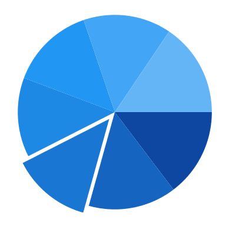
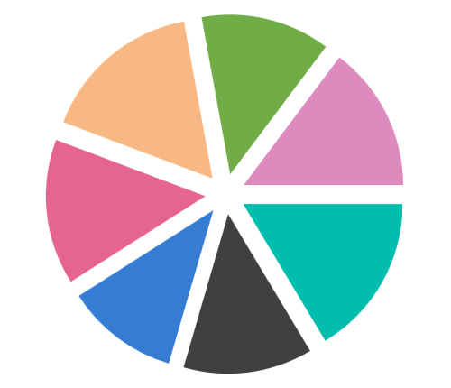

# Explode segments in WinUI Chart (SfCircularChart)

Exploding a segment is used to pull attention to a specific area of the circular chart. The following properties are used to explode the segments in the circular chart.

* [ExplodeAll](https://help.syncfusion.com/cr/winui/Syncfusion.UI.Xaml.Charts.AccumulationSeriesBase.html#Syncfusion_UI_Xaml_Charts_AccumulationSeriesBase_ExplodeAll)  - Used to explode all the segments of these series.
* [ExplodeIndex](https://help.syncfusion.com/cr/winui/Syncfusion.UI.Xaml.Charts.AccumulationSeriesBase.html#Syncfusion_UI_Xaml_Charts_AccumulationSeriesBase_ExplodeIndex) - Used to explode any specific segment.
* [ExplodeRadius](https://help.syncfusion.com/cr/winui/Syncfusion.UI.Xaml.Charts.CircularSeries.html#Syncfusion_UI_Xaml_Charts_CircularSeries_ExplodeRadius) - Used to define the explode distance.
* [ExplodeOnTap](https://help.syncfusion.com/cr/winui/Syncfusion.UI.Xaml.Charts.AccumulationSeriesBase.html#Syncfusion_UI_Xaml_Charts_AccumulationSeriesBase_ExplodeOnTap) - Used to explode the segment when segment is clicked.

**Explode Index**





<chart:SfCircularChart>
. . .
    <chart:PieSeries x:Name="PieSeries" ItemsSource="{Binding Data}" ExplodeIndex="2" ExplodeRadius="10" XBindingPath="Utilization" YBindingPath="ResponseTime" />

</chart:SfCircularChart>





SfCircularChart chart = new SfCircularChart();
. . .
PieSeries series = new PieSeries()
{
    ItemsSource = new ViewModel().Data,
    XBindingPath = "Utilization",
    YBindingPath = "ResponseTime",
    ExplodeIndex = 2,
    ExplodeRadius = 10
};

chart.Series.Add(series);





N> By default [ExplodeRadius](https://help.syncfusion.com/cr/winui/Syncfusion.UI.Xaml.Charts.CircularSeries.html#Syncfusion_UI_Xaml_Charts_CircularSeries_ExplodeRadius) value is zero. So you need to define [ExplodeRadius](https://help.syncfusion.com/cr/winui/Syncfusion.UI.Xaml.Charts.CircularSeries.html#Syncfusion_UI_Xaml_Charts_CircularSeries_ExplodeRadius) value, when you set [ExplodeIndex](https://help.syncfusion.com/cr/winui/Syncfusion.UI.Xaml.Charts.AccumulationSeriesBase.html#Syncfusion_UI_Xaml_Charts_AccumulationSeriesBase_ExplodeIndex) or [ExplodeAll](https://help.syncfusion.com/cr/winui/Syncfusion.UI.Xaml.Charts.AccumulationSeriesBase.html#Syncfusion_UI_Xaml_Charts_AccumulationSeriesBase_ExplodeAll).

**Explode All**





<chart:SfCircularChart>
. . .
    <chart:PieSeries ExplodeAll="True" ExplodeRadius="15" XBindingPath="Category" ItemsSource="{Binding Data}" YBindingPath="Value">

</chart:SfCircularChart>





SfCircularChart chart = new SfCircularChart();
. . .
PieSeries series = new PieSeries()
{
    ItemsSource = new ViewModel().Data,
    XBindingPath = "Category",
    YBindingPath = "Value",
    ExplodeAll = true,
    ExplodeRadius = 15
};

chart.Series.Add(series);





