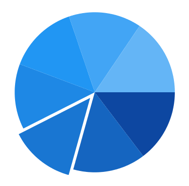

# Explode segments in WinUI Chart (SfCircularChart)

Exploding a segment is used to draw attention to a specific area of the circular chart. The following properties are used to explode the segments in the circular chart.

* [ExplodeAll](https://help.syncfusion.com/cr/winui/Syncfusion.UI.Xaml.Charts.PieSeries.html#Syncfusion_UI_Xaml_Charts_PieSeries_ExplodeAll)  - Used to explode all the segments of the series.
* [ExplodeIndex](https://help.syncfusion.com/cr/winui/Syncfusion.UI.Xaml.Charts.PieSeries.html#Syncfusion_UI_Xaml_Charts_PieSeries_ExplodeIndex) - Used to explode any specific segment.
* [ExplodeRadius](https://help.syncfusion.com/cr/winui/Syncfusion.UI.Xaml.Charts.PieSeries.html#Syncfusion_UI_Xaml_Charts_PieSeries_ExplodeRadius) - Used to define the explode distance.
* [ExplodeOnTap](https://help.syncfusion.com/cr/winui/Syncfusion.UI.Xaml.Charts.PieSeries.html#Syncfusion_UI_Xaml_Charts_PieSeries_ExplodeOnTap) - Used to explode the segment when the segment is clicked.

**Explode Index**





<chart:SfCircularChart>

    <!-- Configure additional chart elements -->
    <chart:PieSeries 
         x:Name="PieSeries" 
         ItemsSource="{Binding Data}"
         ExplodeIndex="2"
         ExplodeRadius="10"
         XBindingPath="Utilization"
         YBindingPath="ResponseTime"/>
</chart:SfCircularChart>





SfCircularChart chart = new SfCircularChart();

// Configure additional chart elements
PieSeries series = new PieSeries()
{
    ItemsSource = new ViewModel().Data,
    XBindingPath = "Utilization",
    YBindingPath = "ResponseTime",
    ExplodeIndex = 2,
    ExplodeRadius = 10
};

chart.Series.Add(series);





N> By default, the [ExplodeRadius](https://help.syncfusion.com/cr/winui/Syncfusion.UI.Xaml.Charts.PieSeries.html#Syncfusion_UI_Xaml_Charts_PieSeries_ExplodeRadius) value is zero. So, you need to define the [ExplodeRadius](https://help.syncfusion.com/cr/winui/Syncfusion.UI.Xaml.Charts.PieSeries.html#Syncfusion_UI_Xaml_Charts_PieSeries_ExplodeRadius) value when you set the [ExplodeIndex](https://help.syncfusion.com/cr/winui/Syncfusion.UI.Xaml.Charts.PieSeries.html#Syncfusion_UI_Xaml_Charts_PieSeries_ExplodeIndex) or [ExplodeAll](https://help.syncfusion.com/cr/winui/Syncfusion.UI.Xaml.Charts.PieSeries.html#Syncfusion_UI_Xaml_Charts_PieSeries_ExplodeAll).

**Explode All**





<chart:SfCircularChart>

    <!-- Configure additional chart elements -->
    <chart:PieSeries ExplodeAll="True"
		     ExplodeRadius="15"
		     XBindingPath="Category"
		     ItemsSource="{Binding Data}"
	             YBindingPath="Value">
</chart:SfCircularChart>





SfCircularChart chart = new SfCircularChart();

// Configure additional chart elements
PieSeries series = new PieSeries()
{
    ItemsSource = new ViewModel().Data,
    XBindingPath = "Category",
    YBindingPath = "Value",
    ExplodeAll = true,
    ExplodeRadius = 15
};

chart.Series.Add(series);





## See Also

- [How to explode the pie chart slice in WinUI Chart (SfCircularChart)?](https://support.syncfusion.com/kb/article/12987/how-to-explode-the-pie-chart-slice-in-winui-chart-sfcircularchart)
