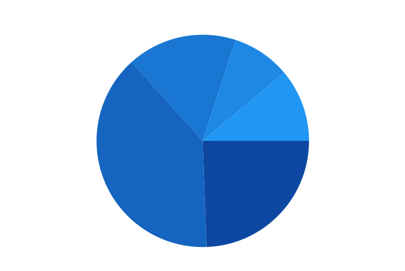
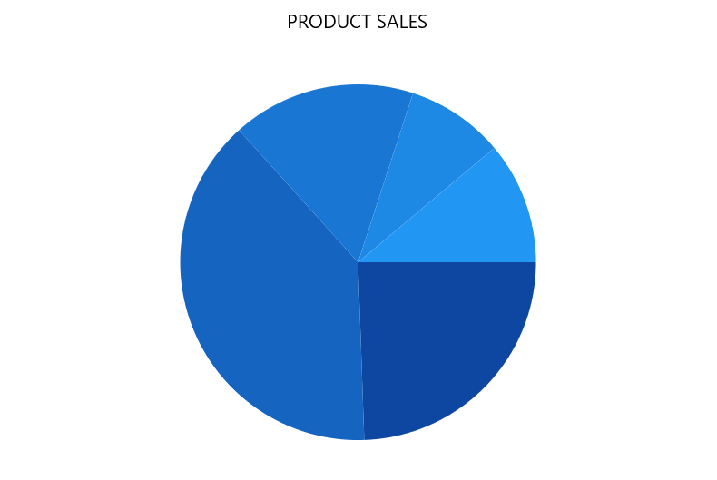
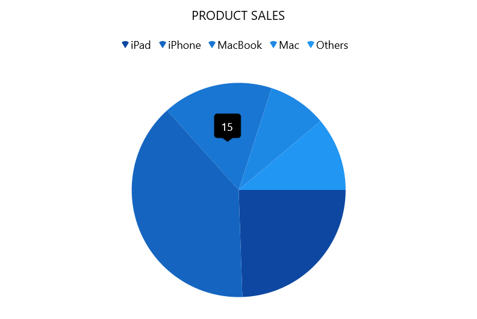

# Getting started with WinUI Circular Charts

This section explains how to populate the circular chart with data, header, data labels, legend, and tooltips, as well as the essential aspects for getting started with the chart.

## Creating an application with WinUI Circular Chart

1. Create a [WinUI 3 desktop app for C# and .NET 5](https://docs.microsoft.com/en-us/windows/apps/winui/winui3/get-started-winui3-for-desktop) or [WinUI 3 app in UWP for C#](https://docs.microsoft.com/en-us/windows/apps/winui/winui3/get-started-winui3-for-uwp).
2. Add reference to [Syncfusion.Chart.WinUI](https://www.nuget.org/packages/Syncfusion.Chart.WinUI/) NuGet. 
3. Import the control namespace `Syncfusion.UI.Xaml.Charts` in XAML or C# to initialize the control.
4. Initialize [SfCircularChart]() control.

 



<Window
    x:Class="ChartDemo.MainWindow"
    . . .
    xmlns:chart="using:Syncfusion.UI.Xaml.Charts">

    <chart:SfCircularChart/>
</Window>
 




using Syncfusion.UI.Xaml.Charts;
. . .
public sealed partial class MainWindow : Window
{
    public MainWindow()
    {
        this.InitializeComponent();
        SfCircularChart chart = new SfCircularChart();
        . . .
        this.Content = chart;
    }
}   




## Initialize view model

Now, let us define a simple data model that represents a data point in chart.

  



public class Sales
{
    public string Product { get; set; }

    public double SalesRate { get; set; }
}

 

 

Next, create a view model class and initialize a list of `Model` objects as follows.

  



public class ChartViewModel
{
    public List<Sales> Data { get; set; }

    public ChartViewModel()
    {
        Data = new List<Sales>()
        {
            new Sales(){Product = "iPad", SalesRate = 25},
            new Sales(){Product = "iPhone", SalesRate = 35},
            new Sales(){Product = "MacBook", SalesRate = 15},
            new Sales(){Product = "Mac", SalesRate = 5},
            new Sales(){Product = "Others", SalesRate = 10},
        };
    }
}

 

 

Create a `ViewModel` instance and set it as the chart's `DataContext`. This enables property binding from `ViewModel` class.

N> Add namespace of `ViewModel` class to your XAML Page if you prefer to set `DataContext` in XAML.

 

 

<Window
    . . .
    xmlns:chart="using:Syncfusion.UI.Xaml.Charts"
    xmlns:model="using:ChartDemo.ViewModel">

    <chart:SfCircularChart>
        <chart:SfCircularChart.DataContext>
            <model:ChartViewModel/>
        </chart:SfCircularChart.DataContext>
    </chart:SfCircularChart>
</Window>



 

ChartViewModel viewModel = new ChartViewModel();
chart.DataContext = viewModel;



 

## Populate chart with data

Adding [PieSeries]() to the chart [Series]() collection and binding `Data` to the series [ItemsSource]() property from its `DataContext` for creating our own Product – Sales Pie chart.

N> To plot the series, the [XBindingPath]() and [YBindingPath]() properties must be configured so that the chart may get values from the respective properties in the data model.

   



<chart:SfCircularChart>
. . .
    <chart:SfCircularChart.Series>
        <chart:PieSeries ItemsSource="{Binding Data}" 
                         XBindingPath="Product" 
                         YBindingPath="SalesRate"/>
    </chart:SfCircularChart.Series>
</chart:SfCircularChart>





SfCircularChart chart = new SfCircularChart();

ChartViewModel viewModel = new ChartViewModel();
chart.DataContext = viewModel;

PieSeries series = new PieSeries();
series.XBindingPath = "Product";
series.YBindingPath = "SalesRate";

series.SetBinding(
    PieSeries.ItemsSourceProperty, 
    new Binding() 
    { Path = new PropertyPath("Data") });

chart.Series.Add(series);
. . .



 

## Add title

The header of the chart acts as the title to provide quick information to the user about the data being plotted in the chart. You can set title using the [Header]() property of circular chart as follows.

 



<chart:SfCircularChart Header="PRODUCT SALES">
    . . .
</chart:SfCircularChart>





chart.Header = "PRODUCT SALES";



  

## Enable Data Labels

The [ShowDataLabels]() property of [CircularSeries]() can be used to enable data labels to improve the readability of the circular chart. The label visibility is set to `False` by default.

 



<chart:PieSeries ShowDataLabels="True"
                 ItemsSource="{Binding Data}" 
                 XBindingPath="Product" 
                 YBindingPath="SalesRate"/>





series.ShowDataLabels = true;



  

## Enable legend

The legend provides information about the data point displayed in the circular chart. The [Legend]() property of the chart was used to enable it.

 



<chart:SfCircularChart>
    . . .
    <chart:SfCircularChart.Legend>
        <chart:ChartLegend/>
    </chart:SfCircularChart.Legend>
</chart:SfCircularChart>





SfCircularChart chart = new SfCircularChart();
. . .
chart.Legend = new ChartLegend();



 

## Enable tooltip

Tooltips are used to show information about the segment, when mouse over on it. Enable tooltip by setting series [ShowTooltip]() property as true.

 



<chart:PieSeries ShowTooltip="True">
    . . . 
</chart:PieSeries>





PieSeries series = new PieSeries();
. . .
series.ShowTooltip = true;





The following code example gives you the complete code of above configurations.

 



<chart:SfCircularChart Header="PRODUCT SALES">
    <chart:SfCircularChart.DataContext>
        <model:ChartViewModel/>
    </chart:SfCircularChart.DataContext>
    <chart:SfCircularChart.Legend>
        <chart:ChartLegend/>
    </chart:SfCircularChart.Legend>
    <chart:SfCircularChart.Series>
        <chart:PieSeries ItemsSource="{Binding Data}" 
                         XBindingPath="Product" ShowTooltip="True"
                         YBindingPath="SalesRate">
            <chart:PieSeries.DataLabelSettings>
                <chart:CircularChartDataLabelSettings Visible="True"/>
            </chart:PieSeries.DataLabelSettings>
        </chart:PieSeries>
    </chart:SfCircularChart.Series>
</chart:SfCircularChart>
 




using Syncfusion.UI.Xaml.Charts;
. . .
public sealed partial class MainWindow : Window
{
    public MainWindow()
    {
        SfCircularChart chart = new SfCircularChart();

        chart.Header = "PRODUCT SALES";
        chart.Legend = new ChartLegend();
        ChartViewModel viewModel = new ChartViewModel();
        chart.DataContext = viewModel;

        PieSeries series = new PieSeries();
        series.XBindingPath = "Product";
        series.YBindingPath = "SalesRate";
        series.ShowTooltip = true;

        series.DataLabelSettings = new CircularChartDataLabelSettings() { Visible = true };

        series.SetBinding(
            PieSeries.ItemsSourceProperty, 
            new Binding() 
            { Path = new PropertyPath("Data") });

        chart.Series.Add(series);
        this.Content = chart;
    }
}





The following chart is created as a result of the previous codes.

N> Download demo application from [GitHub]()

