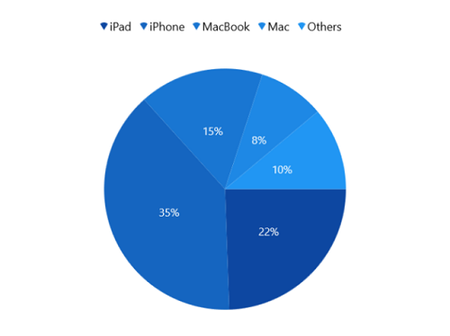
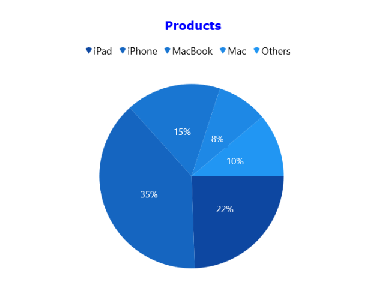
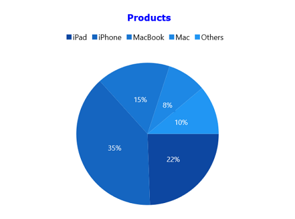
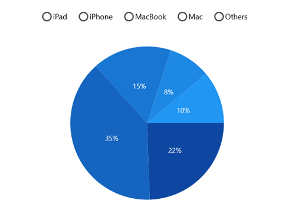
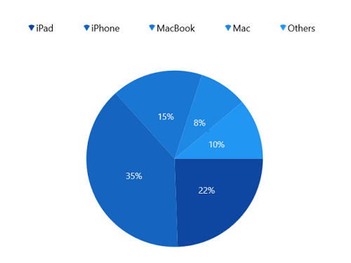
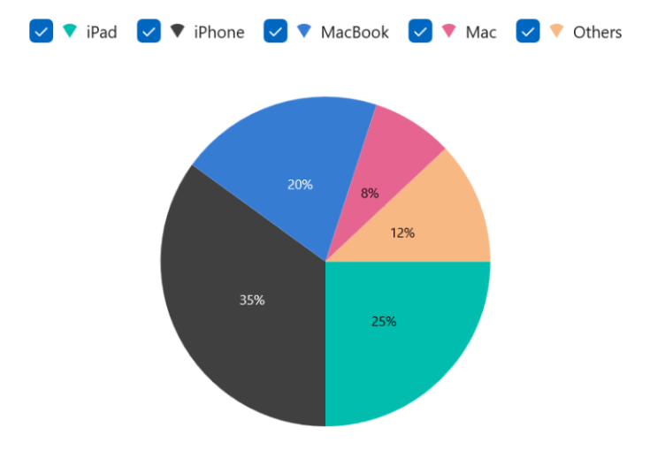
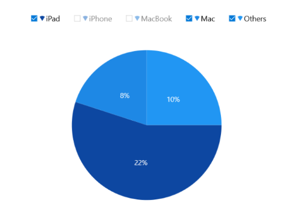
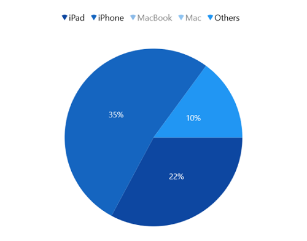
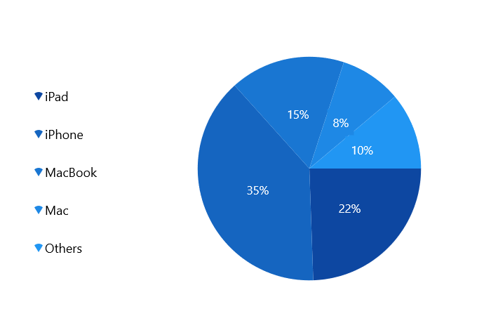
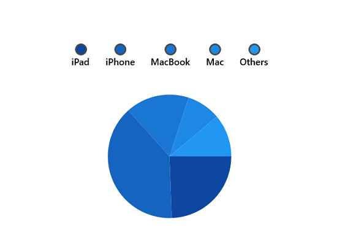

# Legend in WinUI Charts (SfCircularChart)

The legend contains list of series data points in the chart. The information provided in each legend item helps to identify the corresponding data series in the chart.





<chart:SfCircularChart.Legend>
    <chart:ChartLegend/>
</chart:SfCircularChart.Legend>





SfCircularChart chart = new SfCircularChart();
chart.Legend = new ChartLegend();





N> The x-value of data points in the circular chart will be the legend items ‘Label’.

## Title

Circular chart provides support to add any `UIElement` as a title for legend. [Header](https://help.syncfusion.com/cr/winui/Syncfusion.UI.Xaml.Charts.ChartLegend.html#Syncfusion_UI_Xaml_Charts_ChartLegend_Header) property of [ChartLegend](https://help.syncfusion.com/cr/winui/Syncfusion.UI.Xaml.Charts.ChartLegend.html) is used to define the title for legend as the following code example.





<chart:SfCircularChart>
. . .
    <chart:SfCircularChart.Legend>
        <chart:ChartLegend>
            <chart:ChartLegend.Header>
                <TextBlock Text="Products" 
                           HorizontalAlignment="Center"
                           FontWeight="Bold"
                           Foreground="Blue"/>
            </chart:ChartLegend.Header>
    </chart:ChartLegend>
</chart:SfCircularChart.Legend>
</chart:SfCircularChart>





SfCircularChart chart = new SfCircularChart();
ChartLegend legend = new ChartLegend();

TextBlock textBlock = new TextBlock()
{
    Text = "Products",
    HorizontalTextAlignment = TextAlignment.Center,
    Foreground = new SolidColorBrush(Colors.Blue),
    FontWeight = FontWeights.Bold,
};

legend.Header = textBlock;
chart.Legend = legend;





## Icon

Legend icon represents a symbol associated with the each legend item. [LegendIcon](https://help.syncfusion.com/cr/winui/Syncfusion.UI.Xaml.Charts.ChartSeriesBase.html#Syncfusion_UI_Xaml_Charts_ChartSeriesBase_LegendIcon) property of series is used to set the icon type for legend item. By default, the legend icon is [SeriesType](https://help.syncfusion.com/cr/winui/Syncfusion.UI.Xaml.Charts.ChartLegendIcon.html#Syncfusion_UI_Xaml_Charts_ChartLegendIcon_SeriesType).





<chart:SfCircularChart>
. . .
<chart:SfCircularChart.Legend>
    <chart:ChartLegend/>
</chart:SfCircularChart.Legend>

<chart:SfCircularChart.Series>
    <chart:PieSeries LegendIcon="Rectangle"
                     ItemsSource="{Binding Data}"  
                     XBindingPath="Product" 
                     YBindingPath="SalesRate">
    </chart:PieSeries>
</chart:SfCircularChart.Series>
. . .
</chart:SfCircularChart>





SfCircularChart chart = new SfCircularChart();
. . .
chart.Legend = new ChartLegend();

PieSeries series = new PieSeries();
series.LegendIcon = ChartLegendIcon.Rectangle;

chart.Series.Add(series);





The appearance of the legend icon can be customized using the below properties.

* [IconWidth](https://help.syncfusion.com/cr/winui/Syncfusion.UI.Xaml.Charts.ChartLegend.html#Syncfusion_UI_Xaml_Charts_ChartLegend_IconWidth) - Gets or sets the double value that represents the legend icon(s) width.
* [IconHeight](https://help.syncfusion.com/cr/winui/Syncfusion.UI.Xaml.Charts.ChartLegend.html#Syncfusion_UI_Xaml_Charts_ChartLegend_IconHeight) - Gets or sets the double value that represents that legend icon(s) height.
* [IconVisibility](https://help.syncfusion.com/cr/winui/Syncfusion.UI.Xaml.Charts.ChartLegend.html#Syncfusion_UI_Xaml_Charts_ChartLegend_IconVisibility) - Gets or sets the Visibility of the legend icon.





<chart:SfCircularChart>
. . .
<chart:SfCircularChart.Legend>
    <chart:ChartLegend IconWidth="10" IconHeight="5" 
                       IconVisibility="Visible">
    </chart:ChartLegend>
</chart:SfCircularChart.Legend>

</chart:SfCircularChart>





SfCircularChart chart = new SfCircularChart();
. . .
chart.Legend = new ChartLegend()
{
    IconWidth = 10,
    IconHeight = 5,
    IconVisibility = Visibility.Visible,
};





**Custom legend icon**

Circular chart provides support to add custom icon for the legend using [LegendIconTemplate](https://help.syncfusion.com/cr/winui/Syncfusion.UI.Xaml.Charts.ChartSeriesBase.html#Syncfusion_UI_Xaml_Charts_ChartSeriesBase_LegendIconTemplate) property of series as in below example.





<chart:SfCircularChart>
    <chart:SfCircularChart.Resources>
        <DataTemplate x:Key="iconTemplate">
            <Ellipse Height="15" Width="15" Fill="White" 
                 Stroke="#4a4a4a" StrokeThickness="2"/>
        </DataTemplate>
    </chart:SfCircularChart.Resources>

    <chart:SfCircularChart.Legend>
        <chart:ChartLegend IconWidth="15" IconHeight="15"/>
    </chart:SfCircularChart.Legend>
    
    <chart:PieSeries 
        LegendIconTemplate="{StaticResource iconTemplate}"
        ItemsSource="{Binding Data}"/>
</chart:SfCircularChart>





SfCircularChart chart = new SfCircularChart();
. . .
PieSeries series = new PieSeries();
series.LegendIconTemplate = chart.Resources["iconTemplate"] as DataTemplate;
. . .
chart.Series.Add(series);





## Item spacing

[ItemMargin](https://help.syncfusion.com/cr/winui/Syncfusion.UI.Xaml.Charts.ChartLegend.html#Syncfusion_UI_Xaml_Charts_ChartLegend_ItemMargin) property of the [ChartLegend](https://help.syncfusion.com/cr/winui/Syncfusion.UI.Xaml.Charts.ChartLegend.html) is used to provide spacing between each legend items.





<chart:SfCircularChart>
. . .
<chart:SfCircularChart.Legend>
    <chart:ChartLegend ItemMargin="10"/>
</chart:SfCircularChart.Legend>

</chart:SfCircularChart>





SfCircularChart chart = new SfCircularChart();
. . .
chart.Legend = new ChartLegend()
{
    ItemMargin = new Thickness(10)
};





## Checkbox for Legend

Circular chart provides support to enable the checkbox for each legend item to visible or collapse the associated data points. By default, the value of [CheckBoxVisibility](https://help.syncfusion.com/cr/winui/Syncfusion.UI.Xaml.Charts.ChartLegend.html#Syncfusion_UI_Xaml_Charts_ChartLegend_CheckBoxVisibility) property is `Collapsed`.  





<chart:SfCircularChart>
. . .
    <chart:SfCircularChart.Legend>
        <chart:ChartLegend CheckBoxVisibility="Visible"/>
    </chart:SfCircularChart.Legend>

</chart:SfCircularChart>





SfCircularChart chart = new SfCircularChart();
. . .
chart.Legend = new ChartLegend()
{
   CheckBoxVisibility = Visibility.Visible
};





The data point can be collapsed by unchecking the checkbox as below:

## Toggle series visibility 

The visibility of the segment can be control by tapping the legend item by enabling the [ToggleSeriesVisibility](https://help.syncfusion.com/cr/winui/Syncfusion.UI.Xaml.Charts.ChartLegend.html#Syncfusion_UI_Xaml_Charts_ChartLegend_ToggleSeriesVisibility) property. By default, the value of [ToggleSeriesVisibility](https://help.syncfusion.com/cr/winui/Syncfusion.UI.Xaml.Charts.ChartLegend.html#Syncfusion_UI_Xaml_Charts_ChartLegend_ToggleSeriesVisibility) property is `False`.





<chart:SfCircularChart>
. . .
    <chart:SfCircularChart.Legend>
        <chart:ChartLegend ToggleSeriesVisibility="True"/>
    </chart:SfCircularChart.Legend>

</chart:SfCircularChart>





SfCircularChart chart = new SfCircularChart();
. . .
chart.Legend = new ChartLegend()
{
   ToggleSeriesVisibility = true
};





## Placement

Legends can be docked left, right, and top or bottom around the chart area using [Placement]() property. By default, the chart legend is docked at the top of the chart as mentioned earlier.

To display the legend at the left, set the [Placement]() as [Left]() as in below code snippet.





<chart:SfCircularChart>
. . .
<chart:SfCircularChart.Legend>
    <chart:ChartLegend ItemMargin="10" Placement="Left"/>
</chart:SfCircularChart.Legend>

</chart:SfCircularChart>





SfCircularChart chart = new SfCircularChart();
. . .
chart.Legend = new ChartLegend()
{
    ItemMargin = new Thickness(10),
    Placement = LegendPlacement.Left
};





## Background Customization 

The legend background appearance can be customized by using the below properties.

`BorderThickness` - used to change the stroke width of the legend.
`BorderBrush` - used to change the stroke color of the legend.
`Background` - used to change the background color of legend.
`Opacity` - used to control the transparency of the legend icon shape.
`CornerRadius` - used to change the corner radius of the legend.




<chart:SfCircularChart>
. . .
<chart:SfCircularChart.Legend>
    <chart:ChartLegend Background="Gray" BorderBrush="Black" 
                       BorderThickness="1" CornerRadius="5" 
                       Opacity="0.9" >
    </chart:ChartLegend>
</chart:SfCircularChart.Legend>

</chart:SfCircularChart>





SfCircularChart chart = new SfCircularChart();
. . .
chart.Legend = new ChartLegend()
{
    Background = new SolidColorBrush(Colors.Gray),
    BorderBrush = new SolidColorBrush(Colors.Black),
    BorderThickness = new Thickness(1),
    Opacity = 0.9,
    CornerRadius = new CornerRadius(5)
};





## Template

Customize each legend item by using `ItemTemplate` property in [ChartLegend](https://help.syncfusion.com/cr/winui/Syncfusion.UI.Xaml.Charts.ChartLegend.html) as in below code snippet:





<chart:SfCircularChart>
    <chart:SfCircularChart.Resources>
        <DataTemplate x:Key="labelTemplate">
            <StackPanel Margin="10" Orientation="Vertical">
                <Ellipse Height="15" Width="15" Fill="{Binding Interior}" 
                 Stroke="#4a4a4a" StrokeThickness="2"/>
                <TextBlock HorizontalAlignment="Center" FontSize="12"
                           Foreground="Black" 
                           FontWeight="SemiBold" Text="{Binding Label}"/>
            </StackPanel>
        </DataTemplate>
    </chart:SfCircularChart.Resources>
    . . .
    <chart:SfCircularChart.Legend>
        <chart:ChartLegend ItemTemplate="{StaticResource labelTemplate}"/>
    </chart:SfCircularChart.Legend>

</chart:SfCircularChart>





SfCircularChart chart = new SfCircularChart();
. . .
chart.Legend = new ChartLegend()
{

   ItemTemplate = chart.Resources["itemTemplate"] as DataTemplate
};





