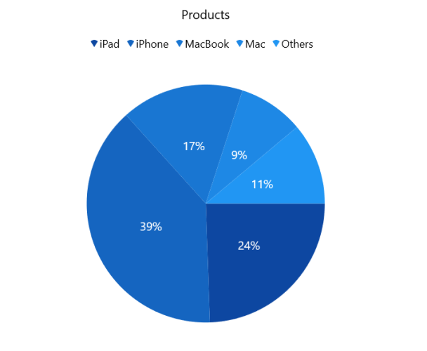

# WinUI Charts Overview (SfCircularChart)

The Syncfusion® [WinUI Charts](https://www.syncfusion.com/winui-controls/charts) (SfCircularChart) are used to create charts with beautiful and enhanced UI visualizations of data, ideal for high-quality WinUI applications.

## Key Features

* **Chart Types** - Supports two types of series: pie and doughnut. Each series presents data in a unique way and is designed to be user-friendly.

* **User Interaction** - Features such as circular chart selection, tooltips, and explode enhance the end-user experience significantly.

* **Legends** - Provide additional information about data points in the chart series. Legends can be wrapped or scrolled if an item exceeds the available bounds.

* **Multiple Series** - The circular chart allows rendering multiple pie or doughnut series simultaneously, with options to compare and visualize two different series at the same time.

* **Dynamic Update** - The chart can be updated dynamically or lazily with live data that changes over time, such as stock prices, temperature, or speed.