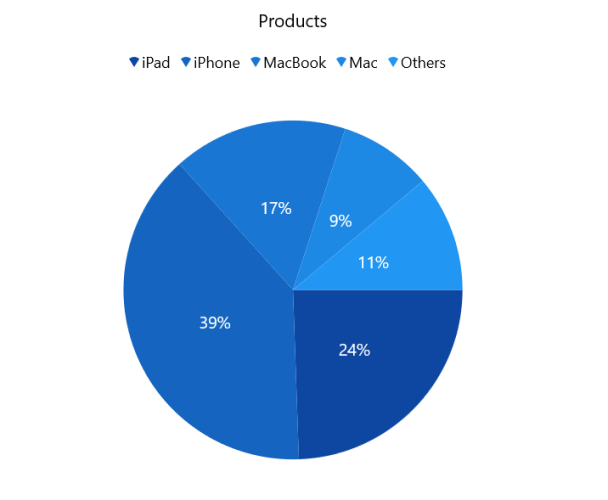

# WinUI Charts Overview (SfCircularChart)

Syncfusion® [WinUI Charts](https://www.syncfusion.com/winui-controls/charts) (SfCircularChart) is used to create charts with beautiful UI visualization of data for high-quality WinUI applications.

## Key features

* **Chart types** - Supports two types of series: pie and doughnut. Each series presents data in a unique way and is designed to be user-friendly.

* **User interaction** - The circular chart selection, tooltips, and explode user interaction features significantly improve the end-user experience.

* **Legends** - Display additional information about the data points of chart series, which can be wrapped or scrolled if an item exceeds the available bounds.

* **Multiple series** - The circular chart provides support for rendering multiple pie or doughnut series at the same time, with options to compare and visualize two different series simultaneously.

* **Dynamic update** - Updates the chart dynamically or lazily with live data that changes over seconds or minutes, such as stock prices, temperature, speed, etc.

## See Also

- [How to create WinUI Pie Chart (SfCircularChart)?](https://support.syncfusion.com/kb/article/12014/how-to-create-winui-pie-chart-sfcircularchart)
- [How to use the drill-down functionality in WinUI Chart (SfCircularChart).](https://support.syncfusion.com/kb/article/13011/how-to-use-the-drill-down-functionality-in-winui-chart-sfcircularchart)

