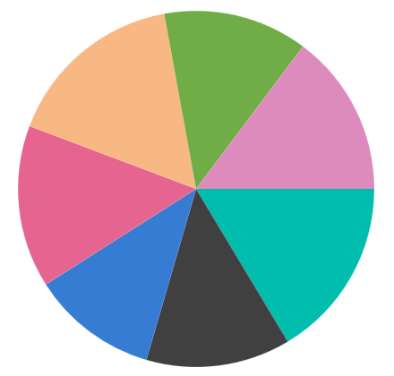

# Pie Chart in WinUI Chart (SfCircularChart)

To render a [PieSeries](https://help.syncfusion.com/cr/winui/Syncfusion.UI.Xaml.Charts.PieSeries.html) in circular chart, create an instance of the [PieSeries](https://help.syncfusion.com/cr/winui/Syncfusion.UI.Xaml.Charts.PieSeries.html) and add it to the [Series](https://help.syncfusion.com/cr/winui/Syncfusion.UI.Xaml.Charts.SfCircularChart.html#Syncfusion_UI_Xaml_Charts_SfCircularChart_Series) collection property of [SfCircularChart](https://help.syncfusion.com/cr/winui/Syncfusion.UI.Xaml.Charts.SfCircularChart.html).





<chart:SfCircularChart>

    <chart:SfCircularChart.Series>
        <chart:PieSeries ItemsSource="{Binding Data}" 
                         XBindingPath="Product" 
                         YBindingPath="SalesRate"/>
    </chart:SfCircularChart.Series>
        
</chart:SfCircularChart>





SfCircularChart chart = new SfCircularChart();

PieSeries series = new PieSeries();
series.XBindingPath = "Product";
series.YBindingPath = "SalesRate";

chart.Series.Add(series);





## Radius

The rendering size of the [PieSeries](https://help.syncfusion.com/cr/winui/Syncfusion.UI.Xaml.Charts.PieSeries.html) can be controlled using the [Radius](https://help.syncfusion.com/cr/winui/Syncfusion.UI.Xaml.Charts.PieSeries.html#Syncfusion_UI_Xaml_Charts_PieSeries_CircularCoefficient) property as shown in the following code sample.





<chart:SfCircularChart>

    <chart:SfCircularChart.Series>
        <chart:PieSeries ItemsSource="{Binding Data}" 
                         XBindingPath="Product" 
                         YBindingPath="SalesRate"
                         Radius = "0.9"/>
    </chart:SfCircularChart.Series>
        
</chart:SfCircularChart>





SfCircularChart chart = new SfCircularChart();

PieSeries series = new PieSeries();
series.XBindingPath = "Product";
series.YBindingPath = "SalesRate";
series.Radius = 0.9;

chart.Series.Add(series);





## Group small data points into “others”

The small segments in the pie chart can be grouped into the “others” category using the [GroupTo](https://help.syncfusion.com/cr/winui/Syncfusion.UI.Xaml.Charts.CircularSeries.html#Syncfusion_UI_Xaml_Charts_CircularSeries_GroupTo) and [GroupMode](https://help.syncfusion.com/cr/winui/Syncfusion.UI.Xaml.Charts.CircularSeries.html#Syncfusion_UI_Xaml_Charts_CircularSeries_GroupMode) properties of [PieSeries](https://help.syncfusion.com/cr/winui/Syncfusion.UI.Xaml.Charts.PieSeries.html).

* [GroupMode](https://help.syncfusion.com/cr/winui/Syncfusion.UI.Xaml.Charts.CircularSeries.html#Syncfusion_UI_Xaml_Charts_CircularSeries_GroupMode) - used to specify the grouping type based on slice [Angle](https://help.syncfusion.com/cr/winui/Syncfusion.UI.Xaml.Charts.PieGroupMode.html#Syncfusion_UI_Xaml_Charts_PieGroupMode_Angle), actual data point [Value](https://help.syncfusion.com/cr/winui/Syncfusion.UI.Xaml.Charts.PieGroupMode.html#Syncfusion_UI_Xaml_Charts_PieGroupMode_Value), or [Percentage](https://help.syncfusion.com/cr/winui/Syncfusion.UI.Xaml.Charts.PieGroupMode.html#Syncfusion_UI_Xaml_Charts_PieGroupMode_Percentage). 
* [GroupTo](https://help.syncfusion.com/cr/winui/Syncfusion.UI.Xaml.Charts.CircularSeries.html#Syncfusion_UI_Xaml_Charts_CircularSeries_GroupTo) - used to set the limit to group data points into a single slice. The grouped segment is labeled as “Others” in legend and toggled as other segment. 

The default value of the [GroupTo](https://help.syncfusion.com/cr/winui/Syncfusion.UI.Xaml.Charts.CircularSeries.html#Syncfusion_UI_Xaml_Charts_CircularSeries_GroupTo) property is `double.NAN`, and the default value of the [GroupMode](https://help.syncfusion.com/cr/winui/Syncfusion.UI.Xaml.Charts.CircularSeries.html#Syncfusion_UI_Xaml_Charts_CircularSeries_GroupMode) property is Value.

**Pie series without grouping**

**Pie series with grouping (Mode - Value)**




<chart:SfCircularChart>

    <chart:SfCircularChart.Series>
        <chart:PieSeries ItemsSource="{Binding Data}" 
                     XBindingPath="Product" 
                     YBindingPath="SalesRate" ShowDataLabels="True"
                     GroupTo="1000" GroupMode="Value">
            <chart:PieSeries.DataLabelSettings>
                <chart:CircularDataLabelSettings ShowConnectorLine="True"
                          ConnectorHeight="80" 
                          Context="DataLabelItem"/>
            </chart:PieSeries.DataLabelSettings>
        </chart:PieSeries>
    </chart:SfCircularChart.Series>

</chart:SfCircularChart>





PieSeries series = new PieSeries();
series.GroupMode = PieGroupMode.Value;
series.GroupTo = 1000;
series.ShowDataLabels = true;
series.DataLabelSettings = new CircularDataLabelSettings()
{
    ShowConnectorLine = true,
    ConnectorHeight = 80,
    Context = LabelContext.DataLabelItem
};

chart.Series.Add(series);





## Semi Pie

By using the [StartAngle](https://help.syncfusion.com/cr/winui/Syncfusion.UI.Xaml.Charts.CircularSeries.html#Syncfusion_UI_Xaml_Charts_CircularSeries_StartAngle) and [EndAngle](https://help.syncfusion.com/cr/winui/Syncfusion.UI.Xaml.Charts.CircularSeries.html#Syncfusion_UI_Xaml_Charts_CircularSeries_EndAngle) properties, you can draw pie series in different shapes such as semi-pie or quarter pie series.





<chart:SfCircularChart>

    <chart:SfCircularChart.Series>
        <chart:PieSeries StartAngle="180" EndAngle="360" ItemsSource="{Binding Data}"
                     XBindingPath="Product" 
                     YBindingPath="SalesRate" ShowDataLabels="True"/>
    </chart:SfCircularChart.Series>

</chart:SfCircularChart>





SfCircularChart chart = new SfCircularChart();

PieSeries series = new PieSeries();
series.XBindingPath = "Product";
series.YBindingPath = "SalesRate";
series.StartAngle = 180;
series.EndAngle = 360;

chart.Series.Add(series);





## Combination Chart

[SfCircularChart](https://help.syncfusion.com/cr/winui/Syncfusion.UI.Xaml.Charts.SfCircularChart.html) allows you to render the combination of pie series and doughnut series.





<chart:SfCircularChart>
. . .
    <chart:SfCircularChart.Series>
        <chart:DoughnutSeries ItemsSource="{Binding Data}"  InnerRadius="0.7" XBindingPath="Demand" YBindingPath="Year2010"/>
                    
        <chart:PieSeries ItemsSource="{Binding Data}" Radius="0.5" XBindingPath="Demand"  YBindingPath="Year2011"/>
    </chart:SfCircularChart.Series>

</chart:SfCircularChart>





SfCircularChart chart = new SfCircularChart();
. . .
DoughnutSeries series1 = new DoughnutSeries();
series1.SetBinding(DoughnutSeries.ItemsSourceProperty, new Binding() { Path = new PropertyPath("Data") });
series1.XBindingPath = "Demand";
series1.YBindingPath = "Year2010";
series1.InnerRadius = 0.7;

PieSeries series2 = new PieSeries();
series2.SetBinding(PieSeries.ItemsSourceProperty, new Binding() { Path = new PropertyPath("Data") });
series2.XBindingPath = "Demand";
series2.YBindingPath = "Year2011";
series2.Radius = 0.5;

chart.Series.Add(series1);
chart.Series.Add(series2);





N> You can refer to our [WinUI Pie Chart](https://www.syncfusion.com/winui-controls/charts/winui-pie-chart) feature tour page for its groundbreaking feature representations. You can also explore our [WinUI Pie Chart example](https://github.com/syncfusion/winui-demos/blob/master/chart/Views/Circular%20Charts/PieChart.xaml) that shows how to easily configure with built-in support for creating stunning visual effects.