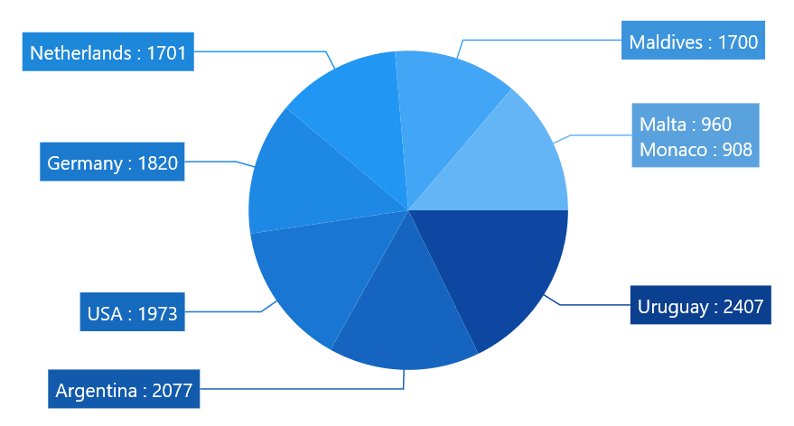

# Pie Series in WinUI Circular Chart

[PieSeries]() is divided into sectors, illustrating numerical proportion. The following code example illustrates the PieSeries.





<chart:PieSeries XBindingPath="Category" ItemsSource="{Binding Data}" YBindingPath="Value"/>





PieSeries series = new PieSeries()
{

    ItemsSource = new ViewModel().Data,

    XBindingPath = "Category",

    YBindingPath = "Value"

};

chart.Series.Add(series);





The rendering size of the PieSeries can be controlled using [`CircularCoefficient`]() property as in below code example.





<chart:PieSeries CircularCoefficient="0.9" XBindingPath="Category" ItemsSource="{Binding Data}" YBindingPath="Value"/>





PieSeries series = new PieSeries()
{

    ItemsSource = new ViewModel().Data,

    XBindingPath = "Category",

    YBindingPath = "Value",

    CircularCoefficient = 0.9

};

chart.Series.Add(series);





### Group small data points into “others”

The small segments in the pie chart can be grouped into the “others” category using the [GroupTo]() and [GroupMode]() properties of PieSeries.

The [GroupMode]() property is used to specify the grouping type based on slice [Angle](), actual data point [Value](), or [Percentage](), and the [GroupTo]() property is used to set the limit to group data points into a single slice. The grouped segment is labeled as “Others” in legend and toggled as other segment. The default value of the [GroupTo]() property is `double.NAN`, and the default value of the [GroupMode]() property is Value.

**Pie series without grouping**

**Pie series with grouping (Mode - Value)**





<chart:PieSeries ItemsSource="{Binding Data}" XBindingPath="Country" YBindingPath="Count" GroupMode="Value" GroupTo="1000">
    <chart:PieSeries.DataMarker>
        <chart:ChartDataMarker ShowConnectorLine="True" 
                                  ConnectorHeight="80" 
                                  ShowLabel="True" 
                                  LabelTemplate="{StaticResource DataLabelTemplate}"  
                                  SegmentLabelContent="LabelContentPath">
        </chart:ChartDataMarker>
    </chart:PieSeries.DataMarker>
</chart:PieSeries>





pieSeries.GroupMode = PieGroupMode.Value;
pieSeries.GroupTo = 1000;
ChartDataMarker datamarker = new ChartDataMarker()
{
    ShowConnectorLine = true,
    ShowLabel = true,
    ConnectorHeight = 80,
    LabelTemplate = this.RootGrid.Resources["DataLabelTemplate"] as DataTemplate,
    SegmentLabelContent = LabelContent.LabelContentPath,

pieSeries.DataMarker = datamarker;





**Pie series with grouping (Mode - Angle)**





<chart:PieSeries ItemsSource="{Binding Data}" XBindingPath="Country" YBindingPath="Count" GroupMode="Angle" GroupTo="30">
    <chart:PieSeries.DataMarker>
        <chart:ChartDataMarker ShowConnectorLine="True" 
                                  ConnectorHeight="80" 
                                  ShowLabel="True" 
                                  LabelTemplate="{StaticResource DataLabelTemplate}"  
                                  SegmentLabelContent="LabelContentPath">
        </chart:ChartDataMarker>
    </chart:PieSeries.DataMarker>
</chart:PieSeries>





pieSeries.GroupMode = PieGroupMode.Angle;
pieSeries.GroupTo = 30;

ChartDataMarker datamarker = new ChartDataMarker()
{
        ShowConnectorLine = true,
        ShowLabel = true,
        ConnectorHeight = 80,
        LabelTemplate = this.RootGrid.Resources["DataLabelTemplate"] as DataTemplate,
        SegmentLabelContent = LabelContent.LabelContentPath,
};

pieSeries.DataMarker = datamarker;





**Pie series with grouping (Mode - Percentage)**





<chart:PieSeries ItemsSource="{Binding Data}" XBindingPath="Country" YBindingPath="Count" GroupMode="Percentage" GroupTo="10">
    <chart:PieSeries.DataMarker>
        <chart:ChartDataMarker ShowConnectorLine="True" 
                                  ConnectorHeight="80" 
                                  ShowLabel="True" 
                                  LabelTemplate="{StaticResource DataLabelTemplate}"  
                                  SegmentLabelContent="LabelContentPath">
        </chart:ChartDataMarker>
    </chart:PieSeries.DataMarker>
</chart:PieSeries>





pieSeries.GroupMode = PieGroupMode.Percentage;
pieSeries.GroupTo = 10;

ChartDataMarker datamarker = new ChartDataMarker()
{
        ShowConnectorLine = true,
        ShowLabel = true,
        ConnectorHeight = 80,
        LabelTemplate = this.RootGrid.Resources["DataLabelTemplate"] as DataTemplate,
        SegmentLabelContent = LabelContent.LabelContentPath,
};

pieSeries.DataMarker = datamarker;





## Semi Pie

By using custom [StartAngle]() and [EndAngle]() properties, you can draw pie series in different shapes such as semicircular or quarter circular series.





<syncfusion:PieSeries StartAngle="180" EndAngle="360" XBindingPath="Utilization" YBindingPath="ResponseTime" ItemsSource="{Binding Data}"/>





PieSeries series = new PieSeries()
{

    ItemsSource = new ViewModel().Data,

    XBindingPath = "Utilization",

    YBindingPath = "ResponseTime",

    StartAngle = 180,

    EndAngle = 360

};

chart.Series.Add(series);





