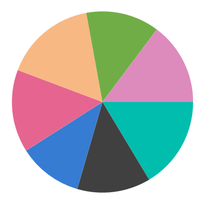
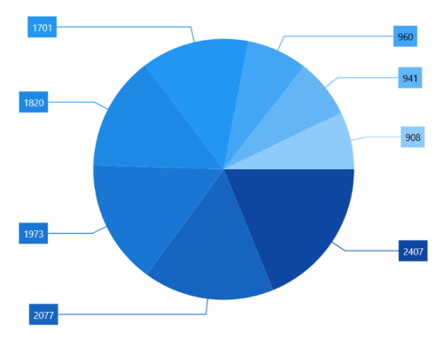
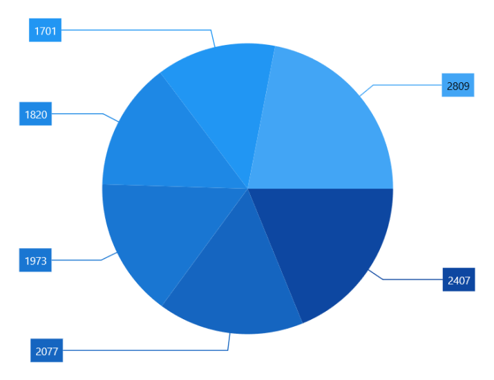
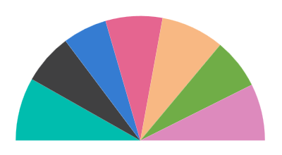

# Pie Chart in WinUI Chart (SfCircularChart)

To render a [PieSeries]() in circular chart, create an instance of the [PieSeries]() and add it to the [Series]() collection property of [SfCircularChart]().





<chart:SfCircularChart>

    <chart:SfCircularChart.Series>
        <chart:PieSeries ItemsSource="{Binding Data}" 
                         XBindingPath="Product" 
                         YBindingPath="SalesRate"/>
    </chart:SfCircularChart.Series>
        
</chart:SfCircularChart>





SfCircularChart chart = new SfCircularChart();

PieSeries series = new PieSeries();
series.XBindingPath = "Product";
series.YBindingPath = "SalesRate";

chart.Series.Add(series);





## Circular Coefficient

The rendering size of the [PieSeries]() can be controlled using the [CircularCoefficient]() property as shown in the following code sample.





<chart:SfCircularChart>

    <chart:SfCircularChart.Series>
        <chart:PieSeries ItemsSource="{Binding Data}" 
                         XBindingPath="Product" 
                         YBindingPath="SalesRate"
                         CircularCoefficient = "0.9"/>
    </chart:SfCircularChart.Series>
        
</chart:SfCircularChart>





SfCircularChart chart = new SfCircularChart();

PieSeries series = new PieSeries();
series.XBindingPath = "Product";
series.YBindingPath = "SalesRate";
series.CircularCoefficient = 0.9;

chart.Series.Add(series);





## Group small data points into “others”

The small segments in the pie chart can be grouped into the “others” category using the [GroupTo]() and [GroupMode]() properties of [PieSeries]().

* [GroupMode]() - used to specify the grouping type based on slice [Angle](), actual data point [Value](), or [Percentage](). 
* [GroupTo]() - used to set the limit to group data points into a single slice. The grouped segment is labeled as “Others” in legend and toggled as other segment. 

The default value of the [GroupTo]() property is `double.NAN`, and the default value of the [GroupMode]() property is Value.

**Pie series without grouping**

**Pie series with grouping (Mode - Value)**




<chart:SfCircularChart>

    <chart:SfCircularChart.Series>
        <chart:PieSeries ItemsSource="{Binding Data}" 
                     XBindingPath="Product" 
                     YBindingPath="SalesRate" ShowDataLabels="True"
                     GroupTo="1000" GroupMode="Value">
            <chart:PieSeries.DataLabelSettings>
                <chart:CircularDataLabelSettings ShowConnectorLine="True"
                          ConnectorHeight="80" 
                          Context="DataLabelItem"/>
            </chart:PieSeries.DataLabelSettings>
        </chart:PieSeries>
    </chart:SfCircularChart.Series>

</chart:SfCircularChart>





PieSeries series = new PieSeries();
series.GroupMode = PieGroupMode.Value;
series.GroupTo = 1000;
series.ShowDataLabels = true;
series.DataLabelSettings = new CircularDataLabelSettings()
{
    ShowConnectorLine = true,
    ConnectorHeight = 80,
    Context = LabelContext.DataLabelItem
};

chart.Series.Add(series);





## Semi Pie

By using the [StartAngle]() and [EndAngle]() properties, you can draw pie series in different shapes such as semi-pie or quarter pie series.





<chart:SfCircularChart>

    <chart:SfCircularChart.Series>
        <chart:PieSeries StartAngle="180" EndAngle="360" ItemsSource="{Binding Data}"
                     XBindingPath="Product" 
                     YBindingPath="SalesRate" ShowDataLabels="True"/>
    </chart:SfCircularChart.Series>

</chart:SfCircularChart>





SfCircularChart chart = new SfCircularChart();

PieSeries series = new PieSeries();
series.XBindingPath = "Product";
series.YBindingPath = "SalesRate";
series.StartAngle = 180;
series.EndAngle = 360;

chart.Series.Add(series);





## Combination Chart

[SfCircularChart]() allows you to render the combination of pie series and doughnut series.





<chart:SfCircularChart>
. . .
    <chart:SfCircularChart.Series>
        <chart:DoughnutSeries ItemsSource="{Binding Data}"  DoughnutCoefficient="0.5" XBindingPath="Demand" YBindingPath="Year2010"/>
                    
        <chart:PieSeries ItemsSource="{Binding Data}" CircularCoefficient="0.5" XBindingPath="Demand"  YBindingPath="Year2011"/>
    </chart:SfCircularChart.Series>

</chart:SfCircularChart>





SfCircularChart chart = new SfCircularChart();
. . .
DoughnutSeries series1 = new DoughnutSeries();
series1.SetBinding(DoughnutSeries.ItemsSourceProperty, new Binding() { Path = new PropertyPath("Data") });
series1.XBindingPath = "Demand";
series1.YBindingPath = "Year2010";
series1.DoughnutCoefficient = 0.5;

PieSeries series2 = new PieSeries();
series2.SetBinding(PieSeries.ItemsSourceProperty, new Binding() { Path = new PropertyPath("Data") });
series2.XBindingPath = "Demand";
series2.YBindingPath = "Year2011";
series2.CircularCoefficient = 0.5;

chart.Series.Add(series1);
chart.Series.Add(series2);





