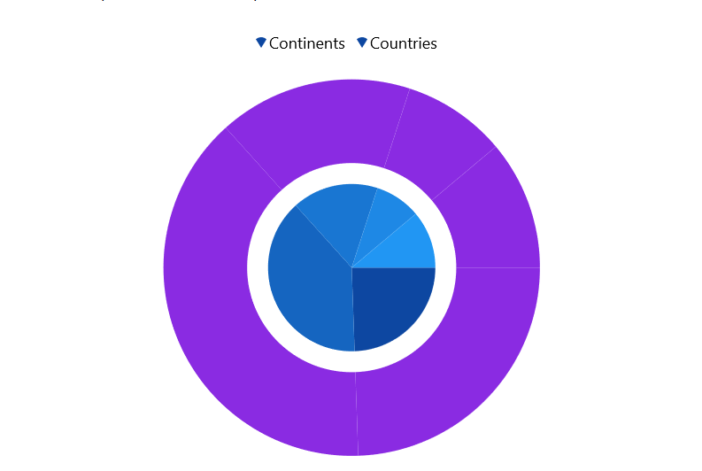
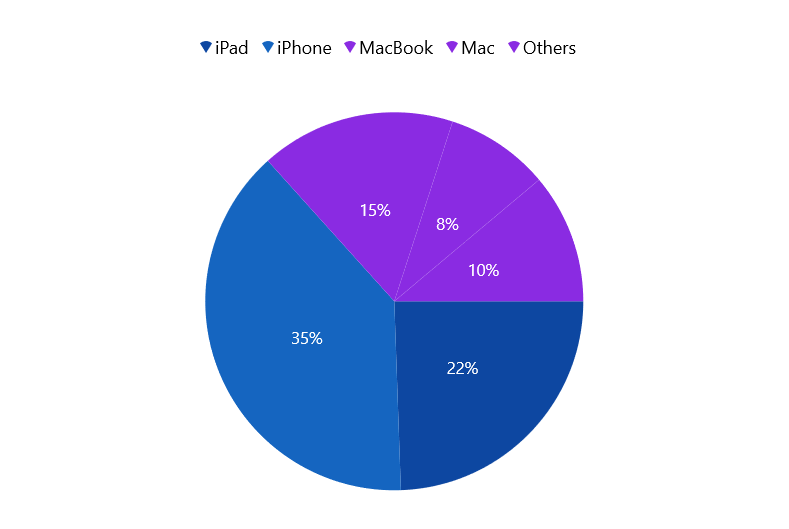

# Selection in WinUI Chart (SfCircularChart)

Circular chart supports selection that allows to select a segment in a series or series itself by using [ChartSelectionBehavior](). 

## Enable Selection

To enable the selection in chart, create an instance of [ChartSelectionBehavior]() and add it to the `Behaviors` collection of circular chart. And also need to set the [SelectionBrush]() property to highlight the segment in the series.





<chart:SfCircularChart>
    <chart:SfCircularChart.Behaviors>
        <chart:ChartSelectionBehavior />
    </chart:SfCircularChart.Behaviors>
<chart:SfCircularChart.Series>
    <chart:PieSeries SelectionBrush="BlueViolet"/>
</chart:SfCircularChart.Series>
</chart:SfCircularChart>





SfCircularChart chart = new SfCircularChart();

ChartSelectionBehavior selection = new ChartSelectionBehavior();
chart.Behaviors.Add(selection);

PieSeries series = new PieSeries();
series.SelectionBrush = new SolidColorBrush(Colors.BlueViolet);
chart.Series.Add(series);





## Series Selection

Series selection is used to highlight a particular series while using multiple series. Series selection is enable by setting [Type]() property value as [Series]() in [ChartSelectionBehavior](). The [SeriesSelectionBrush]() property is used to set the brush color to highlight the series.





<chart:SfCircularChart>
    <chart:SfCircularChart.Behaviors>
        <chart:ChartSelectionBehavior SeriesSelectionBrush="BlueViolet" Type="Series"/>
    </chart:SfCircularChart.Behaviors>
<chart:SfCircularChart.Series>
    <chart:PieSeries Label="Continents" />
    <chart:PieSeries Label="Countries" />
</chart:SfCircularChart.Series>

</chart:SfCircularChart.Series>




SfCircularChart chart = new SfCircularChart();

ChartSelectionBehavior selection = new ChartSelectionBehavior();
selection.Type = SelectionType.Series;
selection.SeriesSelectionBrush = new SolidColorBrush(Colors.BlueViolet);
chart.Behaviors.Add(selection);

PieSeries series = new PieSeries() { Label = "Continents" };
PieSeries series1 = new PieSeries() { Label = "Countries" };
. . .
chart.Series.Add(series);
chart.Series.Add(series1);





## Multi Selection

Circular chart allows to select single or multiple segment\series using [Type]() property. By default the [Type]() value is [Point]().

The following code snippet demonstrates multiple segment selection.





<chart:SfCircularChart>
. . .
    <chart:SfCircularChart.Behaviors>
        <chart:ChartSelectionBehavior Type="MultiPoint"/>
    </chart:SfCircularChart.Behaviors>

</chart:SfCircularChart>





SfCircularChart chart = new SfCircularChart();
. . .
ChartSelectionBehavior selection = new ChartSelectionBehavior();
selection.Type = SelectionType.MultiPoint;
chart.Behaviors.Add(selection);





## Events

The following events are available in chart (`SfCircularChart`).

### SelectionChanging

The [SelectionChanging]() event occurs before the data point is being selected. This is a cancelable event. This argument contains the following information.

* [SelectedSeries]() - Gets the series of the selected data point.
* [SelectedSegments]() - Gets or sets the segments collection of the selected series.
* [SelectedSegment]() - Gets the segment of the selected data point.
* [SelectedIndex]() - Gets the selected data point index.
* [PreviousSelectedIndex]() - Gets the previous selected data point index.
* [IsSelected]() - Gets a value that indicates whether the segment or series is selected.
* [IsDataPointSelection]() - Gets a value that indicates whether the selection is segment selection or series selection.
* [Cancel]() - Gets or Sets a value that indicates whether the selection should be canceled.

### SelectionChanged

The [SelectionChanged]() event occurs after a data point has been selected. This argument contains the following information.

* [SelectedSeries]() - Gets the series of the selected data point.
* [SelectedSegments]() - Gets the segments collection of the selected series.
* [SelectedSegment]() - Gets the segment of the selected data point.
* [SelectedIndex]() - Gets the selected data point index.
* [PreviousSelectedSeries]() - Gets the previous selected series.
* [PreviousSelectedSegments]() - Gets the segments collection of previous selected series.
* [PreviousSelectedSegment]() - Gets the segment of previous selected data point.
* [PreviousSelectedIndex]() - Gets the previous selected data point index.
* [OldPointInfo]() - Gets the previous selected segment item value.
* [NewPointInfo]() - Gets the selected segment item value.
* [IsSelected]() - Gets a value that indicates whether the segment or series is being selected.
* [IsDataPointSelection]() - Gets a value that indicates whether the selection is segment selection or series selection.
* [SelectedSeriesCollection]() - Gets the series collection that has been selected through rectangle selection or mouse interaction.