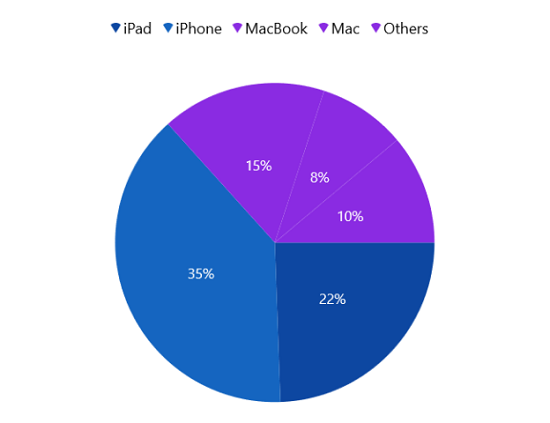

# Selection in WinUI Chart (SfCircularChart)

Circular chart supports selection that allows to select a segment in a series or series itself by using [ChartSelectionBehavior](https://help.syncfusion.com/cr/winui/Syncfusion.UI.Xaml.Charts.ChartSelectionBehavior.html). 

## Enable Selection

To enable the selection in chart, create an instance of [ChartSelectionBehavior](https://help.syncfusion.com/cr/winui/Syncfusion.UI.Xaml.Charts.ChartSelectionBehavior.html) and set it to the `SelectionBehavior` property of circular chart. And also need to set the [SelectionBrush](https://help.syncfusion.com/cr/winui/Syncfusion.UI.Xaml.Charts.AccumulationSeriesBase.html#Syncfusion_UI_Xaml_Charts_AccumulationSeriesBase_SelectionBrush) property to highlight the segment in the series.





<chart:SfCircularChart>

    <chart:SfCircularChart.SelectionBehavior>
        <chart:ChartSelectionBehavior />
    </chart:SfCircularChart.SelectionBehavior>

    <chart:SfCircularChart.Series>
        <chart:PieSeries SelectionBrush="BlueViolet"/>
    </chart:SfCircularChart.Series>
    
</chart:SfCircularChart>





SfCircularChart chart = new SfCircularChart();

ChartSelectionBehavior selection = new ChartSelectionBehavior();
chart.SelectionBehavior = selection;

PieSeries series = new PieSeries();
series.SelectionBrush = new SolidColorBrush(Colors.BlueViolet);
chart.Series.Add(series);





## Multi-selection

Circular chart allows to select single or multiple segment\series using [Type](https://help.syncfusion.com/cr/winui/Syncfusion.UI.Xaml.Charts.ChartSelectionBehavior.html#Syncfusion_UI_Xaml_Charts_ChartSelectionBehavior_Type) property. By default the [Type](https://help.syncfusion.com/cr/winui/Syncfusion.UI.Xaml.Charts.ChartSelectionBehavior.html#Syncfusion_UI_Xaml_Charts_ChartSelectionBehavior_Type) value is [Point](https://help.syncfusion.com/cr/winui/Syncfusion.UI.Xaml.Charts.SelectionType.html#Syncfusion_UI_Xaml_Charts_SelectionType_Point).





<chart:SfCircularChart>
. . .
    <chart:SfCircularChart.SelectionBehavior>
        <chart:ChartSelectionBehavior Type="MultiPoint"/>
    </chart:SfCircularChart.SelectionBehavior>

</chart:SfCircularChart>





SfCircularChart chart = new SfCircularChart();
. . .
ChartSelectionBehavior selection = new ChartSelectionBehavior();
selection.Type = SelectionType.MultiPoint;
chart.SelectionBehavior = selection;





## Events

The following events are available in chart [SfCircularChart](https://help.syncfusion.com/cr/winui/Syncfusion.UI.Xaml.Charts.SfCircularChart.html).

### SelectionChanging

The [SelectionChanging](https://help.syncfusion.com/cr/winui/Syncfusion.UI.Xaml.Charts.ChartBase.html#Syncfusion_UI_Xaml_Charts_ChartBase_SelectionChanging) event occurs before the data point is being selected. This is a cancelable event. This argument contains the following information.

* [SelectedSeries](https://help.syncfusion.com/cr/winui/Syncfusion.UI.Xaml.Charts.ChartSelectionChangingEventArgs.html#Syncfusion_UI_Xaml_Charts_ChartSelectionChangingEventArgs_SelectedSeries) - Gets the series of the selected data point.
* [SelectedSegments](https://help.syncfusion.com/cr/winui/Syncfusion.UI.Xaml.Charts.ChartSelectionChangingEventArgs.html#Syncfusion_UI_Xaml_Charts_ChartSelectionChangingEventArgs_SelectedSegments) - Gets or sets the segments collection of the selected series.
* [SelectedSegment](https://help.syncfusion.com/cr/winui/Syncfusion.UI.Xaml.Charts.ChartSelectionChangingEventArgs.html#Syncfusion_UI_Xaml_Charts_ChartSelectionChangingEventArgs_SelectedSegment) - Gets the segment of the selected data point.
* [SelectedIndex](https://help.syncfusion.com/cr/winui/Syncfusion.UI.Xaml.Charts.ChartSelectionChangingEventArgs.html#Syncfusion_UI_Xaml_Charts_ChartSelectionChangingEventArgs_SelectedIndex) - Gets the selected data point index.
* [PreviousSelectedIndex](https://help.syncfusion.com/cr/winui/Syncfusion.UI.Xaml.Charts.ChartSelectionChangingEventArgs.html#Syncfusion_UI_Xaml_Charts_ChartSelectionChangingEventArgs_PreviousSelectedIndex) - Gets the previous selected data point index.
* [IsDataPointSelection](https://help.syncfusion.com/cr/winui/Syncfusion.UI.Xaml.Charts.ChartSelectionChangingEventArgs.html#Syncfusion_UI_Xaml_Charts_ChartSelectionChangingEventArgs_IsDataPointSelection) - Gets a value that indicates whether the selection is segment selection or series selection.
* [Cancel](https://help.syncfusion.com/cr/winui/Syncfusion.UI.Xaml.Charts.ChartSelectionChangingEventArgs.html#Syncfusion_UI_Xaml_Charts_ChartSelectionChangingEventArgs_Cancel) - Gets or Sets a value that indicates whether the selection should be canceled.

### SelectionChanged

The [SelectionChanged](https://help.syncfusion.com/cr/winui/Syncfusion.UI.Xaml.Charts.ChartBase.html#Syncfusion_UI_Xaml_Charts_ChartBase_SelectionChanged) event occurs after a data point has been selected. This argument contains the following information.

* [SelectedSeries](https://help.syncfusion.com/cr/winui/Syncfusion.UI.Xaml.Charts.ChartSelectionChangedEventArgs.html#Syncfusion_UI_Xaml_Charts_ChartSelectionChangedEventArgs_SelectedSeries) - Gets the series of the selected data point.
* [SelectedSegments](https://help.syncfusion.com/cr/winui/Syncfusion.UI.Xaml.Charts.ChartSelectionChangedEventArgs.html#Syncfusion_UI_Xaml_Charts_ChartSelectionChangedEventArgs_SelectedSegments) - Gets the segments collection of the selected series.
* [SelectedSegment](https://help.syncfusion.com/cr/winui/Syncfusion.UI.Xaml.Charts.ChartSelectionChangedEventArgs.html#Syncfusion_UI_Xaml_Charts_ChartSelectionChangedEventArgs_SelectedSegment) - Gets the segment of the selected data point.
* [SelectedIndex](https://help.syncfusion.com/cr/winui/Syncfusion.UI.Xaml.Charts.ChartSelectionChangedEventArgs.html#Syncfusion_UI_Xaml_Charts_ChartSelectionChangedEventArgs_SelectedIndex) - Gets the selected data point index.
* [PreviousSelectedSeries](https://help.syncfusion.com/cr/winui/Syncfusion.UI.Xaml.Charts.ChartSelectionChangedEventArgs.html#Syncfusion_UI_Xaml_Charts_ChartSelectionChangedEventArgs_PreviousSelectedSeries) - Gets the previous selected series.
* [PreviousSelectedIndex](https://help.syncfusion.com/cr/winui/Syncfusion.UI.Xaml.Charts.ChartSelectionChangedEventArgs.html#Syncfusion_UI_Xaml_Charts_ChartSelectionChangedEventArgs_PreviousSelectedIndex) - Gets the previous selected data point index.
* [IsDataPointSelection](https://help.syncfusion.com/cr/winui/Syncfusion.UI.Xaml.Charts.ChartSelectionChangedEventArgs.html#Syncfusion_UI_Xaml_Charts_ChartSelectionChangedEventArgs_IsDataPointSelection) - Gets a value that indicates whether the selection is segment selection or series selection.
* [SelectedSeriesCollection](https://help.syncfusion.com/cr/winui/Syncfusion.UI.Xaml.Charts.ChartSelectionChangedEventArgs.html#Syncfusion_UI_Xaml_Charts_ChartSelectionChangedEventArgs_SelectedSeriesCollection) - Gets the series collection that has been selected through rectangle selection or mouse interaction.
