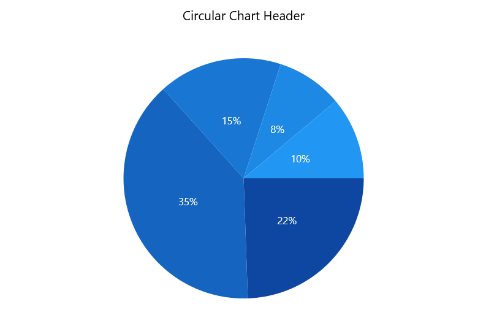
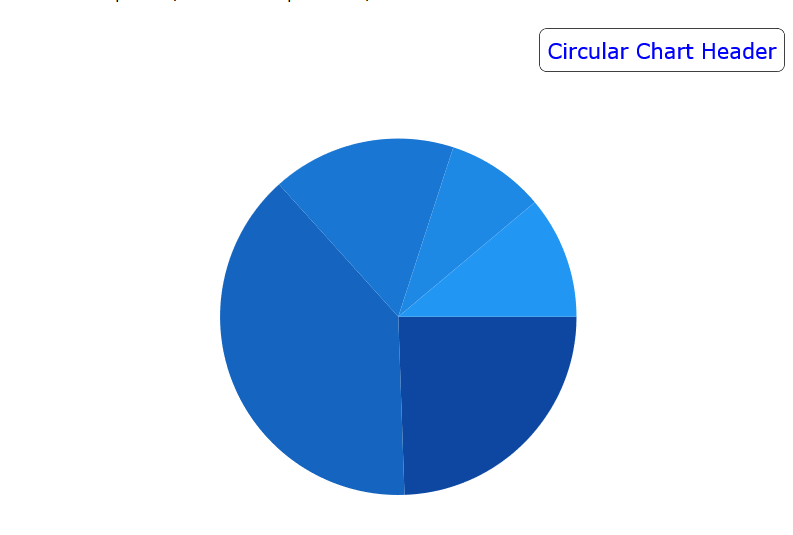

# Header in WinUI Circular Charts (SfCircularChart)

[Header]() property is used to define the title for the chart. This allows you to add any object (.Net object) as content for chart title. 





<chart:SfCircularChart Header="Circular Chart Header">
. . .
</chart:SfCircularChart>





SfCircularChart chart = new SfCircularChart();
chart.Header = "Circular Chart Header";





Header can be positioned left or right side of the chart using [HorizontalHeaderAlignment]() property.

Also you can add more customization for the header as below: 





<chart:SfCircularChart.Header>
    <Border BorderThickness="0.5" BorderBrush="Black" Margin="10" CornerRadius="5">
        <TextBlock Text="Circular Chart Header"
                   Margin="5" 
                   HorizontalTextAlignment="Center"
                   FontFamily="Verdana" FontSize="14" 
                   Foreground="Blue">
        </TextBlock>
    </Border>
</chart:SfCircularChart.Header>





Border border = new Border()
{
    BorderBrush = new SolidColorBrush(Colors.Black),
    Margin = new Thickness(10),
    CornerRadius = new CornerRadius(5)
};

TextBlock textBlock = new TextBlock()
{
    Text = "Circular Chart Header",
    HorizontalTextAlignment = TextAlignment.Center,
    FontFamily = new FontFamily("Verdana"),
    Foreground = new SolidColorBrush(Colors.Blue),
    FontSize = 25,
};

border.Child = textBlock;
chart.Header = border;





