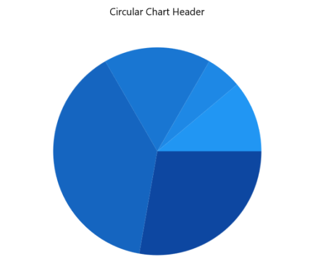
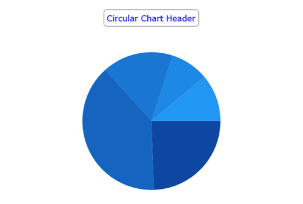
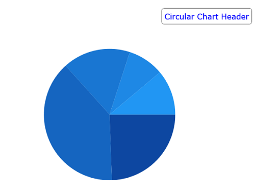

# Header in WinUI Charts (SfCircularChart)

`Header` property is used to define the title for the chart.

   



<chart:SfCircularChart x:Name="chart" Header="Circular Chart Header">
 . . .           
</chart:SfCircularChart>





SfCircularChart chart = new SfCircularChart();
chart.Header = "Circular Chart Header";
. . . 
this.Content = chart;



 

## Customization

`Header` property of `SfCircularChart` is used to define and customize the chart title. It accepts any object (.Net object) as content for the chart header.





<chart:SfCircularChart>
. . .
<chart:SfCircularChart.Header>
    <Border BorderThickness="0.5" BorderBrush="Black" Margin="10" CornerRadius="5">
        <TextBlock Text="Circular Chart Header"
                   Margin="5" 
                   FontFamily="Verdana" FontSize="14" 
                   Foreground="Blue">
        </TextBlock>
    </Border>
</chart:SfCircularChart.Header>

</chart:SfCircularChart>





SfCircularChart chart = new SfCircularChart();
Border border = new Border()
{
    BorderBrush = new SolidColorBrush(Colors.Black),
    Margin = new Thickness(10),
    CornerRadius = new CornerRadius(5)
};

TextBlock textBlock = new TextBlock()
{
    Text = "Circular Chart Header",
    FontFamily = new FontFamily("Verdana"),
    Foreground = new SolidColorBrush(Colors.Blue),
    FontSize = 25,
};

border.Child = textBlock;
chart.Header = border;





## Alignment

The title text content can be aligned horizontally to the left, center or right of the chart using the [HorizontalHeaderAlignment]() property of the `SfCircularChart`.





<chart:SfCircularChart x:Name="chart" 
                HorizontalHeaderAlignment="Right">

    <chart:SfCircularChart.Header>
        <Border BorderThickness="0.5" BorderBrush="Black" Margin="10" CornerRadius="5">
            <TextBlock Text="Circular Chart Header"
                   Margin="5" 
                   HorizontalTextAlignment="Center"
                   FontFamily="Verdana" FontSize="14" 
                   Foreground="Blue"/>
        </Border>
    </chart:SfCircularChart.Header>

</chart:SfCircularChart>





SfCircularChart chart = new SfCircularChart();
chart.HorizontalHeaderAlignment = HorizontalAlignment.Right;
. . .
Border border = new Border()
{
    BorderBrush = new SolidColorBrush(Colors.Black),
    Margin = new Thickness(10),
    CornerRadius = new CornerRadius(5)
};

TextBlock textBlock = new TextBlock()
{
    Text = "Circular Chart Header",
    HorizontalTextAlignment = TextAlignment.Center,
    FontFamily = new FontFamily("Verdana"),
    Foreground = new SolidColorBrush(Colors.Blue),
    FontSize = 25,
};

border.Child = textBlock;
chart.Header = border;





