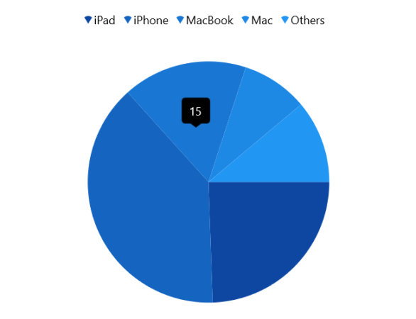
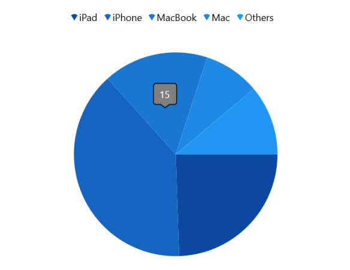
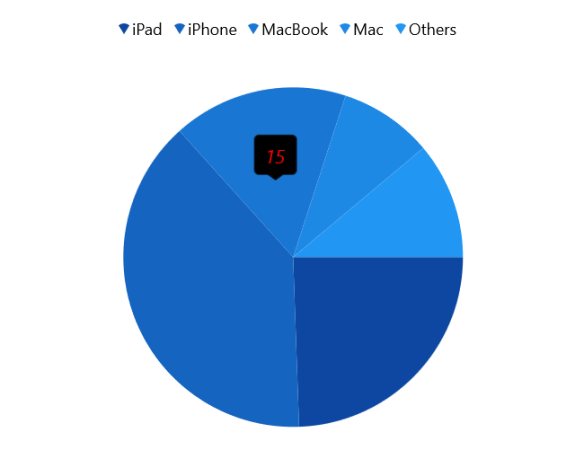
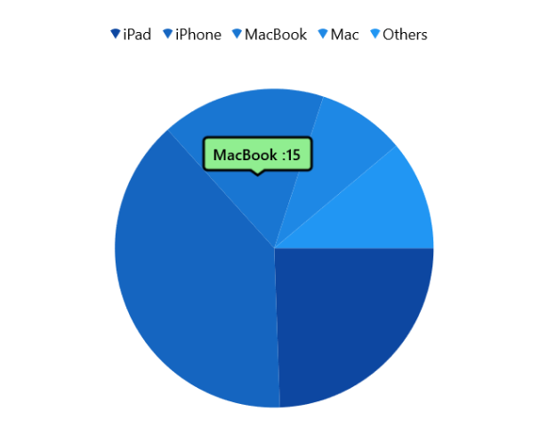

# Tooltip in WinUI Chart (SfCircularChart)

Tooltip is used to display any information over segments. It appears at center of the segment when the mouse hovers over any chart segment. It is set to display the metadata of the hovered segment or data point.

## Define Tooltip

To define the tooltip in the chart, set the [ShowTooltip]() property of series to true. The default value of [ShowTooltip]() property is false.





<chart:SfCircularChart>
. . .
    <chart:PieSeries ShowTooltip="True"
                     ItemsSource="{Binding Data}" 
                     ShowDataLabels="True" 
                     Palette="BlueChrome"
                     XBindingPath="Product" 
                     YBindingPath="SalesRate">
    </chart:PieSeries>

</chart:SfCircularChart>





SfCircularChart chart = new SfCircularChart();
. . .
PieSeries series = new PieSeries() { Label = "Continents" };
series.ShowTooltip = true;
chart.Series.Add(series);





The [ChartTooltipBehavior]() is used to customize the tooltip. For customizing the tooltip, create an instance [ChartTooltipBehavior]() and add it to the `Behaviors` collection of [SfCircularChart](). The following properties are used to customize the tooltip:

* [Style]() - Used to customize the fill and stroke of the tooltip.
* [LabelStyle]() - Used to customize the tooltip label.
* [HorizontalAlignment]() - Used to align the tooltip label at the left, right and center of the data point position or cursor position horizontally.
* [VerticalAlignment]() - Used to align the tooltip label at the top, center and bottom of the data point position or cursor position vertically.
* [HorizontalOffset]() - Used to position the tooltip at a distance from the data point or cursor position horizontally.
* [VerticalOffset]() - Used to position the tooltip at a distance from the data point or cursor position vertically.
* [ShowDuration]() - Used to set the amount of time that the tooltip remains visible in milliseconds.
* [EnableAnimation]() - Used to enable the animation when showing the tooltip.
* [InitialShowDelay]() - Used to delay the display of the tooltip in milliseconds after the user interacts with the series.





<chart:SfCircularChart>
. . .
<chart:SfCircularChart.Behaviors>
    <chart:ChartTooltipBehavior/>
</chart:SfCircularChart.Behaviors>

</chart:SfCircularChart>





SfCircularChart chart = new SfCircularChart();
. . .
ChartTooltipBehavior tooltip = new ChartTooltipBehavior();
chart.Behaviors.Add(tooltip);





## Background Style

The tooltip's fill and stroke color can be customized by using the [Style]() property. To define a [Style]() for tooltip, specify the style of `TargetType` as `Path`.





<chart:SfCircularChart>
. . .
<chart:SfCircularChart.Resources>
    
</chart:SfCircularChart.Resources>

<chart:SfCircularChart.Behaviors>
    <chart:ChartTooltipBehavior Style="{StaticResource style}"/>
</chart:SfCircularChart.Behaviors>

</chart:SfCircularChart>





SfCircularChart chart = new SfCircularChart();
. . .
Style style = new Style(typeof(Path));
style.Setters.Add(new Setter(Path.StrokeProperty, new SolidColorBrush(Colors.Black)));
style.Setters.Add(new Setter(Path.FillProperty, new SolidColorBrush(Colors.Gray)));
. . .
ChartTooltipBehavior tooltip = new ChartTooltipBehavior();
tooltip.Style = style;
. . . 
chart.Behaviors.Add(tooltip);





## Label Style

The tooltip label style can be customized by using the [LabelStyle]() property. To define a [Style]() for the tooltip label, specify the style of `TargetType` as `TextBlock`.





<chart:SfCircularChart>
. . .
<chart:SfCircularChart.Resources>
    
</chart:SfCircularChart.Resources>

<chart:SfCircularChart.Behaviors>
    <chart:ChartTooltipBehavior LabelStyle="{StaticResource labelStyle}"/>
</chart:SfCircularChart.Behaviors>

</chart:SfCircularChart>





SfCircularChart chart = new SfCircularChart();
. . .
Style labelStyle = new Style(typeof(TextBlock));
labelStyle.Setters.Add(new Setter(TextBlock.FontSizeProperty, 14d));
labelStyle.Setters.Add(new Setter(TextBlock.FontStyleProperty, FontStyles.Italic));
labelStyle.Setters.Add(new Setter(TextBlock.ForegroundProperty, new SolidColorBrush(Colors.Red)));
...
ChartTooltipBehavior tooltip = new ChartTooltipBehavior();
tooltip.LabelStyle = labelStyle;
. . .
chart.Behaviors.Add(tooltip);





## Template

Circular chart provides support to customize the appearance of the tooltip by using the [`TooltipTemplate`]() property. 





<chart:SfCircularChart>
. . .
    <chart:SfCircularChart.Resources>
        <DataTemplate x:Key="tooltipTemplate">
            <StackPanel Orientation="Horizontal">
                <TextBlock Text="{Binding Item.Product}" Foreground="Black" FontWeight="Medium" FontSize="12" HorizontalAlignment="Center" VerticalAlignment="Center"/>
                <TextBlock Text=" : " Foreground="Black" FontWeight="Medium" FontSize="12" HorizontalAlignment="Center" VerticalAlignment="Center"/>
                <TextBlock Text="{Binding Item.SalesRate}" Foreground="Black" FontWeight="Medium" FontSize="12" HorizontalAlignment="Center" VerticalAlignment="Center"/>
            </StackPanel>
        </DataTemplate>
    </chart:SfCircularChart.Resources>

    <chart:SfCircularChart.Series>
        <chart:PieSeries ShowTooltip="True"
                 ItemsSource="{Binding Data}" 
                 Palette="BlueChrome"
                 XBindingPath="Product" 
                 YBindingPath="SalesRate"
                 TooltipTemplate="{StaticResource tooltipTemplate}"/>
    </chart:SfCircularChart.Series>
    . . .
</chart:SfCircularChart>





SfCircularChart chart = new SfCircularChart();
. . .
PieSeries series = new PieSeries();
series.ShowTooltip = true;
series.TooltipTemplate = chart.Resources["tooltipTemplate"] as DataTemplate;
. . .     




