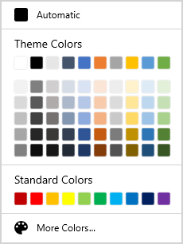
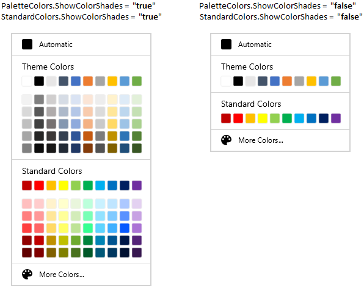
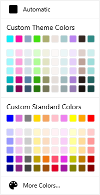

# Getting Started with WinUI ColorPalette (SfColorPalette)

This section explains the steps required to add the [ColorPalette](https://help.syncfusion.com/cr/winUI/Syncfusion.UI.Xaml.Editors.SfColorPalette.html) control and its various color options. This section covers only basic features needed to get started with Syncfusion `ColorPalette` control.

## Control Structure

* The Selected Color represents the color that you select.

* The Automatic Color represents the Color, which can be set by you as default color.

* The ToolTip with Color Details represents the ToolTip, when the mouse hovers on the Color.

* The Standard Colors stores the standard colors like `Red`, `Green`, `Blue` and so on.

* The Recently User Colors stores the Colors that are recently selected.

* The No Color represents the `Transparent` color that applied as the selected color. 

* The More Colors Option provides wide range of color in addition to colors in the palette.

* The Theme Variant Colors represents the Theme colors with variants.

### More Color Dialog

## Creating an application with WinUI ColorPalette

1. Create a simple project using the instructions given in the [Getting Started with your first WinUI app](https://docs.microsoft.com/en-us/windows/apps/winui/winui3/get-started-winui3-for-uwp) documentation.

2. Add reference to [Syncfusion.Editors.WinUI](https://www.nuget.org/packages/Syncfusion.Editors.WinUI) NuGet. 

3. Import the control namespace `Syncfusion.UI.Xaml.Editors` in XAML or C# code.

4. Initialize the `SfColorPalette` control.



<Page
    x:Class="GettingStarted.MainPage"
    xmlns="http://schemas.microsoft.com/winfx/2006/xaml/presentation"
    xmlns:x="http://schemas.microsoft.com/winfx/2006/xaml"
    xmlns:local="using:GettingStarted"
    xmlns:d="http://schemas.microsoft.com/expression/blend/2008"
    xmlns:mc="http://schemas.openxmlformats.org/markup-compatibility/2006"
    xmlns:syncfusion="using:Syncfusion.UI.Xaml.Editors"
    mc:Ignorable="d"
    Background="{ThemeResource ApplicationPageBackgroundThemeBrush}">
    <Grid Name="grid">
        <!--Adding ColorPalette control -->
        <syncfusion:SfColorPalette Name="colorPalette"/>
    </Grid>
</Page>




using Syncfusion.UI.Xaml.Editors;

namespace GettingStarted
{
    /// 

    /// An empty page that can be used on its own or navigated to within a Frame.
    /// 

    public sealed partial class MainPage : Page
    {
        public MainPage()
        {
            this.InitializeComponent();
            // Creating an instance of the ColorPalette control
            SfColorPalette colorPalette = new SfColorPalette();
            grid.Children.Add(colorPalette);
        }
    }
}




N> Download demo application from [GitHub](https://github.com/SyncfusionExamples/syncfusion-winui-colorpalette-examples/blob/master/Samples/ColorPalette_features)

## Accessing a Color programmatically

You can set or change the selected color of the `ColorPalette` programmatically by setting the value to [SelectedBrush](https://help.syncfusion.com/cr/winUI/Syncfusion.UI.Xaml.Editors.SfColorPalette.html#Syncfusion_UI_Xaml_Editors_SfColorPalette_SelectedBrush) property. You can also get the selected color by using the `SelectedBrush` property. The default value of `SelectedBrush` property is `Transparent(#00FFFFFF)`.




<Button Background="{Binding ElementName=colorPalette, Path=SelectedBrush}"></Button>

<syncfusion:SfColorPalette SelectedBrush="Yellow"
                           Name="colorPalette" />




colorPalette.SelectedBrush = new SolidColorBrush(Colors.Yellow);




Here, `Yellow` color is selected color in the `ColorPalette`.

N> Download demo application from [GitHub](https://github.com/SyncfusionExamples/syncfusion-winui-colorpalette-examples/blob/master/Samples/ColorPalette_features)

## Select color from color palette

You can select a different colors from Theme Color and Standard Color panels. You can show or hide the variant colors of the base Theme Colors and Standard Colors by using the `PaletteColors.ShowColorShades`  and `StandardColors.ShowColorShades` properties value as `true` or `false`.




<syncfusion:SfColorPalette Name="colorPalette">
    <syncfusion:SfColorPalette.PaletteColors>
        <syncfusion:ColorPaletteModel ShowColorShades="True"/>
    </syncfusion:SfColorPalette.PaletteColors>
    <syncfusion:SfColorPalette.StandardColors>
        <syncfusion:StandardPaletteModel ShowColorShades="True"/>
    </syncfusion:SfColorPalette.StandardColors>
</syncfusion:SfColorPalette>




colorPalette.PaletteColors.ShowColorShades = true;
colorPalette.StandardColors.ShowColorShades = true;




N> Download demo application from [GitHub](https://github.com/SyncfusionExamples/syncfusion-winui-colorpalette-examples/blob/master/Samples/ColorPalette_features)

## Add your own color in the Theme and Standard color palette

If you want to apply custom colors for base Theme Colors and Standard Colors palette, add the colors into the `PaletteColors.Colors` and `StandardColors.Colors` collections. The variant colors will be automatically created for the own Theme and Standard Colors.




<syncfusion:SfColorPalette Name="colorPalette">
    <syncfusion:SfColorPalette.PaletteColors>
        <syncfusion:ColorPaletteModel ShowColors="True" 
                                      ShowColorShades="True"
                                      Header="Custom Theme Colors" >
            <syncfusion:ColorPaletteModel.Colors>
                <syncfusion:ColorCollection>
                    <syncfusion:ColorModel Color="#FF11EBF8" Tooltip="Custom Aqua" />
                    <syncfusion:ColorModel Color="#FFF80FA6" Tooltip="Custom Deep Pink" />
                    <syncfusion:ColorModel Color="#FF8BA7C2" Tooltip="Custom Dark Gray" />
                    <syncfusion:ColorModel Color="#F53CDF07" Tooltip="Custom Lime Green" />
                    <syncfusion:ColorModel Color="#C2929545" Tooltip="Custom Olive Drab" />
                    <syncfusion:ColorModel Color="#2E956145" Tooltip="Custom Sienna" />
                    <syncfusion:ColorModel Color="#78458E95" Tooltip="Custom Steel Blue" />
                    <syncfusion:ColorModel Color="#8B8220E4" Tooltip="Custom Blue Violet" />
                    <syncfusion:ColorModel Color="#FF352722" Tooltip="Custom Dark Slate Gray" />
                    <syncfusion:ColorModel Color="#FF318B86" Tooltip="Custom Sea Green" />
                </syncfusion:ColorCollection>
            </syncfusion:ColorPaletteModel.Colors>                        
        </syncfusion:ColorPaletteModel>
    </syncfusion:SfColorPalette.PaletteColors> 

    <syncfusion:SfColorPalette.StandardColors>
        <syncfusion:StandardPaletteModel ShowColors="True" 
                                         ShowColorShades="True"
                                         Header="Custom Standard Colors" >
            <syncfusion:StandardPaletteModel.Colors>
                <syncfusion:ColorCollection>
                    <syncfusion:ColorModel Color = "Blue" Tooltip = "Custom Blue" />
                    <syncfusion:ColorModel Color = "Orchid" Tooltip = "Custom Orchid" />
                    <syncfusion:ColorModel Color = "Gray" Tooltip = "Custom Gray" />
                    <syncfusion:ColorModel Color = "Gold" Tooltip = "Custom Gold" />
                    <syncfusion:ColorModel Color = "SandyBrown" Tooltip = "Custom SandyBrown" />
                    <syncfusion:ColorModel Color = "Pink" Tooltip = "Custom Pink" />
                    <syncfusion:ColorModel Color = "Violet" Tooltip = "Custom Violet" />
                    <syncfusion:ColorModel Color = "Yellow" Tooltip = "Custom Yellow" />
                    <syncfusion:ColorModel Color = "Orange" Tooltip = "Custom Orange" />
                    <syncfusion:ColorModel Color = "Red" Tooltip = "Custom Red" />
                </syncfusion:ColorCollection>
            </syncfusion:StandardPaletteModel.Colors>                        
        </syncfusion:StandardPaletteModel>
    </syncfusion:SfColorPalette.StandardColors>    
</syncfusion:SfColorPalette>




colorPalette.PaletteColors.Header = "Custom Theme Colors";
colorPalette.PaletteColors.ShowColors = true;
colorPalette.PaletteColors.ShowColorShades = true;

colorPalette.StandardColors.Header = "Custom Standard Colors";
colorPalette.StandardColors.ShowColors = true;
colorPalette.StandardColors.ShowColorShades = true;




N> Download demo application from [GitHub](https://github.com/SyncfusionExamples/syncfusion-winui-colorpalette-examples/blob/master/Samples/Custom-Colors)

## Choosing a color from MoreColor dialog

If you want to choose a color that is not available in palette, click the more color button and select the color from color spectrum and click the `Ok` button. 




<syncfusion:SfColorPalette ShowMoreColorsButton="true"
                           Name="colorPalette"/>




colorPalette.ShowMoreColorsButton = true;




N> Download demo application from [GitHub](https://github.com/SyncfusionExamples/syncfusion-winui-colorpalette-examples/blob/master/Samples/ColorPalette_features)

## Recently used color items

 If you want to choose a color brush which are recently selected from the `More Colors` dialog, use the `Recent Colors` panel. You can get the recently used color list from the [RecentColors](https://help.syncfusion.com/cr/winUI/Syncfusion.UI.Xaml.Editors.SfColorPalette.html#Syncfusion_UI_Xaml_Editors_SfColorPalette_RecentColors) collection.

N> Colors selected from theme and standard colors will not be added in recent colors.




<syncfusion:SfColorPalette Name="colorPalette"/>




//Getting the recently used color list
var recentColors = colorPalette.RecentColors;




## Reset the selected color

If you want to reset the selected color as `No color` or `Transparent`, click the `No Color` button. You can display the
 `No color` button only by setting the [ShowNoColorButton](https://help.syncfusion.com/cr/winUI/Syncfusion.UI.Xaml.Editors.SfColorPalette.html#Syncfusion_UI_Xaml_Editors_SfColorPalette_ShowNoColorButton) property value as `true`. The default value of `ShowNoColorButton` property is `false`. 




<syncfusion:SfColorPalette ShowNoColorButton="True"
                           Name="colorPalette"/>




colorPalette.ShowNoColorButton = true;




N> Download demo application from [GitHub](https://github.com/SyncfusionExamples/syncfusion-winui-colorpalette-examples/blob/master/Samples/ColorPalette_features)

## Selected color brush changed notification

You will be notified when selected color brush changed in `ColorPalette` by using [SelectedBrushChanged](https://help.syncfusion.com/cr/winUI/Syncfusion.UI.Xaml.Editors.SfColorPalette.html#Syncfusion_UI_Xaml_Editors_SfColorPalette_SelectedBrushChanged) event. The `SelectedBrushChanged` event contains the old and newly selected color values in the [OldBrush](https://help.syncfusion.com/cr/winUI/Syncfusion.UI.Xaml.Editors.SelectedBrushChangedEventArgs.html#Syncfusion_UI_Xaml_Editors_SelectedBrushChangedEventArgs_OldBrush) and [NewBrush](https://help.syncfusion.com/cr/winUI/Syncfusion.UI.Xaml.Editors.SelectedBrushChangedEventArgs.html#Syncfusion_UI_Xaml_Editors_SelectedBrushChangedEventArgs_NewBrush) properties.




<syncfusion:SfColorPalette SelectedBrushChanged="ColorPalette_SelectedBrushChanged"
                           Name="colorPalette" />




colorPalette.SelectedBrushChanged += ColorPalette_SelectedBrushChanged;




You can handle the event as follows,




//Invoked when the selected color is changed
private void ColorPalette_SelectedBrushChanged(object sender, SelectedBrushChangedEventArgs e) {
    var oldBrush= e.OldBrush;
    var newBrush= e.NewBrush;
}



