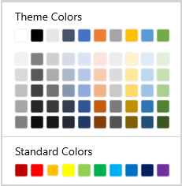

## Choosing a color from MoreColors dialog in WinUI ColorPalette

In addition to colors in `Theme colors` and `Standard colors`, `MoreColor` feature allows you to select wide range of color options from the WinUI [ColorPalette](https://help.syncfusion.com/cr/winUI/Syncfusion.UI.Xaml.Editors.SfColorPalette.html). You can select any custom color with various opacity level based on requirement.

## Select a color from MoreColor dialog

If you wants any custom colors to select with various opacity level, click the more color button and select the color from color spectrum and then click the `Ok` button. 




<editors:SfColorPalette ShowMoreColorsButton="true"
                        Name="colorPalette"/>




colorPalette.ShowMoreColorsButton = true;




N> Download demo application from [GitHub](https://github.com/SyncfusionExamples/syncfusion-winui-colorpalette-examples/blob/master/Samples/ColorPalette_features)

## Hide more color option

If you want to restrict the user to select the color from `MoreColor` dialog, hide the `MoreColor` button by using [ShowMoreColorsButton](https://help.syncfusion.com/cr/winUI/Syncfusion.UI.Xaml.Editors.SfColorPalette.html#Syncfusion_UI_Xaml_Editors_SfColorPalette_ShowMoreColorsButton) property value as `false`. The default value of `ShowMoreColorsButton` property is `true`.




<editors:SfColorPalette ShowMoreColorsButton="False"
                        Name="colorPalette" />




colorPalette.ShowMoreColorsButton = false;




N> Download demo application from [GitHub](https://github.com/SyncfusionExamples/syncfusion-winui-colorpalette-examples/blob/master/Samples/ColorPalette_features)
