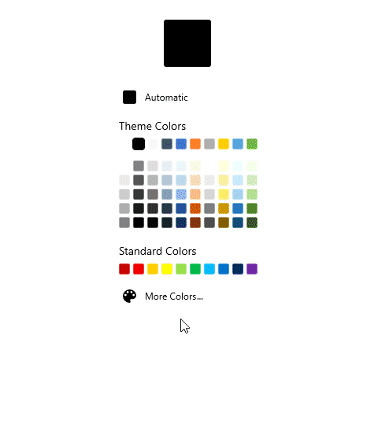
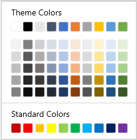

# More Colors in WinUI Color Palette control

This section explains the different more color options available in the [Color Palette](https://help.syncfusion.com/cr/winUI/Syncfusion.UI.Xaml.Editors.SfColorPalette.html) and how to choose the colors and its panel customizations.

## Choosing a color from More Colors dialog in WinUI Color Palette

In addition to colors in `Theme colors` and `Standard colors`, the `More Colors` feature allows you to select a wide range of color options from the WinUI [Color Palette](https://help.syncfusion.com/cr/winUI/Syncfusion.UI.Xaml.Editors.SfColorPalette.html). You can select any custom color with various opacity levels based on requirement.

## Select a color from More Colors dialog

If you want any custom colors to be selected with various opacity levels, click the more color button and select the color from color spectrum and then click the `Ok` button. 




<editors:SfColorPalette ShowMoreColorsButton="true"
                        Name="colorPalette"/>




colorPalette.ShowMoreColorsButton = true;




N> Download demo application from [GitHub](https://github.com/SyncfusionExamples/syncfusion-winui-colorpalette-examples/blob/master/Samples/ColorPalette_features)

## Hide More Colors option

If you want to restrict the user from selecting the color from `More Colors` dialog, hide the `More Colors` button by setting [ShowMoreColorsButton](https://help.syncfusion.com/cr/winUI/Syncfusion.UI.Xaml.Editors.SfColorPalette.html#Syncfusion_UI_Xaml_Editors_SfColorPalette_ShowMoreColorsButton) property value as `false`. The default value of `ShowMoreColorsButton` property is `true`.




<editors:SfColorPalette ShowMoreColorsButton="False"
                        Name="colorPalette" />




colorPalette.ShowMoreColorsButton = false;




N> Download demo application from [GitHub](https://github.com/SyncfusionExamples/syncfusion-winui-colorpalette-examples/blob/master/Samples/ColorPalette_features)
