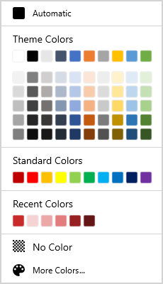

# WinUI Color Palette Overview

The [WinUI Color Palette](https://www.syncfusion.com/winui-controls/color-palette) control provides a rich visual interface for color selection. Its provides standard colors and the various theme colors to choose.  The control also has a `ToolTip` support which bears the name of the color. More color options are embedded with the control that provides you with a wide range of color options.

## Key features

* Theme base and its variant colors support.
* Standard base and its variant support.
* Automatic color support.
* More color selection support.
* Theme and standard panel customization support.
* No color option to selected a transparent color.
* Supports ToolTip to show the selected color while hover on the color item.