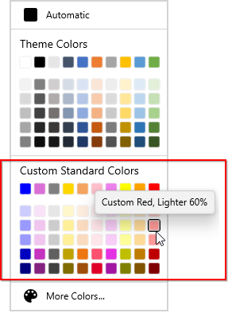
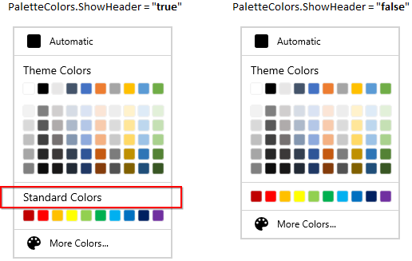

# Select Standard colors in WinUI ColorPalette (SfColorPalette)

This section explains the different standard colors available in the [ColorPalette](https://help.syncfusion.com/cr/winUI/Syncfusion.UI.Xaml.Editors.SfColorPalette.html) and  how to choose the colors and its panel customizations.

## Select a color from built-in standard colors

You can select a various standard colors with its variants by using the Standard Colors palette. 




<editors:SfColorPalette Name="colorPalette" />




SfColorPalette colorPalette= new SfColorPalette();




N> Download demo application from [GitHub](https://github.com/SyncfusionExamples/syncfusion-winui-colorpalette-examples/blob/master/Samples/ColorPalette_features)

## Add your own custom colors in standard color palette

If you want to allow the user to select a color from own standard colors, add that color with its name and tooltip text into the `StandardColors.Colors` collection using the [ColorModel](https://help.syncfusion.com/cr/winUI/Syncfusion.UI.Xaml.Editors.ColorModel.html). It will generates color variants automatically. You can also customize the header text and show or hide its variants by using the [StandardPaletteModel](https://help.syncfusion.com/cr/winUI/Syncfusion.UI.Xaml.Editors.StandardPaletteModel.html).   




<editors:SfColorPalette Name="ColorPalette">
    <editors:SfColorPalette.StandardColors>
        <editors:StandardPaletteModel ShowColors="True" 
                                      ShowColorShades="True"
                                      Header="Custom Standard Colors" >
            <editors:StandardPaletteModel.Colors>
                <editors:ColorCollection>
                    <editors:ColorModel Color = "Blue" Tooltip = "Custom Blue" />
                    <editors:ColorModel Color = "Orchid" Tooltip = "Custom Orchid" />
                    <editors:ColorModel Color = "Gray" Tooltip = "Custom Gray" />
                    <editors:ColorModel Color = "Gold" Tooltip = "Custom Gold" />
                    <editors:ColorModel Color = "SandyBrown" Tooltip = "Custom SandyBrown" />
                    <editors:ColorModel Color = "Pink" Tooltip = "Custom Pink" />
                    <editors:ColorModel Color = "Violet" Tooltip = "Custom Violet" />
                    <editors:ColorModel Color = "Yellow" Tooltip = "Custom Yellow" />
                    <editors:ColorModel Color = "Orange" Tooltip = "Custom Orange" />
                    <editors:ColorModel Color = "Red" Tooltip = "Custom Red" />
                </editors:ColorCollection>
            </editors:StandardPaletteModel.Colors>                        
        </editors:StandardPaletteModel>
    </editors:SfColorPalette.StandardColors>    
</editors:SfColorPalette>




ColorCollection colors = new ColorCollection();
colors.Add(new ColorModel() { Color = Colors.Blue, Tooltip= "Custom Blue" });
colors.Add(new ColorModel() { Color = Colors.Orchid, Tooltip = "Custom Orchid" });
colors.Add(new ColorModel() { Color = Colors.Gray, Tooltip = "Custom Gray" });
colors.Add(new ColorModel() { Color = Colors.Gold, Tooltip = "Custom Gold" });
colors.Add(new ColorModel() { Color = Colors.SandyBrown, Tooltip = "Custom SandyBrown" });
colors.Add(new ColorModel() { Color = Colors.Pink, Tooltip = "Custom Pink" });
colors.Add(new ColorModel() { Color = Colors.Violet, Tooltip = "Custom Violet" });
colors.Add(new ColorModel() { Color = Colors.Yellow, Tooltip = "Custom Yellow" });
colors.Add(new ColorModel() { Color = Colors.Orange, Tooltip = "Custom Orange" });
colors.Add(new ColorModel() { Color = Colors.Red, Tooltip = "Custom Red" });

ColorPalette.StandardColors.Colors = colors;
ColorPalette.StandardColors.Header = "Custom Standard Colors";
ColorPalette.StandardColors.ShowColors = true;
ColorPalette.StandardColors.ShowColorShades = true;




N> Download demo application from [GitHub](https://github.com/SyncfusionExamples/syncfusion-winui-colorpalette-examples/blob/master/Samples/Custom-Colors)

## Show standard color variants

By default, you can select only the standard color without its variants. If you want allow the user to select standard color with its variant colors, use the `StandardColors.ShowColorShades` property value as `true`. The default value of `StandardColors.StandardColors` property is `false`. 




<editors:SfColorPalette Name="colorPalette">
    <editors:SfColorPalette.StandardColors>
        <editors:StandardPaletteModel ShowColorShades="True"/>
    </editors:SfColorPalette.StandardColors>
</editors:SfColorPalette>




colorPalette.StandardColors.ShowColorShades = true;




N> Download demo application from [GitHub](https://github.com/SyncfusionExamples/syncfusion-winui-colorpalette-examples/blob/master/Samples/ColorPalette_features)

## Hide standard colors

If you want hide to the standard color and its variants, use the `StandardColors.ShowColorShades` and `StandardColors.ShowColors` properties value as `false`. The default value of `StandardColors.ShowColors` property is `true`. 




<editors:SfColorPalette Name="colorPalette">
    <editors:SfColorPalette.StandardColors>
        <editors:StandardPaletteModel ShowColors="False" 
                                      ShowColorShades="False"/>
    </editors:SfColorPalette.StandardColors>
</editors:SfColorPalette>




colorPalette.StandardColors.ShowColors = false;
colorPalette.StandardColors.ShowColorShades = false;




N> Download demo application from [GitHub](https://github.com/SyncfusionExamples/syncfusion-winui-colorpalette-examples/blob/master/Samples/ColorPalette_features)

## Change standard color palette header text

If you want to change header text of the standard color palette, use the `StandardColors.Header` property. The default value of `StandardColors.Header` property is `Standard Colors`.




<editors:SfColorPalette Name="colorPalette">
    <editors:SfColorPalette.StandardColors>
        <editors:StandardPaletteModel Header="My standard colors"/>
    </editors:SfColorPalette.StandardColors>
</editors:SfColorPalette>




colorPalette.StandardColors.Header = "My standard colors";




N> Download demo application from [GitHub](https://github.com/SyncfusionExamples/syncfusion-winui-colorpalette-examples/blob/master/Samples/Custom-Colors)

### Hide standard color palette header

If you want to hide header of the standard color palette, use the `StandardColors.ShowHeader` property. The default value of `StandardColors.ShowHeader` property is `true`.




<editors:SfColorPalette Name="ColorPalette">
    <editors:SfColorPalette.StandardColors>
        <editors:StandardPaletteModel ShowHeader="False"/>
    </editors:SfColorPalette.StandardColors>
</editors:SfColorPalette>




colorPalette.StandardColors.ShowHeader = false;




N> Download demo application from [GitHub](https://github.com/SyncfusionExamples/syncfusion-winui-colorpalette-examples/blob/master/Samples/ColorPalette_features)

### Custom UI for standard color palette header 

You can change the appearance of standard color palette header by using the `StandardColors.HeaderTemplate` property. 

N> The DataContext of `StandardColors.HeaderTemplate` is `StandardColors.Header`




<editors:SfColorPalette Name="colorPalette">
    <editors:SfColorPalette.StandardColors>
        <editors:StandardPaletteModel >
            <editors:StandardPaletteModel.HeaderTemplate>
                <DataTemplate>
                    <Grid Background="LightBlue">
                        <TextBlock HorizontalAlignment="Center"
                                   VerticalAlignment="Center"
                                   Text="{Binding}"
                                   FontWeight="Bold" 
                                   Foreground="Red"/>
                    </Grid>
                </DataTemplate>
            </editors:StandardPaletteModel.HeaderTemplate>
        </editors:StandardPaletteModel>
    </editors:SfColorPalette.StandardColors>
</editors:SfColorPalette>




N> Download demo application from [GitHub](https://github.com/SyncfusionExamples/syncfusion-winui-colorpalette-examples/blob/master/Samples/Custom-Colors)

## Adjust space between base standard color and its variants

If you wants to adjust the space between base standard color and its variants, use the `StandardColors.ColorShadesSpacing` property. The default value of `StandardColors.ColorShadesSpacing` property is `10`.




<editors:SfColorPalette Name="colorPalette">
    <editors:SfColorPalette.StandardColors>
        <editors:StandardPaletteModel ColorShadesSpacing="20"
                                      ShowColorShades="False"/>
    </editors:SfColorPalette.StandardColors>
</editors:SfColorPalette>




colorPalette.StandardColors.ColorShadesSpacing = 20;
colorPalette.StandardColors.ShowColorShades = false;




N> Download demo application from [GitHub](https://github.com/SyncfusionExamples/syncfusion-winui-colorpalette-examples/blob/master/Samples/ColorPalette_features)
