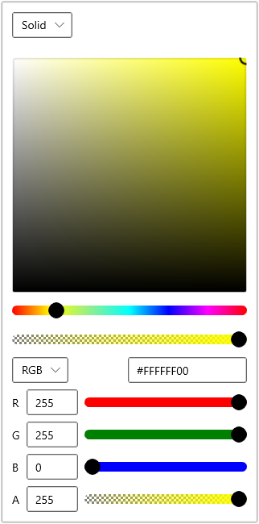
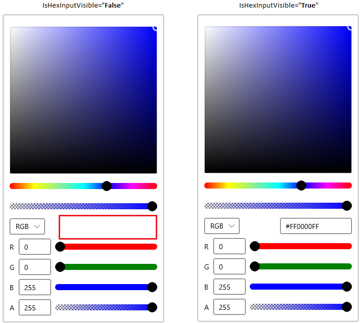
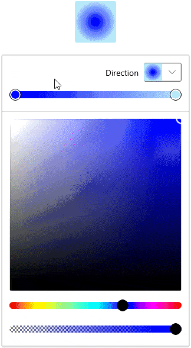

# Getting Started with WinUI Color Picker

This section describes how to create a [WinUI Color Picker](https://www.syncfusion.com/winui-controls/color-picker) control in a WinUI application and overview of its basic functionalities.

## Structure of Color Picker control

## Creating an application with WinUI ColorPicker

1. Create a [WinUI 3 desktop app for C# and .NET 5](https://docs.microsoft.com/en-us/windows/apps/winui/winui3/get-started-winui3-for-desktop) or [WinUI 3 app in UWP for C#](https://docs.microsoft.com/en-us/windows/apps/winui/winui3/get-started-winui3-for-uwp).
2. Add reference to [Syncfusion.Editors.WinUI](https://www.nuget.org/packages/Syncfusion.Editors.WinUI) NuGet. 
3. Import the control namespace `Syncfusion.UI.Xaml.Editors` in XAML or C# code.
4. Initialize the `SfColorPicker` control.




<Page
    x:Class="GettingStarted.MainPage"
    xmlns="http://schemas.microsoft.com/winfx/2006/xaml/presentation"
    xmlns:x="http://schemas.microsoft.com/winfx/2006/xaml"
    xmlns:local="using:GettingStarted"
    xmlns:d="http://schemas.microsoft.com/expression/blend/2008"
    xmlns:mc="http://schemas.openxmlformats.org/markup-compatibility/2006"
    xmlns:editors="using:Syncfusion.UI.Xaml.Editors"
    mc:Ignorable="d"
    Background="{ThemeResource ApplicationPageBackgroundThemeBrush}">
    <Grid Name="grid">
        <!--Adding Color Picker control -->
        <editors:SfColorPicker Name="colorPicker"/>
    </Grid>
</Page>




using Syncfusion.UI.Xaml.Editors;

namespace GettingStarted
{
    /// 

    /// An empty page that can be used on its own or navigated to within a Frame.
    /// 

    public sealed partial class MainPage : Page
    {
        public MainPage()
        {
            this.InitializeComponent();
            // Creating an instance of the Color Picker control
            SfColorPicker colorPicker = new SfColorPicker();

            // Setting height and width to ColorPicker control
            colorPicker.Height = 300;
            colorPicker.Width = 300;

            grid.Children.Add(colorPicker);
        }
    }
}




N> Download demo application from [GitHub](https://github.com/SyncfusionExamples/syncfusion-winui-colorpicker-examples/tree/master/Samples/SelectSolidColors)

## Select solid brush

You can select the solid color brush programmatically by setting the solid color brush value to the [SelectedBrush](https://help.syncfusion.com/cr/winUI/Syncfusion.UI.Xaml.Editors.SfColorPicker.html#Syncfusion_UI_Xaml_Editors_SfColorPicker_SelectedBrush) property. You can select any solid color brush at runtime by clicking on the respective solid color brush area. You can also choose various solid color brush from different standard color models such as `RGB`, `HSV`, `HSL`, `CMYK` formats. The default value of `SelectedBrush` property is `Blue`.




 <editors:SfColorPicker x:Name="colorPicker"
                        SelectedBrush="Yellow"/>




SfColorPicker colorPicker = new SfColorPicker();
colorPicker.SelectedBrush = new SolidColorBrush(Colors.Yellow);




N> Download demo application from [GitHub](https://github.com/SyncfusionExamples/syncfusion-winui-colorpicker-examples/tree/master/Samples/SelectSolidColors)

### Switch between solid brush channels

 You can select the color model by setting the required color brush model to the [ColorChannelOptions](https://help.syncfusion.com/cr/winUI/Syncfusion.UI.Xaml.Editors.SfColorPicker.html#Syncfusion_UI_Xaml_Editors_SfColorPicker_ColorChannelOptions) property or select it from the drop down options. The default value of `ColorChannelOptions` property is `RGB`.




 <editors:SfColorPicker x:Name="colorPicker"
                        ColorChannelOptions="HSV"/>




SfColorPicker colorPicker = new SfColorPicker();
colorPicker.ColorChannelOptions = ColorChannelOptions.HSV;




N> Download demo application from [GitHub](https://github.com/SyncfusionExamples/syncfusion-winui-colorpicker-examples/tree/master/Samples/SelectSolidColors)

### Change opacity of solid brush

You can change opacity of the selected solid color brush by using the A-Alpha value editor or delicate slider in the `Color Picker`. You can hide the A-Alpha slider by using the [AlphaInputOptions](https://help.syncfusion.com/cr/winUI/Syncfusion.UI.Xaml.Editors.SfColorPicker.html#Syncfusion_UI_Xaml_Editors_SfColorPicker_AlphaInputOptions) property value as `TextInput`. The default value of the `AlphaInputOptions` property is `All`.




<editors:SfColorPicker AlphaInputOptions="TextInput"
                       Name="colorPicker">




colorPicker.AlphaInputOptions = ColorInputOptions.TextInput;




N> Download demo application from [GitHub](https://github.com/SyncfusionExamples/syncfusion-winui-colorpicker-examples/tree/master/Samples/SelectSolidColors)

### Hexadecimal editor

You can select a solid color brush by entering the hexadecimal color value to the hexadecimal value editor. You can also get the selected color hexadecimal value by using the hexadecimal value editor. You can hide the hexadecimal value editor by setting the [IsHexInputVisible](https://help.syncfusion.com/cr/winUI/Syncfusion.UI.Xaml.Editors.SfColorPicker.html#Syncfusion_UI_Xaml_Editors_SfColorPicker_IsHexInputVisible) property value as `false`. The default value of `IsHexInputVisible` property is `true`.




<editors:SfColorPicker IsHexInputVisible="False"
                       Name="colorPicker">




colorPicker.IsHexInputVisible = false;




N> Download demo application from [GitHub](https://github.com/SyncfusionExamples/syncfusion-winui-colorpicker-examples/tree/master/Samples/SelectSolidColors)

## Select linear gradient brush

Linear Gradient color brush can be selected by the multiple colors and their location along the gradient axis using the `GradientStop` objects and `StartPoint` and `EndPoint` properties. Based on the `StartPoint` and `EndPoint`, the selected color brush will be combined in linear manner.




 <editors:SfColorPicker x:Name="colorPicker">
    <editors:SfColorPicker.SelectedBrush>
        <LinearGradientBrush StartPoint="0,0" EndPoint="1,1">
            <GradientStop Color="Yellow" Offset="0.0" />
            <GradientStop Color="Red" Offset="0.25" />
            <GradientStop Color="Blue" Offset="0.75" />
            <GradientStop Color="LimeGreen" Offset="1.0" />
        </LinearGradientBrush>
    </editors:SfColorPicker.SelectedBrush>
</editors:SfColorPicker>




//Creating the linear gradient brush
LinearGradientBrush linearGradient = new LinearGradientBrush();
linearGradient.StartPoint = new Point(0, 0);
linearGradient.EndPoint = new Point(1, 1);
linearGradient.GradientStops.Add(
    new GradientStop() { Color = Colors.Yellow, Offset = 0.0 });
linearGradient.GradientStops.Add(
    new GradientStop() { Color = Colors.Red, Offset = 0.25 });
linearGradient.GradientStops.Add(
    new GradientStop() { Color = Colors.Blue, Offset = 0.75 });
linearGradient.GradientStops.Add(
    new GradientStop() { Color = Colors.LimeGreen, Offset = 1.0 });

//Assigning a linear gradient brush to Color Picker
colorPicker.SelectedBrush = linearGradient;




N> Download demo application from [GitHub](https://github.com/SyncfusionExamples/syncfusion-winui-colorpicker-examples/tree/master/Samples/SelectLinearGradientColors)

### Select linear gradient brush interactively

You can directly select a required linear gradient color brush at runtime by setting the [BrushTypeOptions](https://help.syncfusion.com/cr/winUI/Syncfusion.UI.Xaml.Editors.SfColorPicker.html#Syncfusion_UI_Xaml_Editors_SfColorPicker_BrushTypeOptions) property value as `LinearGradientBrush`. The default value of `BrushTypeOptions` property is `All`.




<editors:SfColorPicker BrushTypeOptions="LinearGradientBrush"
                       Name="colorPicker">




colorPicker.BrushTypeOptions = BrushTypeOptions.LinearGradientBrush;




N> Download demo application from [GitHub](https://github.com/SyncfusionExamples/syncfusion-winui-colorpicker-examples/tree/master/Samples/SelectGradientColors)

## Select radial gradient brush

Radial Gradient color brush is similar to Linear Gradient color brush, except for the axis defined by the circle. Based on the `GradientOrigin`, `Center` and radius point values, the selected gradient color brush are combined in a circle manner.




<editors:SfColorPicker x:Name="colorPicker">
    <editors:SfColorPicker.SelectedBrush>
        <RadialGradientBrush GradientOrigin="0.5,0.5" 
                             Center="0.5,0.5"
                             RadiusX="0.5" RadiusY="0.5">
            <GradientStop Color="Yellow" Offset="0" />
            <GradientStop Color="Red" Offset="0.25" />
            <GradientStop Color="Blue" Offset="0.75" />
            <GradientStop Color="LimeGreen" Offset="1" />
        </RadialGradientBrush>
    </editors:SfColorPicker.SelectedBrush>
</editors:SfColorPicker>




//Creating a radial gradient brush
RadialGradientBrush radialGradient = new RadialGradientBrush();
radialGradient.GradientOrigin = new Point(0.5, 0.5);
radialGradient.Center = new Point(0.5, 0.5);
radialGradient.RadiusX = 0.5;
radialGradient.RadiusY = 0.5;
radialGradient.GradientStops.Add(
    new GradientStop() {Color=Colors.Yellow, Offset= 0.0 });
radialGradient.GradientStops.Add(
    new GradientStop() {Color=Colors.Red, Offset = 0.25 });
radialGradient.GradientStops.Add(
    new GradientStop() {Color=Colors.Blue, Offset = 0.75 });
radialGradient.GradientStops.Add(
    new GradientStop() {Color=Colors.LimeGreen, Offset = 1.0 });

//Assigning a radial gradient brush to Color Picker
colorPicker.SelectedBrush = radialGradient;




N> Download demo application from [GitHub](https://github.com/SyncfusionExamples/syncfusion-winui-colorpicker-examples/tree/master/Samples/SelectRadialGradientColors)

### Select radial gradient brush interactively

You can directly select a required radial gradient color brush at runtime by setting the `BrushTypeOptions` property value as `RadialGradientBrush`.




<editors:SfColorPicker BrushTypeOptions="RadialGradientBrush"
                       Name="colorPicker">




colorPicker.BrushTypeOptions = BrushTypeOptions.RadialGradientBrush;




N> Download demo application from [GitHub](https://github.com/SyncfusionExamples/syncfusion-winui-colorpicker-examples/tree/master/Samples/SelectGradientColors)

## Switch between solid, linear and radial gradient brush mode

You can allow the user to choose either `Solid`, `Linear` or `Radial` gradient brush or any combination of brush mode by using the `BrushTypeOptions` property. 




<editors:SfColorPicker BrushTypeOptions="SolidColorBrush,RadialGradientBrush"
                       Name="colorPicker">




colorPicker.BrushTypeOptions = BrushTypeOptions.SolidColorBrush | BrushTypeOptions.RadialGradientBrush;




N> Download demo application from [GitHub](https://github.com/SyncfusionExamples/syncfusion-winui-colorpicker-examples/tree/master/Samples/SelectGradientColors)

### Switch between solid, linear and radial gradient brush mode interactively

You can change the color selection mode directly at runtime by clicking on the corresponding `Solid`, `Linear` or `Radial` gradient brush mode drop down options which is placed in the top of the `Color Picker` control.

N> Download demo application from [GitHub](https://github.com/SyncfusionExamples/syncfusion-winui-colorpicker-examples/tree/master/Samples/SelectGradientColors)

## Selected brush changed notification

You will be notified when selected brush changed in `Color Picker` by using [SelectedBrushChanged](https://help.syncfusion.com/cr/winUI/Syncfusion.UI.Xaml.Editors.SfColorPicker.html#Syncfusion_UI_Xaml_Editors_SfColorPicker_SelectedBrushChanged) events. You can get the old and newly selected brush by using the [OldBrush](https://help.syncfusion.com/cr/winUI/Syncfusion.UI.Xaml.Editors.SelectedBrushChangedEventArgs.html) and [NewBrush](https://help.syncfusion.com/cr/winUI/Syncfusion.UI.Xaml.Editors.SelectedBrushChangedEventArgs.html) properties.




<editors:SfColorPicker SelectedBrushChanged="ColorPicker_SelectedBrushChanged"
                       Name="colorPicker">




colorPicker.SelectedBrushChanged += ColorPicker_SelectedBrushChanged;




You can handle the event as follows,




private void ColorPicker_SelectedBrushChanged(object sender, SelectedBrushChangedEventArgs args) {
    var old_selectedBrush = args.OldBrush;
    var new_selectedBrush = args.NewBrush;
}



