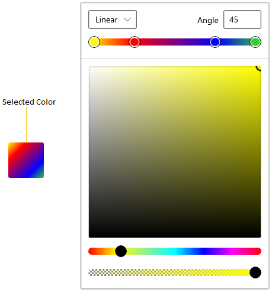
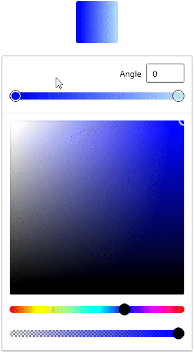
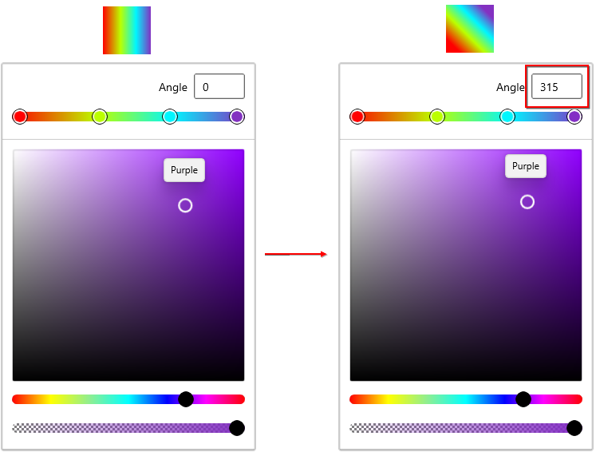
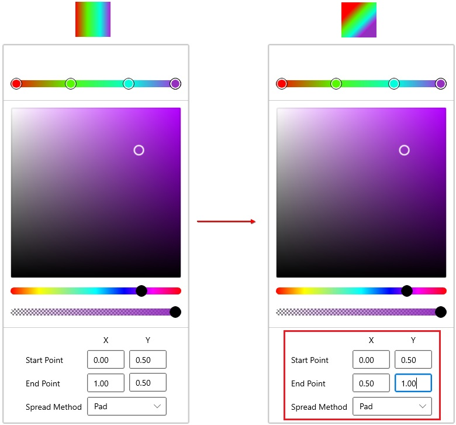
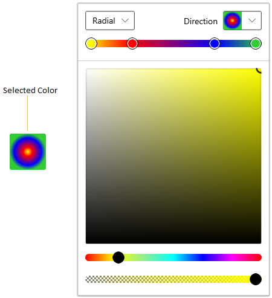
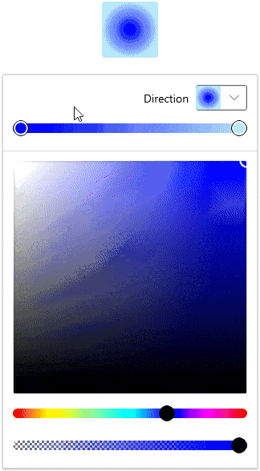
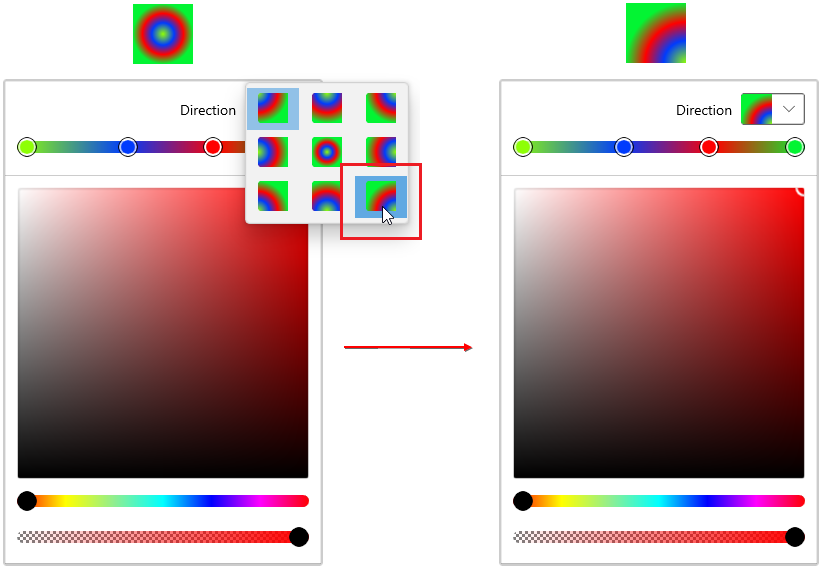
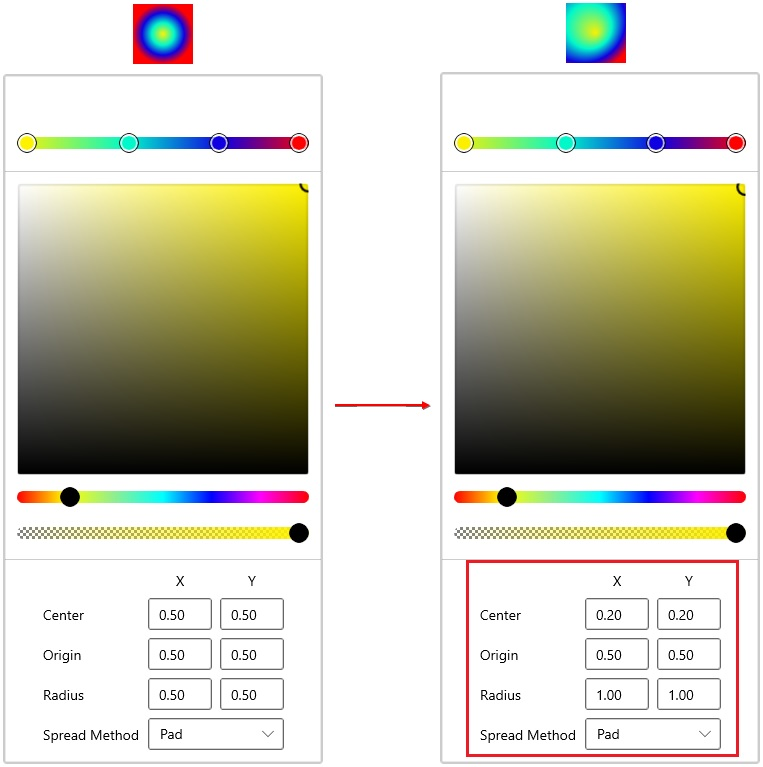
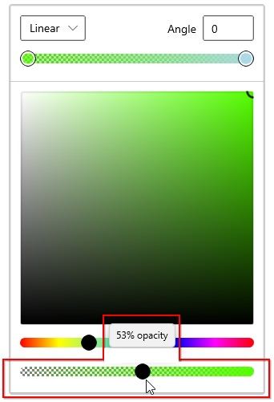

# Gradient Color Selection in WinUI Color Picker

This section describes how to create gradient color brush, modify their colors and their properties available in [Color Picker](https://help.syncfusion.com/cr/winUI/Syncfusion.UI.Xaml.Editors.SfColorPicker.html) control.

## What is a gradient color?

A gradient color paints an area with multiple colors that blend into each other along an axis. `Color Picker` now comes with Gradient tools which returns a brush of type Linear and Radial gradient colors. The offsets can be added or dropped dynamically and its position can be changed to produce different color combinations.

## Select linear gradient brush programmatically

Linear Gradient color brush can be selected by the multiple colors and their location along the gradient axis using the `GradientStop` objects and `StartPoint` and `EndPoint` properties of `LinearGradientBrush`. Based on the `StartPoint` and `EndPoint`, the selected color brush will be combined in linear manner.




 <editors:SfColorPicker x:Name="colorPicker">
    <editors:SfColorPicker.SelectedBrush>
        <LinearGradientBrush StartPoint="0,0" EndPoint="1,1">
            <GradientStop Color="Yellow" Offset="0.0" />
            <GradientStop Color="Red" Offset="0.25" />
            <GradientStop Color="Blue" Offset="0.75" />
            <GradientStop Color="LimeGreen" Offset="1.0" />
        </LinearGradientBrush>
    </editors:SfColorPicker.SelectedBrush>
</editors:SfColorPicker>




using Syncfusion.UI.Xaml.Editors;
using Microsoft.UI;
using Microsoft.UI.Xaml.Media;
using Windows.Foundation;
using Windows.UI;

//Creating the linear gradient brush
LinearGradientBrush linearGradient = new LinearGradientBrush();
linearGradient.StartPoint = new Point(0, 0);
linearGradient.EndPoint = new Point(1, 1);
linearGradient.GradientStops.Add(
    new GradientStop() { Color = Colors.Yellow, Offset = 0.0 });
linearGradient.GradientStops.Add(
    new GradientStop() { Color = Colors.Red, Offset = 0.25 });
linearGradient.GradientStops.Add(
    new GradientStop() { Color = Colors.Blue, Offset = 0.75 });
linearGradient.GradientStops.Add(
    new GradientStop() { Color = Colors.LimeGreen, Offset = 1.0 });

//Assigning a linear gradient brush to Color Picker
colorPicker.SelectedBrush = linearGradient;




N> Download demo application from [GitHub](https://github.com/SyncfusionExamples/syncfusion-winui-colorpicker-examples/tree/master/Samples/SelectLinearGradientColors)

## Interactively select linear gradient brush

You can directly select a linear gradient color brush at runtime by creating multiple gradient stops and selecting a color for each stop. The created gradient stops are then combined to form a linear gradient color brush. You can enable the linear gradient mode by setting the [BrushTypeOptions](https://help.syncfusion.com/cr/winUI/Syncfusion.UI.Xaml.Editors.SfColorPicker.html#Syncfusion_UI_Xaml_Editors_SfColorPicker_BrushTypeOptions) property value to `LinearGradientBrush`. The default value of the `BrushTypeOptions` property is `All`.




<editors:SfColorPicker BrushTypeOptions="LinearGradientBrush"
                       Name="colorPicker"/>




colorPicker.BrushTypeOptions = BrushTypeOptions.LinearGradientBrush;




N> Download demo application from [GitHub](https://github.com/SyncfusionExamples/syncfusion-winui-colorpicker-examples/tree/master/Samples/SelectGradientColors)

## Change angle of linear gradient brush

You can change the angle of the selected linear gradient color brush by entering a value in the `Angle` value editor, or programmatically by setting the `Angle` property of type `double`. The `Angle` value editor accepts values from `0` to `359`. The default angle value is `0`. The angle editor is shown only when the [AxisInputOption](https://help.syncfusion.com/cr/winui/Syncfusion.UI.Xaml.Editors.SfColorPicker.html#Syncfusion_UI_Xaml_Editors_SfColorPicker_AxisInputOption) property value is `Simple`.




<editors:SfColorPicker AxisInputOption="Simple" 
                       BrushTypeOptions="LinearGradientBrush"
                       Name="colorPicker"/>




using Syncfusion.UI.Xaml.Editors;

colorPicker.AxisInputOption = AxisInputOption.Simple;
colorPicker.BrushTypeOptions = BrushTypeOptions.LinearGradientBrush;




N> Download demo application from [GitHub](https://github.com/SyncfusionExamples/syncfusion-winui-colorpicker-examples/tree/master/Samples/SelectGradientColors)

## Change offset of linear gradient brush using value editor

You can change the offset of the selected linear gradient color brush by using the dedicated start- and end-point value editors. By default, the offset value editors are collapsed. To show them, set the `AxisInputOption` property value to `Advanced`.




<editors:SfColorPicker AxisInputOption="Advanced" 
                       BrushTypeOptions="LinearGradientBrush"
                       Name="colorPicker"/>




using Syncfusion.UI.Xaml.Editors;

colorPicker.AxisInputOption = AxisInputOption.Advanced;
colorPicker.BrushTypeOptions = BrushTypeOptions.LinearGradientBrush;




N> Download demo application from [GitHub](https://github.com/SyncfusionExamples/syncfusion-winui-colorpicker-examples/tree/master/Samples/SelectGradientColors)

## Select radial gradient brush programmatically

Radial Gradient color brush is similar to Linear Gradient color brush, except for the axis defined by the circle. Based on the `GradientOrigin`, `Center` and radius point values, the selected gradient color brush are combined in a circle manner. You can programmatically select a radial gradient brush by using the `RadialGradientBrush` elements.




<editors:SfColorPicker x:Name="colorPicker">
    <editors:SfColorPicker.SelectedBrush>
        <RadialGradientBrush GradientOrigin="0.5,0.5" 
                             Center="0.5,0.5"
                             RadiusX="0.5" RadiusY="0.5">
            <GradientStop Color="Yellow" Offset="0" />
            <GradientStop Color="Red" Offset="0.25" />
            <GradientStop Color="Blue" Offset="0.75" />
            <GradientStop Color="LimeGreen" Offset="1" />
        </RadialGradientBrush>
    </editors:SfColorPicker.SelectedBrush>
</editors:SfColorPicker>




using Syncfusion.UI.Xaml.Editors;
using Microsoft.UI;
using Microsoft.UI.Xaml.Media;
using Windows.Foundation;
using Windows.UI;

//Creating a radial gradient brush
RadialGradientBrush radialGradient = new RadialGradientBrush();
radialGradient.GradientOrigin = new Point(0.5, 0.5);
radialGradient.Center = new Point(0.5, 0.5);
radialGradient.RadiusX = 0.5;
radialGradient.RadiusY = 0.5;
radialGradient.GradientStops.Add(
    new GradientStop() {Color=Colors.Yellow, Offset= 0.0 });
radialGradient.GradientStops.Add(
    new GradientStop() {Color=Colors.Red, Offset = 0.25 });
radialGradient.GradientStops.Add(
    new GradientStop() {Color=Colors.Blue, Offset = 0.75 });
radialGradient.GradientStops.Add(
    new GradientStop() {Color=Colors.LimeGreen, Offset = 1.0 });

//Assigning a radial gradient brush to Color Picker
colorPicker.SelectedBrush = radialGradient;




N> Download demo application from [GitHub](https://github.com/SyncfusionExamples/syncfusion-winui-colorpicker-examples/tree/master/Samples/SelectRadialGradientColors)

## Interactively select radial gradient brush 

You can directly select a radial gradient color brush at runtime by creating multiple gradient stops and selecting a color for each stop. The created gradient stops are then combined to form a radial gradient color brush. You can enable the radial gradient mode by setting the `BrushTypeOptions` property value to `RadialGradientBrush`.




<editors:SfColorPicker BrushTypeOptions="RadialGradientBrush"
                       Name="colorPicker"/>




using Syncfusion.UI.Xaml.Editors;

colorPicker.BrushTypeOptions = BrushTypeOptions.RadialGradientBrush;




N> Download demo application from [GitHub](https://github.com/SyncfusionExamples/syncfusion-winui-colorpicker-examples/tree/master/Samples/SelectGradientColors)

## Change direction of radial gradient brush

You can change the direction of the selected radial gradient color brush by selecting a direction from the drop-down list, or programmatically by setting the `Direction` property of type `RadialGradientDirection`. The supported values are `TopLeft`, `TopRight`, `BottomLeft`, and `BottomRight`. The direction option is shown only when the `AxisInputOption` property value is `Simple`.




<editors:SfColorPicker AxisInputOption="Simple" 
                       BrushTypeOptions="RadialGradientBrush"
                       Name="colorPicker"/>




using Syncfusion.UI.Xaml.Editors;

colorPicker.AxisInputOption = AxisInputOption.Simple;
colorPicker.BrushTypeOptions = BrushTypeOptions.RadialGradientBrush;




N> Download demo application from [GitHub](https://github.com/SyncfusionExamples/syncfusion-winui-colorpicker-examples/tree/master/Samples/SelectGradientColors)

## Change offset of radial gradient brush using value editor

You can change the offset of the selected radial gradient color brush by using the dedicated center, origin, and radius value editors. To show the offset value editors, set the `AxisInputOption` property value to `Advanced`.




<editors:SfColorPicker AxisInputOption="Advanced" 
                       BrushTypeOptions="RadialGradientBrush"
                       Name="colorPicker"/>




using Syncfusion.UI.Xaml.Editors;

colorPicker.AxisInputOption = AxisInputOption.Advanced;
colorPicker.BrushTypeOptions = BrushTypeOptions.RadialGradientBrush;




N> Download demo application from [GitHub](https://github.com/SyncfusionExamples/syncfusion-winui-colorpicker-examples/tree/master/Samples/SelectGradientColors)

## Change opacity of gradient brush

You can change the opacity of the selected gradient color brush by using the dedicated slider in the `Color Picker`.




<editors:SfColorPicker BrushTypeOptions="LinearGradientBrush,RadialGradientBrush"
                       Name="colorPicker"/>




using Syncfusion.UI.Xaml.Editors;

SfColorPicker colorPicker = new SfColorPicker();
colorPicker.BrushTypeOptions = BrushTypeOptions.LinearGradientBrush | BrushTypeOptions.RadialGradientBrush;




N> Download demo application from [GitHub](https://github.com/SyncfusionExamples/syncfusion-winui-colorpicker-examples/tree/master/Samples/SelectGradientColors)

## Selected gradient brush changed notification

You will be notified when the selected gradient color brush changes in `Color Picker` by using the [SelectedBrushChanged](https://help.syncfusion.com/cr/winUI/Syncfusion.UI.Xaml.Editors.SfColorPicker.html#Syncfusion_UI_Xaml_Editors_SfColorPicker_SelectedBrushChanged) event. You can get the old and newly selected brush by using the `OldBrush` and `NewBrush` properties of the `SelectedBrushChangedEventArgs` class.




<editors:SfColorPicker BrushTypeOptions="SolidColorBrush,RadialGradientBrush"
                       SelectedBrushChanged="ColorPicker_SelectedBrushChanged"
                       Name="colorPicker"/>




using Syncfusion.UI.Xaml.Editors;

colorPicker.SelectedBrushChanged += ColorPicker_SelectedBrushChanged;
colorPicker.BrushTypeOptions = BrushTypeOptions.SolidColorBrush | BrushTypeOptions.RadialGradientBrush;




You can handle the event as follows.




private void ColorPicker_SelectedBrushChanged(object sender, SelectedBrushChangedEventArgs args)
{
    var oldSelectedBrush = args.OldBrush;
    var newSelectedBrush = args.NewBrush;
}


