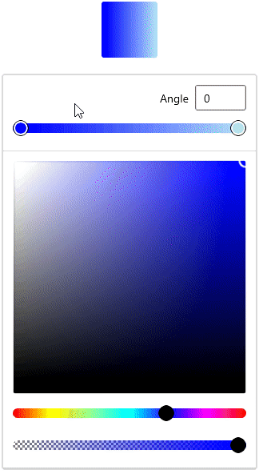
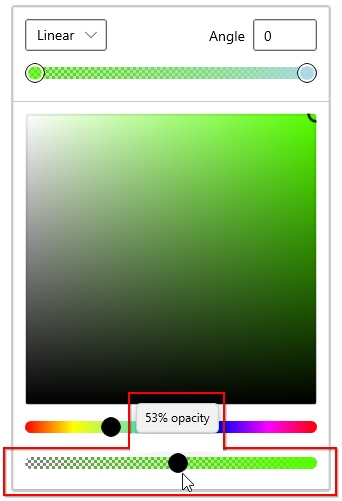

# Gradient Color Selection in WinUI Color Picker

This section describes how to create gradient color brush, modify their colors and their properties available in [Color Picker](https://help.syncfusion.com/cr/winUI/Syncfusion.UI.Xaml.Editors.SfColorPicker.html) control.

## What is a gradient color?

A gradient color paints an area with multiple colors that blend into each other along an axis. `Color Picker` now comes with Gradient tools which returns a brush of type Linear and Radial gradient colors. The offsets can be added or dropped dynamically and its position can be changed to produce different color combinations.

## Select linear gradient brush programmatically

Linear Gradient color brush can be selected by the multiple colors and their location along the gradient axis using the `GradientStop` objects and `StartPoint` and `EndPoint` properties of `LinearGradientBrush`. Based on the `StartPoint` and `EndPoint`, the selected color brush will be combined in linear manner.




 <editors:SfColorPicker x:Name="colorPicker">
    <editors:SfColorPicker.SelectedBrush>
        <LinearGradientBrush StartPoint="0,0" EndPoint="1,1">
            <GradientStop Color="Yellow" Offset="0.0" />
            <GradientStop Color="Red" Offset="0.25" />
            <GradientStop Color="Blue" Offset="0.75" />
            <GradientStop Color="LimeGreen" Offset="1.0" />
        </LinearGradientBrush>
    </editors:SfColorPicker.SelectedBrush>
</editors:SfColorPicker>




//Creating the linear gradient brush
LinearGradientBrush linearGradient = new LinearGradientBrush();
linearGradient.StartPoint = new Point(0, 0);
linearGradient.EndPoint = new Point(1, 1);
linearGradient.GradientStops.Add(
    new GradientStop() { Color = Colors.Yellow, Offset = 0.0 });
linearGradient.GradientStops.Add(
    new GradientStop() { Color = Colors.Red, Offset = 0.25 });
linearGradient.GradientStops.Add(
    new GradientStop() { Color = Colors.Blue, Offset = 0.75 });
linearGradient.GradientStops.Add(
    new GradientStop() { Color = Colors.LimeGreen, Offset = 1.0 });

//Assigning a linear gradient brush to Color Picker
colorPicker.SelectedBrush = linearGradient;




N> Download demo application from [GitHub](https://github.com/SyncfusionExamples/syncfusion-winui-colorpicker-examples/tree/master/Samples/SelectLinearGradientColors)

## Interactively select linear gradient brush

You can directly select a required linear gradient color brush  as your wish at runtime by creating the multiple gradient stops and select color for that gradient stops. Then, created gradient stops will be combined together and form a linear gradient color brush. You can enable the linear gradient mode by setting the [BrushTypeOptions](https://help.syncfusion.com/cr/winUI/Syncfusion.UI.Xaml.Editors.SfColorPicker.html#Syncfusion_UI_Xaml_Editors_SfColorPicker_BrushTypeOptions)  property value as `LinearGradientBrush`. The default value of `BrushTypeOptions` property is `All`.




<editors:SfColorPicker BrushTypeOptions="LinearGradientBrush"
                       Name="colorPicker">




colorPicker.BrushTypeOptions = BrushTypeOptions.LinearGradientBrush;




N> Download demo application from [GitHub](https://github.com/SyncfusionExamples/syncfusion-winui-colorpicker-examples/tree/master/Samples/SelectGradientColors)

## Change angle of linear gradient brush

If you want to change the angle of selected linear gradient color brush, change the angle value in `Angle` value editor. Based on the value of `Angle` value editor, selected linear gradient color brush will be rotated. The angle option only shown on when [AxisInputOption](https://help.syncfusion.com/cr/winui/Syncfusion.UI.Xaml.Editors.SfColorPicker.html#Syncfusion_UI_Xaml_Editors_SfColorPicker_AxisInputOption) property value is `Simple`. The `Angle` value editor accept the value from `0` to `359`. The default angle value is `0`.




<editors:SfColorPicker AxisInputOption="Simple" 
                       BrushTypeOptions="LinearGradientBrush"
                       Name="colorPicker">




colorPicker.AxisInputOption= AxisInputOption.Simple;
colorPicker.BrushTypeOptions = BrushTypeOptions.LinearGradientBrush;




N> Download demo application from [GitHub](https://github.com/SyncfusionExamples/syncfusion-winui-colorpicker-examples/tree/master/Samples/SelectGradientColors)

## Change offset of linear gradient brush using value editor

You can change the offset of selected linear gradient color brush by using dedicated start and end point value editors. By default, offset value editors are collapsed. If you want to show the offset value editors, use the `AxisInputOption` property value as `Advanced`. 




<editors:SfColorPicker AxisInputOption="Advanced" 
                       BrushTypeOptions="LinearGradientBrush"
                       Name="colorPicker">




colorPicker.AxisInputOption= AxisInputOption.Advanced;
colorPicker.BrushTypeOptions = BrushTypeOptions.LinearGradientBrush;




N> Download demo application from [GitHub](https://github.com/SyncfusionExamples/syncfusion-winui-colorpicker-examples/tree/master/Samples/SelectGradientColors)

## Select radial gradient brush programmatically

Radial Gradient color brush is similar to Linear Gradient color brush, except for the axis defined by the circle. Based on the `GradientOrigin`, `Center` and radius point values, the selected gradient color brush are combined in a circle manner. You can programmatically select a radial gradient brush by using the `RadialGradientBrush` elements.




<editors:SfColorPicker x:Name="colorPicker">
    <editors:SfColorPicker.SelectedBrush>
        <RadialGradientBrush GradientOrigin="0.5,0.5" 
                             Center="0.5,0.5"
                             RadiusX="0.5" RadiusY="0.5">
            <GradientStop Color="Yellow" Offset="0" />
            <GradientStop Color="Red" Offset="0.25" />
            <GradientStop Color="Blue" Offset="0.75" />
            <GradientStop Color="LimeGreen" Offset="1" />
        </RadialGradientBrush>
    </editors:SfColorPicker.SelectedBrush>
</editors:SfColorPicker>




//Creating a radial gradient brush
RadialGradientBrush radialGradient = new RadialGradientBrush();
radialGradient.GradientOrigin = new Point(0.5, 0.5);
radialGradient.Center = new Point(0.5, 0.5);
radialGradient.RadiusX = 0.5;
radialGradient.RadiusY = 0.5;
radialGradient.GradientStops.Add(
    new GradientStop() {Color=Colors.Yellow, Offset= 0.0 });
radialGradient.GradientStops.Add(
    new GradientStop() {Color=Colors.Red, Offset = 0.25 });
radialGradient.GradientStops.Add(
    new GradientStop() {Color=Colors.Blue, Offset = 0.75 });
radialGradient.GradientStops.Add(
    new GradientStop() {Color=Colors.LimeGreen, Offset = 1.0 });

//Assigning a radial gradient brush to Color Picker
colorPicker.SelectedBrush = radialGradient;




N> Download demo application from [GitHub](https://github.com/SyncfusionExamples/syncfusion-winui-colorpicker-examples/tree/master/Samples/SelectRadialGradientColors)

## Interactively select radial gradient brush 

You can directly select a required radial gradient color brush as your wish at runtime by creating the multiple gradient stops and select color for that gradient stops. Then, created gradient stops will be combined together and form a radial gradient color brush. You can enable the radial gradient mode by setting the `BrushTypeOptions` property value as `RadialGradientBrush`. 




<editors:SfColorPicker BrushTypeOptions="RadialGradientBrush"
                       Name="colorPicker">




colorPicker.BrushTypeOptions = BrushTypeOptions.RadialGradientBrush;




N> Download demo application from [GitHub](https://github.com/SyncfusionExamples/syncfusion-winui-colorpicker-examples/tree/master/Samples/SelectGradientColors)

## Change direction of radial gradient brush

If you want to change the direction of selected radial gradient color brush, select the any direction from the drop down option. The direction option only shown on when `AxisInputOption` property value is `Simple`. 




<editors:SfColorPicker AxisInputOption="Simple" 
                       BrushTypeOptions="RadialGradientBrush"
                       Name="colorPicker">




colorPicker.AxisInputOption= AxisInputOption.Simple;
colorPicker.BrushTypeOptions = BrushTypeOptions.RadialGradientBrush;




N> Download demo application from [GitHub](https://github.com/SyncfusionExamples/syncfusion-winui-colorpicker-examples/tree/master/Samples/SelectGradientColors)

## Change offset of radial gradient brush using value editor

You can change the offset of selected radial gradient color brush by using dedicated center, origin and radius value editors. If you want to show the offset value editors, use the `AxisInputOption` property value as `Advanced`.




<editors:SfColorPicker AxisInputOption="Advanced" 
                       BrushTypeOptions="RadialGradientBrush"
                       Name="colorPicker">




colorPicker.AxisInputOption= AxisInputOption.Advanced;
colorPicker.BrushTypeOptions = BrushTypeOptions.RadialGradientBrush;




N> Download demo application from [GitHub](https://github.com/SyncfusionExamples/syncfusion-winui-colorpicker-examples/tree/master/Samples/SelectGradientColors)

## Change opacity of gradient brush

You can change opacity of the selected gradient color brush by using the delicate slider in the `Color Picker`.




<editors:SfColorPicker BrushTypeOptions="LinearGradientBrush,RadialGradientBrush"
                       Name="colorPicker">




SfColorPicker colorPicker = new SfColorPicker();
colorPicker.BrushTypeOptions = BrushTypeOptions.LinearGradientBrush | BrushTypeOptions.RadialGradientBrush;




N> Download demo application from [GitHub](https://github.com/SyncfusionExamples/syncfusion-winui-colorpicker-examples/tree/master/Samples/SelectGradientColors)

## Selected gradient brush changed notification

You will be notified when selected gradient color brush changed in `Color Picker` by using [SelectedBrushChanged](https://help.syncfusion.com/cr/winUI/Syncfusion.UI.Xaml.Editors.SfColorPicker.html#Syncfusion_UI_Xaml_Editors_SfColorPicker_SelectedBrushChanged) events. You can get the old and newly selected brush by using the [OldBrush](https://help.syncfusion.com/cr/winUI/Syncfusion.UI.Xaml.Editors.SelectedBrushChangedEventArgs.html) and [NewBrush](https://help.syncfusion.com/cr/winUI/Syncfusion.UI.Xaml.Editors.SelectedBrushChangedEventArgs.html) properties.




<editors:SfColorPicker BrushTypeOptions="SolidColorBrush,RadialGradientBrush"
                       SelectedBrushChanged="ColorPicker_SelectedBrushChanged"
                       Name="colorPicker">




colorPicker.SelectedBrushChanged += ColorPicker_SelectedBrushChanged;
colorPicker.BrushTypeOptions = BrushTypeOptions.SolidColorBrush | BrushTypeOptions.RadialGradientBrush;




You can handle the event as follows,




private void ColorPicker_SelectedBrushChanged(object sender, SelectedBrushChangedEventArgs args) {
    var old_selectedBrush = args.OldBrush;
    var new_selectedBrush = args.NewBrush;
}



