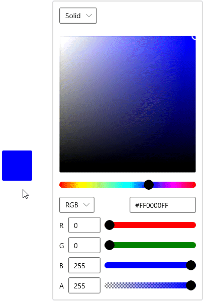

# WinUI ColorPicker Overview

The [ColorPicker](https://help.syncfusion.com/cr/winUI/Syncfusion.UI.Xaml.Editors.SfColorPicker.html) control is an user interface to select and adjust color values. It supports various color specifications like RGB (Red Green Blue), HSV (Hue Saturation Value), Hex codes, linear and radial gradient color brushes.

## ColorPicker control structure

## Key features

* Color Editing - Drag the handle to pick your favorite color in the picker region or set the color values manually with input control (RGB or HSV or HSL or CMYK or Hex codes).

* A slider displaying the Hue spectrum, allowing for selection of a hue value.

* Gradient Editor - Sliders capable of altering the stops of a linear or radial brush.

* Supports ToolTip to show the selected color while dragging the picker in ColorEdit control.
