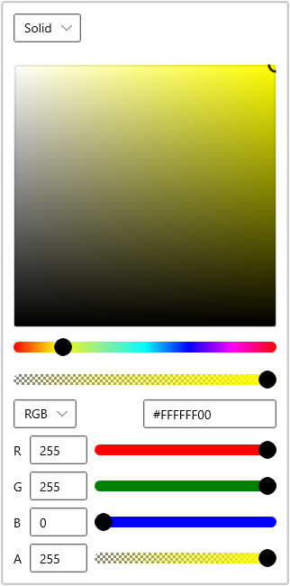
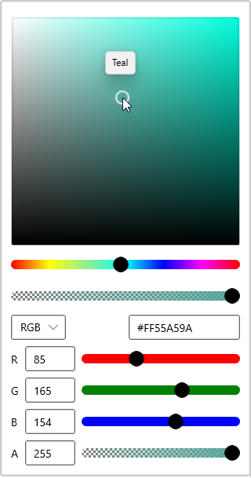
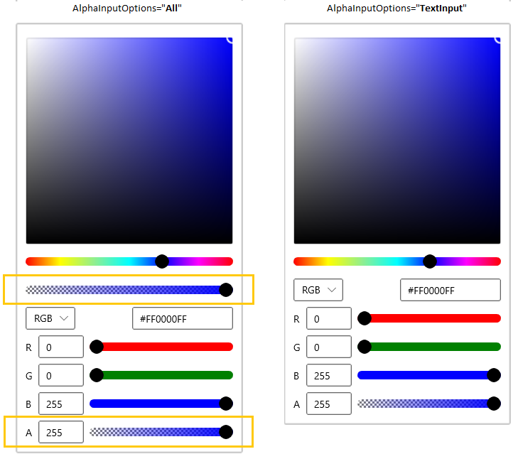
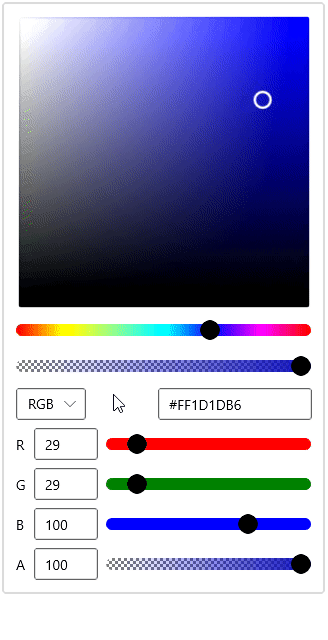
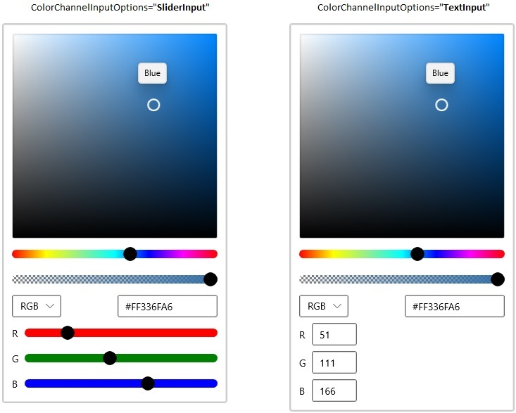
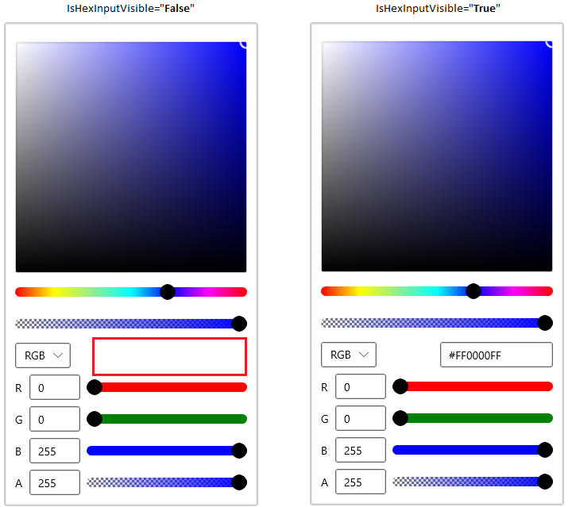
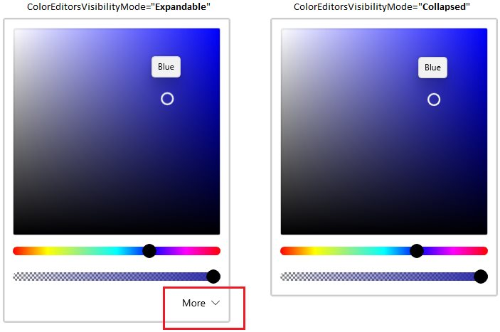

# Solid Color Selection in WinUI Color Picker

This section explains how to select a solid color from different color models, how to modify their individual properties in [Color Picker](https://help.syncfusion.com/cr/winUI/Syncfusion.UI.Xaml.Editors.SfColorPicker.html).

## What is solid color?

Solid color comprises a single color with its alpha value. It contains different color channels such as RGB, HSV, HSL and CMYK color channels.

## Select solid brush programmatically

You can select the solid color brush programmatically by setting the solid color brush value to the [SelectedBrush](https://help.syncfusion.com/cr/winUI/Syncfusion.UI.Xaml.Editors.SfColorPicker.html#Syncfusion_UI_Xaml_Editors_SfColorPicker_SelectedBrush) property of type `Brush`. The XAML `Brush` type converter accepts standard color names (e.g., `Yellow`). You can also choose solid color brushes from different standard color models such as `RGB`, `HSV`, `HSL`, and `CMYK`. The default value of the `SelectedBrush` property is `SolidColorBrush(Colors.Blue)`.




 <editors:SfColorPicker x:Name="colorPicker"
                        SelectedBrush="Yellow"/>




using Syncfusion.UI.Xaml.Editors;
using Microsoft.UI;
using Microsoft.UI.Xaml.Media;
using Windows.UI;

SfColorPicker colorPicker = new SfColorPicker();
colorPicker.SelectedBrush = new SolidColorBrush(Colors.Yellow);




N> Download demo application from [GitHub](https://github.com/SyncfusionExamples/syncfusion-winui-colorpicker-examples/tree/master/Samples/SelectSolidColors)

## Select solid brush interactively

You can select any solid color brush at runtime by clicking on the respective solid color brush area. You can enable only the solid color brush mode by setting the [BrushTypeOptions](https://help.syncfusion.com/cr/winui/Syncfusion.UI.Xaml.Editors.SfColorPicker.html#Syncfusion_UI_Xaml_Editors_SfColorPicker_BrushTypeOptions) property value to `SolidColorBrush`.




<editors:SfColorPicker Name="colorPicker"/>




using Syncfusion.UI.Xaml.Editors;

SfColorPicker colorPicker = new SfColorPicker();
colorPicker.BrushTypeOptions = BrushTypeOptions.SolidColorBrush;




N> Download demo application from [GitHub](https://github.com/SyncfusionExamples/syncfusion-winui-colorpicker-examples/tree/master/Samples/SelectSolidColors)

## Change opacity of solid brush

You can change the opacity of the selected solid color brush by using the alpha value editor or dedicated slider in the `Color Picker`. You can hide the alpha slider by setting the [AlphaInputOptions](https://help.syncfusion.com/cr/winUI/Syncfusion.UI.Xaml.Editors.SfColorPicker.html#Syncfusion_UI_Xaml_Editors_SfColorPicker_AlphaInputOptions) property to `TextInput`, `SliderInput`, or `None`. The default value of the `AlphaInputOptions` property is `All`.




<editors:SfColorPicker BrushTypeOptions="SolidColorBrush"
                       AlphaInputOptions="TextInput"
                       Name="colorPicker"/>




using Syncfusion.UI.Xaml.Editors;

colorPicker.AlphaInputOptions = ColorInputOptions.TextInput;
colorPicker.BrushTypeOptions = BrushTypeOptions.SolidColorBrush;




N> Download demo application from [GitHub](https://github.com/SyncfusionExamples/syncfusion-winui-colorpicker-examples/tree/master/Samples/SelectSolidColors)

## Switch between color channels

The `Color Picker` contains different color channels, namely `RGB`, `HSV`, `HSL`, and `CMYK`. You can select any color model by setting the [ColorChannelOptions](https://help.syncfusion.com/cr/winUI/Syncfusion.UI.Xaml.Editors.SfColorPicker.html#Syncfusion_UI_Xaml_Editors_SfColorPicker_ColorChannelOptions) property or by selecting it from the drop-down list. The default value of the `ColorChannelOptions` property is `RGB`.




 <editors:SfColorPicker BrushTypeOptions="SolidColorBrush"
                        x:Name="colorPicker"
                        ColorChannelOptions="HSV"/>




using Syncfusion.UI.Xaml.Editors;

SfColorPicker colorPicker = new SfColorPicker();
colorPicker.ColorChannelOptions = ColorChannelOptions.HSV;
colorPicker.BrushTypeOptions = BrushTypeOptions.SolidColorBrush;




N> Download demo application from [GitHub](https://github.com/SyncfusionExamples/syncfusion-winui-colorpicker-examples/tree/master/Samples/SelectSolidColors)

## Choose color-channel input mode

You can change the value of the selected color channel components by using either a text editor, a slider, or both. If you want to restrict the input to a text editor or a slider only, use the [ColorChannelInputOptions](https://help.syncfusion.com/cr/winui/Syncfusion.UI.Xaml.Editors.SfColorPicker.html#Syncfusion_UI_Xaml_Editors_SfColorPicker_ColorChannelInputOptions) property value of `TextInput` or `SliderInput`. The default value of the `ColorChannelInputOptions` property is `All`.




<editors:SfColorPicker BrushTypeOptions="SolidColorBrush"
                       ColorChannelInputOptions="TextInput"
                       Name="colorPicker"/>




using Syncfusion.UI.Xaml.Editors;

colorPicker.ColorChannelInputOptions = ColorInputOptions.TextInput;
colorPicker.BrushTypeOptions = BrushTypeOptions.SolidColorBrush;




N> Download demo application from [GitHub](https://github.com/SyncfusionExamples/syncfusion-winui-colorpicker-examples/tree/master/Samples/SelectSolidColors)

## Hexadecimal editor

You can select a solid color brush by entering a hexadecimal color value in the hexadecimal value editor. You can also read the selected color's hexadecimal value from this editor. You can hide the hexadecimal value editor by setting the [IsHexInputVisible](https://help.syncfusion.com/cr/winUI/Syncfusion.UI.Xaml.Editors.SfColorPicker.html#Syncfusion_UI_Xaml_Editors_SfColorPicker_IsHexInputVisible) property to `false`. The default value of the `IsHexInputVisible` property is `true`.




<editors:SfColorPicker BrushTypeOptions="SolidColorBrush"
                       IsHexInputVisible="False"
                       Name="colorPicker"/>




using Syncfusion.UI.Xaml.Editors;

colorPicker.IsHexInputVisible = false;
colorPicker.BrushTypeOptions = BrushTypeOptions.SolidColorBrush;




N> Download demo application from [GitHub](https://github.com/SyncfusionExamples/syncfusion-winui-colorpicker-examples/tree/master/Samples/SelectSolidColors)

## Expand or collapse the Color Editors visibility

You can change the visibility of the hexadecimal value editor and color channel editors to an expandable or collapsed state by setting the [ColorEditorsVisibilityMode](https://help.syncfusion.com/cr/winui/Syncfusion.UI.Xaml.Editors.SfColorPicker.html#Syncfusion_UI_Xaml_Editors_SfColorPicker_ColorEditorsVisibilityMode) property. The supported values are:

- `Inline` (default) - editors are always visible.
- `Expandable` - editors are collapsed by default and can be expanded.
- `Collapsed` - editors are always collapsed.




<editors:SfColorPicker BrushTypeOptions="SolidColorBrush"
                       ColorEditorsVisibilityMode="Expandable"
                       Name="colorPicker"/>




using Syncfusion.UI.Xaml.Editors;

colorPicker.ColorEditorsVisibilityMode = ColorEditorsVisibilityMode.Expandable;
colorPicker.BrushTypeOptions = BrushTypeOptions.SolidColorBrush;




N> Download demo application from [GitHub](https://github.com/SyncfusionExamples/syncfusion-winui-colorpicker-examples/tree/master/Samples/SelectSolidColors)

## Selected brush changed notification

You will be notified when the selected solid color brush changes in `Color Picker` by using the [SelectedBrushChanged](https://help.syncfusion.com/cr/winUI/Syncfusion.UI.Xaml.Editors.SfColorPicker.html#Syncfusion_UI_Xaml_Editors_SfColorPicker_SelectedBrushChanged) event. You can get the old and newly selected brush by using the `OldBrush` and `NewBrush` properties of the `SelectedBrushChangedEventArgs` class.




<editors:SfColorPicker BrushTypeOptions="SolidColorBrush"
                       SelectedBrushChanged="ColorPicker_SelectedBrushChanged"
                       Name="colorPicker"/>




using Syncfusion.UI.Xaml.Editors;

colorPicker.SelectedBrushChanged += ColorPicker_SelectedBrushChanged;
colorPicker.BrushTypeOptions = BrushTypeOptions.SolidColorBrush;




You can handle the event as follows.




private void ColorPicker_SelectedBrushChanged(object sender, SelectedBrushChangedEventArgs args)
{
    var oldSelectedBrush = args.OldBrush;
    var newSelectedBrush = args.NewBrush;
}




## Troubleshooting

| Issue | Possible cause | Fix |
|-------|----------------|-----|
| `IsHexInputVisible` has no effect | `BrushTypeOptions` is set to a gradient mode | Set `BrushTypeOptions` to `SolidColorBrush`. |
| Color channel editors are missing | `ColorChannelInputOptions` is set to `None` | Reset to `All` (default) or set to `TextInput`/`SliderInput`. |
| Event handler not invoked | The XAML event name does not match the code-behind method name | Ensure the `SelectedBrushChanged="..."` attribute matches the handler signature. |
