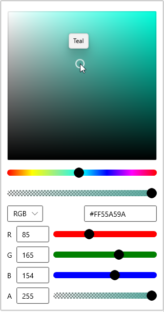

# Solid Color Selection in WinUI Color Picker

This section explains how to select a solid color from different color models, how to modify their individual properties in [Color Picker](https://help.syncfusion.com/cr/winUI/Syncfusion.UI.Xaml.Editors.SfColorPicker.html).

## What is solid color?

Solid color comprises a single color with its alpha value. It contains different color channels such as RGB, HSV, HSL and CMYK color channels.

## Select solid brush programmatically

You can select the solid color brush programmatically by setting the solid color brush value to the [SelectedBrush](https://help.syncfusion.com/cr/winUI/Syncfusion.UI.Xaml.Editors.SfColorPicker.html#Syncfusion_UI_Xaml_Editors_SfColorPicker_SelectedBrush) property. You can also choose various solid color brush from different standard color models such as `RGB`, `HSV`, `HSL`, `CMYK` formats. The default value of `SelectedBrush` property is `Blue`.




 <editors:SfColorPicker x:Name="colorPicker"
                        SelectedBrush="Yellow"/>




SfColorPicker colorPicker = new SfColorPicker();
colorPicker.SelectedBrush = new SolidColorBrush(Colors.Yellow);




N> Download demo application from [GitHub](https://github.com/SyncfusionExamples/syncfusion-winui-colorpicker-examples/tree/master/Samples/SelectSolidColors)

## Select solid brush interactively

You can select any solid color brush at runtime by clicking on the respective solid color brush area. You can enable only the solid color brush mode by setting the [BrushTypeOptions](https://help.syncfusion.com/cr/winui/Syncfusion.UI.Xaml.Editors.SfColorPicker.html#Syncfusion_UI_Xaml_Editors_SfColorPicker_BrushTypeOptions) property value as `SolidColorBrush`.




<editors:SfColorPicker Name="colorPicker">




SfColorPicker colorPicker = new SfColorPicker();
colorPicker.BrushTypeOptions = BrushTypeOptions.SolidColorBrush;




N> Download demo application from [GitHub](https://github.com/SyncfusionExamples/syncfusion-winui-colorpicker-examples/tree/master/Samples/SelectSolidColors)

## Change opacity of solid brush

You can change opacity of the selected solid color brush by using the A-Alpha value editor or delicate slider in the `Color Picker`. You can hide the A-Alpha slider by using the [AlphaInputOptions](https://help.syncfusion.com/cr/winUI/Syncfusion.UI.Xaml.Editors.SfColorPicker.html#Syncfusion_UI_Xaml_Editors_SfColorPicker_AlphaInputOptions) property value as `TextInput`. The default value of the `AlphaInputOptions` property is `All`.




<editors:SfColorPicker BrushTypeOptions="SolidColorBrush"
                       AlphaInputOptions="TextInput"
                       Name="colorPicker">




colorPicker.AlphaInputOptions = ColorInputOptions.TextInput;
colorPicker.BrushTypeOptions = BrushTypeOptions.SolidColorBrush;




N> Download demo application from [GitHub](https://github.com/SyncfusionExamples/syncfusion-winui-colorpicker-examples/tree/master/Samples/SelectSolidColors)

## Switch between color channels

The `Color Picker` contains different color channels namely `RGB`, `HSV`, `HSL` and `CMYK`. You can select any color model by setting value the [ColorChannelOptions](https://help.syncfusion.com/cr/winUI/Syncfusion.UI.Xaml.Editors.SfColorPicker.html#Syncfusion_UI_Xaml_Editors_SfColorPicker_ColorChannelOptions) property or select it from the drop down options. The default value of `ColorChannelOptions` property is `RGB`.




 <editors:SfColorPicker BrushTypeOptions="SolidColorBrush"
                        x:Name="colorPicker"
                        ColorChannelOptions="HSV"/>




SfColorPicker colorPicker = new SfColorPicker();
colorPicker.ColorChannelOptions = ColorChannelOptions.HSV;
colorPicker.BrushTypeOptions = BrushTypeOptions.SolidColorBrush;




N> Download demo application from [GitHub](https://github.com/SyncfusionExamples/syncfusion-winui-colorpicker-examples/tree/master/Samples/SelectSolidColors)

## Input options for color channel

You can change the value of selected solid color channel elements by using either text editor or delicate slider or using both. If you want to change selected solid color channel value only by using text editor or delicate slider, use the [ColorChannelInputOptions](https://help.syncfusion.com/cr/winui/Syncfusion.UI.Xaml.Editors.SfColorPicker.html#Syncfusion_UI_Xaml_Editors_SfColorPicker_ColorChannelInputOptions) property value as `TextInput` or `SliderInput`. The default value of `ColorChannelInputOptions` property is `All`.




<editors:SfColorPicker BrushTypeOptions="SolidColorBrush"
                       ColorChannelInputOptions="TextInput"
                       Name="colorPicker">




colorPicker.ColorChannelInputOptions = ColorInputOptions.TextInput;
colorPicker.BrushTypeOptions = BrushTypeOptions.SolidColorBrush;




N> Download demo application from [GitHub](https://github.com/SyncfusionExamples/syncfusion-winui-colorpicker-examples/tree/master/Samples/SelectSolidColors)

## Hexadecimal editor

You can select a solid color brush by entering the hexadecimal color value to the hexadecimal value editor. You can also get the selected color hexadecimal value by using the hexadecimal value editor. You can hide the hexadecimal value editor by setting the [IsHexInputVisible](https://help.syncfusion.com/cr/winUI/Syncfusion.UI.Xaml.Editors.SfColorPicker.html#Syncfusion_UI_Xaml_Editors_SfColorPicker_IsHexInputVisible) property value as `false`. The default value of `IsHexInputVisible` property is `true`.




<editors:SfColorPicker BrushTypeOptions="SolidColorBrush"
                       IsHexInputVisible="False"
                       Name="colorPicker">




colorPicker.IsHexInputVisible = false;
colorPicker.BrushTypeOptions = BrushTypeOptions.SolidColorBrush;




N> Download demo application from [GitHub](https://github.com/SyncfusionExamples/syncfusion-winui-colorpicker-examples/tree/master/Samples/SelectSolidColors)

## Expand or collapse the Color Editors visibility

You can change the visibility of hexadecimal value editor and color channel elements as expandable or collapsed state by setting the [ColorEditorsVisibilityMode](https://help.syncfusion.com/cr/winui/Syncfusion.UI.Xaml.Editors.SfColorPicker.html#Syncfusion_UI_Xaml_Editors_SfColorPicker_ColorEditorsVisibilityMode) property value as `Expandable` or `Collapsed`. The default value of `ColorEditorsVisibilityMode` property is `Inline`.




<editors:SfColorPicker BrushTypeOptions="SolidColorBrush"
                       ColorEditorsVisibilityMode="Expandable"
                       Name="colorPicker">




colorPicker.ColorEditorsVisibilityMode = ColorEditorsVisibilityMode.Expandable;
colorPicker.BrushTypeOptions = BrushTypeOptions.SolidColorBrush;




N> Download demo application from [GitHub](https://github.com/SyncfusionExamples/syncfusion-winui-colorpicker-examples/tree/master/Samples/SelectSolidColors)

## Selected brush changed notification

You will be notified when selected solid color brush changed in `Color Picker` by  using [SelectedBrushChanged](https://help.syncfusion.com/cr/winUI/Syncfusion.UI.Xaml.Editors.SfColorPicker.html#Syncfusion_UI_Xaml_Editors_SfColorPicker_SelectedBrushChanged) events. You can get the old and newly selected brush by using the [OldBrush](https://help.syncfusion.com/cr/winUI/Syncfusion.UI.Xaml.Editors.SelectedBrushChangedEventArgs.html) and [NewBrush](https://help.syncfusion.com/cr/winUI/Syncfusion.UI.Xaml.Editors.SelectedBrushChangedEventArgs.html) properties.




<editors:SfColorPicker BrushTypeOptions="SolidColorBrush"
                       SelectedBrushChanged="ColorPicker_SelectedBrushChanged"
                       Name="colorPicker">




colorPicker.SelectedBrushChanged += ColorPicker_SelectedBrushChanged;
colorPicker.BrushTypeOptions = BrushTypeOptions.SolidColorBrush;




You can handle the event as follows,




private void ColorPicker_SelectedBrushChanged(object sender, SelectedBrushChangedEventArgs args) {
    var old_selectedBrush = args.OldBrush;
    var new_selectedBrush = args.NewBrush;
}



