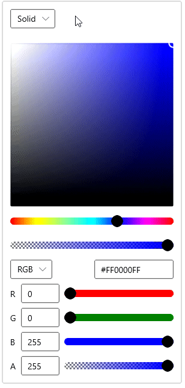
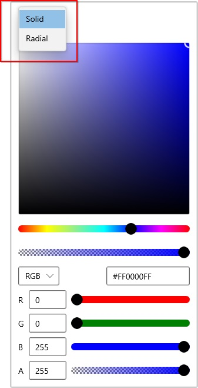
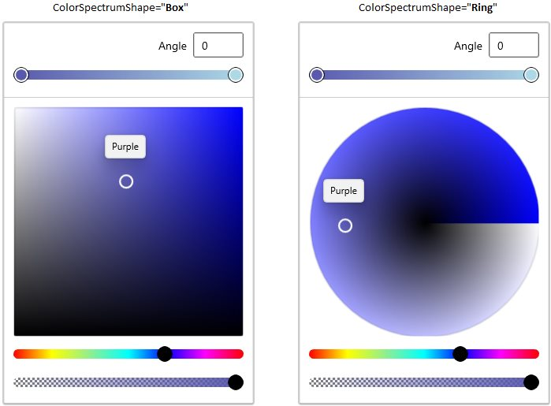
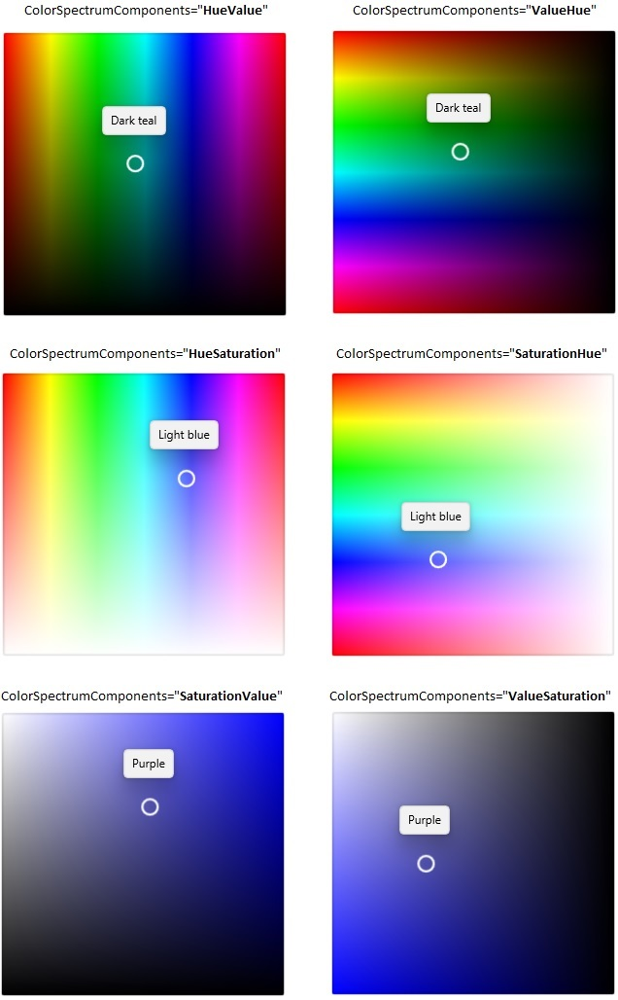
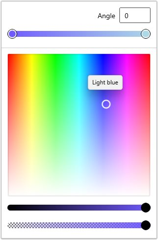

# UI Customization in WinUI Color Picker

This section explains how to customize the color spectrum and switch to different modes in [Color Picker](https://help.syncfusion.com/cr/winUI/Syncfusion.UI.Xaml.Editors.SfColorPicker.html).

## Switch between solid, linear and gradient brush mode interactively

You can change the color selection mode directly at runtime by clicking on the corresponding `Solid`, `Linear` or `Radial` gradient brush mode drop down options which is placed in the top of the `Color Picker` control.

N> Download demo application from [GitHub](https://github.com/SyncfusionExamples/syncfusion-winui-colorpicker-examples/tree/master/Samples/SelectGradientColors)

## Enable specific brush mode

You can enable the user to choose either `Solid`, `Linear` or `Radial` gradient brush or any combination of brush mode by using the `BrushTypeOptions` property. 




<editors:SfColorPicker BrushTypeOptions="SolidColorBrush,RadialGradientBrush"
                       Name="colorPicker">




colorPicker.BrushTypeOptions = BrushTypeOptions.SolidColorBrush | BrushTypeOptions.RadialGradientBrush;




N> Download demo application from [GitHub](https://github.com/SyncfusionExamples/syncfusion-winui-colorpicker-examples/tree/master/Samples/SelectGradientColors)

## Change shape of Color Spectrum

By default, color spectrum is in box shapes. If you want to change the color spectrum shapes as circle, use the [ColorSpectrumShape](https://help.syncfusion.com/cr/winui/Syncfusion.UI.Xaml.Editors.SfColorPicker.html#Syncfusion_UI_Xaml_Editors_SfColorPicker_ColorSpectrumShape) property value as `Ring` . The default value of `ColorSpectrumShape` property is `Box`.




<editors:SfColorPicker ColorSpectrumShape="Ring" 
                       BrushTypeOptions="LinearGradientBrush"
                       Name="colorPicker">




colorPicker.ColorSpectrumShape = ColorSpectrumShape.Ring;
colorPicker.BrushTypeOptions = BrushTypeOptions.LinearGradientBrush;




N> Download demo application from [GitHub](https://github.com/SyncfusionExamples/syncfusion-winui-colorpicker-examples/tree/master/Samples/SelectGradientColors)

## Change Color spectrum's color components

You can changes the color spectrum components as any combination of hue, saturation or value by using the [ColorSpectrumComponents](https://help.syncfusion.com/cr/winui/Syncfusion.UI.Xaml.Editors.SfColorPicker.html#Syncfusion_UI_Xaml_Editors_SfColorPicker_ColorSpectrumComponents) property. The default value of `ColorSpectrumComponents` property is `SaturationValue`.




<editors:SfColorPicker ColorSpectrumComponents = "HueSaturation"
                       BrushTypeOptions="LinearGradientBrush"
                       Name="colorPicker">




colorPicker.ColorSpectrumComponents = ColorSpectrumComponents.HueSaturation;
colorPicker.BrushTypeOptions = BrushTypeOptions.LinearGradientBrush;




N> Download demo application from [GitHub](https://github.com/SyncfusionExamples/syncfusion-winui-colorpicker-examples/tree/master/Samples/SelectGradientColors)
