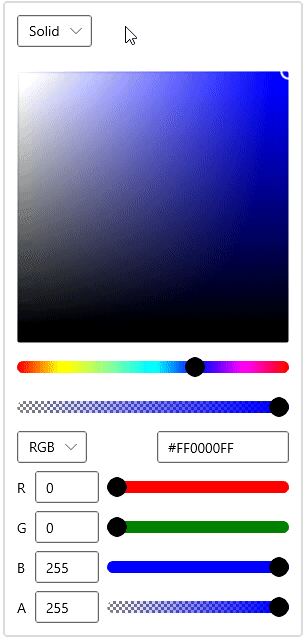
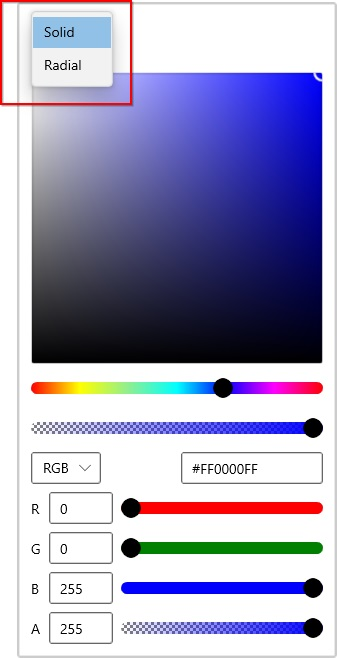
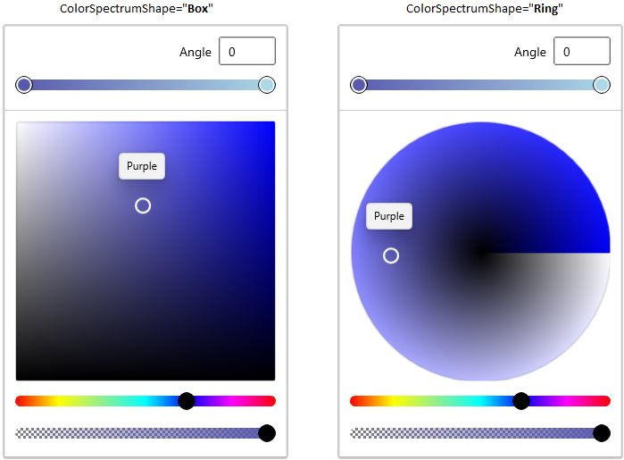
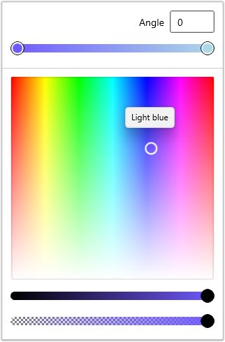

# UI Customization in WinUI Color Picker

This section explains how to customize the color spectrum and switch to different modes in [Color Picker](https://help.syncfusion.com/cr/winUI/Syncfusion.UI.Xaml.Editors.SfColorPicker.html).

## Switch between solid, linear, and radial gradient brush mode interactively

You can change the color selection mode directly at runtime by clicking on the corresponding `Solid`, `Linear`, or `Radial` gradient brush mode drop-down options that are placed at the top of the `Color Picker` control.

N> Download demo application from [GitHub](https://github.com/SyncfusionExamples/syncfusion-winui-colorpicker-examples/tree/master/Samples/SelectGradientColors)

## Enable specific brush mode

You can allow the user to choose any combination of `Solid`, `Linear`, or `Radial` gradient brushes by using the `BrushTypeOptions` property. The `BrushTypeOptions` enum supports the values `All`, `SolidColorBrush`, `LinearGradientBrush`, and `RadialGradientBrush`.




<editors:SfColorPicker BrushTypeOptions="SolidColorBrush,RadialGradientBrush"
                       Name="colorPicker"/>




using Syncfusion.UI.Xaml.Editors;

colorPicker.BrushTypeOptions = BrushTypeOptions.SolidColorBrush | BrushTypeOptions.RadialGradientBrush;




N> Download demo application from [GitHub](https://github.com/SyncfusionExamples/syncfusion-winui-colorpicker-examples/tree/master/Samples/SelectGradientColors)

## Change shape of Color Spectrum

By default, the color spectrum is shown in box shape. To change the color spectrum shape to a circle, use the [ColorSpectrumShape](https://help.syncfusion.com/cr/winui/Syncfusion.UI.Xaml.Editors.SfColorPicker.html#Syncfusion_UI_Xaml_Editors_SfColorPicker_ColorSpectrumShape) property. The supported values are `Box` (default) and `Ring`.




<editors:SfColorPicker ColorSpectrumShape="Ring" 
                       BrushTypeOptions="LinearGradientBrush"
                       Name="colorPicker"/>




using Syncfusion.UI.Xaml.Editors;

colorPicker.ColorSpectrumShape = ColorSpectrumShape.Ring;
colorPicker.BrushTypeOptions = BrushTypeOptions.LinearGradientBrush;




N> Download demo application from [GitHub](https://github.com/SyncfusionExamples/syncfusion-winui-colorpicker-examples/tree/master/Samples/SelectGradientColors)

## Change Color spectrum's color components

You can change the color spectrum components to any combination of hue, saturation, or value by using the [ColorSpectrumComponents](https://help.syncfusion.com/cr/winui/Syncfusion.UI.Xaml.Editors.SfColorPicker.html#Syncfusion_UI_Xaml_Editors_SfColorPicker_ColorSpectrumComponents) property. The supported values are `HueSaturation`, `HueValue`, and `SaturationValue` (default).




<editors:SfColorPicker ColorSpectrumComponents = "HueSaturation"
                       BrushTypeOptions="LinearGradientBrush"
                       Name="colorPicker"/>




using Syncfusion.UI.Xaml.Editors;

colorPicker.ColorSpectrumComponents = ColorSpectrumComponents.HueSaturation;
colorPicker.BrushTypeOptions = BrushTypeOptions.LinearGradientBrush;




