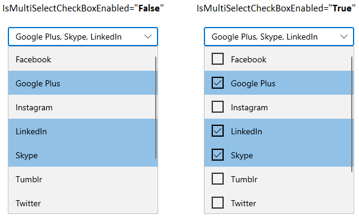

# Editing, Filtering and Searching WinUI ComboBox

This section describes the editing, filtering and searching operations available in the WinUI `ComboBox` control.

## Enable editing

You can edit the text in the text box by setting `IsEditable` property value as `true`. If the edit text letter sequence match with the dropdown items, then it will auto fill the rest of the letters in that item.

N> Edit mode will be effective only on single selection mode.




//Model.cs
public class SocialMedia
{
    public string Name { get; set; }
    public int ID { get; set; }
}

//ViewModel.cs
public class SocialMediaViewModel
{
    public ObservableCollection<SocialMedia> SocialMedias { get; set; }
    public SocialMediaViewModel()
    {
        this.SocialMedias = new ObservableCollection<SocialMedia>();
        this.SocialMedias.Add(new SocialMedia() { Name = "Facebook", ID = 0 });
        this.SocialMedias.Add(new SocialMedia() { Name = "Google Plus", ID = 1 });
        this.SocialMedias.Add(new SocialMedia() { Name = "Instagram", ID = 2 });
        this.SocialMedias.Add(new SocialMedia() { Name = "LinkedIn", ID = 3 });
        this.SocialMedias.Add(new SocialMedia() { Name = "Skype", ID = 4 });
        this.SocialMedias.Add(new SocialMedia() { Name = "Tumblr", ID = 5 });
        this.SocialMedias.Add(new SocialMedia() { Name = "Twitter", ID = 6 });
        this.SocialMedias.Add(new SocialMedia() { Name = "Vimeo", ID = 7 });
        this.SocialMedias.Add(new SocialMedia() { Name = "WhatsApp", ID = 8 });
        this.SocialMedias.Add(new SocialMedia() { Name = "YouTube", ID = 9 });
    }
}







<editors:SfComboBox
    ItemsSource="{Binding SocialMedias}"
    IsEditable="True"
    SelectionMode="Single"
    DisplayMemberPath="Name"
    TextMemberPath="Name"
    x:Name="sfComboBox">
    <editors:SfComboBox.DataContext>
        <local:SocialMediaViewModel />
    </editors:SfComboBox.DataContext>
</editors:SfComboBox>




SfComboBox sfComboBox = new SfComboBox();
sfComboBox.DataContext = new SocialMediaViewModel();
sfComboBox.ItemsSource = (sfComboBox.DataContext as SocialMediaViewModel).SocialMedias;
sfComboBox.SelectionMode = ComboBoxSelectionMode.Single;
sfComboBox.IsEditable = true;
sfComboBox.DisplayMemberPath = "Name";
sfComboBox.TextMemberPath = "Name";




## Change delimiter text

You can change the delimiter string that helps to separate the selected items displayed in a multi-select `ComboBox`. The default value of `DelimiterText` property is **,**.

N> The delimiter text will be effective only for multi-selection mode.

For e.g.: `-` as a delimiter text.




<editors:SfComboBox
    DelimiterText="-"
    SelectionMode="Multiple"
    x:Name="sfComboBox"/>




SfComboBox sfComboBox = new SfComboBox();
sfComboBox.SelectionMode = ComboBoxSelectionMode.Multiple;
sfComboBox.DelimiterText = "-";




## Hide the CheckBox

You can hide the checkbox that is displayed in a dropdown list by using the `IsMultiSelectCheckBoxEnabled` property. The default value of `IsMultiSelectCheckBoxEnabled` property is **true**.

N> The `IsMultiSelectCheckBoxEnabled` property will be effective only for multi-selection mode.

For e.g.: `-` as a delimiter text.




<editors:SfComboBox
    IsMultiSelectCheckBoxEnabled="False"
    SelectionMode="Multiple"
    x:Name="sfComboBox"/>




SfComboBox sfComboBox = new SfComboBox();
sfComboBox.SelectionMode = ComboBoxSelectionMode.Multiple;
sfComboBox.IsMultiSelectCheckBoxEnabled = false;




## Selection changed notification

You will be notified when selected item changed in `ComboBox` by using `SelectionChanged` event. The `SelectionChanged` event contains the newly selected and removed items in the `AddedItems` and `RemovedItems` properties.




<editors:SfComboBox
    SelectionChanged="OnSfComboBoxSelectionChanged"
    x:Name="sfComboBox"/>




SfComboBox sfComboBox = new SfComboBox();
sfComboBox.SelectionChanged += OnSfComboBoxSelectionChanged;




You can handle the event as follows.




private void OnSfComboBoxSelectionChanged(object sender, ComboBoxSelectionChangedEventArgs e)
{
    var addedItems = e.AddedItems;
    var removedItems = e.RemovedItems;
}



