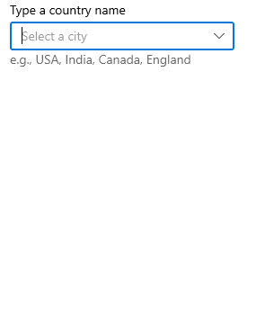

# Filtering in WinUI ComboBox (SfComboBox)

The [ComboBox](https://help.syncfusion.com/cr/winui/Syncfusion.UI.Xaml.Editors.SfComboBox.html) has built-in support to filter data items depending on the text entered in the editing text box. The filter operation starts as soon as you start typing characters in the component.

## Enable filtering

To enable filtering functionality in `ComboBox` control, set the [IsFilteringEnabled](https://help.syncfusion.com/cr/winui/Syncfusion.UI.Xaml.Editors.SfComboBox.html#Syncfusion_UI_Xaml_Editors_SfComboBox_IsFilteringEnabled) and [IsEditable](https://help.syncfusion.com/cr/winui/Syncfusion.UI.Xaml.Editors.SfComboBox.html#Syncfusion_UI_Xaml_Editors_SfComboBox_IsEditable) properties as `true`. The default value is `false`. The drop-down will open automatically as soon as you start typing characters in the `ComboBox` control.




//Model.cs
 public class CityInfo
 {
    public string CityName { get; set; }
    public string CountryName { get; set; }
    public bool IsCapital { get; set; }
}

//ViewModel.cs
public class CityViewModel
{
    public ObservableCollection<CityInfo> Cities { get; set; }
    public CityViewModel()
    {
        this.Cities = new ObservableCollection<CityInfo>();
        this.Cities.Add(new CityInfo() { CityName= "Chicago", CountryName= "USA" });
        this.Cities.Add(new CityInfo() { CityName= "Los Angeles", CountryName= "USA" });          
        this.Cities.Add(new CityInfo() { CityName= "Houston", CountryName= "USA" });
        this.Cities.Add(new CityInfo() { CityName= "New York", CountryName= "USA" });
        this.Cities.Add(new CityInfo() { CityName = "Washington", CountryName = "USA", IsCapital = true });
        this.Cities.Add(new CityInfo() { CityName= "Chennai", CountryName= "India" });
        this.Cities.Add(new CityInfo() { CityName= "Delhi", CountryName= "India", IsCapital = true });
        this.Cities.Add(new CityInfo() { CityName= "Kolkata", CountryName= "India" });
        this.Cities.Add(new CityInfo() { CityName= "Mumbai", CountryName= "India" });
        this.Cities.Add(new CityInfo() { CityName= "Berlin", CountryName= "Germany", IsCapital = true });
        this.Cities.Add(new CityInfo() { CityName= "Cologne", CountryName= "Germany" });
        this.Cities.Add(new CityInfo() { CityName= "Hamburg", CountryName= "Germany" });
        this.Cities.Add(new CityInfo() { CityName= "Munich", CountryName= "Germany" });
        this.Cities.Add(new CityInfo() { CityName= "Quebec City", CountryName= "Canada" });
        this.Cities.Add(new CityInfo() { CityName= "Ottawa", CountryName= "Canada", IsCapital = true });
        this.Cities.Add(new CityInfo() { CityName= "Toronto", CountryName= "Canada" });
        this.Cities.Add(new CityInfo() { CityName= "Vancouver", CountryName= "Canada" });
        this.Cities.Add(new CityInfo() { CityName= "Victoria", CountryName= "Canada" });
        this.Cities.Add(new CityInfo() { CityName= "London", CountryName= "England", IsCapital = true });
        this.Cities.Add(new CityInfo() { CityName= "Bath", CountryName= "England" });
        this.Cities.Add(new CityInfo() { CityName= "Manchester", CountryName= "England" });
        this.Cities.Add(new CityInfo() { CityName= "Oxford", CountryName= "England" });
        this.Cities.Add(new CityInfo() { CityName= "Bandung", CountryName= "Indonesia" });
        this.Cities.Add(new CityInfo() { CityName= "Jakarta", CountryName= "Indonesia", IsCapital = true });
        this.Cities.Add(new CityInfo() { CityName= "Depok", CountryName= "Indonesia" });
        this.Cities.Add(new CityInfo() { CityName= "Makassar", CountryName= "Indonesia" });
        this.Cities.Add(new CityInfo() { CityName= "Surabaya", CountryName= "Indonesia" });
    }
}







<editors:SfComboBox x:Name="comboBox"
                    IsEditable="true"
                    IsFilteringEnabled="true"
                    ItemsSource="{Binding Cities}"
                    TextMemberPath="CityName"
                    DisplayMemberPath="CityName">
        <editors:SfComboBox.DataContext>
            <local:CityViewModel/>
        </editors:SfComboBox.DataContext>
</editors:SfComboBox>





comboBox.IsFilteringEnabled = true;




N> Filtering will be supported only for editable mode.

## Filter mode

The string comparison for filtering suggestions can be changed using the [TextSearchMode](https://help.syncfusion.com/cr/winui/Syncfusion.UI.Xaml.Editors.SfComboBox.html#Syncfusion_UI_Xaml_Editors_SfComboBox_TextSearchMode) property. The default filtering type is `StartsWith`, ignoring accent and it is case insensitive. The available filtering modes are,

* StartsWith
* Contains

### Filter with beginning text

Filter the matching items based on the starting text and the first filtered item will be appended to the typed input and highlighted in the drop-down. 




<editors:SfComboBox x:Name="comboBox"
                    TextSearchMode="StartsWith"
                    IsEditable="true"
                    IsFilteringEnabled="true"
                    ItemsSource="{Binding Cities}"
                    TextMemberPath="CityName"
                    DisplayMemberPath="CityName" />
       




comboBox.TextSearchMode = ComboBoxTextSearchMode.StartsWith;




N> To disable the auto appending and highlighting feature, set [IsTextSearchEnabled](https://help.syncfusion.com/cr/winui/Syncfusion.UI.Xaml.Editors.SfComboBox.html#Syncfusion_UI_Xaml_Editors_SfComboBox_IsTextSearchEnabled) property as `false`.

### Filter with contains text

Filter the matching items that contain specific text, and the first filtered item will be highlighted in the drop-down.




<editors:SfComboBox x:Name="comboBox"
                    TextSearchMode="Contains"
                    IsEditable="true"
                    IsFilteringEnabled="true"
                    ItemsSource="{Binding Cities}"
                    TextMemberPath="CityName"
                    DisplayMemberPath="CityName" />





comboBox.TextSearchMode = ComboBoxTextSearchMode.Contains;




N> Auto appending of the first suggested item text to typed input is not supported in this mode.

### Custom filtering

The ComboBox control provides support to implement the own custom logic for the filtering mechanism by using the `FilterBehavior` property. In order to implement the desired custom filtering behavior for ComboBox you need to create a class that derives from the `IComboBoxFilterBehavior` interface. 

`IComboBoxFilterBehavior` contains the following method:

`GetMatchingIndexes(SfComboBox source, ComboBoxFilterInfo filterInfo)` – Returns a collection of integer objects representing the indexes of the filtered items using the text entered in ComboBox control.

The following example demonstrates displaying the cities based on the country name entered in the ComboBox control.




<editors:SfComboBox TextMemberPath="CityName"
                    DisplayMemberPath="CityName"
                    IsEditable="True"
                    IsFilteringEnabled="True"
                    ItemsSource="{Binding Cities}">
        <editors:SfComboBox.FilterBehavior>
            <local:CityFilteringBehavior/>
        </editors:SfComboBox.FilterBehavior>
</editors:SfComboBox>





/// 

/// To filter the cities based on country name.
/// 

public class CityFilteringBehavior : IComboBoxFilterBehavior
{
    public List<int> GetMatchingIndexes(SfComboBox source, ComboBoxFilterInfo filterInfo)
    {
        List<int> filteredlist = new List<int>();
        List<CityInfo> CityItems = source.Items.OfType<CityInfo>().ToList(); 

        filteredlist.AddRange(from CityInfo item in CityItems
                              where item.CountryName.StartsWith(filterInfo.Text, StringComparison.CurrentCultureIgnoreCase) ||
                                    item.CityName.StartsWith(filterInfo.Text, StringComparison.CurrentCultureIgnoreCase)
                              select CityItems.IndexOf(item));

        return filteredlist;
    }
}




