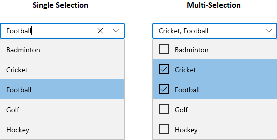
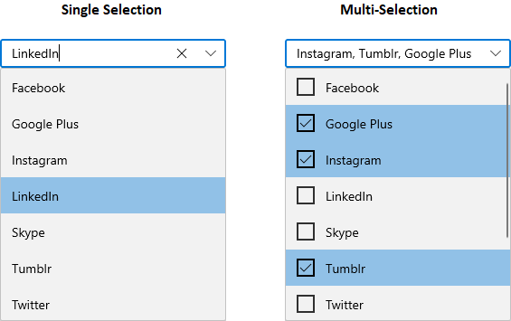
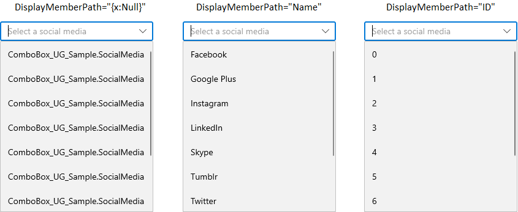
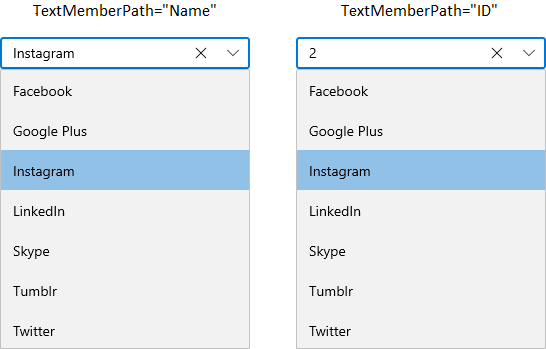
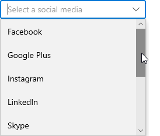

# Getting Started with WinUI ComboBox

This section explains the steps required to add the `WinUI ComboBox` control in the WinUI application and utilize the various functions provided.

## Structure of ComboBox control

## Creating an application with WinUI ComboBox

In this walkthrough, you will create a WinUI application that contains the `ComboBox` control.

## Adding control manually in XAML

To add `ComboBox` control manually in XAML, follow the below steps.

1. Create a [WinUI 3 desktop app for C# and .NET 5](https://docs.microsoft.com/en-us/windows/apps/winui/winui3/get-started-winui3-for-desktop).
2.  Download and refer the following NuGet package in the project.

    * [Syncfusion.Editors.WinUI](https://www.nuget.org/packages/Syncfusion.Editors.WinUI)

3. Import the control namespace `Syncfusion.UI.Xaml.Editors` in XAML page.
4. Initialize the `ComboBox` control.




<Window
    x:Class="GettingStarted.MainPage"
    xmlns="http://schemas.microsoft.com/winfx/2006/xaml/presentation"
    xmlns:x="http://schemas.microsoft.com/winfx/2006/xaml"
    xmlns:local="using:GettingStarted"
    xmlns:d="http://schemas.microsoft.com/expression/blend/2008"
    xmlns:mc="http://schemas.openxmlformats.org/markup-compatibility/2006"
    xmlns:editors="using:Syncfusion.UI.Xaml.Editors"
    mc:Ignorable="d"
    Background="{ThemeResource ApplicationPageBackgroundThemeBrush}">
    <Grid Name="grid">
        <!--Adding ComboBox control -->
        <editors:SfComboBox Name="sfComboBox"/>
    </Grid>
</Window>




## Adding control manually in C#

To add `ComboBox` control manually in C# , follow the below steps.

1. Create a [WinUI 3 desktop app for C# and .NET 5](https://docs.microsoft.com/en-us/windows/apps/winui/winui3/get-started-winui3-for-desktop) or [WinUI 3 app in UWP for C#](https://docs.microsoft.com/en-us/windows/apps/winui/winui3/get-started-winui3-for-uwp).
2.  Download and refer the following NuGet in the project.

    * [Syncfusion.Editors.WinUI](https://www.nuget.org/packages/Syncfusion.Editors.WinUI)

3. Import the control namespace `Syncfusion.UI.Xaml.Editors` in C# page.
4. Initialize the `ComboBox` control.




namespace GettingStarted
{
    public sealed partial class MainWindow : Window
    {
        public MainPage()
        {
            this.InitializeComponent();
            // Creating an instance of the ComboBox control
            SfComboBox sfComboBox = new SfComboBox();

            grid.Children.Add(sfComboBox);
        }
    }
}




## Populating items using SfComboBoxItem

You can add the items inside the `ComboBox` control using the `SfComboBoxItem`.




<editors:SfComboBox x:Name="sfComboBox">
    <editors:SfComboBoxItem Content="Badminton"/>
    <editors:SfComboBoxItem Content="Cricket"/>
    <editors:SfComboBoxItem Content="Football"/>
    <editors:SfComboBoxItem Content="Golf"/>
    <editors:SfComboBoxItem Content="Hockey"/>
</editors:SfComboBox>




SfComboBox sfComboBox = new SfComboBox();

SfComboBoxItem item1 = new SfComboBoxItem() { Content = "Badminton" };
SfComboBoxItem item2 = new SfComboBoxItem() { Content = "Cricket" };
SfComboBoxItem item3 = new SfComboBoxItem() { Content = "Football" };
SfComboBoxItem item4 = new SfComboBoxItem() { Content = "Golf" };
SfComboBoxItem item5 = new SfComboBoxItem() { Content = "Hockey" };

sfComboBox.Items.Add(item1);
sfComboBox.Items.Add(item2);
sfComboBox.Items.Add(item3);
sfComboBox.Items.Add(item4);
sfComboBox.Items.Add(item5);

this.Content = sfComboBox;




## Populating items by DataBinding

You can populate the items to the `ComboBox` control by using the `ItemsSource` property. The `DisplayMemberPath` property is used to the name or path of the property displayed for each data item in the dropdown list.

1. Create Model and populate it with required properties. Create the ViewModel class and populate ObservableCollection object with the Model objects.




//Model.cs
public class SocialMedia
{
    public string Name { get; set; }
    public int ID { get; set; }
}

//ViewModel.cs
public class SocialMediaViewModel
{
    public ObservableCollection<SocialMedia> SocialMedias { get; set; }
    public SocialMediaViewModel()
    {
        this.SocialMedias = new ObservableCollection<SocialMedia>();
        this.SocialMedias.Add(new SocialMedia() { Name = "Facebook", ID = 0 });
        this.SocialMedias.Add(new SocialMedia() { Name = "Google Plus", ID = 1 });
        this.SocialMedias.Add(new SocialMedia() { Name = "Instagram", ID = 2 });
        this.SocialMedias.Add(new SocialMedia() { Name = "LinkedIn", ID = 3 });
        this.SocialMedias.Add(new SocialMedia() { Name = "Skype", ID = 4 });
        this.SocialMedias.Add(new SocialMedia() { Name = "Tumblr", ID = 5 });
        this.SocialMedias.Add(new SocialMedia() { Name = "Twitter", ID = 6 });
        this.SocialMedias.Add(new SocialMedia() { Name = "Vimeo", ID = 7 });
        this.SocialMedias.Add(new SocialMedia() { Name = "WhatsApp", ID = 8 });
        this.SocialMedias.Add(new SocialMedia() { Name = "YouTube", ID = 9 });
    }
}




2. Now create an instance of ViewModel in DataContext property of the `ComboBox` control in Window.xaml and bind the collection property from ViewModel to the ``ItemSource` property of `ComboBox`. Set the property from Model class to be displayed in the dropdowm list by `DisplayMemberPath` property. Set the property from Model class to be displayed in the selection box by `TextMemberPath` property.




<editors:SfComboBox
    ItemsSource="{Binding SocialMedias}"
    DisplayMemberPath="Name"
    TextMemberPath="Name"
    x:Name="sfComboBox">
    <editors:SfComboBox.DataContext>
        <local:SocialMediaViewModel />
    </editors:SfComboBox.DataContext>
</editors:SfComboBox>




SfComboBox sfComboBox = new SfComboBox();
sfComboBox.DataContext = new SocialMediaViewModel();
sfComboBox.ItemsSource = (sfComboBox.DataContext as SocialMediaViewModel).SocialMedias;
sfComboBox.DisplayMemberPath = "Name";
sfComboBox.TextMemberPath = "Name";




## Setting watermark text

You can prompt the user with any information by using the `PlaceholderText` property. This text will be displayed only when no item is selectwed or edit text is empty. The default value of `PlaceholderText` property is **string.Empty** (No string will be displayed).




<editors:SfComboBox
    PlaceholderText="Select a social media"
    x:Name="sfComboBox"/>




SfComboBox sfComboBox = new SfComboBox();
sfComboBox.PlaceholderText = "Select a social media";




## Selection mode

You can select the single or multiple items. By default the selection of items in `ComboBox` is single selection. In order to select multiple items in `ComboBox`, set the `SelectionMode` property value as`Multiple` and select those multiple items from the drop down list.




<editors:SfComboBox
    SelectionMode="Multiple"
    x:Name="sfComboBox"/>




SfComboBox sfComboBox = new SfComboBox();
sfComboBox.SelectionMode = ComboBoxSelectionMode.Multiple;




## Selection changed notification

You will be notified when selected item changed in `ComboBox` by using `SelectionChanged` event. The `SelectionChanged` event contains the newly selected and removed items in the OldValue and NewValue properties.The `ValueChanged` contains the following properties.

 * `NewValue` - Contains the new input value.
 * `OldValue` - Contains the previous input value.




<editors:SfComboBox
    SelectionChanged="OnSfComboBoxSelectionChanged"
    x:Name="sfComboBox"/>




SfComboBox sfComboBox = new SfComboBox();
sfComboBox.SelectionChanged += OnSfComboBoxSelectionChanged;




You can handle the event as follows.




private void OnSfComboBoxSelectionChanged(object sender, ComboBoxSelectionChangedEventArgs e)
{
    var addedItems = e.AddedItems;
    var removedItems = e.RemovedItems;
}

## Setting a header

You can add a header for `ComboBox` control by using the `Header` property. This header will be placed on top of the control. The default value of `Header` property is **null**.




<editors:SfComboBox
    Header="Favourite Social Media"
    x:Name="sfComboBox"/>




SfComboBox sfComboBox = new SfComboBox();
sfComboBox.Header = "Favourite Social Media";




## Setting a description

You can add a description about the input in `ComboBox` control by using the `Description` property. This description will be placed on bottom of the control. The default value of `Description` property is **null**.




<editors:SfComboBox
    Header="Favourite Social Media"
    x:Name="sfComboBox">
    <editors:SfComboBox.Description>
        <TextBlock Text = "It is regularly used social media."/>
    </editors:SfComboBox.Description>
</editors:SfComboBox>




SfComboBox sfComboBox = new SfComboBox();
sfComboBox.Description =  new TextBlock(){ Text="It is regularly used social media."};




## Change Placeholder text foreground

You can change the placeholder text's foreground by using the `PlaceholderForeground` property. The default value of `PlaceholderForeground` property is **null**.




<editors:SfComboBox
    PlaceholderForeground="Red"
    PlaceholderText="Select a social media"
    x:Name="sfComboBox"/>




SfComboBox sfComboBox = new SfComboBox();
sfComboBox.PlaceholderForeground = new SolidColorBrush(Colors.Red);
sfComboBox.PlaceholderText =  "Select a social media";




## Change display member

 You can change the path of the data object to be displayed in a `Combobox`'s dropdown list by using the `DisplayMemberPath` property. The default value of `DisplayMemberPath` property is **null**.

 N> If the `DisplayMemberPath` is `null`, Class name of the data object will be shown in dropdown list.




<editors:SfComboBox
    ItemsSource="{Binding SocialMedias}"
    DisplayMemberPath="Name"
    PlaceholderText="Select a social media"
    x:Name="sfComboBox">
    <editors:SfComboBox.DataContext>
        <local:SocialMediaViewModel />
    </editors:SfComboBox.DataContext>
</editors:SfComboBox>




SfComboBox sfComboBox = new SfComboBox();
sfComboBox.DataContext = new SocialMediaViewModel();
sfComboBox.ItemsSource = (sfComboBox.DataContext as SocialMediaViewModel).SocialMedias;
sfComboBox.DisplayMemberPath = "Name";
sfComboBox.PlaceholderText = "Select a social media";




## Change display member of selected item

 You can change the path of the selected data objects to be displayed in a `Combobox`'s textbox or selection box by using the `TextMemberPath` property. The default value of `TextMemberPath` property is **null**.

 N> If the `TextMemberPath` is `null`, Class name of the selected data objects will be shown in the textbox or selection box.




<editors:SfComboBox
    ItemsSource="{Binding SocialMedias}"
    TextMemberPath="Name"
    DisplayMemberPath="Name"
    x:Name="sfComboBox">
    <editors:SfComboBox.DataContext>
        <local:SocialMediaViewModel />
    </editors:SfComboBox.DataContext>
</editors:SfComboBox>




SfComboBox sfComboBox = new SfComboBox();
sfComboBox.DataContext = new SocialMediaViewModel();
sfComboBox.ItemsSource = (sfComboBox.DataContext as SocialMediaViewModel).SocialMedias;
sfComboBox.TextMemberPath = "Name";
sfComboBox.DisplayMemberPath = "Name";




## Change dropdown height

 You can increase or decrease the height of dropdown list based on the items by using the `MaxDropDownHeight` property. The default value of `MaxDropDownHeight` property is **Auto**. 

 N> If the `MaxDropDownHeight` is too small compared the populated items, scrollviewer will be automatically shown to navigate the hidden items.




<editors:SfComboBox
    MaxDropDownHeight="200"
    x:Name="sfComboBox">
</editors:SfComboBox>




SfComboBox sfComboBox = new SfComboBox();
sfComboBox.MaxDropDownHeight = 200;




