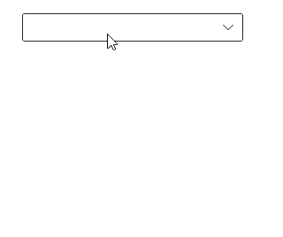
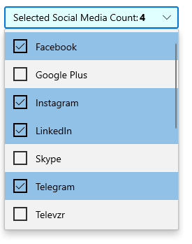

# Getting Started with WinUI ComboBox

This section explains the steps required to add the ComboBox control and binding data in ComboBox control. This section covers only basic features needed to get started with Syncfusion ComboBox control.

## Creating an application with WinUI ComboBox

1. Create a [WinUI 3 desktop app for C# and .NET 5](https://docs.microsoft.com/en-us/windows/apps/winui/winui3/get-started-winui3-for-desktop).
2.  Download and refer the following NuGet package in the project.

    * [Syncfusion.Editors.WinUI](https://www.nuget.org/packages/Syncfusion.Editors.WinUI)

3. Import the control namespace `Syncfusion.UI.Xaml.Editors` in XAML or C# code.
4. Initialize the [SfComboBox](https://help.syncfusion.com/cr/winui/Syncfusion.UI.Xaml.Editors.SfComboBox.html) control.




<Window
    x:Class="GettingStarted.MainPage"
    xmlns="http://schemas.microsoft.com/winfx/2006/xaml/presentation"
    xmlns:x="http://schemas.microsoft.com/winfx/2006/xaml"
    xmlns:local="using:GettingStarted"
    xmlns:d="http://schemas.microsoft.com/expression/blend/2008"
    xmlns:mc="http://schemas.openxmlformats.org/markup-compatibility/2006"
    xmlns:editors="using:Syncfusion.UI.Xaml.Editors"
    mc:Ignorable="d"
    Background="{ThemeResource ApplicationPageBackgroundThemeBrush}">
    <Grid Name="grid">
        <!--Adding ComboBox control -->
        <editors:SfComboBox Name="sfComboBox"/>
    </Grid>
</Window>





using Syncfusion.UI.Xaml.Editors;
namespace GettingStarted
{
    public sealed partial class MainWindow : Window
    {
        public MainPage()
        {
            this.InitializeComponent();
            // Creating an instance of the ComboBox control
            SfComboBox sfComboBox = new SfComboBox();

            grid.Children.Add(sfComboBox);
        }
    }
}




## Populating items using SfComboBoxItem

You can add the items inside the `ComboBox` control using the [SfComboBoxItem](https://help.syncfusion.com/cr/winui/Syncfusion.UI.Xaml.Editors.SfComboBoxItem.html).




<editors:SfComboBox x:Name="sfComboBox" 
                    Width="250">
    <editors:SfComboBoxItem Content="Badminton"/>
    <editors:SfComboBoxItem Content="Cricket"/>
    <editors:SfComboBoxItem Content="Football"/>
    <editors:SfComboBoxItem Content="Golf"/>
    <editors:SfComboBoxItem Content="Hockey"/>
</editors:SfComboBox>





SfComboBox sfComboBox = new SfComboBox();

SfComboBoxItem item1 = new SfComboBoxItem() { Content = "Badminton" };
SfComboBoxItem item2 = new SfComboBoxItem() { Content = "Cricket" };
SfComboBoxItem item3 = new SfComboBoxItem() { Content = "Football" };
SfComboBoxItem item4 = new SfComboBoxItem() { Content = "Golf" };
SfComboBoxItem item5 = new SfComboBoxItem() { Content = "Hockey" };

sfComboBox.Items.Add(item1);
sfComboBox.Items.Add(item2);
sfComboBox.Items.Add(item3);
sfComboBox.Items.Add(item4);
sfComboBox.Items.Add(item5);

this.Content = sfComboBox;




## Populating items using data binding

The ComboBox can be bound to an external data source using the [ItemsSource](https://help.syncfusion.com/cr/winui/Syncfusion.UI.Xaml.Editors.SfDropDownListBase.html#Syncfusion_UI_Xaml_Editors_SfDropDownListBase_ItemsSource) property. Now, let us create Model and ViewModel classes to populate ComboBox with SocialMedia details.

**Step 1:** Define a simple model class SocialMedia with fields ID and name, and then populate social media data in the ViewModel.




//Model.cs
public class SocialMedia
{
    public string Name { get; set; }
    public int ID { get; set; }
}

//ViewModel.cs
public class SocialMediaViewModel
{
    public ObservableCollection<SocialMedia> SocialMedias { get; set; }
    public SocialMediaViewModel()
    {
        this.SocialMedias = new ObservableCollection<SocialMedia>();
        this.SocialMedias.Add(new SocialMedia() { Name = "Facebook", ID = 0 });
        this.SocialMedias.Add(new SocialMedia() { Name = "Google Plus", ID = 1 });
        this.SocialMedias.Add(new SocialMedia() { Name = "Instagram", ID = 2 });
        this.SocialMedias.Add(new SocialMedia() { Name = "LinkedIn", ID = 3 });
        this.SocialMedias.Add(new SocialMedia() { Name = "Skype", ID = 4 });
        this.SocialMedias.Add(new SocialMedia() { Name = "Telegram", ID = 5 });
        this.SocialMedias.Add(new SocialMedia() { Name = "Televzr", ID = 6 });
        this.SocialMedias.Add(new SocialMedia() { Name = "Tik Tok", ID = 7 });
        this.SocialMedias.Add(new SocialMedia() { Name = "Tout", ID = 8 });
        this.SocialMedias.Add(new SocialMedia() { Name = "Tumblr", ID = 9 });
        this.SocialMedias.Add(new SocialMedia() { Name = "Twitter", ID = 10 });
        this.SocialMedias.Add(new SocialMedia() { Name = "Vimeo", ID = 11 });
        this.SocialMedias.Add(new SocialMedia() { Name = "WhatsApp", ID = 12 });
        this.SocialMedias.Add(new SocialMedia() { Name = "YouTube", ID = 13 });
    }
}




**Step 2:** Populate data in ComboBox. 

Now, populate this SocialMediaViewModel data in SfComboBox control by binding to the `ItemSource` property. 




<Window
    x:Class="GettingStarted.MainPage"
    xmlns="http://schemas.microsoft.com/winfx/2006/xaml/presentation"
    xmlns:x="http://schemas.microsoft.com/winfx/2006/xaml"
    xmlns:local="using:GettingStarted"
    xmlns:d="http://schemas.microsoft.com/expression/blend/2008"
    xmlns:mc="http://schemas.openxmlformats.org/markup-compatibility/2006"
    xmlns:editors="using:Syncfusion.UI.Xaml.Editors"
    mc:Ignorable="d"
    Background="{ThemeResource ApplicationPageBackgroundThemeBrush}">
    <Grid Name="grid">
       <Grid.DataContext>
         <local:SocialMediaViewModel />
       </Grid.DataContext>

        <!--Setting ItemsSource-->
        <editors:SfComboBox x:Name="sfComboBox" 
                            Width="250"
                            ItemsSource="{Binding SocialMedias}" />
    </Grid>
</Window>





sfComboBox.ItemsSource = (sfComboBox.DataContext as SocialMediaViewModel).SocialMedias;




N> Set the SocialMediaViewModel instance as the DataContext of your control; this is done to bind properties of SocialMediaViewModel to SfComboBox.

**Step 3:** Setting TextMemberPath and DisplayMemberPath.

The ComboBox control is populated with the list of social medias. But the SocialMedia model contains two properties, ID and Name, so it is necessary to intimate by which property it should display value in the selection box portion of the ComboBox control, when an item is selected.

[TextMemberPath](https://help.syncfusion.com/cr/winui/Syncfusion.UI.Xaml.Editors.SfDropDownListBase.html#Syncfusion_UI_Xaml_Editors_SfDropDownListBase_TextMemberPath) - This property path is used to get the value for displaying in the selection box portion of the ComboBox control when an item is selected. The default value is `String.Empty`.

[DisplayMemberPath](https://help.syncfusion.com/cr/winui/Syncfusion.UI.Xaml.Editors.SfDropDownListBase.html#Syncfusion_UI_Xaml_Editors_SfDropDownListBase_DisplayMemberPath) - This property path is used to the name or path of the property displayed for each data item in the drop-down list. The default value is `String.Empty`.




sfComboBox.DisplayMemberPath = "Name";
sfComboBox.TextMemberPath = "Name";




## Multi selection

The ComboBox allows user to select multiple values from the drop-down list. The multi-select ComboBox mode can be enabled by setting the [SelectionMode](https://help.syncfusion.com/cr/winui/Syncfusion.UI.Xaml.Editors.SfDropDownListBase.html#Syncfusion_UI_Xaml_Editors_SfDropDownListBase_SelectionMode) property as `Multiple`. Checkboxes can be used to represent selected items.

The selection operations can be handled using the [SelectionChanged](https://help.syncfusion.com/cr/winui/Syncfusion.UI.Xaml.Editors.SfDropDownListBase.html#Syncfusion_UI_Xaml_Editors_SfDropDownListBase_SelectionChanged) event of SfComboBox.




<editors:SfComboBox x:Name="sfComboBox"
                    Width="250"
                    SelectionMode="Multiple"
                    ItemsSource="{Binding SocialMedias}"
                    DisplayMemberPath="Name"
                    TextMemberPath="Name">
</editors:SfComboBox>




sfComboBox.SelectionMode = ComboBoxSelectionMode.Multiple;




## Editing

The ComboBox control supports editable and non-editable modes to choose items. To enable editing functionality, set the [IsEditable](https://help.syncfusion.com/cr/winui/Syncfusion.UI.Xaml.Editors.SfComboBox.html#Syncfusion_UI_Xaml_Editors_SfComboBox_IsEditable) property as `true`. The default value is false.




<editors:SfComboBox x:Name="sfComboBox"
                    Width="250"
                    IsEditable="true"
                    ItemsSource="{Binding SocialMedias}"
                    DisplayMemberPath="Name"
                    TextMemberPath="Name">
</editors:SfComboBox>





sfComboBox.IsEditable = true;




## Searching

Based on the [TextSearchMode](https://help.syncfusion.com/cr/winui/Syncfusion.UI.Xaml.Editors.SfComboBox.html#Syncfusion_UI_Xaml_Editors_SfComboBox_TextSearchMode) property, the ComboBox control highlights the first item which fits the user input in the drop down list. To disable searching functionality, set the [IsTextSearchEnabled](https://help.syncfusion.com/cr/winui/Syncfusion.UI.Xaml.Editors.SfComboBox.html#Syncfusion_UI_Xaml_Editors_SfComboBox_IsTextSearchEnabled) property as `false`. The default value is true.

## Filtering

The ComboBox control provides support to filter the items in the drop-down based on the starting letter or whether they contain a specific letter. To enable filtering functionality, set the [IsFilteringEnabled](https://help.syncfusion.com/cr/winui/Syncfusion.UI.Xaml.Editors.SfComboBox.html#Syncfusion_UI_Xaml_Editors_SfComboBox_IsFilteringEnabled) property as true. The default value is false.




<editors:SfComboBox x:Name="sfComboBox"
                    Width="250"
                    IsEditable="true"
                    IsFilteringEnabled="true"
                    ItemsSource="{Binding SocialMedias}"
                    DisplayMemberPath="Name"
                    TextMemberPath="Name">
</editors:SfComboBox>





sfComboBox.IsFilteringEnabled = true;




N> Filtering will be supported only for editable mode.

## SelectionBox UI

The selection box appearance of SfComboBox can be changed by using the [SelectionBoxItemTemplate](https://help.syncfusion.com/cr/winui/Syncfusion.UI.Xaml.Editors.SfComboBox.html#Syncfusion_UI_Xaml_Editors_SfComboBox_SelectionBoxItemTemplate) property of SfComboBox. The default value of `SelectionBoxItemTemplate` is `null`.

N> `SelectionBoxItemTemplate` has no effect when `IsEditable` is `true`.




<Grid HorizontalAlignment="Center" VerticalAlignment="Center">
   <Grid.DataContext>
        <local:SocialMediaViewModel/>
    </Grid.DataContext>
    <Grid.Resources>
        <SolidColorBrush x:Key="SyncfusionComboBoxBackgroundFocused" 
                         Color="LightCyan" />
    </Grid.Resources>

   <editors:SfComboBox x:Name="sfComboBox"
                    Width="250"
                    SelectionMode="Multiple"
                    ItemsSource="{Binding SocialMedias}"
                    DisplayMemberPath="Name"
                    Background="LightCyan"
                    TextMemberPath="Name">
      <editors:SfComboBox.SelectionBoxItemTemplate>
         <DataTemplate>
            <StackPanel Orientation="Horizontal" Background="LightCyan">
                <TextBlock Margin="12,5,0,6" 
                           FontFamily="{ThemeResource ContentControlThemeFontFamily}"
                           FontSize="{ThemeResource ControlContentThemeFontSize}"
                           Text="Selected Social Media Count:" />
                <TextBlock Margin="2,5,0,0"
                           FontFamily="{ThemeResource ContentControlThemeFontFamily}"
                           FontSize="{ThemeResource ControlContentThemeFontSize}"
                           Text="{Binding ElementName=sfComboBox, Path=SelectedItems.Count}" />
            </StackPanel>
         </DataTemplate>
      </editors:SfComboBox.SelectionBoxItemTemplate>
    </editors:SfComboBox>

</Grid>




N> You can refer more information about Customization of ComboBox element using theme keys from [this](https://help.syncfusion.com/winui/themes) link.
